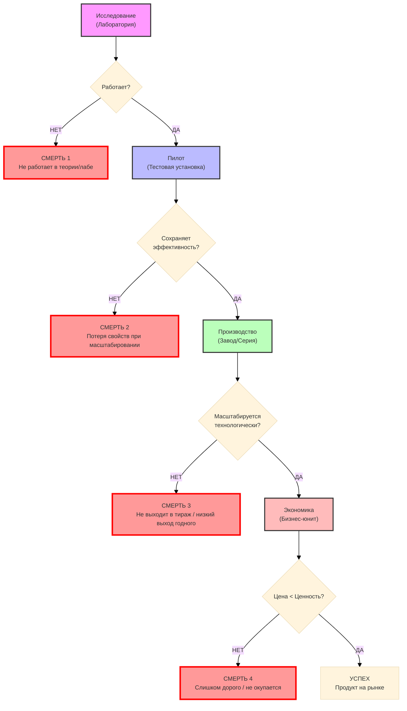
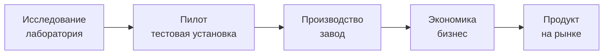
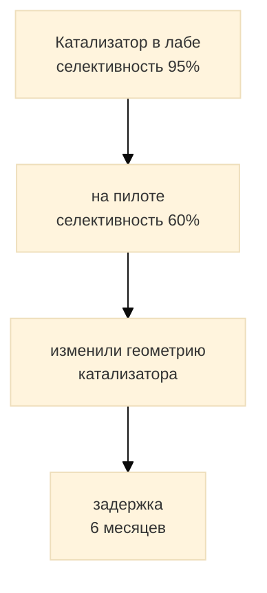
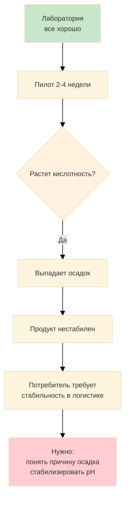
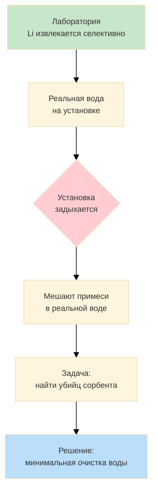
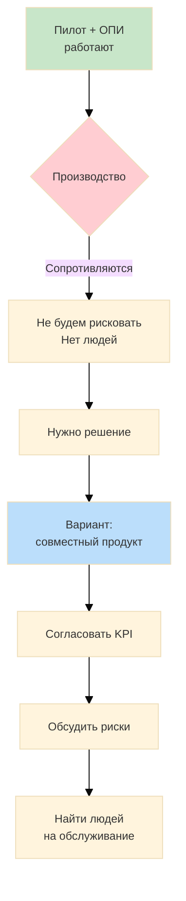
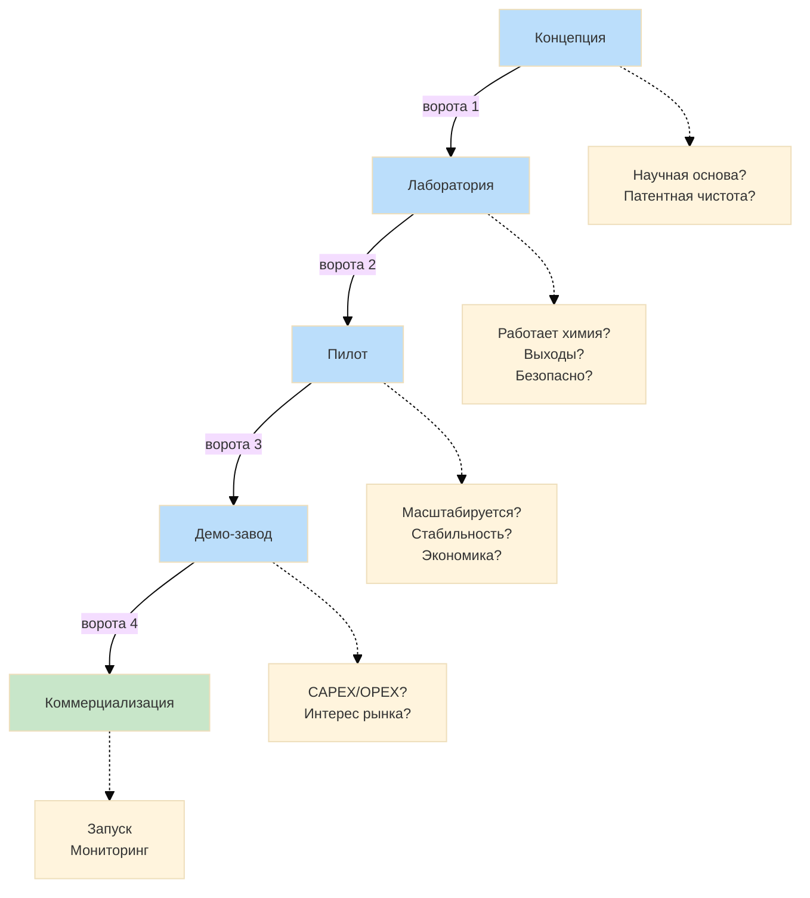
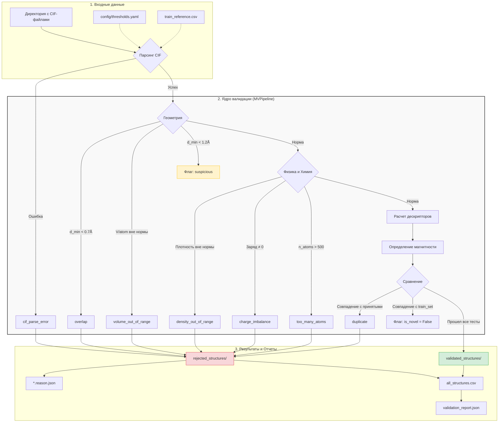
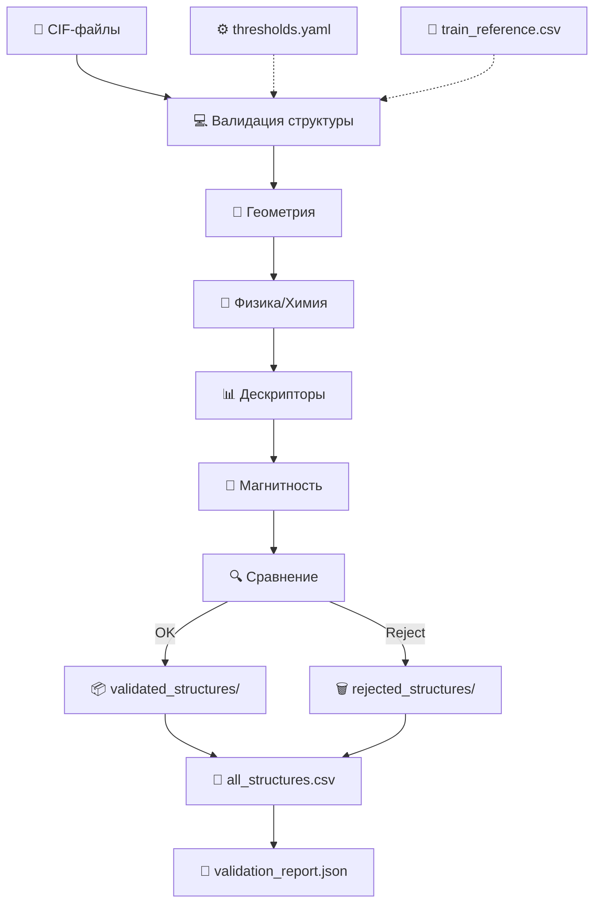
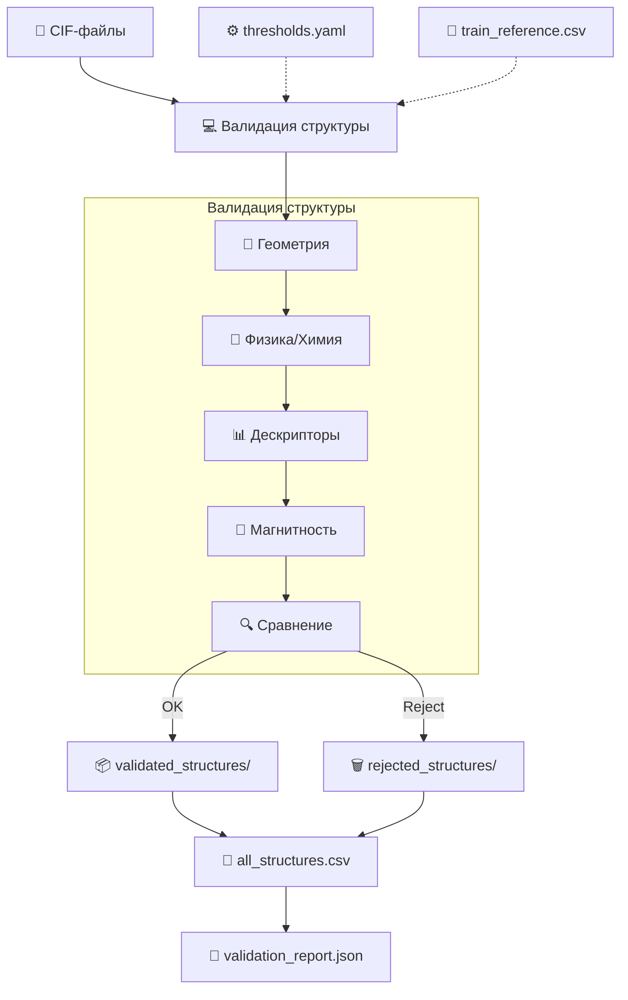

### Стартап-предпринимательство как путь в науку
**Александр Улесов**
**Principal Engineer (PE)** — это не просто инженер, это в первую очередь **лидер** команды, умеющий успешно выводить новые (прежде всего, цифровые) продукты на рынок. 
PE — это специалист, обладающий не только хардовыми инженерными навыками, знанием рынка и основ data-driven подхода, но и soft skills, особенно в части управления и коммуникации.

- PI
	- авторитет
	- Ресурсы
		- Деньги
		- Нетворк
		- Кадры
		- Инфраструктура

- PE
	- тоже самое что PI только типа тех. лид
### Физически-информированные нейронные сети
- добавляем в функцию потерь дифференциальное уравнение
- оценка

### От научных лабораторий к энергетическим гигантам
**Кривошапкин Павел**
- статья - это результат работы и мерило исследователя

- для производств нужно:
	- более масштабный результат
	- устойчивая работа

| R&D - возможности                                             | Индустрия - ограничения                                              |
| :------------------------------------------------------------ | :------------------------------------------------------------------- |
| Фокус на открытиях, надо время на эксперименты                | фокус на быстроте                                                    |
| мерило - научная публикация                                   | мерило - прибыль                                                     |
| потенциал масштабирования, публикация на Nature               | где это купить? кто это купит? какая польза на тонну сырья?          |
| базовые знания, глубина исследований, гибкость и креативность | ответственность за результат, управление рисками и контроль качества |
успешная технология должна выжить в обоих мирах

- внедрение бизнес-процессов повысит подготовку студентов

- ученый должен менять свое направление каждые 5-7 лет

- Креативная экономика: что это за продукт? как на нем можно заработать больше денег?
	- неожиданные продукты
	- стоимость минимальная

Четыре столпа успешной хим. технологии

| Химия                                                    | Инженерия                                                | Безопасность                                            | Экономика                                                                                                                                                                                                                                                                                      |
| :------------------------------------------------------- | :------------------------------------------------------- | ------------------------------------------------------- | ---------------------------------------------------------------------------------------------------------------------------------------------------------------------------------------------------------------------------------------------------------------------------------------------- |
| селективность, стабильность катализатора, выход продукта | (тепло/массо)обмен, материалы конструкции, гидродинамика | Риски взрыва, токсичность, коррозия, аварийные сценарии | - CAPEX капитальные затраты (железо, подводка электричества, коммуникации) - OPEX - операционные затраты (сырье, зп работникам) - цена продукта - сколько готов платить рынок - OPEX выше рыночной цены - смерть - окупаемость - если вы не окупаете CAPEX через 3-5 лет то вы лох |

- чаще всего исследования умирают на пилоте

**История 1**

**История 3**

**История 4**

**История 5**

##### Этапы технологии

##### 3 правила технологии
1. нет данныз длит. испытаний - вы не знаете технологию
2. нет интеграции и владельца - не будет внедрения
3. Если не бьется экономика - это тоже результат, просто другой маршрут

### Жидкие металлы для синтеза энергетических материалов
**Сергей Леончук**
эмульсия
каллоидное
микросферы на основе микрокапель, у которых можно регулировать морфологию

### Путь PI из науки в индустрию

### Публичные выступления
- в выступлении важно не сам спич, а **изменения** у слушателей

- спич должен быть

	- полезным
		- какая аудитория?
		- какая цель у нас и аудитории?
		- мотивация аудитории

### Project management
стейкхолделы