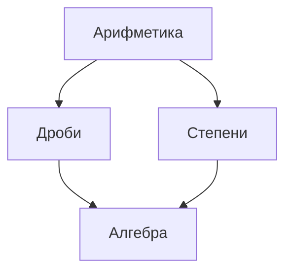

## день 1
### Мультиагентные системы и ризонинг
все начиналось с Rule Based систем (обучение с учителем)

сверточная нейросеть хорошо классифицирует изображения, глубокое обучение избавляет от ручного извлечения признаков

сначала ИИ научился видеть (как люди додумались от AlexNet к VGG сетке). Attension is all you need https://habr.com/ru/articles/781770/ 

**трансформер** - Это такой вид нейросетевой архитектуры, который хорошо подходит для обработки последовательностей данных.

от RNN к Transformer
![[Pasted image 20250630060639.png]]
feed formed - это векторизирование слов

Прогноз следующего слова — основа обучения LLM

Почему Transformer стал стандартом:
* Обрабатывает весь контекст одновременно 
* Легко масштабируется (GPU-friendly) 
* Можно предобучать на огромных датасетах

https://habr.com/ru/articles/474368/ С помощью формулы Байеса можно переоценить априорные вероятности (), исходя из наблюдений (), и получить совершенно новое представление о реальности.
___
ИИ прошел путь от жестких правил к самообучающимся моделям — следующий шаг: учить его думать

**End-to-end модели (или сквозные модели)** — это такие модели в машинном обучении, которые обрабатывают данные от начального этапа до конечного результата без промежуточных этапов или ручного проектирования признаков.

Экспертные системы (Based on rules) -> End-to-end модели (Based on learning) -> Reasoning (Based on thinking)
___
**Supervised fine-tuning (SFT)** — это методика, применяемая для адаптации предварительно обученных Large Language Model (LLM) под конкретную задачу при помощи размеченных данных. https://habr.com/ru/articles/829318/

**RLHF (Reinforcement Learning from Human Feedback)** - это метод обучения языковой модели, который позволяет ей научиться соответствовать ожиданиям людей. Сначала выучивается _модель вознаграждения_, которая по тексту дает оценку, насколько ответ подходит человеку. Затем она используется для обучения языковой модели с помощью _метода обучения с подкреплением (RL)_. В результате модель научится генерировать более соответствующие человеческим ожиданиям ответы на заданные тексты. https://habr.com/ru/articles/730990/

Общая схема обучения LLM: три шага
- Шаг 1: Pretrain Обучение на больших корпусах текста, дает знание языка
- Шаг 2: SFT Дообучение на инструкциях, дает способность следовать инструкциям
- Шаг 3: RLHF Обучение на оценках ИИ-тренеров, дает способность следовать инструкциям
___
Мышление необходимо
НЕТ: Вопрос → ответ  
ДА: Вопрос → reasoning → ответ

**Zero-shot Learning (ZSL)** - это способность модели выполнять задачи без каких-либо примеров обучения. Она делает это за счёт обобщённых знаний, полученных во время предобучения.
**Few-shot Learning (FSL)** - это метод, при котором модели предоставляется всего несколько примеров (обычно от 1 до 5), чтобы лучше понять структуру задачи. https://habr.com/ru/articles/897604/

Ключевым требованием к базовой модели является **ненулевая вероятность генерации правильных цепочек рассуждений**
Как повысить вероятность правильных рассуждений?
- Способ 1: Генерировать больше цепочек рассуждений и добавлять их в обучающую выборку.
- Способ 2: Использовать RL для того, чтобы «подталкивать» модель к генерации правильных рассуждений.
___
Мультиагентные системы усиливают рассуждения через декомпозицию и оценку подшагов
Сложная задача разбивается на несколько шагов, Каждый агент решает подзадачу отдельно, так Система генерирует более качественные рассуждения
После это все идет в Оценка  и сбор примеров и получаются Качественные CoT примеры
___
гигачад отдал заполнение ответов на основные медицинские вопросы институту

Как собрать chain of thoughts для врачей?
- был сделан телеграм бот, играли 2 доктора: один знал диагноз, второй задавал вопросы и пытался диагноз угадать
___
Игры позволяют моделировать сложные ситуации на минимальных структурах — это мощный способ учить и тестировать алгоритмы
___
Модели обученные на ризонинге проводят рассуждения в весах, из рассуждения вслух фиктивные
___
**Multi-Step Reinforcement Learning (RL)** — это метод обучения с подкреплением, который обобщает стандартные алгоритмы (например, Q-learning или TD-обучение), используя информацию о нескольких последовательных шагах для обновления политики агента.
1. **Отличие от 1-step RL**:
    - В обычном RL (например, TD(0) или Q-learning) обновление происходит на основе награды и оценки следующего состояния (**1 шаг**).
    - В **multi-step RL** учитывается траектория из нескольких шагов (**n шагов**), что позволяет быстрее учитывать отложенные награды.
        
2. **Основная идея**:
    - Агент собирает последовательность состояний, действий и наград за `n` шагов.
    - Обновление value-функции происходит с учетом **суммы наград за `n` шагов** + оценка состояния через `n` шагов.
    
3. **Примеры алгоритмов**:
    - **n-step TD** (обобщение TD-обучения).
    - **n-step Q-learning**.
    - **n-step SARSA**.
___
Без верифицированной награды рассуждение не заработает — тут и скрыт главный риск

Развитие идет «кругами»
1. Модели научились few shot (покажи пример решения, смогу повторить) -> CoT Хорошие CoT превратились в инструктивные датасеты
2. Базовая модель, которая много видела, может иногда генерировать правильные решения
3. RL позволяет повысить вероятность генерации правильных решений и полезных рассуждений
4. Цепочки рассуждений можно «направлять» на основе декомпозиции задачи на подшаги (агенты), и оценивать эти подшаги отдельно: мультиагентная система!
5. Агенты одновременно решают задачу более качественно, и генерируют прекрасные синтетические примеры.

### LLMs и трансформеры: пути развития и ограничения
#### LLMs и Трансформер
→ Encoder: читаем входную последовательность 
→ Decoder: генерируем последовательность на выходе
пример: машинный перевод
Multi-Head Attention:
![[Pasted image 20250630072614.png]]
у нас был входной эмбед, потом к нему мы делаем добавки (делаем изменения в представлении) в каждом блоке трансформера

→ Cross-Attention – смотрим на выходы из Encoder.
→ Self-Attention – смотрим на предыдущие сгенерированные токены, запрещаем смотреть в будущее.

Decoder используется для авторегрессионной генерации текста, токен за токеном, слева- направо.
![[Pasted image 20250630072846.png]]
___
**Как работают трансформеры?**

Трансформеры состоят из нескольких ключевых компонентов:
- Энкодер (Encoder): Читает входной текст и преобразует его в числа, которые модель может понять. Каждое слово превращается в вектор (набор чисел) с помощью Input
- Embedding. Затем добавляется Positional Encoding, чтобы модель знала, в каком порядке идут слова (Illustrated Transformer).
- Декодер (Decoder): Генерирует выходной текст, например, перевод или ответ. Он использует информацию от энкодера через Cross-Attention.
- Механизм внимания (Attention): Это сердце трансформеров. Он позволяет модели "смотреть" на разные части текста и решать, какие слова важны. Формула внимания: Attention(Q, K, V) = softmax(QK^T)V, где Q, K, V — это запросы, ключи и значения, которые помогают модели выделять важные связи (DataCamp).
- Многоголовое внимание (Multi-Head Attention): Модель смотрит на текст с разных точек зрения, чтобы лучше понять связи между словами.

  

Простое объяснение: Представьте, что вы решаете головоломку, где нужно соединить слова в предложении. Энкодер — это как человек, который раскладывает кусочки пазла, а декодер — тот, кто собирает их в картинку. Внимание — это как лупа, которая помогает найти самые важные кусочки.
#### Трансформер  с точки зрения памяти
Типы памяти в Трансформере:
- Long-term memory: Параметры модели, нельзя изменить, но - Новый полученный опыт не сохраняется
- Short-term memory: Текущее контекстное окно, может меняться, но Ограничена размером контекстного окна
- Working memory: механизм внимания - осуществляет отбор из short-term memory, но Число последовательных операций ограничено числом слоев
ЛЛМ сейчас ведут себя как человек с амнезией, у них постоянно сбрасываются контекстные окна - Andrej Karpathy: Software Is Changing Again https://www.youtube.com/watch?v=LCEmiRjPEtQ
___
#### Длина контекста
all Harry Potter books - 1 млн токенов
Но входную длину трансформеров трудно масштабировать
##### **Проблемы масштабирования длины входа в Transformers**
**1. Квадратичная сложность внимания (Attention)**
- Стандартный механизм Self-Attention требует `O(n²)` вычислений, где `n` — длина последовательности.
- Это значит, что при увеличении контекста в 2 раза, вычисления становятся в **4 раза медленнее**.

**2. Большие требования к памяти (KV-cache)**
- Transformers хранят ключи (`K`) и значения (`V`) для всех предыдущих токенов (KV-cache).
- Чем длиннее контекст, тем больше оперативки нужно, что ограничивает работу с длинными текстами.

**3. Плохая генерализация на новых длинах**
- Если модель обучалась на коротких текстах, она может плохо работать на длинных (и наоборот).
- Чтобы это исправить, используют **дополнительные методы**:
    - **Positional Interpolation (PI)** — "плавное" масштабирование позиционных эмбеддингов.
    - **YaRN** — улучшенный метод адаптации ротационных эмбеддингов (RoPE) для длинных контекстов.
    - **Пост-тюнинг** — дообучение модели на нужных длинах после основной тренировки.
==зачем масштабировать входную длину трансформеров??== - увеличивать длину контекстного окна, чтобы не было "я забыл что ел на завтрак"
##### **Как сейчас работают модели с контекстом в 1M+ токенов?**

Современные LLM обрабатывают **сверхдлинные тексты** (1 млн+ токенов) благодаря **оптимизациям**:
1. **Flash Attention** – ускоряет вычисления внимания, экономя память.
    
2. **Ring Attention** – распределяет нагрузку между GPU для гигантских контекстов.
    
3. **Multi-Query Attention (MQA)** – использует общие ключи/значения, уменьшая затраты памяти.
    
4. **Grouped-Query Attention (GQA)** – баланс между скоростью и качеством, группируя запросы.
##### **Линейная рекурренция в современных рекуррентных моделях**
**Линейная рекурренция** — это механизм обработки последовательностей, где текущее состояние `hₜ` вычисляется как **линейная комбинация** предыдущего состояния `hₜ₋₁` и нового входного вектора `xₜ`.

**Базовая формула**:
$h_t=Ah_t−1+Bx_th_t​=Ah_t−1​+Bx_t​$

- `A` — матрица параметров (обновляет скрытое состояние),
- `B` — матрица проекции входа,
- `hₜ` — скрытое состояние на шаге `t`.
##### **Новые архитектуры с рекурренцией и линейным вниманием**
Чтобы избежать проблем Transformers, появляются модели **с рекуррентными механизмами**:
- **Mamba, Hawk, xLSTM, RWKV** – используют линейные или рекуррентные слои вместо внимания, экономя ресурсы.
    
- **Гибридные модели** (сочетание Transformer и RNN):
    - **Recurrent Transformers** – добавляют рекуррентные связи в Transformer.
    - **Griffin, RecurrentGemma, Jamba** – комбинируют лучшие черты обоих подходов.
##### **Recurrent Memory Transformer (RMT)**
Это гибрид Transformer и RNN, где **память** передается между сегментами последовательности.  

**Как работает?**  
1. **Память как токены**: Входная последовательность дополняется специальными *memory-токенами*.  
2. **Передача памяти**: После обработки сегмента, эти токены сохраняются и передаются в **следующий сегмент**.  
3. **Обратное распространение**: Градиенты во время обучения идут через memory-токены, связывая сегменты.  

**Зачем нужно?**  
- Позволяет Transformer работать с **очень длинными контекстами**, разбивая их на части.  
- Сохраняет информацию между сегментами (как RNN), но использует механизм внимания.  

**Аналогия**:  
Как если бы Transformer "делал пометки" в блокноте (memory-токены) и использовал их при чтении следующей главы.  

**Примеры моделей**: RMT, Memformer, Transformer-XL (схожие идеи).
![[Pasted image 20250630075200.png]]

**Контекст увеличили,  а как с его использованием?**
==почему хитмапы длин контекстов зеленые?== - потому что точность ответов хорошая при любой позиции контекста вопроса в тексте (начало или конец) при любой длине контекста
##### **BABILong Benchmark 

BABILong – это тест для оценки способности языковых моделей **анализировать и рассуждать** на основе информации, распределенной в **очень длинных документах**.  

**Ключевые особенности:**  
- **20 разнообразных задач**:  
  - Цепочки фактов (*fact chaining*)  
  - Простая индукция и дедукция  
  - Подсчёт элементов (*counting*)  
  - Работа со списками и множествами  
- **Основан на bAbI** (Weston et al., 2016) – наборе задач, которые считаются базовыми для "разумного" ИИ.  
- **Масштабируемая длина**: тесты можно расширять на сколь угодно длинные контексты.  
**Зачем нужен?**  
Проверить, может ли модель:  
1. Находить и связывать факты, разбросанные по огромному тексту.  
2. Делать логические выводы на основе этих фактов.  
3. Корректно обрабатывать структурированные данные (списки, множества).  

**Пример задачи:**  
*Документ на 100 тыс. токенов содержит 50 фактов. Вопрос: "Если A верно, а B следует из A, что можно сказать о B?"*  

**Актуальность:**  
Используется для тестирования моделей вроде GPT-4, Claude 3 или Gemini в сценариях с **длинным контекстом** (1M+ токенов).  

**Вывод:**  
BABILong – это стресс-тест для LLM, показывающий, насколько хорошо они справляются с **длинными и сложными** логическими задачами.

#### Глубина модели
Глубина модели == число последовательных операций
___
**Chain-of-Thought ~= Recurrence**
- →  Модель авторегрессионно генерирует решение задачи
- →  На каждом шаге делается сэмплирование – выбор токена – потеря информации

**Chain-of-Continuous-Thought == Recurrence**
- →  Модель авторегрессионно генерирует решение задачи
- →  На каждом шаге ~~делается сэмплирование – выбор токена – потеря информации~~ передается последний hidden state
- → Модель становится **рекуррентной** и ее эффективная глубина увеличивается
___
**Looped Transformers and Adaptive Computation Time** - Опять получили рекуррентную модель, но рекуррентную вглубь!
- →  Можно зациклить целый трансформер или отдельные слои
- →  Каждый слой может применяться разное число раз (Adaptive Computation Time)
- →  Число параметров не изменяется, но увеличивается эффективная глубина модели

#### Бонусная инфа
**Titans (MAC)** — это улучшенная версия RMT (Recurrent Memory Transformer), где память реализована через **нейросетевой модуль** вместо фиксированных токенов.  
3 типа памяти:
1. **Краткосрочная** — текущий сегмент/окно (как в RMT).  
2. **Долгосрочная** — нейросетевой модуль (учится сохранять важное).  
3. **Постоянная** — заранее обученные memory-токены (не меняются).  

**Суть:**  
MAC обобщает идею RMT, добавляя **гибкую нейросетевую память**, что позволяет эффективнее работать с длинными контекстами.  

Аналогия:  
- RMT — блокнот с ручкой (фиксированные записи).  
- MAC — умный цифровой блокнот с поиском и автосохранением.  

**Применение:** задачи с контекстом 1M+ токенов.

##### **Эволюция долговременной памяти в моделях**  

1. **RNN** – один вектор (скрытое состояние).  
2. **RMT** – набор векторов (memory-токены).  
3. **ARMT/SSMs/Linear Transformers** – матрица (структурированная память).  
4. **Titans (MAC)** – MLP (нейросеть), которая динамически управляет памятью.  

##### **Memorize via Online Learning**  
- **Test Time Training (TTT)** – модель дообучается *прямо во время inference*, чтобы адаптироваться к новым данным.  
- **Learning to Learn** – метаобучение, где модель учится эффективно запоминать.  

**Суть:**  
От простого вектора (RNN) → к умной нейросети (Titans), которая учится сохранять и обновлять информацию *на лету*.

### Reinforcement Learning  A Birds-Eye View
##### Оглавление :
1. Foundations (Основы)
	Базовые концепции: MDP (Markov Decision Processes), Bellman Equations, Value/Policy Iteration.
	Методы: Monte Carlo, Temporal Difference (TD), Q-Learning.
	Цель: Формальное понимание, как агент учится через trial-and-error.
2. Scaling RL: Function Approximation (Масштабирование через аппроксимацию)
	Проблема: Табличные методы не работают для больших пространств состояний.
	Решение: Нейросети для аппроксимации Q-функций/политик (DQN, Policy Gradients).
	Вызовы: Deadly Triad (bootstrapping + approximation + off-policy → нестабильность).
3. Deep RL Renaissance (Эра глубокого RL)
	Прорывы: DQN (играет в Atari), AlphaGo, PPO.
	Техники: Experience Replay, Target Networks, Advantage Estimation.
	Приложения: Роботы, игры, NLP.
4. Stable Policy Optimization (Стабильная оптимизация политик)
	Проблема: Policy Gradients часто нестабильны (высокая дисперсия).
	Методы:
	TRPO (гарантирует монотонное улучшение через KL-ограничения).
	PPO (упрощённый TRPO с клиппингом).
	SAC/TD3 (для непрерывных действий).
5. Offline Reinforcement Learning (Обучение без взаимодействия)
	Суть: Обучение на заранее собранных данных (без симулятора).
	Проблемы: Distributional Shift, OOD-действия.
	Методы:
	CQL (консервативные Q-значения).
	BC+RL (гибрид с клонированием экспертов).
6. Meta Reinforcement Learning (Мета-RL)
	Цель: Агент учится адаптироваться к новым задачам за несколько шагов.
	Подходы:
	MAML (оптимизация для быстрой настройки).
	RL² (запоминание стратегий через RNN).
	Пример: Робот, который после тренировки на 100 предметах понимает, как поднять новый.
7. Tabula Rasa No More (Прощание с "чистым листом")
	Идея: Современный RL не начинают с нуля — используют:
	Предобученные модели (например, LLM + RLHF).
	Transfer Learning (перенос знаний между задачами).
	Человеческие данные (демонстрации, обратная связь).
	Пример: ChatGPT fine-tuning через RLHF.
#### Foundations  

**Reinforcement Learning (RL, обучение с подкреплением)** — это метод машинного обучения, где агент учится принимать решения через пробу действий и получая награды или штрафы от среды. Его цель — найти стратегию, которая максимизирует суммарную награду за долгий срок. Примеры: игры (AlphaGo), роботы, рекомендательные системы.  

Коротко: *"Пробуй, ошибайся, получай обратную связь и оптимизируй поведение"*.
___
==**Почему сходимость RL важна?**==
	RL — это **оптимизация**: агент должен не просто "пробовать", а гарантированно находить **лучшую стратегию** (или хотя бы близкую к ней).
	- **Без сходимости:**	    
	    - Агент может **деградировать** (например, после удачного начала начать делать хуже).
	    - Решения будут **непредсказуемыми** (сегодня работает, завтра — нет).
	**Как добиться адекватности cхождения?**
	Выбор метода под задачу
	- **Дискретные действия** (например, игры):
	    - **DQN + улучшения** (Double DQN, Prioritized Replay).
	- **Непрерывные действия** (роботы, авто):
	    - **PPO** (баланс стабильности/простоты).
	    - **SAC/TD3** (для точного контроля).
	- **Оффлайн-обучение** (данные без взаимодействия):
	    - **CQL** или **IQL** (избегают "галлюцинаций").
##### **Markov Decision Processes (MDPs)**  

**Что это?**  
Формальная модель для задач RL, где агент взаимодействует со средой, получая награды.  

**Компоненты:**  
- **S** — состояния, **A** — действия.  
- **P(s'|s,a)** — вероятности перехода.  
- **R(s,a)** — награда.  
- **γ** — коэффициент дисконтирования (учитывает важность будущих наград).  

**Цель:**  
Найти стратегию **π(a|s)**, максимизирующую **сумму дисконтированных наград**:  

$E\left[\sum_{t=0}^{\infty} \gamma^t R_t \right]$


**Уравнения Беллмана:**  
- **V(s)** (ценность состояния):  
  $V(s) = \max_a \left( R(s,a) + \gamma \sum_{s'} P(s'|s,a) V(s') \right)$
  
- **Q(s,a)** (ценность действия): 
  $Q(s,a) = R(s,a) + \gamma \sum_{s'} P(s'|s,a) \max_{a'} Q(s',a')$

**Суть:**  
MDP — это «правила игры» для RL, где оптимальная стратегия ищется через **V(s)** и **Q(s,a)**. 
Пример:  
Как роботу выбрать путь, чтобы быстрее добраться до цели, учитывая препятствия (состояния) и затраты энергии (награды).
##### **Policy Iteration (Итерация политики)**
**1. Оценка политики (Policy Evaluation)**  
Оцениваем текущую стратегию **π**, вычисляя её ценность **V^π** или **Q^π** (через TD-обучение или итеративные методы).
**2. Улучшение политики (Policy Improvement)**  
Создаём новую стратегию **π'**, выбирая действия, которые максимизируют **Q^π** (жадный выбор).
**3. Цикл**  
Повторяем шаги 1 и 2, пока политика не перестанет улучшаться.
##### **On-Policy vs Off-Policy Learning**
**On-Policy (на политике)**
- Обучается **только на тех действиях**, которые выбирает текущая стратегия.
- Плюсы: стабильность, гарантированная сходимость.
- Минусы: неэффективное использование данных (нельзя переиспользовать старые данные).
- Пример: SARSA.
    
**Off-Policy (вне политики)**
- Обучается **на любых действиях** (даже от других стратегий).
- Плюсы: можно использовать replay buffer, высокая sample efficiency.
- Минусы: менее стабилен, может расходиться.
- Пример: Q-Learning.
    
**Аналогия:**
- On-Policy — ученик, который учится только на своих ошибках.
- Off-Policy — ученик, который анализирует ещё и чужие ошибки.
##### **Temporal-Difference Learning (TD-обучение)**  

**Суть:**  
Гибрид метода Монте-Карло и динамического программирования. Обновляет оценки на основе **предсказаний** (бутстрэппинг), а не полного эпизода.  

**Формула обновления:**  
$V(s) \leftarrow V(s) + \alpha [r + \gamma V(s') - V(s)]$
- **α** — скорость обучения,  
- **γ** — коэффициент дисконтирования,  
- **r + γV(s')** — TD-цель (предсказание будущего).  

**Особенности:**  
- **Онлайн-обучение:** Обновляется после каждого шага.  
- **Не требует модели среды:** Учится на "сыром" опыте (без знания P(s'|s,a)).  
- **On-Policy:** Обычно оценивает текущую политику (как SARSA).  

**Пример (TD(0)):**  
1. Робот делает шаг: переходит из **s** в **s'**, получая награду **r**.  
2. Корректирует оценку **V(s)** на основе **ошибки предсказания**:  
   $\text{Ошибка} = [r + \gamma V(s')] - V(s)$

**Плюсы:**  
- Быстрее MC (не ждёт конца эпизода).  
- Меньше дисперсия, чем у MC (использует бутстрэппинг).  

**Минусы:**  
- Смещённость из-за бутстрэппинга.  
Бутстрэп (Bootstrap) в статистике:
	Это метод, основанный на многократной генерации выборок из имеющихся данных с помощью метода Монте-Карло. 
	Он позволяет оценить распределение статистик, таких как среднее, стандартное отклонение, доверительные интервалы, когда анализируемая выборка мала или распределение неизвестно. 
	В частности, бутстрэп используется для оценки точности моделей машинного обучения, проверки гипотез и построения доверительных интервалов.

**Аналогия:**  
Как студент, который проверяет конспект после каждой лекции (а не ждёт сессии).
##### **Q-Learning (Уоткинс, 1989)**  
**Суть:**  
Off-policy алгоритм, который учит **оптимальную Q-функцию (Q*)** независимо от действий агента.  

**Формула обновления:**  

$Q(s,a) \leftarrow Q(s,a) + \alpha \left[r + \gamma \max_{a'} Q(s',a') - Q(s,a)\right]$

- **r + γ max Q(s',a')** — целевое значение (максимальная будущая награда).  
- **α** — скорость обучения.  

**Особенности:**  
- **Off-Policy:** Может учиться на данных от любой стратегии (например, из replay buffer).  
- **Сходится к Q***: Гарантированно находит оптимальную политику для табличных MDP.  
- **Основа DQN:** Используется в глубоком RL (например, для Atari).  
**Алгоритм глубокой Q-сети** (DQN) - это
	является онлайновым, методом обучения с подкреплением вне политики без моделей. Агент DQN является основанным на значении агентом обучения с подкреплением, который обучает критика оценивать возврат или будущие вознаграждения. DQN является вариантом Q-изучения.
**Пример:**  
Робот изучает лабиринт:  
1. Идёт случайно (exploration), но записывает **максимально возможные будущие награды** в Q-таблицу.  
2. В итоге находит кратчайший путь (оптимальная политика).  

**Плюсы:**  
- Простота.  
- Эффективность (использует любые данные).  

**Минусы:**  
- Переоценка Q-значений (решается Double Q-Learning).  
- Только для дискретных действий.  

**Аналог:**  
Как учиться на чужих ошибках, выбирая всегда «идеальный» вариант.
#### Scaling RL: Function Approximation
##### **"Смертельная триада" (Deadly Triad) в RL**
**Компоненты:**
1. **Бутстрэппинг** (обновление через предсказания).
2. **Аппроксимация функций** (например, нейросетями).
3. **Off-policy обучение** (использование "чужих" данных).

**Проблема:**  
При одновременном использовании **алгоритм может расходиться** (оценки ценностей "прыгают" или уходят в бесконечность).

**Суть:**  
Нет гарантии сходимости, если совмещать все три элемента.

**Пример:**  
DQN (глубокий Q-learning) борется с этим через:
- Target networks (стабилизация бутстрэппинга).
- Осторожный подбор гиперпараметров.

##### **Policy Gradients (REINFORCE)**  
**Суть:** Прямая оптимизация стратегии **πθ(a|s)** через градиентный подъём, чтобы максимизировать ожидаемую награду.  
**Как работает:**  
1. **Параметризуем политику** (например, нейросетью).  
2. **Обновляем веса θ** в направлении, которое увеличивает суммарную награду в траекториях.  

**Плюсы:**  
- Может обучать **стохастические и непрерывные** политики.  
- Не требует модели среды.  
**Минусы:**  
- Высокая **дисперсия** градиентов → медленное обучение.  
- Сходится только к **локальному оптимуму**.  

**Контраст с value-based методами (типа Q-learning):**  
- Не использует bootstrap → нет смещения, но больше шума.  
- Пример: **REINFORCE** — простейший вариант, но требует трюков (базисные линии) для устойчивости.  
**Аналог:**  
Как капитан корабля, который меняет курс, глядя на среднюю прибыль от рейсов (без точной карты).
#### Deep RL Renaissance  
##### **Deep Q-Networks (DQN)**  
**Суть:** Первая успешная модель, которая научилась играть в Atari по пикселям (2015).  
**Как работает:**  
- **Q-функция** аппроксимируется нейросетью.  
- **Experience replay**: Сохраняет прошлый опыт для устранения корреляции в данных.  
- **Target network**: Отдельная сеть для стабильного обучения (редко обновляется).  

**Плюсы:**  
- **End-to-end**: Учится напрямую из пикселей.  
- **Превзошла людей** в 49 играх Atari.  
**Минусы:**  
- Только **дискретные действия**.  
- Медленное обучение (**sample-inefficient**).  
- Чувствительность к гиперпараметрам.  

**Важно:** Основа для современных методов (Rainbow, R2D2).
##### **Deep Deterministic Policy Gradient (DDPG)**  
**Для чего:** Управление в **непрерывных** пространствах действий.  

**Как работает:**  
- **Гибрид DQN + Policy Gradients**:  
  - **Актор (Actor)** — выбирает действия (детерминированно).  
  - **Критик (Critic)** — оценивает Q-значения.  
- **Target Networks + Replay Buffer** — для стабильности (как в DQN).  
- 
**Плюсы:**  
- Работает с **непрерывными действиями** (например, скорость, угол).  
- Эффективно использует данные (replay buffer).  
**Минусы:**  
- Чувствителен к **гиперпараметрам**.  
- Может страдать от **ошибок аппроксимации**.  
- 
**Пример:**  
Робот-манипулятор учится хватать предметы:  
- **Актор** решает, как двигать схват (непрерывные команды).  
- **Критик** оценивает, насколько действие удачное.  
**Аналог:**  
Как тренер (**актор**) + спортивный аналитик (**критик**), работающие в паре.

##### **Twin Delayed DDPG (TD3, 2018)**  

**Улучшения над DDPG:**  
1. **Двойные критики** — две Q-сети, чтобы снизить переоценку (берётся минимум из их предсказаний).  
==Зачем TD3 снижает оценку Q-функции через минимум двух критиков?==
	**Проблема:**  
	В DDPG/DQN **критик (Q-сеть)** часто **переоценивает** значения действий (особенно в начале обучения). Это приводит к:
	- Нестабильному обучению.
	- Выбору неоптимальных действий из-за завышенных предсказаний.
2. **Задержка обновлений политики** — актор обновляется реже, чем критики, для стабильности.  
3. **Сглаживание целевой политики** — шум к действиям, чтобы Q-функция не переобучалась на артефакты.  

**Плюсы:**  
- Стабильнее и надёжнее DDPG.  
- Лучше работает в сложных средах (например, точное управление роботом).  

**Минусы:**  
- Сложнее в реализации.  
- Чувствителен к уровню шума.  

**Пример:**  
Робот-манипулятор учится точнее хватать хрупкие предметы благодаря:  
- Меньшим ошибкам в оценке Q-значений (двойные критики).  
- Плавным обновлениям стратегии (задержка).  

**Фишка:** TD3 — это «прокачанный DDPG» для серьёзных задач.
#### Stable Policy Optimization 
==щас будет дофига политик оптимизации, зачем они?==(TRPO, PPO, SAC, TD3 и др.)
	**1. Решают общие проблемы Policy Gradients:**
	- **Высокая дисперсия** градиентов → нестабильное обучение.
	- **Катастрофические изменения** политики (агент «ломается» после одного плохого обновления).
	- **Сложность выбора размера шага** (слишком большой шаг → коллапс, слишком маленький → медленное обучение).
	2. **Разные сценарии — разные методы:**
	- **TRPO/PPO** — Для задач с **чёткими границами** (например, безопасность робота).
	- **SAC** — Для сред, где нужно **исследование** (открытые миры).
	- **TD3** — Когда критична **стабильность** (точное управление).
##### **Trust Region Policy Optimization (TRPO, 2015)**  
**Суть:** Метод оптимизации политик с гарантией *монотонного улучшения* за счёт жёсткого контроля шага обновления.  
**Как работает:**  
1. **Ограничение KL-дивергенции** — новая политика не может отклоняться слишком сильно от старой (чтобы не сломать обучение).  
==что такое **KL-дивергенция**==
	**Что это:** Мера "расстояния" между двумя распределениями (например, старой и новой политикой).
	**Зачем:** В TRPO ограничивает изменения политики, чтобы обучение не пошло "вразнос".
	**Формула:**
	 $DKL​(πold​∣∣πnew​)=∑πold​(a∣s)logπnew​(a∣s)πold​(a∣s)​$
	**Аналог:** Как ограничитель скорости в автомобиле — не даёт политике резко меняться.
2. **Решает сложную оптимизацию** с ограничением (через метод сопряжённых градиентов + line search).  

**Плюсы:**  
- Гарантирует, что каждая итерация **не ухудшит** политику.  
- Надёжнее обычного Policy Gradient.  
**Минусы:**  
- Вычислительно дорогой (нужны матрицы Гессе, сложные расчёты).  
- На практике сложен для реализации.  

**Пример:**  
Робот учится ходить:  
- TRPO аккуратно подстраивает параметры походки, избегая резких изменений, которые могут привести к падению.  
**Альтернатива:** **PPO** (упрощённая версия TRPO с клиппингом).
##### **Proximal Policy Optimization (PPO, 2017)**  
**Суть:** Упрощённая и эффективная версия TRPO для стабильного обучения политик.  
**Как работает:**  
- **Клиппинг отношений вероятностей** — ограничивает изменения политики, избегая резких обновлений.  
==что такое клиппинг?==
	- **Что это:** Принудительное ограничение изменения вероятностей действий (без сложных расчётов KL).
	- **Как работает:** "Обрезает" отношение $π_{new}, π_{old}$ в диапазоне [1−ϵ,1+ϵ][1−ϵ,1+ϵ].
	- **Пример:** Если новое действие в 10 раз вероятнее старого, PTO считает его лишь в 1+ϵ1+ϵ раз вероятнее (например, в 1.2 раза).
- Оптимизирует **суррогатную функцию** с клиппингом:  
  
  $L(\theta) = \min\left( \frac{\pi_\theta(a|s)}{\pi_{\text{old}}(a|s)} A_t, \text{clip}\left(\frac{\pi_\theta(a|s)}{\pi_{\text{old}}(a|s)}, 1 \pm \epsilon\right) A_t \right)$
  
**Плюсы:**  
- **Проще и быстрее TRPO** (без сложной оптимизации).  
- **Стабильность** как у TRPO, но с меньшими вычислительными затратами.  
**Минусы:**  
- Требует подбора коэффициента клиппинга $\epsilon$.  

**Пример:**  
ИИ для игры в Dota 2 использует PPO, чтобы плавно улучшать стратегию без «катастрофических» изменений.  
**Фишка:** PPO — это «TRPO для бедных», но работает почти так же хорошо.
#### Offline Reinforcement Learning 
##### **Разница между Online и Offline RL**  
**Online RL:**  
- Агент **взаимодействует со средой** в реальном времени (учится на своём опыте).  
- Пример: DQN, PPO.  

**Offline RL:**  
- Агент учится **на заранее собранных данных** (без взаимодействия со средой).  
- Проблема: данные могут быть **неоптимальными** или неполными.  

---
==Сейчас будет пиздец дохуя методов, как и раньше, зачем они?==
	Эти методы нужны, чтобы **обучать ИИ на готовых данных** (без взаимодействия со средой), решая ключевые проблемы Offline RL:
	1. **Неоптимальные данные** (AWAC)  
	   — Учит агента **выбирать лучшие действия** из датасета, игнорируя плохие.  
	2. **Distributional Shift** (CQL, IQL)  
	   — Не даёт агенту **"галлюцинировать"** и выбирать действия, которых нет в данных.  
	3. **Консервативность** (TD3+BC, ReBRAC)  
	   — Смешивает RL с **клонированием экспертов**, чтобы агент не "слетал с рельсов".  
	**Аналог:**  
	Как ученик, который учится водить **только по записям чужих поездок** (без реальной практики), избегая аварийных ситуаций.  
	**Выбор метода:**  
	- **AWAC** — если данные среднего качества.  
	- **CQL/IQL** — если данных мало или они шумные.  
	- **ReBRAC** — для максимальной точности.
##### **Advantage-Weighted Actor Critic (AWAC)**  
**Суть:**  
- Улучшает политику, **взвешивая действия** из датасета по их **преимуществу (Advantage)**.  
- Формула:  

  $\pi_{\text{new}} \propto \pi_{\text{old}}(a|s) \cdot \exp\left(\frac{A(s,a)}{\lambda}\right)$
  
- **Плюсы:** Простота, работает даже с неидеальными данными.  

---

##### **Проблема Distributional Shift в Offline RL**  
**Что это:**  
- Новая политика выбирает **действия, которых нет в датасете** → критика (Q-функция) даёт **ошибочные оценки**.  
- Результат: агент **ломается** из-за "галлюцинаций" о несуществующих наградах.  

**Решение:**  
- **Консервативные методы** (например, CQL).  

---

##### **Conservative Q-Learning (CQL)**  
**Суть:**  
- **Штрафует Q-значения** для действий **вне датасета**, чтобы избежать переоценки.  
- Формула:  
  
  $\min_Q \underbrace{\mathbb{E}_{s \sim \text{data}} \left[ \max_a Q(s,a) - \mathbb{E}_{a \sim \text{data}} Q(s,a) \right]}_{\text{Штраф за "незнакомые" действия}} + \text{TD-ошибка}$
  
- **Итог:** Агент **консервативен** и держится близко к данным.  

---

##### **Сравнение методов**  
| Метод          | Решает проблему          | Как?                          |  
|----------------|--------------------------|-------------------------------|  
| **AWAC**       | Неоптимальные данные     | Взвешивание по Advantage      |  
| **CQL**        | Distributional Shift     | Штраф за OOD-действия         |  

**Пример:**  
- **AWAC:** Робот учится ходить по записям "успешных" шагов, даже если они неидеальны.  
- **CQL:** Не позволяет роботу пытаться "сальто", если такого нет в данных.
##### **Implicit Q-Learning (IQL)**  
**Суть:**  
- **Неявное обучение Q-функции** без использования действий за пределами датасета (избегает OOD-проблем).  
- Использует **expectile regression** для оценки "лучших" действий в данных.  
- **Плюсы:**  
  - Не требует доступа к среде.  
  - Стабильнее CQL в сложных задачах.  
**Пример:**  
Агент учится играть в футбол, анализируя только запили матчей (не пробуя невозможные удары).  

---

##### **TD3 + Behavioral Cloning (TD3+BC)**  
**Суть:**  
- Комбинация **Q-обучения (TD3)** и **клонирования поведения** (BC) из датасета.  
- Формула:  
  \[
  $\pi = \arg\max_{\pi} \mathbb{E}_{(s,a) \sim \text{data}} \left[ \lambda Q(s,\pi(s)) - (\pi(s) - a)^2 \right]$
  \]  
  - $\lambda$ — баланс между RL и клонированием.  
- **Плюсы:**  
  - Простота.  
  - Эффективен на узких датасетах.  
**Пример:**  
Робот учится хватать предметы, повторяя движения экспертов + небольшая оптимизация через TD3.  

---

##### **ReBRAC (TD3+BC на стероидах)**  
**Суть:**  
- Улучшенный TD3+BC с **глубокими архитектурными хитростями**:  
  - Нормализация состояний.  
  - Оптимизированные гиперпараметры.  
- **Плюсы:**  
  - **State-of-the-art** для Offline RL.  
  - Работает даже на "плохих" датасетах.  

**Пример:**  
Автономный дрон летает по треку, используя только старые записи полётов (без симулятора).  

---

##### **Сравнение методов**  
| Метод          | Акцент                   | Когда использовать?           |  
|----------------|--------------------------|-------------------------------|  
| **IQL**        | Избегает OOD-действий    | Для сложных/разреженных данных|  
| **TD3+BC**     | RL + клонирование        | Быстрое решение для простых задач |  
| **ReBRAC**     | Максимальная эффективность | Когда нужен SOTA результат |  

**Фишка:**  
- **IQL** — для безопасности (никаких "фантазий").  
- **TD3+BC** — "работает из коробки".  
- **ReBRAC** — когда нужен максимум производительности.
#### Meta Reinforcement Learning 
**Цель:** Научиться адаптироваться к **новым задачам** за несколько попыток (few-shot) или вообще без примеров (zero-shot).  

**Как работает?**  
1. **Meta-обучение:** Агент тренируется на множестве разных задач (например, 100 лабиринтов или игровых уровней).  
2. **Быстрая адаптация:** После обучения может освоить **новую задачу** за 1-5 попыток, используя "навык учиться".  
**Ключевые принципы:**  
- **"Учимся учиться":** Агент запоминает не конкретные решения, а **стратегии обучения**.  
- **Обобщение:** Переносит опыт с прошлых задач на новые (даже незнакомые).  

**Примеры:**  
- Робот, который после тренировки на 50 предметах **с ходу** понимает, как поднять новый.  
- ИИ для игр, который быстро осваивает незнакомый уровень.  
**Методы:**  
- **MAML:** Оптимизирует начальные веса модели для быстрой настройки.  
- **RL²:** Использует память (RNN) для запоминания стратегий.  
**Плюсы:**  
- Экономит время и данные.  
- Подходит для динамичных сред (где задачи меняются).  
**Фишка:** Meta-RL — это как "метанавык" для ИИ, позволяющий **быстро осваивать новое**.

#### Moving Beyond Tabula Rasa 
___
«Современные системы RL не учатся с нуля; они опираются на предыдущие — модели, данные и обратную связь — для повышения эффективности, безопасности и обобщения. ˮ
___
==Что такое Tabula Rasa ?==
	**Буквально:** С латыни — _«чистая доска»_.
	**В контексте RL:**  
	— Подход, когда агент **начинает обучение с нуля** (без предварительных знаний).  
	— Пример: Классический DQN или PPO, которые учатся _с чистого листа_ в каждой новой среде.
	**Проблема:**  
	— Неэффективно для сложных задач (каждый раз учить «с нуля» — долго и ресурсозатратно).
	Пример:  
	Робот-доставщик не учится заново ходить для каждого нового здания, а использует _ранее освоенные навыки_.
	**Фишка:**  
	Современный RL уходит от Tabula Rasa к _обучению с предзнанием_, как люди.
##### **RLHF (Обучение с подкреплением на основе человеческой обратной связи)**  
- **Как работает:**  
  1. Люди оценивают ответы модели (👍/👎).  
  2. Обучается **модель вознаграждения** (предсказывает, понравится ли ответ человеку). 
  3. Модель дорабатывается через **PPO**, чтобы максимизировать это вознаграждение (+ штраф за отклонение от изначальной политики).  
- **Зачем:** Чтобы ChatGPT/LLM говорили **понятно и безопасно**.  

##### **RLVR (RL с проверяемыми наградами)**  
- **Как работает:**  
  — Награда **бинарная** (1/0) на основе *точных критериев* (например, прошёл ли код тесты).  
  — Использует **внешние валидаторы** (компилятор, математический решатель).  
- **Зачем:** Для задач с **чёткими правилами** (код, математика), где человеческие оценки не нужны.  

**Разница:**  
- **RLHF** — для субъективных задач (диалоги).  
- **RLVR** — для объективных (код, логика).  

Пример:  
- RLHF: ChatGPT учится избегать токсичных ответов.  
- RLVR: ИИ-программист учится писать рабочий код.
### Эволюция мышления LLM-агентов: от базовой логики до научных открытий
#### Первые признаки «общего» интеллекта
##### Эволюция LLM до ASI - идёт от простого предсказания текста к автономным агентам и потенциально ASI, но ключевые проблемы (планирование, истинное понимание) пока не решены.

**1. Next token prediction**  
Базовый принцип работы LLM: предсказывают следующее слово в тексте на основе статистических закономерностей.  

**2. Scaling pretraining (LLM)**  
Увеличение масштаба моделей (параметры, данные, вычислительные ресурсы) улучшает их способности (например, GPT-3 → GPT-4).  

**3. Post-training**  
Дообучение после претрейнинга:  
- **SFT (Supervised Fine-Tuning)** – тонкая настройка на размеченных данных.  
- **RLHF (Reinforcement Learning from Human Feedback)** – оптимизация ответов через обратную связь от людей.  

**4. Agentic workflows**  
LLM становятся *агентами*: выполняют задачи автономно, используя планирование, память и взаимодействие с окружением (например, AutoGPT).  

**5. LLM-based AGI?**  
Вопрос: могут ли LLM стать искусственным общим интеллектом (AGI)? Пока нет — они не способны к глубокому пониманию и самостоятельному обучению.  

**6. ASI? Self-evolving systems**  
Следующий шаг — *искусственный суперинтеллект (ASI)*:  
- **Саморазвивающиеся системы** (например, Darwin Godel Machine) автоматически улучшают свой код.  
- **RL post-training** – обучение с подкреплением в реальном времени (test-time scaling).  
- **LRM (Language Reasoning Models)** – модели, специализированные на сложных рассуждениях.  

**ReAct** — это метод, который сочетает **рассуждения (Reasoning)** и **действия (Acting)** в языковых моделях (LLM), чтобы улучшить их способность решать сложные задачи.
Как это работает:
1. **Рассуждение (Reasoning)**
    - Модель разбивает задачу на шаги и объясняет свои мысли (как Chain-of-Thought).
    - Пример:  
        *"У Роджера 5 мячей. Он купил 2 банки по 3 мяча. Сначала найдем, сколько мячей в банках: 2 × 3 = 6. Затем сложим с исходными: 5 + 6 = 11."*
2. **Действие (Acting)**
    - Модель может взаимодействовать с внешними инструментами (поиск, калькулятор, API), если нужно.
    - Пример:  
        _"Запросить текущий курс доллара, чтобы рассчитать стоимость."_
3. **Цикл обратной связи**
    - Модель проверяет результат и корректирует действия при ошибках.
#### Классификация LLM моделей
1. **Классические LLM (GPT, LLaMA, DeepSeek-V3)**
	- **Основа**: Предсказание следующего токена.
	    
	- **Примеры**: GPT-3, LLaMA-2, DeepSeek-V3.
	    
	- **Ограничения**: Нет глубокого планирования, склонны к ошибкам в рассуждениях.
	- **Transformer** (например, GPT, LLaMA) — это **основа современных LLM**.
	    - Все перечисленные модели (GPT-3, LLaMA-2, DeepSeek-V3) используют **архитектуру Transformer** с механизмом self-attention.
	    - Именно они доминируют в текущих LLM благодаря способности обрабатывать длинные контексты и параллельным вычислениям.
        
	- **RNN/LSTM** — устаревшие для LLM, но исторически важны:
	    - Ранние языковые модели (до 2017 года) использовали RNN и LSTM (например, ELMo).
	    - **Проблемы**:
	        - Медленная генерация (последовательная обработка).
	        - Затухание градиентов в длинных контекстах.
	    - Сейчас почти не применяются в чистом виде для LLM, но могут использоваться в гибридных моделях.

 2. **RL-Оптимизированные модели (RLHF, DPO, GRPO)**
	- **Основа**: Дообучение с подкреплением (Reinforcement Learning).
	    
	- **Примеры**: ChatGPT (RLHF), DeepSeek-R1 (GRPO).
	    
	- **Особенности**: Лучше следуют инструкциям, но не всегда улучшают _понимание_.

 3. **Рассуждающие модели (LRM, o1-типа)**
	- **Основа**: Внутренние "цепочки рассуждений".
	    
	- **Примеры**: **OpenAI o1**, DeepSeek-R1.
	    
	- **Характеристики**:
    
	    - Медленные (генерируют много промежуточных токенов).
	        
	    - Чёрный ящик (неясно, как именно рассуждают).
	        
	    - Часто имитируют логику, а не решают задачи алгоритмически.

4. **Саморазвивающиеся системы (AGI/ASI-кандидаты)**
	- **Основа**: Автоматическое улучшение своего кода.
	    
	- **Примеры**: **AlphaEvolve**, **Darwin Godel Machine**.
	    
	- **Фишка**: Могут открывать новые алгоритмы (например, оптимизируют матричные вычисления).
#### Рассуждающие модели
##### **"Аha moment" – фейк?**  

Этот термин описывает момент, когда модель (например, DeepSeek-R1) якобы внезапно "осознаёт" решение задачи после долгих размышлений. Однако исследования показывают, что это **иллюзия**:  
 Почему это не настоящее озарение?  
	1. **Артефакты обучения**  
	   - Модель просто повторяет шаблоны из данных, а не "понимает" задачу.  
	   - Пример: Внезапные "инсайты" встречаются даже у базовых моделей *до* RL-дообучения.  
	2. **Подтасовка примеров**  
	   - В статьях демонстрируют удачные случаи, но скрывают множество ошибок.  
	   - Такие моменты нестабильны и не воспроизводятся надежно.  
	3. **Короткие ответы выигрывают**  
	   - RL-алгоритмы (типа GRPO) неявно поощряют краткие ответы, что создает ложное впечатление "ясности мысли".  
Вывод:  
"Aha moment" — это **статистическая аномалия**, а не признак сознательности. Модель имитирует прорыв, но не совершает его по-настоящему.  
*Источник: Liu Z. et al. "Understanding r1-zero-like training" (2025).*

##### Артефакты бенчмарков
**Бенчмарк** (от англ. _benchmark_) — это стандартный тест или набор задач для объективной оценки производительности моделей ИИ (например, языковых моделей, как GPT или DeepSeek).

**Env info** (от _environment information_) — это **информация о внешней среде**, с которой взаимодействует ИИ-агент.
Конкретнее:
В контексте LLM-агентов (например, AutoGPT или других автономных систем) **env** означает:
1. **Данные из внешнего мира**:
    - Результаты поиска в интернете.
    - Ответы от API (погода, курсы валют, базы данных).
    - Показатели датчиков (если агент управляет роботом).
        
2. **Контекст задачи**:
    - Текущее состояние памяти агента.
    - История предыдущих действий.
    - Ограничения (например, бюджет или время).

 Пример из ReAct:
Когда агент решает задачу _«Сколько стоит биткоин?»_, он:
1. Получает **env info** — актуальный курс через API.
2. Анализирует данные и выдаёт ответ.
Где встречается?
В архитектурах агентов, например:
- **AutoGPT**: Взаимодействует с браузером, файловой системой.
- **Voyager (Minecraft-агент)**: Получает **env info** о мире игры (блоки, мобы, инвентарь).

#### Новые открытия и саморазвивающиеся системы
**AlphaEvolve, Darwin Godel Machine и подобные ИИ-агенты действительно используют нейросети, но не только их.** Вот как это работает:
##### 1. **Основа: Гибридные архитектуры**
Эти агенты сочетают:
- **LLM (например, GPT-4o, DeepSeek-R1)** — для генерации идей и рассуждений.
- **Символьные системы** — для точных вычислений (как традиционные алгоритмы).
- **RL (обучение с подкреплением)** — для оптимизации решений.
---
##### 2. **Как именно они работают?**
#### Для **AlphaEvolve**:
1. **Генерация гипотез**  
   - Нейросеть предлагает *варианты* новых алгоритмов (например, "а если попробовать разложить матрицу иначе?").  
2. **Проверка через симуляцию**  
   - Символьный движок тестирует гипотезу математически (например, считает, сколько операций потребуется).  
3. **Эволюционный отбор**  
   - Лучшие варианты сохраняются, остальные отбраковываются (как в генетических алгоритмах).  
##### Для **Darwin Godel Machine**:
1. **Самомодификация кода**  
   - Агент анализирует свой код, находит слабые места и предлагает правки (через LLM).  
2. **Тестирование на бенчмарках**  
   - Изменения проверяются на задачах (например, SWE-bench). Успешные правки сохраняются.  
---
##### 3. **Почему нейросети — не единственный компонент?**
- **LLM хороши для творчества**, но плохи для точных вычислений → нужны символьные системы.  
- **RL помогает адаптироваться**, но требует четких правил оценки → нужны бенчмарки.  

Пример:  
Когда AlphaEvolve оптимизирует FlashAttention, он:  
- Генерирует идеи через LLM → проверяет их на эффективность через симулятор → внедряет лучший вариант.  
---
##### 4. **Аналогии**  
Представьте команду из:  
- *Креативного стажёра* (LLM) — предлагает безумные идеи.  
- *Бухгалтера* (символьная система) — считает, что реально сработает.  
- *Менеджера* (RL) — решает, какие идеи внедрять.  

**Итог:** Это не "просто нейросети", а сложные гибриды, где LLM — лишь часть системы.

### Нейронный MCTS: Базовые принципы и применение в языковых моделях

#### 1. Мотивация и современные применения
- **Примеры успеха**:
    
    - AlphaGo (2015), AlphaZero (2017), MuZero (2019) — победы в го, шахматах, Atari.
        
    - AlphaTensor (2022) — открытие новых алгоритмов умножения матриц (например, 4×4 за 47 операций вместо 49).
        
- **Где применяется**: игры, планирование, оптимизация, RAG-системы.
#### 2. Классический Монте-Карло поиск по дереву
##### **Monte Carlo Tree Search (MCTS)** — это алгоритм для принятия решений в сложных средах (например, игры, планирование задач) через **адаптивный поиск по дереву возможных действий**.  
 **Как работает?**  
1. **Selection**  
   - Выбор пути в дереве, балансируя между **исследованием** (новые варианты) и **использованием** (известные хорошие ходы).  
   - Формула: $\begin{aligned}UCT(s,a) = &\underbrace{Q(s,a)}_{\text{Средняя награда}}\\&+ c \cdot\underbrace{\sqrt{\frac{\ln\left(\sum_b N(s,b)\right)}{1+N(s,a)}}}_{\text{Пенальти за исследование}}\end{aligned}$, где:  
	 - **Q(s,a)** — средняя награда за действие aa в состоянии ss (например, % побед в игре).
	 - $∑bN(s,b)∑b​N(s,b)$ — общее число посещений родительского узла ss.
	 - **N(s,a)N(s,a)** — число посещений действия aa в узле ss.
	 - **c** — гиперпараметр, регулирующий баланс между:
		- **Эксплуатацией** (выбор действий с высокой наградой QQ).
		- **Исследованием** (попытка малоизученных действий, где второе слагаемое велико).
2. **Expansion**  
   - Добавление нового узла (действия) в дерево, если текущий путь не изучен до конца.  
3. **Simulation**  
   - "Прогулка" от нового узла до конца эпизода (например, случайные ходы в игре).  
4. **Backpropagation**  
   - Обновление статистик (награды/посещения) вдоль пройденного пути.  
**Примеры применения**  
- **Игры**: AlphaGo (победа над чемпионом мира в го), AlphaZero (шахматы, сёги).  
- **LLM**: Улучшение рассуждений (Tree of Thoughts), диалоговые агенты (GDP-ZERO).  
- **Оптимизация**: AlphaTensor (ускорение умножения матриц).  
**Плюсы**  
- Не требует полного знания среды (учится на ходу).  
- Эффективен в задачах с огромным пространством вариантов.  
**Аналог**: Как шахматист анализирует несколько ходов вперёд, но делает это алгоритмически.
##### **Саммари:**
1. **Умная альтернатива полному перебору**  
   - MCTS эффективно исследует пространство решений, не требуя полного перебора всех вариантов.  

2. **Широкое применение**  
   - Используется для:  
     - Планирования  
     - Составления расписаний  
     - Физических симуляций (например, алгоритм HOOT)  

3. **Известность благодаря игре Go**  
   - MCTS прославился после победы AlphaGo над чемпионами мира, так как идеально подходит для игр с огромным количеством возможных ходов.  

4. **Зависит от политики по умолчанию**  
   - Показывает лучшие результаты, когда у него есть хорошая эвристика (например, в средах с ограниченным числом действий).  

**Итог**: MCTS — это мощный метод для задач с большой сложностью, где полный перебор невозможен. Особенно силён в играх (Go, шахматы) и оптимизации.

3. 03  Нейронный MCTS в AlphaZero
#### **Объяснение PUCT (Polynomial Upper Confidence Trees) в MCTS**  

Это усовершенствованная версия UCT, используемая в нейронных MCTS (например, AlphaZero). Она сочетает **ценность действий** и **априорные вероятности** из нейросети.  

---

 **Формула PUCT**  
![[Pasted image 20250630130845.png]]

##### **Компоненты**:  
1. **\(Q(s,a)\)** — средняя награда за действие \(a\) (например, % побед в этом узле).  
2. **\(P(s,a)\)** — априорная вероятность действия из нейросети (например, предсказание AlphaZero).  
3. $\sum_b N(s,b)$ — общее число посещений родительского узла \(s\).  
4. **\(N(s,a)\)** — сколько раз выбирали действие \(a\).  
5. **\(c_1, c_2\)** — гиперпараметры, регулирующие влияние исследования.  

---

##### **Как работает?**  
1. **Выбор действия**:  
   - Алгоритм идёт по дереву, выбирая действия с максимальным PUCT.  
   - Баланс между:  
     - **Эксплуатацией** (выбор действий с высокими \(Q\) и \(P\)).  
     - **Исследованием** (редко посещённые действия получают "бонус").  

2. **Достижение листа**:  
   - Когда находят неисследованный узел, его состояние передаётся нейросети.  
   - Нейросеть возвращает:  
     - **Приоры** \(P\) (вероятности действий).  
     - **Ценность** \(v\) (оценку позиции, например, шансы на победу).  

3. **Обновление дерева**:  
   - Награда \(v\) "размазывается" назад по пути:  
     - \(N(s,a) +1\) (увеличиваем счётчик посещений).  
     - \(W(s,a) +v\) (суммируем награды).  
     - \(Q(s,a) = \frac{W(s,a)}{N(s,a)}\) (пересчитываем среднюю награду).  

---

##### **Пример из AlphaZero**  
- В шахматах PUCT помогает выбирать между:  
  - **Известным сильным ходом** (высокие \(Q\) и \(P\)).  
  - **Новым ходом**, который нейросеть считает перспективным (высокий приор \(P\)), но его ещё не исследовали.  

**Ключевое отличие от UCT**:  
PUCT использует **предсказания нейросети** (\(P\)), что ускоряет обучение в сложных средах (например, го или робототехнике).  

--- 

Если кратко: PUCT — это "умный" баланс между изученным опытом и нейросетевыми догадками.
##### **Как выбирается лучшее действие после построения дерева в MCTS**

После множества симуляций (например, 1600) финальное действие выбирается одним из двух способов:
 **1. Детерминистический выбор (для соревновательной игры)**  
- Выбирается действие **с наибольшим количеством посещений (N)**.  
- **Пример**: Если из состояния `s` есть 3 действия с посещениями `N=800`, `N=600`, `N=200`, выбирается первое (800).  
- **Почему**: Самый изученный вариант обычно самый надёжный.  
**2. Стохастический выбор (для исследования)**  
- Действие выбирается **случайно**, но с учётом весов:  
  - Вероятность пропорциональна \(N^{1/\tau}\), где \(\tau\) — "температура".  
  - При \(\tau=1\): вероятность = доля посещений (например, `800/1600 = 0.5`).  
  - При \(\tau > 1\): распределение становится более равномерным.  
- **Пример**: Для `N=[800, 600, 200]` и \(\tau=4\) вероятности будут `(0.5, 0.125, 0.375)`.  

##### **Почему это важно?**  
- **Детерминистический режим**: Для максимизации результата (например, в финале турнира).  
- **Стохастический режим**: Полезен при обучении, чтобы исследовать альтернативные варианты.  

**Аналог**:  
- Как шахматист в тренировке пробует разные ходы (\(\tau > 1\)), но на турнире играет только проверенные ($\tau \to 0$).  

##### **Связь с улучшением политики**  
MCTS превращает сырые предсказания нейросети (например, из AlphaZero) в **оптимальную политику**:  
- После симуляций распределение посещений (`N`) даёт улучшенную версию исходной политики.  

Формула для стохастического выбора:  

![[Pasted image 20250630131234.png]]

где $\tau$ регулирует "консервативность" выбора.
##### **Как обучается AlphaZero (и подобные системы)?**  

**1. Самоигра (Self-Play)**  
- Нейросеть играет **сама против себя**, генерируя данные для обучения.  
- На каждом шаге сохраняются:  
  - **Состояние доски** (например, позиция в шахматах).  
  - **Вероятности ходов** из MCTS (улучшенная политика).  
  - **Победитель** игры (+1/-1).  
**Почему это важно?**  
Система автоматически создает «учебный курс» — от простых позиций к сложным.  

---
 **2. Обучение нейросети**  
- **Мини-батчи**: Из последних 500,000 игр выбираются случайные позиции (например, 2048 за раз).  
- **Функция потерь**: Нейросеть учится предсказывать:  
  - **Политику** (вероятности ходов) → через кросс-энтропию с MCTS-политикой.  
  - **Ценность** (оценку позиции) → через MSE с фактическим результатом игры.  
  - **Регуляризация** (штраф за сложность модели).  
Формула:  

$l = (z - v)^2 - \pi^T \log p + c||\theta||^2$

где:  
- \(z\) — результат игры (+1/–1),  
- \(v\) — предсказанная ценность,  
- \(\pi\) — политика MCTS,  
- \(p\) — предсказанная политика нейросети.  
- (z - v)^2 - critic MSE
- \pi^T \log p - actor ctoss-entropy
- c||\theta||^2 - L2 reg

---
**3. Оценка новой сети**  
- Каждые 1000 шагов: новая сеть играет **100 игр** против текущей лучшей версии.  
- **Критерий успеха**: Новая сеть должна выиграть ≥55% игр.  
- Если проходит — становится новой «лучшей версией».  

**Почему 55%?**  
Чтобы избежать «качелей» и обеспечить устойчивый прогресс.  

---
**Ключевые особенности**  
- **Без человеческих данных**: Учится только на self-play.  
- **MCTS как учитель**: Генерирует улучшенные политики для обучения.  
- **Непрерывное улучшение**: Цикл «игра → обучение → отбор» повторяется тысячи раз.  

**Аналог**:  
Как шахматист анализирует свои партии, чтобы улучшить стратегию, но полностью автоматизировано.  

--- 
##### **ResNet Encoder в AlphaZero: Кодирование игрового состояния**

1. **Что такое "игровое состояние"?**  
   - Для игры типа Го (19x19) состояние кодируется как **19×19×17 тензор**, включающий:  
     - Текущие позиции камней (чёрные/белые).  
     - Их позиции за **последние 7 ходов** (история игры).  
     - Чей ход (все +1 для чёрных, 0 для белых, или наоборот).  

2. **Архитектура ResNet**:  
   - **Вход**: 19×19×17 "снимок" доски.  
   - **Слои**:  
     - Свёртки 3×3 (256 фильтров) → ReLU → BatchNorm.  
     - **Skip-connections** (как в ResNet) — помогают обучать глубокую сеть.  
     - Без max-pooling (сохраняет пространственную структуру).  

3. **Зачем это нужно?**  
   - Нейросеть видит **не только текущую позицию**, но и **тенденции** (последние ходы).  
   - ResNet эффективно извлекает паттерны (например, формы групп камней в Го).  

**Аналог**:  
Как если бы шахматист оценивал позицию, учитывая последние 5 ходов, а не только текущую расстановку фигур.  

**Пример кодирования**:  
```
[[1, 0, 0],  # Чёрный камень
 [0, 1, 0],  # Белый камень
 [0, 0, 0]]  # Пусто
```
##### **Краткое саммари AlphaZero**  

**1. Обучение с нуля (Tabula Rasa)**  
- Обучается исключительно через **самоигры** (self-play), без использования человеческих данных или подсказок.  

**2. Архитектура**  
- Использует **ResNet** для кодирования игрового состояния (например, доски в шахматах или Го).  
- Свёрточные слои анализируют пространственные паттерны.  

**3. Результаты**  
- **Сверхчеловеческий уровень** в шахматах, сёги и Го.  
- Побеждает мировые топ-программы (Stockfish, Elmo) и чемпионов (AlphaGo Lee).  

**4. Ограничения**  
- Требует **точного симулятора** игры (не работает в реальном мире).  
- Только **детерминированные среды** (нет случайных событий).  
- Упрощённый RL (без discount factor, сложных наград).  
- **Очень ресурсоёмкий** (нужны мощные GPU/TPU).  

**Итог**: AlphaZero — прорыв в ИИ для игр, но её методы сложно масштабировать на задачи с неопределённостью или без чётких правил.  

**Аналог**: Как если бы робот-шахматист учился только играя сам с собой, без книг или учителей, и стал чемпионом.
#### Нейронный MCTS в MuZero
##### **AlphaZero vs MuZero: ключевые отличия**  

1. **Доступ к среде**  
   - **AlphaZero**: Требует **правил игры** (симулятор для генерации ходов и состояний).  
   - **MuZero**: **Не знает правил** — учит их сам через *модель динамики* (предсказывает следующее состояние и награду).  

2. **Применимость**  
   - **AlphaZero**: Только детерминированные игры (шахматы, Го).  
   - **MuZero**: Работает в **стохастических средах** (Atari, робототехника) и даже с **непрерывными действиями**.  

3. **Архитектура**  
   - **AlphaZero**: 1 нейросеть (предсказывает политику и ценность).  
   - **MuZero**: 3 нейросети:  
     - *Representation*: Кодирует наблюдение в состояние.  
     - *Dynamics*: Предсказывает следующее состояние и награду.  
     - *Prediction*: Политика и ценность (как в AlphaZero).  

4. **Примеры**  
   - **AlphaZero**: Победы в шахматах/Го.  
   - **MuZero**: Мастерство в Atari (Pong, Breakout), где правила неизвестны.  

**Итог**:  
MuZero — это *более универсальный AlphaZero*, способный учиться **без знания правил среды**, но требующий больше вычислений.  

**Аналог**:  
- AlphaZero — шахматист, который знает все правила.  
- MuZero — гений, который учит правила по ходу игры.
#### Применение MCTS при инференсе языковых моделей

##### **1. Основная концепция**  
Используется **MCTS (поиск по дереву Монте-Карло)**, где LLM выполняет роли:  
- **Политики** → предлагает возможные действия (текст, рассуждения, планы).  
- **Ценностной сети** → оценивает качество вариантов.  
###### **2. Как это работает?**

- **LLM + MCTS**:
    - На каждом шаге LLM предлагает варианты (например, возможные решения математической задачи).
    
    - MCTS **исследует** эти варианты, балансируя между:
    
        - **Эксплуатацией** (выбор лучших известных путей).
        
        - **Исследованием** (проверка новых идей).
            
    - Результат — более **согласованные и точные** ответы.
Это позволяет LLM **планировать на несколько шагов вперёд**, улучшая результаты в:  
- Генерации кода.  
- Многошаговых рассуждениях.  
- Диалоговых системах.  
---
##### **2. Ключевые методы**  
1. **LLM-MCTS** (Zhao et al., 2023):  
   - LLM как **"мир"** (предсказывает последствия действий) и **политика**.  
   - Улучшает планирование на 30% против обычных LLM.  

2. **ReST-MCTS*** (Zhang et al., 2024):  
   - **Самообучение**: MCTS автоматически помечает **правильные шаги рассуждений**.  
   - Эти данные fine-tune LLM, повышая точность (+15% в арифметике).  

3. **GDP-ZERO** (Yu et al., 2023):  
   - MCTS для диалогов: выбирает убедительные реплики, побеждая ChatGPT в PersuasionForGood.  

4. **Chain of Preference (CPO)**:  
   - Tree-of-Thought (ToT) находит лучшие цепочки рассуждений → обучает LLM им следовать.  
   - Результат: ToT-качество без его вычислительных затрат.  
5. SeRTS (Self-Rewarding Tree Search)**
	- **Суть**: Комбинирует LLM и MCTS для поиска информации
	- **Как работает**:
	    - LLM предлагает варианты поиска документов
	    - MCTS оценивает их релевантность и достоверность
	    - Лучшие варианты используются для обучения LLM через PPO
	- **Результаты**: Улучшает поиск в биомедицине, превосходя традиционные методы (BM25)
6. XoT (Everything of Thoughts)
	- **Суть**: Улучшает рассуждения LLM с помощью MCTS
	- **Как работает**
	    - MCTS анализирует и корректирует цепочки рассуждений LLM
	    - Использует предобученную модель для оценки вариантов
	- **Результаты**: На 20-30% лучше стандартных методов в задачах (головоломки, арифметика)
7. MCTS для текстовых игр
	- **Суть**: Создание агентов для текстовых игр
	- **Как работает**:
	    - LLM предсказывает последствия действий
	    - MCTS выбирает оптимальные стратегии
	- **Результаты**: Агенты лучше справляются с многоходовыми задачами
---
##### **Примеры**  
- **SeRTS**: Улучшает поиск документов в биомедицине через MCTS.  
- **XoT**: LLM + MCTS решают головоломки (24-игра, кубик Рубика).  

##### **Вывод**

MCTS значительно улучшает LLM, позволяя:
- Лучше планировать действия
- Делать более точные выводы
- Эффективнее решать сложные задачи
    
**Преимущества**:
- Более качественные результаты
- Возможность самообучения моделей
    
**Ограничения**:
- Высокие требования к вычислительным ресурсам
- Сложность реализации
    

Эти методы открывают новые возможности для создания более умных и автономных ИИ-систем.

> *"MCTS — это 'тренер' для LLM, заставляющий их думать на несколько шагов вперёд."*

#### Extra
##### **EfficientZeroV2: эффективное обучение с подкреплением**  

###### **Ключевые особенности**  
- **Универсальный фреймворк** для RL-алгоритмов с **малым объемом данных**  
- Поддержка:  
  - **Дискретных и непрерывных** действий  
  - **Визуальных** и **низкоразмерных** входных данных  
- **Улучшенная версия EfficientZero** с новыми оптимизациями (включая *consistency loss*)  

###### **Результаты**  
- **Превосходит SOTA** (включая Dreamer-V3) в задачах с ограниченными данными  
- **Применение**:  
  - Atari (игры)  
  - Робототехника  
  - Планирование  

###### **Доступность**  
- **Открытый исходный код**: [GitHub](https://github.com/Shengjiewang-Jason/EfficientZeroV2)  
- **Публикация**: ICML 2024 (Spotlight)  

**Итог**: EfficientZeroV2 — прорыв в sample-efficient RL, сочетающий эффективность и универсальность.  
**SOTA (State-of-the-Art)** — это сокращение от _«передовой уровень технологии»_. В контексте EfficientZeroV2 это означает:

##### **1. Что такое SOTA?**
— **Лучший из существующих** на момент публикации метод в определённой области (например, sample-efficient RL).  
— Benchmark, с которым сравнивают новые алгоритмы.
> Подходит для задач, где сбор данных дорог или невозможен в больших объемах.

## день 2
### Хемоинформатика и Deep Learning: новая революция в ХИМИИ  
КОНСТАНТИН СЕРГЕЕВИЧ УШЕНИН
#### **1. Введение в ChemAI**  
**Проекты трека:**  
- **XYZ-to-SMILES**: Конвертация 3D-структур в SMILES с улучшением RDKit.  
- **RS-MolGAN**: Генерация молекул с помощью GAN.  
- **Протеолитические пептиды**: Анализ ДНК-данных.  

**Ключевые технологии (Ananikov, 2024):**  
1. ИИ в разработке лекарств – не нужен сильный ML, но нужна установка для сбора данных ==(?)==
2. Генеративные модели (например, диффузионные).  
3. Автоматизированные лаборатории (роботы-химики). – обработка данных
##### **Краткая хронология хемоинформатики**  
 **1940–1980**  
- **Основная задача**: Хранение и представление химических данных в компьютерах.  
- **Примеры**:  
  - 1970s: Wiswesser Line Notation (WLN) — первая текстовая система кодирования молекул.  
  - 1980s: SMILES — упрощённая замена WLN.  
 **1990–2000**  
- **3D-структуры**: Развитие методов докинга (моделирование взаимодействия лигандов с белками).  
- **Инструменты**:  
  - 1985: ChemDraw — визуализация молекул.  
  - 1990s: QSAR (количественные модели "структура–активность").  
  - 2005–2006: OpenBabel, RDKit — открытые библиотеки для химии.  
 **2000–2010**  
- **Открытые данные**:  
  - 2004: PubChem — база данных молекул.  
  - 2009: ChEMBL — база биоактивных соединений.  
- **Стандарты**: InChI (универсальный идентификатор молекул).  
**2010–2020**  
- **Большие данные**: Анализ ADMET-свойств (всасывание, токсичность и др.).  
- **ИИ**:  
  - 2017: druGAN — генеративные модели для дизайна лекарств.  
 **2020–2030**  
- **Тренды**:  
  - Генеративный ИИ, облачные вычисления.  
  - Автоматизированные лаборатории (роботы-химики).  
---
#### **2. Основные понятия**  
##### **Перцептрон**

**Определение:**  
Перцептрон — это простейшая искусственная нейронная сеть, состоящая из **одного слоя** (или одного «нейрона»), предназначенная для бинарной классификации данных. Это фундаментальная модель, заложившая основы современного машинного обучения.
 
 **1. Как устроен перцептрон?**

- **Входы**: Вектор признаков x=(x1,x2,...,xn)x=(x1​,x2​,...,xn​).
    
- **Веса**: Каждому входу xixi​ соответствует вес wiwi​.
    
- **Смещение (bias)**: Добавочный параметр bb.
    
- **Активация**: Сумма взвешенных входов + смещение:
    
	$z=∑i=1nwixi+bz=i=1∑n​wi​xi​+b$
- **Функция активации**: Ступенчатая (например, функция Хевисайда):
    
    f(z)={1 если z≥0,
    0 если z<0.}

**Пример:**  
Классификация фруктов по весу (x1x1​) и цвету (x2x2​):

- Если $0.5x_1+0.3x_2−1≥00.5x_1​+0.3x_2​−1≥0$ → «Яблоко», иначе → «Апельсин».
___
##### **Представление молекул**  
- **SMILES**:  
  - Текстовая строка (например, аспирин: `CC(=O)OC1=CC=CC=C1C(=O)O`).  
  - Проблемы: Не учитывает 3D-структуру, хиральность.  
	  - Хиральность (др.-греч. χείρ «рука») — _свойство молекулы не совмещаться в пространстве со своим зеркальным отражением_.
- **2D-граф**: Атомы — узлы, связи — рёбра. Инструменты: RDKit.  
- **3D-граф**: Координаты атомов + их позиции. Датасеты: QM9, MD17. 
	  – облако точек. Нету информации об электронах
- Молекулярная динамика (3д + время)

##### 2. **ADMET**  
**Что это?**  – ==скаляр?==
Аббревиатура, описывающая ключевые параметры фармакокинетики и токсичности лекарств:  
- **A (Absorption)** — Всасывание: Как препарат попадает в кровь (например, через кишечник).  
- **D (Distribution)** — Распределение: Как он распространяется по органам (например, проникновение через гематоэнцефалический барьер).  
- **M (Metabolism)** — Метаболизм: Как организм расщепляет вещество (например, в печени).  
- **E (Excretion)** — Выведение: Как выводится (через почки, желчь и т.д.).  
- **T (Toxicity)** — Токсичность: Побочные эффекты (например, гепатотоксичность).  

**Пример:**  
Если лекарство плохо всасывается (низкий **A**), оно может быть неэффективным.  

**Зачем нужно?**  
Критично для разработки лекарств: 90% кандидатов отсеиваются на этапе тестирования ADMET.

---

##### 3. **QSAR** (Quantitative Structure-Activity Relationship)  
**Что это?**  – белок + молекула
Методы, связывающие химическую структуру молекулы с её биологической активностью или свойствами (например, токсичностью, растворимостью).  

**Типы:**  
- **2D-QSAR:** Анализ плоских структур.  
- **3D-QSAR:** Учёт 3D-формы и зарядов (например, метод CoMFA).  
- **4D-QSAR:** Добавляет динамику конформаций.  

**Пример:**  
Предсказание, что замена `-CH₃` на `-OH` увеличит растворимость молекулы.  

**Инструменты:**  
- Программы: Schrodinger, MOE.  
- ML-модели: Random Forest, GNN.  

**Зачем нужно?**  
Ускоряет поиск перспективных молекул, сокращая число экспериментов.

---
##### 1. SMILES (Simplified Molecular Input Line Entry System)  
**Что это?**  
Текстовый формат для описания структуры химических молекул с помощью ASCII-символов. Позволяет компактно записывать сложные молекулы в виде строки.  

**Пример:**  
- Аспирин: `CC(=O)OC1=CC=CC=C1C(=O)O`  
  - `C` — атом углерода, `O` — кислорода, `=` — двойная связь, `1` — номер атома для замыкания цикла.  
- Вода: `O`  
- Этанол: `CCO`  

**Особенности:**  
- **Проблемы:** Не учитывает хиральность, таутомерию и 3D-структуру.  
- **Улучшения:** Существуют расширения (SMARTS, SMILES-3D).  
- **Инструменты:** RDKit (библиотека для работы с SMILES).  

**Зачем нужно?**  
Упрощает хранение, поиск и обработку молекул в базах данных и алгоритмах машинного обучения.
![[Pasted image 20250701052131.png]]

---
##### 4. **Geometric DL** (Geometric Deep Learning)  
**Что это?**  
Методы машинного обучения для данных с геометрической структурой (графы, 3D-молекулы, белки), учитывающие их симметрии.  

**Ключевые понятия:**  
- **E(3)-эквивариантность:** Модель должна быть устойчива к поворотам/переносам молекулы в пространстве.  
- **Примеры архитектур:**  
  - SchNet (для молекул).  
  - Equivariant GNN (для белков).  

**Пример:**  
Предсказание энергии молекулы не должно зависеть от её ориентации в системе координат.  

**Зачем нужно?**  
3D-структуры молекул и материалов требуют специальных подходов, так как стандартные NN не учитывают их симметрии.

---
##### 5. **Activity Cliff**  
**Что это?**  
Ситуация, когда небольшое изменение структуры молекулы (например, замена одного атома) приводит к резкому изменению её активности.  

**Пример из лекции:**  
- Молекула A: IC₅₀ = 3 нМ (высокая активность).  
- Молекула B (почти идентичная A): IC₅₀ = 126 нМ (активность падает в 40 раз).  

**Почему проблема?**  
- Модели ML часто ошибаются в таких случаях, так как учатся на "гладких" данных.  
- Мешает предсказанию новых лекарств.  

**Решение:**  
Использование методов, учитывающих локальные особенности химического пространства (например, Attention в GNN).

---
##### Связь между терминами  
- **SMILES** и **QSAR**: SMILES используется как вход для QSAR-моделей.  
- **ADMET** и **QSAR**: QSAR часто предсказывает ADMET-свойства.  
- **Geometric DL** и **Activity Cliff**: Geometric DL помогает улучшить предсказание для Activity Cliff за счёт учёта 3D-структуры.  
---
##### **Типы предсказываемых свойств молекул**  

1. **Скаляры (для всей молекулы)**  
   - Примеры: энергия, теплота образования.  
   - Это просто числа, характеризующие молекулу целиком.  

2. **Скаляры (для атомов)**  
   - Пример: частичные заряды на атомах.  
   - Каждому атому присваивается число.  

3. **Векторы (для атомов)**  
   - Пример: силы, действующие на каждый атом (3D-вектор).  
   - Указывают направление и величину воздействия.  

4. **Тензоры**  
   - Примеры: поляризуемость, Гессиан (вторая производная энергии).  
   - Это многомерные данные (матрицы 3×3 и больше).  

5. **Пространственные функции**  
   - Пример: электронная плотность (распределение в 3D).  
   - Показывает, где вероятнее найти электроны.  

6. **Матрицы**  
   - Примеры: матрица Фока (описывает электронные состояния), матрица плотности.  
   - Нужны для квантово-химических расчётов.  

**Проще говоря:**  
От простых чисел (энергия) до сложных 3D-данных (электронные облака) — в зависимости от задачи.
___
##### **ML/DL vs Классические методы в квантовой химии**  
**Классические методы**  
- **DFT (Теория функционала плотности)**:  
  - Сложность: `O(N⁴)` (N — число электронов).  
  - 12 млн молекул = 2 месяца на 20 CPU/GPU.  
- **CCSD(T)** (золотой стандарт точности):  
  - Сложность: `O(N⁸)`.  
  - 12 млн молекул = все суперкомпьютеры мира на год.  
**Нейронные сети**  
- Работают с **атомами** (M), а не электронами → `O(M²)`–`O(M⁴)`.  
- **Плюсы**:  
  - Быстрый скрининг миллионов молекул.  
  - Прямое предсказание свойств (без квантовых расчётов).  
  - Генерация новых молекул с заданными свойствами.  
**Итог**:  
ML/DL в тысячи раз быстрее, но требует предварительного обучения на данных DFT/CCSD(T).
___
#### Разработка лекарств
если ошибаетесь в предсказании целевого таргета, это фатальная ошибка
___
#### Генеративные задачи
- →  Генерация молекул с заданными свойствами
    
- →  Изменение фрагментов у существующих молекул
	- молекулы красители очень инертны, но если к ним что-то присоединить, они становятся токсичными
- →  Генерация линкеров  
    Пример успешного вывода на рынок в 2024 году — Aprocitentan
    	- 2 молекулы, находим связь между ними и создаем лекарство с двумя молекулами
- →  Генерация молекулы под известный карман белка
#### **3. Датасеты**  
##### **MoleculeNet: Краткий обзор**

**1. Квантовая механика (Quantum Mechanics)**

- **QM7/QM7b, QM8, QM9**:
    
    - Свойства малых молекул (энергия, спектры, термодинамика), рассчитанные методами DFT.
        
    - Примеры: энергия атомизации, HOMO-LUMO, возбуждённые состояния.
        
 **2. Физическая химия (Physical Chemistry)**

- **Регрессионные задачи**:
    
    - **ESOL**: Растворимость в воде.
        
    - **FreeSolv**: Энергия гидратации.
        
    - **Lipophilicity**: Коэффициент распределения октанол/вода.
        

**3. Биофизика (Biophysics)**

- **Классификация и регрессия**:
    
    - **PCBA/MLV/HIV**: Активность молекул (например, ингибирование ВИЧ).
        
    - **PDBbind/BACE**: Связывание с белками (аффинность, IC₅₀).
        

**4. Физиология (Physiology)**

- **Классификация**:
    
    - **BBBP**: Проникновение через гематоэнцефалический барьер.
        
    - **Tox21/ToxCast**: Токсичность.
        
    - **SIDER/ClinTox**: Побочные эффекты лекарств.
        

**5. Пример данных (Таблица)**

- Содержит:
    
    - Названия (IUPAC), SMILES, экспериментальные и расчётные значения свойств.
        
    - Пример: `4-methoxy-N,N-dimethyl-benzamide` (растворимость: эксп. = -11.01, расч. = -9.625).

| Название          | Описание                                                                                           | Пример данных                        |                                                                                       |
| ----------------- | -------------------------------------------------------------------------------------------------- | ------------------------------------ | ------------------------------------------------------------------------------------- |
| **QM9**           | Свойства малых молекул (до 23 атомов)                                                              | Энергия, дипольный момент            | не очень подходит для фармы                                                           |
| **MD17**          | Траектории молекулярной динамики                                                                   | Координаты атомов + время            |                                                                                       |
| **Open Catalyst** | Данные для катализа (молекула + подложка)                                                          | Энергии взаимодействия               | на квантовом уровне как молекулы будут реагировать в средах воды или воздуха          |
| **MoleculeNet**   | Разнородные задачи (растворимость, токсичность)                                                    | SMILES + свойства                    |                                                                                       |
| DES370K           | →Молекула + вода<br>→  Две одинаковые молекулы<br>→  Молекула + какой-то популярный растворитель |                                      |                                                                                       |
| Transition-1x     | - Нужно предсказать пиковую энергию нужную для разрыва связи<br>                                   | реакционные координаты               | - Де-факто — это тоже датасет нековалентных димеров                                   |
| Nabla2DFT         | Датасеты квантовых свойств                                                                        | ![[Pasted image 20250701053959.png]] | самый большой  <br>по разнообразию целевых значений для обучения druglike молекулы |

**Проблемы датасетов:**  
- Нехватка CCSD(T)-точных данных (всего ~30 тыс. молекул vs. миллиарды DFT).  

---
#### **4. Инструменты**  
- **RDKit**: Работа с SMILES, 2D-графами.  
	- может визуализировать молекулу как 2д граф
	- нужен для EDA
- Работа с 3д данными:
	
- **Квантовая химия**:  
	 - ORCA
		- линейная комбинация атомных орбиталей
	- VASP
  - psi4/pyscf (открытые, Python-совместимые).  
- **Мол. динамика**: GROMACS, OpenMM.  
	- квантовая механика моделирует реакции электронов в молекуле
- **DL-модели**:  
	- Chemprop (MPNN для 2D-графов).  
		- **MPNN (Message Passing Neural Network)** — это тип графовой нейронной сети (GNN), разработанный специально для работы с химическими структурами, где молекулы представлены в виде графов (атомы — узлы, связи — рёбра).
	- SchNet (3D-эквивариантные сети).  
	- Hugging Face - smiles модели

---
#### **5. LLM для химии

| Проект        | Описание                  | Ключевые особенности                                                                                                                                                                                                    |                                                                                             |
| ------------- | ------------------------- | ----------------------------------------------------------------------------------------------------------------------------------------------------------------------------------------------------------------------- | ------------------------------------------------------------------------------------------- |
| **LlaSMol**   | Языковая модель для химии | - Обучена на MoleculeNet + 4-5 датасетов<br>- Решает задачу конверсии наименований (тривиальные ↔ IUPAC ↔ SMILES)<br>- Разные форматы запросов дают разные ответы                                                       | ==картинки видит==                                                                          |
| **MaCBench**  | Бенчмарк для ИИ в химии   | - Включает:<br>  • Химические данные (учебники, фото установок) <br>  • In silico (band-gap анализ)<br>  • Экспериментальные данные (ЯМР, рентгеновская спектроскопия)<br>- Тестирование на реальных разнородных данных | правильно ли собрана установка?                                                             |
| **El Agente** | ИИ-ассистент для химиков  | - Автоматизация вычислений:<br>  • Настройка экспериментов<br>  • Генерация конфигов для квантово-химического ПО<br>  • Подготовка данных<br>- Пока только roadmap, не готовый продукт                                  | можно будет писать ллм: мне нужно модель такого-то белка и его реакция с таким-то веществом |

Ключевые отличия:
- LlaSMol - специализированная LLM для химии
- MaCBench - тестовый набор данных для оценки моделей
- El Agente - инструмент автоматизации исследований
___
#### 5. Робототехника для химии
	имеет большие проблемы (надо слить 2 вещества вместе, надо сливать аккуратно) – текстовое описание будет непонятно в какой форме
Две основные концепции 
	→ Реализации с робо-руками 
	→ Реализации через специализированные платформы (Chemputation)


| Концепция        | Описание                                                                                         | Ключевые компоненты                                                                                                                | Особенности                                                                                                    |
| ---------------- | ------------------------------------------------------------------------------------------------ | ---------------------------------------------------------------------------------------------------------------------------------- | -------------------------------------------------------------------------------------------------------------- |
| **Chemputation** | Специализированные платформы для автоматизированного синтеза                                     | - Язык XDL для описания синтеза<br>- Оборудование: помпы, реакторы, сепараторы, фильтры<br>- Методы анализа: ИК-спектроскопия, ЯМР | - Работающие системы с 2014 года<br>- Высокая пропускная способность (high throughput)                         |
| **Robot-arm**    | - Роботы-манипуляторы для химических задач<br>- на 25 год слить 2 жидкости вместе – проблема<br> | - VLA-модели (Vision-Language-Action)<br>- Оборудование: XRD аппарат, стопки образцов, зона подготовки                             | - Сложность точных операций (налив жидкостей)<br>- Превращение обычного оборудования в high throughput системы |

**Ключевые различия:**
- **Chemputation** - специализированные "заводские" линии для химического синтеза
- **Robot-arm** - гибкие манипуляторы для различных лабораторных задач

**Тренд:** Обе концепции развиваются в сторону увеличения производительности (high throughput) и автономности.
![[Pasted image 20250701060028.png]]
___
#### 7. Geometric Deep Learning
Идет параллельно LLM
Работает с неевклидовыми данными
![[Pasted image 20250701060642.png]]
Графовые нейронные сети позволяют задавать инвариантность и эквивариентность группы преобразований
LLM плохо работает с 3д, поэтомк DL для 3д
**Принципы:**  
- **E(3)-эквивариантность**: Инвариантность к поворотам/переносам молекулы.  
- **Пример архитектур**:  
  - PaiNN (векторные признаки).  
  - Equiformer (сферические гармоники).  

**Применение:**  
- Предсказание энергии молекулы.  
- Генерация 3D-структур.  
![[Pasted image 20250701061219.png]]
меняем векторные признаки, но скаляр остается тем же (сверху). так мы можем моделировать поворот

---
#### **8. Открытые проблемы**  
1.  **Activity Cliff**:  
   - Резкое изменение свойств при малой модификации структуры.  
   - *Пример*: Замена `-CH₃` на `-OH` снижает активность в 100 раз.  
1. Проблема с электронами
	- Всё что связано с электронной системой и спинами вызывает сложности
		→ HOMO LUMO gap  
		→ ионизация  
		→ возбужденные состояния

2. **Долгодистанционные взаимодействия**:  
   - Слабые силы (например, Ван-дер-Ваальса) сложно моделировать.  

3. **Точность CCSD(T)**:  
   - Разрыв между нейросетевыми моделями и квантовыми расчетами (~1 ккал/моль).  

4. **Фондовые модели (Foundation Models)**:  
   - Нет аналогов ChatGPT для химии — текущие модели узкоспециализированы.  
	   - ==Что такое Foundation Model?  ==
		Это модели ИИ, обученные на огромных объёмах данных для решения широкого круга задач (например, ChatGPT для текста). В химии аналоги пытаются охватить:
		- Предсказание свойств молекул
		- Генерацию структур
		- Анализ спектров и т.д.
4. Проблемы с обобщением
	- - Генерализация на молекулы большего размера
	    - →  Проблема длинных взаимодействий
	    - ==**Генерализация**== — это способность модели корректно предсказывать свойства для данных, которые не входили в обучающую выборку. В химии это особенно сложно из-за разнообразия молекулярных структур и условий.
	- →  Генерализация на химические элементы, которых небыло в обучающем наборе
	- →  Генерализация на новые остовные структуры (scaffolds)
	- →  Генерализация на новые условия: комнатная температура, новые растворители
---
#### **Ключевые выводы**  
- **Главный тренд**: Deep Learning + 3D-данные (Geometric DL).  
- **Вызовы**: Обобщение моделей, точность, интерпретируемость.  
- **Будущее**: Автоматизированные лаборатории + генеративный дизайн молекул.  

---

**Доп. материалы:**  
- [MoleculeNet](https://moleculenet.org/), [RDKit](https://www.rdkit.org/).  
- Статьи: Ananikov (2024), «Exposing the Limitations of Molecular ML» (2022).  
### Внимание и память: модели обработки последовательностей нового поколения
АЙДАР САЛАВАТОВИЧ БУЛАТОВ
##### **1. Введение и открытые задачи**  
- **Открытые задачи в deep learning:**  
  - Обработка больших контекстов.  
  - Постоянное дообучение (continual learning, meta-learning).  
  - Увеличение экспрессивности архитектур нейросетей.  
- **Цитата:** «Искусство памяти — это искусство внимания» (Сэмюэл Джонсон, 1787).  

---

##### **2. Основные архитектуры обработки последовательностей**  
**2.1. RNN (Рекуррентные нейронные сети)**  
- **Принцип работы:**  
  - Рекурсивная функция, зависящая от текущего и предыдущих состояний:  
     $h_t = \phi(h_{t-1} W_{hh} + x_t W_{xh} + b_h)$
     $H_t$ - состояние памяти
  - Ограничение: память — один вектор на шаг, что приводит к проблемам с длинными зависимостями.  
  ![[Pasted image 20250701065603.png]]
- **Проблемы:**  
  - Затухание градиентов (Hochreiter, 1991).  
	  - ==Почему это проблема?== Градиент - мера влияния прошлых шагов на текущий ответ. Если это влияние никак не измерить, то модель не сможет выучить временные зависимости.
  - Bottleneck в передаче информации (пример: перевод длинных предложений).  

**2.2. LSTM и GRU**  
- **LSTM (1997):** Решает проблему затухания градиентов через механизм вентилей (forget, input, output gates).  
	- LSTM (Long Short-Term Memory) – это тип рекуррентной нейронной сети (RNN), разработанный для обработки последовательных данных и решения проблемы "исчезающего градиента", которая часто возникает в обычных RNN при работе с данными, содержащими долгосрочные зависимости.
	- Квадратик – полносвязный слой
	![[Pasted image 20250701070334.png]]
- **GRU:** Упрощённая версия LSTM с объединёнными вентилями.  
	- Управляемые рекуррентные блоки (GRU) — механизм вентилей для рекуррентных нейронных сетей, представленный в 2014 году. Было установлено, что его эффективность при решении задач моделирования музыкальных и речевых сигналов сопоставима с использованием долгой краткосрочной памяти.
- **Недостатки:**  
  - Плохая параллелизация.  
  - Ограниченная память (один вектор на шаг). 
  - seq-to-seq – последовательность на вход и выход
	  - пример – перевод

**2.3. Transformer (2017)**  
- **Ключевые компоненты:**  
  - Self-attention: взвешенное среднее для моделирования зависимостей между токенами.  
![[Pasted image 20250701070716.png]]
  - Multi-head attention: несколько голов внимания для разных типов связей.  
- **Преимущества:**  
  - Параллелизация.  
  - Прямые связи между всеми токенами.  
  - In-Context Learning:
	  - мы можем подать примеры решения задач в контексте и он может научиться их решать
  - Выигрывает LTSM в задачах копирования
- **Недостатки:**  
  - Квадратичная сложность \(O(n^2)\) по длине контекста.  
  - Ограниченная обобщающая способность на длинных последовательностях.  

---

##### **3. Проблемы и решения**  
**3.1. Ограничения Transformer**  
- **Вычислительная сложность:** Рост затрат при увеличении контекста.  
- **Память:** Необходимость хранить KV-кэш для всего контекста.  
- **Обобщение:** Слабая адаптация к длинам, превышающим обучающие.  

**3.2. Подходы к масштабированию**  
- **Sparse Attention:** Локальное, глобальное или случайное внимание (BigBird, Longformer).  
- **Linear Attention:** Аппроксимация внимания через ядра (Katharopoulos et al., 2020).  
- Recurrent Memory Transformer (RMT)
- **Рекуррентные модификации:**  
  - **Transformer-XL:** Сохранение состояний между сегментами.  
  - **RMT (Recurrent Memory Transformer):** Добавление токенов памяти для передачи информации между сегментами.  

**3.3. Модели с памятью**  
- **ARMT (Associative Recurrent Memory Transformer):**  
  - Ассоциативная память на основе матричных операций.  
  - Пример: обновление памяти через ключи и значения:  
    $A_i = A_{i-1} + \beta_i (v_i - \overline{v}_i) \otimes \phi(k_i)$
- **Titans:** MLP-память, обучаемая на лету (test-time training).  
	- Многослойный перцептрон (MLP) — это одна из элементарных архитектур, с которой часто начинают освоение нейронных сетей и принципов их обучения. Обычно его сравнивают с такими типами моделей машинного обучения, как опорно-векторная машина и сети Кохонена. По сравнению с ними, MLP предоставляет более точные результаты, особенно в задачах классификации.

---

##### **4. Применение и эксперименты**  
**4.1. BABILong Benchmark**  
- **Задача:** Рассуждения на основе длинных контекстов (до 50M токенов).  
- **Результаты:**  
  - ARMT и Titans показывают лучшую точность по сравнению с GPT-4 и Mamba.  
  - Возможность обработки сверхдлинных последовательностей без потери качества.  

**4.2. Continual Learning (CL)**  
- **Проблемы:**  
  - Catastrophic forgetting (забывание старых знаний).  
  - Balance между стабильностью и пластичностью.  
- **Методы:**  
  - Transfer learning, meta-learning, curriculum learning.  

**4.3. Test-Time Training (TTT)**  
- **Идея:** Обучение модели на каждом тестовом примере без меток.  
- **Пример:** Self-supervised задачи (реконструкция входных данных).  

---

##### **5. Выводы и направления**  
- **Комбинирование архитектур:** RNN + Transformer + память.  
- **Тренды:**  
  - Адаптивные модели (continual learning, TTT).  
  - Улучшение обработки длинных контекстов.  
- **Перспективы:**  
  - Универсальные модели с гибкой памятью.  
  - Применение в мультимодальных задачах (текст, код, видео).  

---

#### **Ключевые термины:**  
##### **1. Self-attention (Самовнимание)**

**Что это?**  
Механизм, позволяющий модели анализировать взаимосвязи между всеми элементами входной последовательности (например, словами в предложении).

**Как работает?**

- Для каждого токена (слова) вычисляются три вектора:
    
    - **Query (Q)** — что ищем.
        
    - **Key (K)** — что можем предложить.
        
    - **Value (V)** — информация для передачи.
        
- Веса внимания: определяют, насколько токен i зависит от токена j:
    
    ![[Pasted image 20250701065118.png]]
- **Пример:** В предложении _"Кот ест рыбу"_ слово _"ест"_ уделяет больше внимания _"коту"_ и _"рыбе"_.
    

**Зачем нужно?**  
Позволяет модели учитывать контекстные зависимости любой длины (в отличие от RNN, где информация передаётся последовательно).

---

##### **2. KV-кэш (Key-Value Cache)**

**Что это?**  
Оптимизация для ускорения работы Transformer при генерации текста. Хранит вычисленные ключи (`K`) и значения (`V`) для предыдущих токенов, чтобы избежать повторных вычислений.

**Как работает?**

- При генерации каждого нового токена:
    
    - **Кэшируются** ключи и значения всех предыдущих токенов.
        
    - Новый токен использует cached `K` и `V` для расчёта внимания.
        
- **Пример:** Для генерации 5-го слова в тексте модель не пересчитывает `K`, `V` первых 4 слов — берёт их из кэша.
    

**Проблема:**  
Требует много памяти для длинных контекстов (например, 1 млн токенов → гигабайты данных).

---

##### **3. Затухание градиентов (Vanishing Gradients)**

**Что это?**  
Проблема, при которой градиенты (поправки к весам модели) экспоненциально уменьшаются при обратном распространении через слои, что мешает обучению глубоких сетей.

**Причины:**

- В RNN: многократное умножение на малые значения (например, при применении сигмоиды).
    
- **Пример:** В предложении _"Я родился в... [стране]"_ модель может "забыть" слово _"родился"_из-за длинной цепочки вычислений.
    

**Решение:**

- LSTM/GRU: используют вентили для контроля потока информации.
    
- Residual connections (в Transformer): пропускают градиенты без изменений.
    

---

##### **4. Ассоциативная память (Associative Memory)**

**Что это?**  
Механизм, позволяющий модели записывать, хранить и извлекать информацию по ассоциациям (аналогично человеческой памяти).

**Как работает?**

- **Запись:** Данные сохраняются в виде пар ключ-значение (`K`, `V`).
    
- **Чтение:** По запросу (`Q`) находится ближайший ключ и возвращается связанное значение.
    
- **Формула (пример из ARMT):**
    
    Ai=Ai−1+βi(vi−v‾i)⊗ϕ(ki)Ai​=Ai−1​+βi​(vi​−vi​)⊗ϕ(ki​)
    
    где AA — память, kiki​ — ключ, vivi​ — значение.
    

**Пример:**

- Вопрос: _"Столица Франции?"_ → ключ `"Франция"` → значение `"Париж"`.
    

**Применение:**

- ARMT, Titans — улучшают обработку длинных контекстов.
##### 5. **Meta-Learning (Метаобучение)**

**Короткое определение:**  
Метаобучение — это «обучение учиться». Алгоритмы метаобучения не просто решают конкретную задачу, а учатся _быстро адаптироваться_ к новым задачам на основе небольшого количества данных.

**Ссылки:**  
- [Transformer-XL](https://arxiv.org/abs/1901.02860), [ARMT](https://arxiv.org/abs/2402.01032), [Titans](https://arxiv.org/abs/2501.00663).  

### Лекция «Агенты с памятью в обучении с подкреплением»
АЛЕКСЕЙ КОНСТАНТИНОВИЧ КОВАЛЁВ
#### **1. Введение**
- **MDP (Markov Decision Process)**:
  - Будущее состояние зависит только от текущего состояния.
  - Уравнение: $P(S_{t+1}|S_t) = P(S_{t+1}|S_1, \ldots, S_t)$ .

- **POMDP (Partially Observable MDP)**:
  - Наблюдаемость состояний частична, марковость не соблюдается.
  - Примеры: игры с неполной информацией, робототехника.

- **Сведение POMDP к MDP**:
  - Использование истории (Frame Stack).
  - Belief States (вероятностное распределение состояний).
  - Подходы на основе моделей мира.
  - Механизмы памяти (функции над историей).

- **Разнообразие механизмов памяти в RL**
	- **1. Рекуррентные нейронные сети (DRQN)**
		- **Как работает**: Использует LSTM/GRU для хранения истории взаимодействий со средой в скрытом состоянии.
		    
		- **Плюсы**: Хорошо подходит для задач с последовательностями (например, игры Atari).
		    
		- **Пример**: Deep Recurrent Q-Network (DRQN) — расширение DQN с LSTM.
	- **2. Трансформеры (DTQN)**

		- **Как работает**: Анализирует всю историю наблюдений через механизм внимания (attention).
		    
		- **Плюсы**: Ловит долгосрочные зависимости (например, Decision Transformer).
		    
		- **Пример**: DTQN — Q-learning с трансформером вместо RNN.
	- **3. Внешнее хранилище (HCAM)**

		- **Как работает**: Агент записывает информацию в отдельный "банк памяти" (например, Neural Map).
		    
		- **Плюсы**: Память можно перезаписывать и структурировать.
		    
		- **Пример**: Hierarchical Chunk Attention Memory (HCAM) — память с иерархическим доступом.
	- **4. Графы (Value Memory Graph)**

		- **Как работает**: Строит граф, где узлы — состояния, а рёбра — переходы между ними.
		    
		- **Плюсы**: Полезно для навигации в лабиринтах или планирования.
		    
		- **Пример**: Value Memory Graph — агент восстанавливает траектории через граф.
	- **5. Память в параметрах модели**

		- **Как работает**: Информация "вшивается" в веса нейросети (например, через мета-обучение).
		    
		- **Плюсы**: Не требует явного хранения истории.
		    
		- **Пример**: Model-Based RL, где среда кодируется внутри модели.

- Временные зависимости в RL
	- Память — это способность вспоминать события далекого прошлого в текущий момент времени
	- Credit assignment — это способность соотносить текущее вознаграждение с предыдущими действиями


---

#### **2. Как оценивать память RL агентов? Классификация памяти RL-агентов**
##### **2.1. Декларативная и процедурная память**
- **Декларативная память**:
  - Перенос знаний в пределах одной среды и эпизода.
  - Пример: запоминание локаций в лабиринте.

- **Процедурная память**:
  - Перенос навыков между разными средами или эпизодами.
  - Пример: обучение управлению роботом в различных условиях.

##### **2.2. Кратковременная и долговременная память**
- **Кратковременная память**:
  - Использование локальных корреляций в пределах контекста агента  $\xi \leq K$ .
  - Пример: запоминание последних нескольких действий.

- **Долговременная память**:
  - Использование глобальных корреляций вне контекста $\xi > K$ .
  - Пример: запоминание ключевых событий из далёкого прошлого.

###### Ключевые параметры
| Параметр | Описание                                                        |
| -------- | --------------------------------------------------------------- |
| ξ        | Горизонт корреляции (время между событием и его использованием) |
| K        | Длина контекста агента (сколько шагов он явно помнит)           |
___
##### Классификация памяти в RL агентах

###### 1. Общая память в POMDP
- **Определение**:  
  Механизмы запоминания истории взаимодействий с частично наблюдаемой средой
- **Характеристики**:
  - Требуется для компенсации частичной наблюдаемости
  - Основная цель - восстановление полного состояния из наблюдений

###### 2. Декларативная память
- **Определение**:  
  Запоминание конкретных фактов, локаций и событий
- **Подтипы**:
  - **Долговременная память** (ξ > K):
    - Запоминание на длительных временных горизонтах
    - Пример: запоминание расположения ключа в лабиринте
  - **Кратковременная память** (ξ ≤ K):
    - Работа с недавней историей
    - Пример: запоминание последних 5 действий

###### 3. Процедурная память
- **Определение**:  
  Запоминание навыков и опыта для решения задач
- **Контексты**:
  - **Внутренний цикл (inner-loop)**:
    - Адаптация к конкретной задаче
  - **MDP/POMDP**:
    - Работа в полностью/частично наблюдаемых средах
- **Подтипы**:
  - **Долговременная память** (ξ > K):
    - Перенос навыков между задачами
  - **Кратковременная память** (ξ ≤ K):
    - Быстрая адаптация в рамках одной задачи

___
##### **2.3. Среды с интенсивным использованием памяти**
    
- Определяются как POMDP, где минимальный горизонт корреляции (ξ) между событиями > 1.
	
- **Граница памяти** $Kˉ=min⁡ξ−1$:
	
	- Если контекст агента K<Kˉ, среда тестирует **долговременную память**.
		
- **Механизм памяти** μ(K) расширяет эффективный контекст $K_{eff}≥K$.
        
2. **Алгоритм тестирования памяти**
    
    - **Шаг 1**: Проверить наличие пар «событие-вспоминание» (n ≥ 1).
        
    - **Шаг 2**: Вычислить Kˉ (минимальный ξ - 1).
        
    - **Шаг 3**: Настроить эксперимент:
        
        - **Кратковременная память**: K>Kˉ.
            
        - **Долговременная память**: K≤Kˉ.
            
3. **Влияние параметров**
    
    - **Fixed mode**: ξ фиксирован (зависит от размера карты).
        
    - **Variable mode**: ξ варьируется.
        
    - Пример (Minigrid-Memory):
        
        - Успешность зависит от K и режима (фикс./переменный).

---

#### **3. Бенчмарки для оценки памяти RL-агентов**
##### **3.1. Популярные бенчмарки**
- **Psychlab**: Тесты на внимание и память.
- **POPGym**: Задачи с частичной наблюдаемостью (например, Battleship, Labyrinth Escape).
- **Memory Gym**: Задачи на запоминание (Mortar Mayhem, Mystery Path).

##### **3.2. Проблемы текущих бенчмарков**
- Отсутствие единого стандарта.
- Сложность сравнения механизмов памяти из-за разнообразия задач.

##### **3.3. Новые бенчмарки для робототехники**
- **MemoryBench**: Задачи на манипуляцию объектами с памятью (например, Re-open Drawer, Re-arrange Blocks).
- **Shell Game, Intercept, RememberColor**: Тесты на запоминание позиций, цветов, форм.

---

#### **4. Механизмы памяти в RL**
##### **4.1. Основные подходы**
- **RNN (LSTM, GRU)**:
  - Рекуррентные сети для обработки последовательностей.
	  - RNN добавляют скрытое состояние, позволяющее учитывать прошлую информацию
  - Пример: Deep Recurrent Q-Networks (DRQN).
	  - Обрабатывает один кадр за шаг, история запоминается через скрытое состояние
	  - ==Recurrent Model-Free RL Can Be a Strong Baseline for Many POMDPs== – Ni, Tianwei, Benjamin Eysenbach, and Ruslan Salakhutdinov. "Recurrent model-free rl can be a strong baseline for many pomdps." //arXiv preprint arXiv:2110.05038 (2021).

- **Трансформеры**:
  - Механизмы внимания для выявления долгосрочных зависимостей.
  - Пример: Decision Transformer (DT)
	  - Механизм внимания обрабатывает все входы параллельно, выявляя связи между элементами истории
  - Gated Transformer-XL (GTrXL).
	  - Transformer-XL улучшает способность трансформера обрабатывать long-range зависимости за счет механизма кэширования представлений токенов
	  - Первое успешное использование трансформера в Online RL

- **State-Space Models (SSM)**:
  - Моделирование скрытых состояний среды и его эволюцию во времени через параметрические уравнения
  - Пример: Mamba.
  - Structured State Space Models for In-Context RL
	  - Адаптация архитектуры S5 для RL
	  - Предложен оператор, позволяющий сбрасывать hidden state внутри батча при переходе между эпизодами и корректно обрабатывать разные длины эпизодов

- Graph Neural Networks (GNNs) 
	- Архитектуры, обрабатывающие данные, представленные в виде графа (узлы + рёбра)
	- В контексте RL узлы хранят состояния/наблюдения, рёбра моделируют переходы (действия, связи)
	- Граф = структурированная база знаний о среде
	- Graph-based Memory Reconstruction
		- Агент восстанавливает полезные траектории через механизм внимания по графу
		- ![[Pasted image 20250701093751.png]]

- Temporal Convolution
	- Заключается в применении 1D сверток по временной оси к прошлым наблюдениям (или признакам), что позволяет агенту учитывать историю без рекурсии

- **Внешняя память**:
  - Буферы для хранения информации (например, HCAM, Value Memory Graph).

##### **4.2. Примеры архитектур**
- **Reinforcement Learning with Fast and Forgetful Memory**
	- Каждый элемент памяти — комплексное число, описывающее не просто значение признака, а когда и насколько сильно оно влияло на поведение
	- Каждое наблюдение вносит вклад в память с экспоненциально затухающим влиянием
	- Память - структурированная комплексная матрица
- **Stable Hadamard Memory (SHM)**:
	  - Матричная память с избирательным забыванием.
	  - Превосходит GRU и FFM на сложных задачах.

- **Recurrent Action Transformer with Memory (RATE)**:
	  - Decision Transformer с памятью из RMT и TrXL и блоком контроля обновления памяти MRV
	  - Эффективен в задачах с долгосрочными зависимостями (например, Memory Maze).

---

#### **5. Заключение**
##### **5.1. Ключевые выводы**
- Память в RL — сложное и многогранное понятие.
- Важно правильно выбирать бенчмарки и сравнивать с релевантными базовыми методами.
- В робототехнике наблюдается дефицит задач, требующих память.

##### **5.2. Перспективы**
- Развитие универсальных бенчмарков.
- Интеграция новых механизмов памяти (например, SSM, SHM) в реальные приложения.
- Исследование альтернатив памяти, таких как "автостигмергия" (внешние источники памяти).

---
#### **Дополнительные материалы**
- Препринты: [arXiv:2412.06531](https://arxiv.org/abs/2412.06531), [arXiv:2306.09459](https://arxiv.org/abs/2306.09459).

### Лекция «Мультиагентные системы: современные архитектуры и методы взаимодействия агентов»
АЛСУ РАФАЭЛЕВНА САГИРОВА
#### **1. От LLM к MAS**
**Ключевые моменты**:  
- **Языковые модели (LLM)** обрабатывают последовательности токенов, в то время как **мультиагентные системы (MAS)** обрабатывают последовательности действий.  
- **Преимущества MAS**:  
  - Возможность решения комплексных задач, которые не под силу большим проприетарным моделям.  
  - Быстрота экспериментов (нет необходимости обучать агентов с нуля).  
  - Универсальность подхода.  

**Вызовы**:  
- Создание эффективных агентов-специалистов.  
- Обеспечение автономности агентов (без централизованного управления).  
- Построение среды для коллективной работы.  
- Масштабируемость и вычислительная эффективность.  

**Пример**:  
- **LLM**: Решение уравнения \(x² + 5x - 6 = 0\).  
- **MAS**: Система агентов, где каждый выполняет свою часть задачи (например, один агент анализирует уравнение, другой решает его, третий проверяет результат).  

**Система LLM-агентов**:

- **Типы агентов**: Single Agent, Network, Supervisor.
	
- **Фреймворки**: LangGraph, Microsoft AutoGen, MetaGPT, smolagents.
	
- **Подходы**:
	- Использование LLM как инструментов (LLM Tools).
	- Иерархическая структура (Supervisor в роли инструментов).
	- Domain-Driven Design (LLM DDD).
            
2. **Этапы работы мультиагентной системы**:
    
    1. **Пользовательский запрос**.
    2. **Декомпозиция задачи** (разбиение на подзадачи).
    3. **Планирование действий агентов**.
    4. **Обмен информацией** между агентами.
    5. **Объединение результатов** для финального решения.

**Фреймворки**:  
- LangChain, AutoGen и другие.  

---

#### **2. Специализация LLM-агентов**
**Методы специализации**:  
1. **Prompting**:  
   - Использование промптов для настройки поведения модели.  
   - Пример: In-Context Learning (a.k.a. Few-Shot Prompting) (обучение на нескольких примерах).  
   - Подвержен галюцинациям до нахождения "идеального" промпта
   - ![[Pasted image 20250701112323.png]]
2. **Retrieval-Augmented Generation (RAG)**:  
	- Метод:
		1. **Поиск (Retrieval)**:
			- Система ищет релевантные документы/данные из внешних источников (например, базы знаний или интернет).
		2. **Обогащение контекста**:
			- Найденная информация добавляется к промпту (входным данным) LLM.
		3. **Генерация (Generation)**:
			- Модель использует дополненный контекст для формирования точного и актуального ответа.
   - Дополнение промптов внешними данными для улучшения точности.  
   - Проблема: сохранение памяти агента.  
3. **Chain-of-Thought Prompting**:  
   - Пошаговое рассуждение для сложных задач.  
4. **Group Relative Policy Optimization (GRPO)**:  
   - Метод оптимизации политик агентов для совместной работы.  
   - позволяет благодаря RL награждать агента на нормальные ответы и ругать за неправильные
#### **3. Взаимодействие агентов**
**Парадигмы взаимодействия**:  
1. **Кооперация**:  
   - Агенты работают вместе для достижения общей цели.  
   - Пример: DyLAN (Dynamic LLM-Agent Network), где агенты формируют команду для решения задачи.  
2. **Дебаты**:  
   - Агенты с разными точками зрения обсуждают проблему для нахождения оптимального решения.  
3. **Соревнование**:  
   - Агенты с конфликтующими целями (например, в игре "Дипломатия").  
**Задача**: найти самый эффективный паттерн взаимодействия агентов для наискорейшего поиска ответа
**Структуры взаимодействия**:  
- **Многоуровневая**: Агенты взаимодействуют внутри своего уровня или с соседними слоями.  
- **Децентрализованная**: Прямое взаимодействие между агентами.  
- **Централизованная**: Коммуникация через агента-модератора.  
- **Общее пространство общения**: Агенты обмениваются информацией через общий чат. 
- ![[Pasted image 20250701113104.png]]

**Примеры**:  
- **DyLAN** - многоуровневая иерархия:  
  - Агенты генерируют ответы, LLM-ранкер оценивает их и выбирает лучших для следующего шага – Temporal FFN 
	  - обновленная команда агентов получает на вход агрегированные ответы с прошлого шага
		![[Pasted image 20250701113702.png]]
	  - ==Как оцениваются агенты?==
		  - →Агенты на шаге t оценивают качество ответов на шаге t-1
		  - →LLM-ранкер вычисляет уверенность агентов в оценках на каждом шаге
		  - →Итоговая команда составляется на основе Importance скоров
	  - ==Как это работает, подробное объяснение:==
		1. **Формирование команды**
		    - Пользователь дает задачу (например, "Создай маркетинговый план для нового продукта").
		    - Система выбирает **наиболее подходящих агентов** (например, копирайтер, аналитик, дизайнер).
	    2. **Работа агентов**
    
		    - Каждый агент выполняет свою часть задачи:
		        
		        - _Копирайтер_ пишет текст,
		        - _Аналитик_ изучает рынок,
		        - _Дизайнер_ предлагает визуал.
		            
		    - Их ответы передаются **LLM-ранкеру** (специальному агенту-оценщику).
        
		3. **Оценка и фильтрация**
    
		    - **LLM-ранкер** проверяет качество ответов и оставляет только **лучшие идеи**.
		        
		    - Пример:
		        - Отбрасывает слабые варианты дизайна,
		        - Выбирает самые точные аналитические данные.
		            
3. **Повторение и улучшение**
    
    - Оставшиеся агенты получают **агрегированные результаты** (объединенные лучшие ответы).
        
    - Процесс повторяется, пока не будет найдено оптимальное решение.
  - Используется Importance Scoring для формирования итоговой команды.  
- **Welfare Diplomacy**:  
  - Агенты играют роли в настольной игре, общаясь на естественном языке и кооперируясь для достижения целей.  

**Технологии**:  
- **SRMT (Shared Recurrent Memory)**:  
  - Общая память для координации агентов, аналогичная теории глобального рабочего пространства.  
  - Позволяет агентам обмениваться "воспоминаниями" через cross-attention.  

---
#### **4. Мультиагентное обучение с подкреплением (MARL)**
**Основные концепции**:  
- **Марковские процессы принятия решений (MDP)**:  
  - Каждый агент влияет на состояние системы и получает свою награду.  
  - Цель: максимизация ожидаемой награды.  
  - ![[Pasted image 20250701114750.png]]
- **Model-Based Reinforcement Learning (MBRL)**:  
	- **Что это?**  
	MBRL — это подход в обучении с подкреплением, где агент **не просто учится методом проб и ошибок**, а сначала строит **"модель мира"** (world model) — внутреннее представление о том, как устроена среда.
	-  **Ключевые компоненты MBRL:**
	1. **Модель мира (World Model)**
		- Это "симулятор среды", который предсказывает:
	        - **Следующее состояние** st+1st+1​ (transition function).
	            
	        - **Награду** rtrt​ (reward function).
	
	    - Пример: если агент — робот, модель мира предсказывает, как изменится его положение после движения вперёд.
	        
	2. **Планирование на основе модели**
	    
	    - Агент использует модель для "воображаемых" сценариев (imaginary rollouts), чтобы выбрать лучшие действия **без реальных взаимодействий со средой**.
	        
	3. **Преимущества**:
	    
	    - Экономит время (не требует тысяч реальных проб).
	    - Позволяет обучаться в сложных/дорогих средах (например, робототехника).

**Пример**:  
- **MAMBA (Multi-Agent Model-Based Approach)**:  
	- **Что это?**  
	  
		MAMBA — это **многоагентная версия MBRL**, где несколько агентов:
			1. Совместно обучают **общую модель мира**.
			2. Координируются через **обмен сообщениями**.
			
	- **Как работает?**
	
		- **Каждый агент** имеет:
		    - Свою **модель мира** (предсказывает изменения среды).
		    - **RNN** (рекуррентную сеть) для учета истории действий.
        
		- **Блок коммуникации**:
		    - Агенты обмениваются **дискретными сообщениями** (например, векторами ztizti​).
		    - Сообщения не зависят от наград (**reward-agnostic**), то есть передают только информацию о состоянии/планах.

	- **Фазы работы:**

		1. **Централизованное обучение**:
		    - Агенты вместе обучают модель мира на общих данных.
		        
		2. **Децентрализованное выполнение**:
		    - Каждый агент действует автономно, но может получать подсказки от других через сообщения.
        

	- **Пример**:
	
		- **Роботы-курьеры** в складе:
		    - Общая модель мира предсказывает движение других роботов и грузов.
		    - Через сообщения они согласовывают маршруты, чтобы не сталкиваться.

**Коммуникация**:  
- **Reward-agnostic communication**:  
  - Агенты обмениваются сообщениями без явного учета наград.  
	- Вместо "Я думаю, это даст +10 очков" они передают:
	    - "Я иду в точку A" или "Здесь препятствие".
	- **Зачем?**
		- Уменьшает переобучение (агенты не гонятся за сиюминутной наградой).
		- Делает коммуникацию более универсальной.
- **Behaviour learning**:  
  - Агенты учатся эффективным стратегиям через взаимодействие.  

---
#### **SRMT (Shared Recurrent Memory Transformer) — краткое объяснение**

**Суть**:  
SRMT — это архитектура для **коллективного обучения агентов**, где они используют **общую память** для координации действий, подобно команде, обменивающейся мыслями через "доску объявлений".
##### **Как это работает?**

1. **Локальные наблюдения**
    
    - Каждый агент видит свою часть среды (`obs, t`) и обновляет **личную память** (RNN).
        
2. **Общая память**
    
    - Агенты записывают важную информацию в **Shared Memory** (через `Memory Head`).
        
    - Пример: робот-разведчик отмечает в общей памяти расположение препятствий.
        
3. **Обмен данными**
    
    - Через **Cross-Attention** агенты читают общую память, чтобы учитывать действия других.
        
    - Например: "Агент 1 увидел врага → все агенты получают это предупреждение".
        
4. **Принятие решений**
    
    - На основе **общей памяти** и своих наблюдений агенты выбирают действия (`Action Head`) и оценивают их полезность (`Value Head`).
        
	![[Pasted image 20250701120136.png]]
##### **Аналогия**

Представьте **команду спецназа**:

- Каждый боец докладывает обстановку по рации (общая память).
- Все слышат друг друга и корректируют действия.
- Решения принимаются на основе сводной информации.
___
#### **Заключение**
**Ключевые идеи**:  
- Мультиагентные системы позволяют решать сложные задачи за счет распределения ролей и взаимодействия.  
- Специализация агентов достигается через промпт-инжиниринг, RAG и другие методы.  
- Взаимодействие может быть кооперативным, конкурентным или основанным на дебатах.  
- MARL и MBRL обеспечивают обучение агентов в динамических средах.  

**Перспективы**:  
- Развитие масштабируемых и эффективных систем.  
- Интеграция MAS с LLM для решения реальных задач.  

### Лекция «Генеративные модели в индустрии: задачи, решения, риски»
ВАЛЕНТИН АНДРЕЕВИЧ ХРУЛЬКОВ
#### **1. Постановка задачи**
##### **Что такое генеративное проектирование?**
- Переход от растровых изображений и ручного проектирования к **параметрической генерации**, где объекты описываются наборами параметров и атрибутов.  
- Примеры модальностей:  
  - **Text-to-Parametric**: генерация по текстовому описанию.  
  - **Image-to-Parametric**: создание моделей по изображениям.  
  - **Point cloud-to-Parametric**: реконструкция 3D-моделей из облаков точек.  

##### **Ключевой вопрос**
Как воплотить генерации в реальность?  
- **Цель проектирования**: создание инженерной документации (чертежи, BIM-модели) для производства.  
- **Проблема**: классические модальности (изображения, текст) содержат недостаточно информации для точного воспроизведения объектов.  

##### **Параметрические объекты**
- Новый формат представления данных, сочетающий геометрию и атрибутивную информацию (например, JSON, XML, графы).  
- Требования:  
  - Соответствие техническому заданию (ТЗ).  
  - Удовлетворение физическим и геометрическим ограничениям.  

---

#### **2. Направления R&D**
##### **Основные области**
1. **Строительство и архитектура**:  
   - Генерация BIM-моделей, планировок, дизайна интерьеров.  
   - Связано с reverse-инжинирингом
1. **Промышленность и машиностроение**:  
   - Оптимизация конструкций и инженерных систем.  
3. **Виртуальная реальность**:  
   - Создание immersive-сред.  

##### **Актуальные задачи**
- Дизайн интерьеров.  
- Генерация планировок.  
- Концептуальное проектирование (массинг).  

---

#### **3. Подходы к решению**
##### **Супервизированные методы**
- **DStruct2Design**:  
  - Генерация планировок квартир на основе JSON-описания.  
  - Использует дообученные LLM (например, Llama3) на датасетах RPLAN и ProcTHOR-10k.  

##### **Мультиагентные системы**
- **Text2BIM**:  
  - Генерация Python-кода для создания BIM-моделей в Vectorworks.  
  - Агенты: Product Owner (формирует ТЗ), Programmer (пишет код), Reviewer (проверяет качество).  
- **CARD**:  
  - Генерация планировок по текстовому запросу.  
  - Агенты: Product Manager (векторное представление), Lead Designer (графическое представление).  

##### **Диффузионные модели**
- **HouseDiffusion**:  
  - Генерация 2D-планировок с использованием Diffusion Transformer (DiT).  
  - Особенность: Discrete and Continuous Denoising для точного позиционирования вершин полигонов.  

##### **Комбинация с алгоритмами**
- **LayoutVLM**:  
  - Генерация дизайна интерьера через VLM + оптимизация расположения объектов.  
- **Tile-GPT**:  
  - Генерация планировки участка с использованием генетических алгоритмов (Wave Function Collapse).  

---

#### **4. Проблема данных и оценка качества**
##### **Датсеты**
- **Планировочные решения**:  
  - RPLAN (80K планировок), CubiCasa (5K SVG), FloorPlanCAD (15K DWG).  
- **Дизайн интерьера**:  
  - ProcTHOR (10K 3D-моделей), InteriorNet (22M планов).  

##### **Синтетические данные**
- **Filter-based генерация**: LLM создает варианты дизайна, которые затем валидируются.  
- **Эволюционная генерация**: итеративное усложнение примитивов.  

##### **Метрики оценки**
1. **Quality**:  
   - Визуальное качество, функциональность, рациональность.  
   - Методы: user-study, LLM-as-a-judge.  
2. **Prompt-consistency**:  
   - Соответствие текстовому запросу (CLIP-score).  
3. **Self-consistency**:  
   - Физическая и геометрическая корректность (отсутствие коллизий, "парящих" объектов).  

---

#### **5. AI-продукты в индустрии**
- **ArchiLabs**:  
  - Платформа для генерации Revit-скриптов на Python по текстовому запросу.  
  - Функции: code editing, retrieval, автоматизация workflows.  

---

#### **6. Тренды и вызовы**
##### **Главные вызовы**
- Отсутствие открытых данных и бенчмарков.  
- Сложность работы с геометрией в LLM.  
- Необходимость 100% точности для промышленного применения.  

##### **Перспективные направления**
1. **Reasoning**:  
   - Поэтапное решение задач (Chain-of-Thought).  
2. **Мультиагентные системы**:  
   - Декомпозиция сложных задач на подзадачи.  
3. **Эволюционные алгоритмы**:  
   - Итеративное улучшение решений на основе критериев отбора.  

---
#### **Заключение**
Генеративное проектирование — молодая, но быстроразвивающаяся область с большим потенциалом. Ключевые направления развития:  
- Улучшение методов генерации сложной геометрии.  
- Развитие мультиагентных и эволюционных подходов.  
- Создание открытых датасетов и стандартов оценки.  

**Цитата**:  
*"Generative design is where we see the greatest potential for AI. But the question is, ‘Are we going to be able to trust it in a production environment?’"* — Todd Rogers, BIM Manager.  

## день 3

### Лекция «Эпоха кооперативного ИИ»
ЯРОСЛАВ РАДИОНОВИЧ БЕСПАЛОВ
Руководитель научной группы «Мультимодальные архитектуры ИИ» AIRI

---
#### **1. Введение в AI-агенты и мультиагентные системы**
- **AI-агент** — это система на базе генеративного ИИ, способная:
  - Планировать и совершать автономные действия.
  - Реагировать на изменения во внешней среде.
  - Взаимодействовать с людьми и другими агентами для достижения целей.
- **Мультиагентная система (MAS)** состоит из множества независимых AI-агентов, которые:
  - Сотрудничают, конкурируют или ведут переговоры.
  - Выполняют задачи параллельно, адаптируясь к сложным средам.

---
#### **2. Сравнение AI-агентов и людей (RE-Bench)**
- **Краткосрочное превосходство AI**:
  - В 4 раза эффективнее людей-экспертов за 2 часа.
  - Выполняет 25–37 итераций в час против 3.4 у человека.
  - Мгновенный доступ к знаниям.
- **Долгосрочное превосходство людей**:
  - Люди показывают 2-кратное преимущество при 32-часовом бюджете.
  - Кривая обучения людей остается крутой даже после 8 часов, тогда как у AI выходит на плато через 2–4 часа.

---
#### **3. Мультиагентное взаимодействие и эмерджентность**
эмерджентность – при переносе в другую среду появляются новые свойства
- Пример: **Дилемма заключённого**:
  - Агенты выбирают между сотрудничеством и предательством, используя доминирующую стратегию.
  - Эмерджентность (роевой интеллект) проявляется при взаимодействии множества агентов.
- **Эксперименты**:
  - Одиночный запрос к GigaChat-Max-1.
  - Мультиагентное взаимодействие с переговорами (2 раунда).

---
**CodeAct агент: инструменты и протоколы:**

- **MCP-сервер** (Model Context Protocol) на WebAssembly для выполнения кода.
- **Динамическая загрузка функций** (только необходимых для расчета).
    
 **Архитектура системы:**

- **Агенты**:
    - Анализатор запроса → Исполнитель (расчеты + диалог).
        
- **Инструменты**:  
    Python-песочница, MCP для связи.
___
#### **4. Принципы взаимодействия агентов**
- **Кооперация**: Совместная работа для общей цели.
- **Конкуренция**: Соперничество для оптимизации стратегий.
- **Коопетиция**: Комбинация кооперации и конкуренции.
- **Важность**: Позволяет создавать гибкие среды для решения сложных задач.

---
#### **5. Модели коммуникации в MAS**
- **Централизованная**: Один координатор управляет системой (риск узкого места).
- **Децентрализованная**: Peer-to-peer взаимодействие (устойчивость к сбоям).
- **Иерархическая**: Глобальное планирование на верхнем уровне, локальное выполнение на нижнем.
- 
**Примеры стратегий взаимодействия агентов в MAS**
 **1. Рорсоп (P2P автономный выбор)** – Агенты самостоятельно решают, какую задачу выполнять и кому передать следующий шаг
    
 **2. MostBlusy (Назначение загруженным агентам)** – Задачи назначаются наиболее загруженным агентам, которые  уже "разогреты" и могут эффективно обработать дополнительные задачи в том же контексте
    
 **3. Moderated (Агент-модератор)** – Используется специальный агента-модератора для управления процессом выполнения.  Модератор решает, какому агенту передать управление на следующем ходе
    
 **4. RoundRobin (Циклический порядок)** – Циклически передает управление между агентами в заданном порядке
    
 **5. Random (Случайный выбор)** – Случайный выбор агента

___
#### **6. Стратегии координации агентов**
- **Rule-based**: Заранее определенные правила (например, распределение задач).
- **Role-based**: Специализация агентов по ролям (разработка, тестирование).
- **Model-based**: Прогнозирование действий других агентов для адаптации.
- **Комбинирование стратегий**: Сочетание правил, ролей и моделей для гибкости.
![[Pasted image 20250702052809.png]]
---
#### **7. Делегирование задач внешним инструментам**
- **Рекомендации**:
  - Не передавать все функции сразу (перегрузка контекста).
  - Группировать функции по смыслу (математика, работа с файлами).
  - Загружать функции динамически по необходимости.

---
**Повторный промптинг (retry prompting)**
	1. Первичный запрос
	2.Валидация Полученного ответа
	3.Обработка ошибок и формирование нового запроса
	4.Итеративное улучшение до получения корректного результата
	
**Model Context Protocol (MCP)** — это открытый стандарт, регулирующий способ предоставления контекста и данных AI-моделям. По сути, MCP служит «универсальным разъемом» между LLM - приложением (агентом) и внешними системами.

#### Память в мультиагентных системах

 **Роль памяти**:
Персонализация взаимодействия, передача знаний между агентами, адаптация системы.

**Типы памяти**:
1. **Краткосрочная**
    - _Что хранит_: Текущие взаимодействия, задачи.
        
    - _Пример_: Последние действия пользователя, этап переговоров.
        
2. **Долгосрочная**
    - _Что хранит_: Факты, правила, прошлый опыт.
        
    - _Пример_: История взаимодействий, успешные стратегии.
        
3. **Контекстная**
    - _Что хранит_: Текущий диалог, цель.
        
    - _Пример_: Роль агента в диалоге.
        
4. **Общая (консенсусная)**
    - _Что хранит_: Общие знания для согласования действий агентов.
        
    - _Пример_: Согласование стратегий между агентами.
        
5. **Сущностная**
    - _Что хранит_: Данные о сущностях (люди, организации) в виде графа.
        
    - _Пример_: Анализ связей в системе.
#### **8. Retrieval-Augmented Generation (RAG)**
- **Проблемы наивного RAG**:
  - Потеря контекста, нерелевантные документы, каскадные ошибки.
- **Улучшенные техники**:
  - **HtmlRAG**: Использование HTML-структур.
  - **FastRAG**: Текстовый поиск + графы знаний.
  - **Auto-RAG**: Многораундовые диалоги для уточнения.
  - **MemoRAG**: Долгосрочная память.
- **Retrieval-Augmented Instruction Tuning**:
  - Обучение модели работе с внешними данными.

---

#### **9. Саморефлексия и механизмы самопроверки**
- **Саморефлексия**:
  - Агенты анализируют результаты, корректируют действия.
  - Связана с перепланированием (re-planning).
- **Механизмы самопроверки**:
  - Обратный откат (self-backtracking) для исправления ошибок.
  - Голосование за корректность ответов.
**Агентные паттерны**
![[Pasted image 20250702054256.png]]

___
#### **10. Безопасность и надежность MAS**
- **Риски**:
  - Взаимное усиление ошибок.
  - Галлюцинации и недостоверный контент.
- **Меры**:
  - Самопроверка, модерация, трассировка действий.
  - Трехуровневая система принятия решений (люди, LLM, узкоспециализированные инструменты).

---

#### **11. Динамическое масштабирование и оптимизация**
- **Динамическое масштабирование**:
  - Агенты включаются/выключаются в зависимости от нагрузки.
- **Стратегия "Less is More"**:
  - Минимизация числа агентов для упрощения управления.

---

#### **12. Планирование и роль агента-планировщика**
- **Агент-планировщик**:
  - Создает детальные планы, распределяет подзадачи.
  - Отделяет стратегическое планирование от оперативного выполнения.
- **Агент-оркестратор**:
  - Контролирует промежуточные результаты, предотвращает каскадные сбои.

---

#### **13. Логирование и аудит**
- **Важность**:
  - Фиксация действий для прозрачности и отладки.
  - Соблюдение регуляторных требований.
- **Журналы аудита (audit trail)**:
  - Отслеживание решений и их источников.

---

#### **14. Примеры мультиагентных систем**
- **Медицинский ассистент**:
  - Сбор жалоб, диагностика, маршрутизация к специалистам.
  - Навыки: OCR, парсинг PDF, детекция анализов.
- **Финансовый ассистент**:
  - Извлечение показателей из отчетов (МСФО).
  - Агенты: OCR-парсер, экстрактор, финансист, критик.
- **Результаты**:
  - Снижение ошибок на 30–50%, экономия токенов до 70%.

---

#### **15. Рекомендации для разработки AI-агентов**
- Баланс между внутренним анализом и действиями.
- Использование нативных возможностей (function calling).
- Оптимизация через многократную генерацию решений.
- Определение оптимального уровня reasoning для избежания overthinking.

---

#### **16. Заключение**
- Мультиагентные системы — ключ к решению сложных задач.
- Важны баланс между кооперацией и конкуренцией, безопасность и адаптивность.
- Примеры успешных внедрений (СберЗдоровье, финансовый ассистент) подтверждают эффективность подхода.

--- 

**Ключевые термины**:  
AI-агент, мультиагентная система, коопетиция, RAG, саморефлексия, динамическое масштабирование, трехуровневая система принятия решений.
___
### Лекция «Введение в современную оптимизацию»
АЛЕКСАНДР ИГОРЕВИЧ ТЮРИН
К.к.н., руководитель научной группы «Методы оптимизации в машинном обучении» AIRI, старший преподаватель в Сколтехе
#### **Зачем нужна оптимизация?**
- **Примеры применения**:
  - **Экономика**: Линейное программирование для максимизации прибыли при ограничениях.
  - **Физика**: Фильтр Калмана для оценки состояния системы через оптимизацию.
  - **Машинное обучение**: Минимизация функции потерь при обучении моделей (ResNet, GPT, LSTM).
---
#### **Страница 4: Основная цель оптимизации**
- Нахождение минимума функции потерь \( f(x) \). Пример: график функции с оптимальной точкой \( x^* \).

---
#### **Страница 5: Функции потерь в ML и LLM**
- **Логистическая функция потерь** для бинарной классификации:
  
$\min_{x \in \mathbb{R}^d} \left\{ \frac{1}{n} \sum_{i=1}^n \log \left( 1 + \exp(-b_i \cdot g(a_i, x)) \right) \right\}.$
  
- **Компоненты моделей**: Softmax, Multi-Head Attention, Feed Forward и другие.

---
#### **Важность ускорения обучения**
- **Типичный процесс**:
  1. Подготовка данных (1-2 недели).
  2. Написание кода (1-3 недели).
  3. Обучение модели (может занимать месяцы).
- **Проблема**: Обучение требует много времени и ресурсов, необходимо его оптимизировать.
---
#### ** Популярные алгоритмы оптимизации**
- **SGD (стохастический градиентный спуск)**:
  
$x^{k+1} = x^k - \gamma \nabla f(x^k; \xi^k).$
  
- **Adam(W)**:
- ![[Pasted image 20250702065219.png]]
  - Адаптивные моменты для обновления параметров.
  - Эмпирически эффективен, но теоретически сложен.
- **Ссылки**: Объяснение SGD, Adam.

---
#### **Эмпирические методы и теория**
- **Lion, Shampoo, Muon**: Новые алгоритмы без строгого теоретического обоснования.
- **Теоретический вывод**: Классический SGD оптимален при стандартных предположениях.
---
#### Эволюция оптимизации
- **Классическая оптимизация**:
  - Один CPU, последовательные вычисления.
  - Пример: Алгоритм SGD.
- **Современная оптимизация**:
  - Распределённые системы (GPU, суперкомпьютеры).
  - Проблемы: синхронизация, коммуникация, асинхронность.
- До 2000 были линейные алгоритмы
---
#### **Теоретические вопросы**
- **Основные проблемы**:
	
  - Скорость сходимости.
	  - - нужно понять, что не адам работает на бенчмарках, а что адам сходится и математически верен
  - Адаптивность к параметрам.
  - Эффективность в распределённых системах.
  - Устойчивость к задержкам.
	  - время коммуникации, время подсчета

---
#### **Практические вопросы**
- **Бенчмарки**:
  - Сравнение оптимизаторов по времени и эффективности.
- **Квантование**:
  - Сокращение объёма памяти (гибкие и фиксированные биты).
- **Оптимизация коммуникаций**:
  - Уменьшение "пузырей" в вычислениях.
---
#### **Два подхода к исследованию**
- **Эмпирический**: Эксперименты без строгих доказательств (пример: AdEMAMix Optimizer).
	- Добавили в Adam какую-то хрень к формуле и она стала пизже. Заебись
- **Теоретический**: Доказательства без экспериментов (пример: Asynchronous SGD).
- **Вывод**: Важен баланс между теорией и практикой.
---
#### Исследования в AIRI
- **Asynchronous optimization and heterogeneous devices (Асинхронная оптимизация)**:
  - Методы Remala SGD и Prognositor ASGD для работы с гетерогенными устройствами.
  - Оптимальная временная сложность:
    
    $\min_{m \in [n]} \left[ \left( \frac{1}{m} \sum_{i=1}^m \frac{1}{\tau_i} \right)^{-1} \left( \frac{L \Delta}{\epsilon} + \frac{\sigma^2 L \Delta}{m \epsilon^2} \right) \right].$
    
- **Ссылки**: NeurIPS 2023, ICML 2025.
---
-  **Generalized Smoothness (Обобщённая гладкость)**
	- Чтобы что-то доказать, надо сначала что-то предположить...
	- **Классическое предположение**: $\nabla^2 f(x)\| \leq L$  не всегда верно в ML.
	- **Новое предположение**: $\nabla^2 f(x)\| \leq \ell(\|\nabla f(x)\|)$.
	- **Алгоритм GD с обобщённой гладкостью**:
	  - Адаптивный шаг $\gamma_k$ , вычисляемый через интеграл.
	- **Ссылки**: ICML 2025.

---
#### **Коммуникационные затраты**
- **Проблемы**: Задержки при обмене данными.
- **Решения**:
  - Локальные шаги (Parallel Inner Optimization).
	  - старая идея, но щас хайпится
  - Сжатие данных (Compressed communication).
---
#### **Унифицированная теория и бенчмарки в асинхронной оптимизации**
- **Birch SGD**: Теоретическая фреймворк на основе графов для анализа асинхронных методов.
- **Цель**: Сравнение методов на современных задачах.
---
#### **Страница 18-19: Заключение и вызовы**
- **Главные задачи**:
  - Улучшение алгоритмов (например, Adam).
  - Реалистичные теоретические предположения.
  - Стандартизация бенчмарков.
  - Уменьшение эвристики, усиление теории.
- **Контакты**: AIRI, Telegram.

---
#### Итог:
Лекция охватывает ключевые аспекты современной оптимизации — от теоретических основ до практических вызовов в распределённых системах и ML. Основной акцент сделан на необходимости баланса между теорией и практикой, а также на важности ускорения и эффективности алгоритмов.
### Лекция «Языковые модели ДНК: может ли ИИ расшифровать генетический код?»
АЛЁНА ВЯЧЕСЛАВОВНА АСПИДОВА
Инженер-исследователь группы «Биоинформатика» AIRI Лекция «LLM в генеративном проектировании»
#### **Оглавление**
Лекция посвящена применению искусственного интеллекта, в частности языковых моделей, для анализа и интерпретации генетического кода. Основные темы включают:
- Роль генетики в формировании интеллекта (IQ).
- Структуру и функции ДНК.
- Методы токенизации и архитектуры моделей для работы с геномными данными.
- Практические задачи, такие как предсказание экспрессии генов, аннотация и дизайн регуляторных элементов.

---
#### Основные термины
##### **1. Генетика и молекулярная биология**  
###### **ДНК (дезоксирибонуклеиновая кислота)**  
- **Определение**: Молекула, хранящая генетическую информацию в виде последовательности нуклеотидов (A, T, C, G).  
- **Пример**: У человека ~3.2 млрд пар нуклеотидов.  
- **Важно**: Содержит гены — участки, кодирующие белки.  

###### **Центральная догма молекулярной биологии**  
- **Определение**: Процесс передачи генетической информации:  
  1. **Транскрипция**: ДНК → РНК.  
  2. **Трансляция**: РНК → белок.  
- **Пример**: Ген *RPS7* транскрибируется в РНК, которая затем трансформируется в рибосомный белок.  

###### **Сплайсинг**  
- **Определение**: Вырезание интронов (некодирующих участков) и соединение экзонов (кодирующих) в РНК.  
- **Пример**: Мутация в сайте сплайсинга гена *RPS7* вызывает Diamond-Blackfan анемию.  

###### **Топологически ассоциированные домены (TADs)**  
- **Определение**: Участки ДНК, взаимодействующие друг с другом в 3D-пространстве ядра.  
- **Роль**: Обеспечивают правильную регуляцию генов. Нарушение TADs может привести к болезням (например, врождённым порокам).  

##### **2. Методы анализа ДНК с помощью ИИ**  
###### **Токенизация**  
- **Определение**: Преобразование последовательности ДНК в числовой формат для обработки моделью.  
- **Методы**:  
  - **One-hot кодирование**: A = [1,0,0,0], T = [0,1,0,0] и т.д.  
  - **K-mers**: Разбиение на перекрывающиеся/неперекрывающиеся фрагменты (например, "ATG" для k=3).  
  - **BPE (Byte-Pair Encoding)**: Оптимизация словаря, но может разделять биологически значимые участки.  

###### **Языковая модель ДНК**  
- **Определение**: ИИ-модель, обучающаяся предсказывать последовательности или их свойства (аналогично NLP).  
- **Примеры**:  
  - **DNABERT**: Трансформер для анализа ДНК.  
  - **HyenaDNA**: Использует длинные свёртки для обработки больших последовательностей.  

###### **Masked Language Modeling (MLM)**  
- **Определение**: Задача, где модель предсказывает "замаскированные" участки ДНК (аналогично BERT в NLP).  
- **Пример**: Дана последовательность "ATGC**\*GTA", модель предсказывает пропущенный нуклеотид.  

##### **3. Регуляция генов**  
###### **Промотор**  
- **Определение**: Участок ДНК, где начинается транскрипция (связывается РНК-полимераза).  
- **Пример**: Мутации в промоторе могут нарушить экспрессию гена.  

###### **Энхансер**  
- **Определение**: Участок ДНК, усиливающий экспрессию гена, даже если он расположен далеко (до 1 млн пар нуклеотидов).  
- **Механизм**: ДНК сворачивается, сближая энхансер с промотором.  

###### **Альтернативный сплайсинг**  
- **Определение**: Процесс, при котором один ген может давать несколько вариантов белка за счёт разного соединения экзонов.  
- **Пример**: Ген *DSCAM* у дрозофилы кодирует ~38,000 изоформ белка.  

##### **4. Практические задачи ИИ в геномике**  
###### **Предсказание экспрессии генов**  
- **Цель**: Определить, насколько активен ген в конкретной клетке.  
- **Данные**: Используются ChIP-seq (для транскрипционных факторов), RNA-seq (для уровней РНК).  

###### **Аннотация генов**  
- **Цель**: Автоматически находить гены, экзоны, интроны в "сырой" ДНК.  
- **Метод**: Модели классифицируют каждый нуклеотид (например, "экзон" или "интрон").  

###### **Дизайн регуляторных элементов**  
- **Цель**: Создавать искусственные промоторы/энхансеры для контроля генов.  
- **Подход**: GAN или эволюционные алгоритмы.  

###### **5. Проблемы и решения**  
###### **Клеточная специфика**  
- **Проблема**: Модели могут не учитывать различия между типами клеток (например, нейронами и печенью).  
- **Решение**: Добавление метаданных (например, тип клетки) в входные данные.  

###### **Гомологии в данных**  
- **Проблема**: Похожие последовательности в train и test наборах завышают метрики.  
- **Решение**: Разделение данных так, чтобы гомологичные участки не пересекались.  

---

#### **1. Генетика и интеллект (IQ)**
- **Эффект Уилсона**: Наследуемость IQ увеличивается с возрастом, достигая ~80% к 18–20 годам. Это означает, что генетические факторы играют значительную роль в формировании интеллекта.
- **Генетическое тестирование**: Более 12 миллионов человек прошли генетическое тестирование, что позволяет исследовать связь между генами и IQ.

---

#### **2. Центральная догма молекулярной биологии**
1. **ДНК**: Хранит генетическую информацию в виде последовательности нуклеотидов (A, T, C, G). Гены — это участки ДНК, кодирующие белки.
2. **Транскрипция**: Гены "переписываются" в молекулы РНК.
3. **Трансляция**: РНК используется для синтеза белков, которые выполняют основные функции в клетке.

---

#### **3. Пример нарушения сплайсинга: Diamond–Blackfan анемия (DBA)**
- **DBA**: Редкое наследственное заболевание, связанное с нарушением образования эритроцитов.
- **Мутация в гене RPS7**: Нарушает сплайсинг (процесс вырезания интронов и соединения экзонов в РНК), что приводит к снижению уровня мРНК и белка. Это подтверждает важность регуляторных участков ДНК, таких как 5'-UTR.

---

#### **4. Топологически ассоциированные домены (TADs)**
- **TADs**: Участки ДНК, которые взаимодействуют друг с другом в трёхмерном пространстве ядра. Нарушение структуры TADs может привести к неправильным взаимодействиям между генами и энхансерами (усилителями транскрипции), вызывая заболевания, например, врождённые пороки развития.

---

#### **5. Языковые модели для анализа ДНК**
##### **5.1. Данные (геном)**
- **Геном**: Совокупность всей ДНК организма. Примеры размеров:
  - Человек: ~3.2 млрд пар нуклеотидов.
  - Кишечная палочка: ~4.5 тыс. пар.
  - SARS-CoV-2: ~30 тыс. пар.
- **Референсный геном**: Эталонная последовательность ДНК для вида, например, человека или мыши.

##### **5.2. Токенизация**
Методы преобразования последовательностей ДНК в числовые векторы:
1. **One-hot кодирование**: Каждый нуклеотид кодируется вектором из 4 элементов (A, T, C, G).
	- получается очень много токенов
2. **K-mers**: Последовательности из k нуклеотидов. Бывают:
   - Перекрывающиеся: Богаче контекстом, но возможна утечка информации.
	   - всё ещё очень много токенов
   - Неперекрывающиеся: Уменьшают длину, но могут разбивать значимые участки.
	   - оптимальны с точки зрения длины
1. **Byte-Pair Encoding (BPE)**: Оптимизирует словарь, но может разделять биологически значимые единицы.
все методы выше неэффективно токенизируют ДНК
2. **Обучаемая токенизация (MxDNA)**: Модель сама определяет оптимальные токены, учитывая контекст.

![[Pasted image 20250702085007.png]]
	- ставим сверху модель, которая обобщает и потом уже подаем энкодер
![[Pasted image 20250702085212.png]]
##### **5.3. Архитектуры моделей**
1. **CNN**: Выделяет локальные паттерны в ДНК.
2. **Transformer**: Обрабатывает длинные последовательности, но требует больших вычислительных ресурсов.
щас будут space state model
3. **Hyena**: Использует длинные свёртки для эффективного моделирования дальнодействующих взаимодействий.
	- позволяет работать с длиной
4. **U-net (Borzoi)**: Подходит для задач с высоким разрешением, таких как предсказание экспрессии генов.
5. **Mamba (Caduceus)**: Эффективна для длинных последовательностей благодаря State Space Models (SSM).
	- добавили reverse component
6. **GENA-LM**: энкодер. Основана на BPE-токенизации и sparse attention, работает с последовательностями до 36 тыс. пар нуклеотидов.

##### **5.4. Learning Objectives**
- **MLM (Masked Language Modeling)**: Предсказывает "замаскированные" участки ДНК.
- **Next Token Prediction**: Предсказывает следующий нуклеотид в последовательности.
- **Contrastive Loss**: Учит модель различать похожие и разные последовательности.
	- аугментируем – это будут положительные пары. остальные отриц
- **GAN**: Генеративные модели для создания искусственных последовательностей ДНК.

##### **5.5. Работа с длинными последовательностями**
- **Составные архитектуры**: Комбинация CNN и Transformer.
- **Positional Encoding**: Добавляет информацию о позиции нуклеотидов (например, rotary embeddings).
- **RMT (Recurrent Memory Transformer)**: Обрабатывает длинные последовательности по частям.

---

#### **6. Практические задачи**
##### **6.1. Классификация видов**
- **Цель**: Определить вид организма по фрагменту ДНК.
- **Основа**: Виды различаются по частотам нуклеотидов и структуре генома.

##### **6.2. Эпигенетика и регуляция**
- **Регуляторные элементы**:
  - Промоторы: Начало транскрипции.
  - Энхансеры: Усиливают экспрессию генов.
  - Сайленсеры: Подавляют экспрессию.
- **Альтернативный сплайсинг**: Один ген может кодировать несколько белков.
- **Предсказание экспрессии генов**: Модели используют данные ChIP-seq, RNA-seq для предсказания активности генов.
- ==Обучая можель мы можем понять, как будет себя вести ген/днк, если убрать у него букву==
- ==- Можно создать промотер (по исследованию экспрессии генов) для конкретной части тела: в сердце он норм, в легких хрень==

##### **6.3. Аннотация генов**
- **Цель**: Определить структуру гена (экзоны, интроны, UTR) по последовательности ДНК.
- **Методы**: Модели обучаются на размеченных геномах для классификации каждого нуклеотида.
- проблема: false positive, лечится:
	- 39 видов в датасете
	- Самый длинный транскрипт гена
	- Проход по гену с двух сторон

##### **6.4. Прогнозирование фенотипических признаков**
- **Пример**: Определение пола по Y-хромосоме.
- **Подход**: Использование предобученных моделей (например, GENA-LM) для анализа "сырых" последовательностей.

---

#### **7. Аугментация данных**
- **Reverse Complement**: Замена нуклеотидов на комплементарные (A ↔ T, C ↔ G) и обратный порядок.
- **Shift (сдвиг)**: Смещение последовательности для увеличения разнообразия данных.

---

#### **8. Проблемы и решения**
1. **Клеточная специфика**: Модели могут не учитывать различия между типами клеток. Решение: Добавление описания эксперимента в модель.
2. **Утечка информации**: Гомологичные последовательности должны попадать в один набор данных (train/validation/test), чтобы избежать завышения метрик.
3. **Повторы в ДНК**: Участки с повторяющимися последовательностями (например, "NNN") могут затруднять анализ.

---
#### **Заключение**
Языковые модели ДНК открывают новые возможности для расшифровки генетического кода, предсказания заболеваний и дизайна регуляторных элементов. Однако остаются вызовы, такие как учёт клеточной специфики и обработка длинных последовательностей. Дальнейшее развитие методов ИИ позволит глубже понять механизмы работы генома.
### Лекция «Генерация малых молекул: от вариационных автоэнкодеров до диффузионных моделей»
АЛЕКСАНДР ЮРЬЕВИЧ ТЕЛЕПОВ
Инженер-исследователь группы «Глубокое обучение в науках о жизни» AIRI, автор FREED++
#### **Содержание лекции**:
1. **Генерация малых молекул**  
   - Задачи и методы генерации.  
   - Молекулярные представления и валидность.  
   - Метрики качества.  
   - Датасеты.  

2. **Молекулярная оптимизация**  
   - Blackbox-оптимизация.  
   - Подходы: RL, эволюционные алгоритмы, GFN.  

3. **Разработка лекарств**  
   - Этапы разработки.  
   - Условная генерация и виртуальный скрининг.  
   - Современные методы (Pocket2Mol, TargetDiff, GFN).  

---

#### **1. Генерация малых молекул**
**Молекула** — электрически нейтральная частица, образованная из двух или более связанных химическими связями атомов.
##### **Задача генерации**  
Цель: минимизировать расстояние между распределением данных \( p_{\text{data}} \) и распределением модели \( p_{\theta} \):  

$\min_{\theta \in M} d(p_{\theta}, p_{\text{data}}).$

Примеры метрик: KL-дивергенция, расстояние Вассерштейна.

##### **Методы генерации**  
#### **1.1. GAN (Generative Adversarial Networks)**

- **Определение**: Две нейросети (генератор и дискриминатор) состязаются: генератор создает молекулы, дискриминатор отличает их от реальных.
    
- **Пример**: MolGAN — генерирует молекулярные графы.
    
- **Плюсы**: Высокое качество генерации.
    
- **Минусы**: Сложность обучения (нестабильность).
    

#### **1.2. VAE (Variational Autoencoder)**

- **Определение**: Кодирует молекулу в латентный вектор и декодирует обратно.
    
- **Примеры**:
    
    - **CVAE**: Условная генерация (например, для заданных свойств).
        
    - **GVAE**: Работает с SMILES-строками.
        
- **Плюсы**: Простота интерпретации.
    
- **Минусы**: Низкая валидность (например, 50% для GVAE).
    

#### **1.3. Диффузионные модели (Diffusion Models)**

- **Определение**: Постепенное добавление и удаление шума из молекулы.
    
- **Пример**: **EDM** (Equivariant Diffusion Model) — сохраняет 3D-инвариантность.
    
- **Плюсы**: Высокое качество 3D-структур.
    
- **Минусы**: Медленная генерация.
    

#### **1.4. Авторегрессионные модели**

- **Определение**: Генерация пошагово (атом за атомом или связь за связью).
    
- **Пример**: **QUETZAL** — генерирует 3D-молекулы, но не инвариантна к перестановкам атомов.
##### **Молекулярные представления**  
- **Молекулярный граф**: атомы — вершины, связи — ребра.  
- **SMILES**: текстовое представление молекулы (например, `CCO` для этанола).  
- **3D-конформация**: пространственное расположение атомов.  
- **Атомная плотность**: 4D-тензор, описывающий распределение атомов.  
	- - **Применение**: В VAE на атомных плотностях (например, для генерации лигандов).

##### **Валидность молекул**  
    
Молекула должна:  
- Быть связной.  
- Соблюдать правила валентности (например, углерод — 4 связи).  
- Пример невалидной молекулы: атом азота с 5 связями.  
- **Проверка**: Через RDKit (библиотека для химического анализа).
#### Генерация и молекулярные представления
==нахуя вообще генерировать молекулы?==
- под белок
Идея: сводим задачу генерации молекулы к генерации удобного молекулярного представления
	Не всякое сгенерированное представление будет соответствовать валидной молекуле!
Требования:
	1. Модель должна генерировать валидные молекулы (связность, соблюдение правил валентности)
	2. Правдоподобие молекулы должно быть инвариантно к перенумерации атомов
	3. E(3)-эквивариантное правдоподобие (если генерируется конформация)
##### **Метрики качества**  
- коэфициент валидности молекулы
- **FCD (Fréchet ChemNet Distance)**: Сравнение распределений свойств молекул.
    
- **Разнообразие**: Уникальность сгенерированных молекул.
    
- **Новизна**: Отличие от обучающего датасета.
    
- **QED (Quantitative Estimate of Drug-likeness)**: Оценка "лекарственности" (0–1).
    
- **SA (Synthetic Accessibility)**: Синтетическая доступность.
- **Fréchet ChemNet Distance (FCD)**: сравнение распределений.  
- **Валидность**: процент химически корректных молекул.  
- **Новизна**: отличие от обучающего набора.  
- **Физико-химические свойства**: LogP, молекулярный вес, синтетическая доступность (SA).  

##### **Датасеты**  
- **QM9**: 134 тыс. молекул с 9 тяжелыми атомами.  
- **ZINC**: 37 млн. коммерчески доступных молекул.  
- **PubChem**: 111 млн. соединений.  
- **PDBBind**: база данных для докинга (связывания молекул с белками).  

---
##### **Прелиминарии: От плотности к конформации и графу**

Этот раздел описывает два ключевых этапа преобразования молекулярных данных:

1. **От атомной плотности к 3D-конформации** (пространственной структуре).
    
2. **От 3D-конформации к молекулярному графу** (описанию связей между атомами).
    
###### **1. Плотность → Конформация**
 **Что такое атомная плотность?**

Атомная плотность — это 4D-тензор (3D-пространство + типы атомов), где каждый "пик" соответствует вероятности нахождения атома определенного типа в данной точке.

- **Пример**: Для воды (H₂O) плотность будет иметь пики для кислорода и двух водородов.
    

 **Алгоритм преобразования:**

1. **Инициализация атомов в пиках плотности**:
    
    - Находят локальные максимумы в тензоре плотности — предполагаемые позиции атомов.
        
    - Тип атома определяется по каналу с максимальной активностью.
        
2. **Коррекция позиций градиентным спуском**:
    
    - Оптимизируют расположение атомов, минимизируя разницу между исходной плотностью и плотностью, созданной текущими атомами.
        
    - Используют **L2-лосс**:
        
        $Loss=∥G_{ref}−G_{generated}∥^2$
        
        где Gref​ — исходная плотность, Ggenerated — плотность от текущих атомов.
        

 **Пример**:

Для молекулы **этанола (C₂H₅OH)** алгоритм сначала размещает атомы C, O и H в пиках плотности, затем уточняет их координаты, чтобы минимизировать ошибку.

 **Зачем это нужно?**

Позволяет восстановить 3D-структуру молекулы из данных кристаллографии или предсказанных плотностей (например, из диффузионных моделей).

---

###### **2. Конформация → Граф**

 **Что такое молекулярный граф?**

Граф, где:

- **Вершины** = атомы,
    
- **Рёбра** = химические связи.
    

 **Алгоритм преобразования:**

1. **Определение наличия связей**:
    
    - Связь между атомами существует, если расстояние между ними меньше суммы их **ковалентных радиусов** + допуск.
        
    - **Пример**: Для C-C связь есть при расстоянии < 1.7 Å (ковалентный радиус C ≈ 0.77 Å).
        
2. **Выставление порядков связей**:
    
    - **Порядок связи** (1 — одинарная, 2 — двойная и т.д.) определяется по расстоянию и углам:
        
        - **C=C** (двойная связь) ≈ 1.34 Å,
            
        - **C≡C** (тройная) ≈ 1.20 Å.
            
    - Используют эвристики или квантово-химические расчеты.
        

 **Пример**:

Для **бензола (C₆H₆)**:

1. Обнаруживают 6 атомов C в цикле с расстоянием ~1.4 Å (ароматические связи).
    
2. Определяют чередующиеся двойные и одинарные связи (или используют модель делокализованных электронов).
    

 **Проблемы**:

- **Неочевидные связи**: Например, водородные связи могут быть ошибочно приняты за ковалентные.
    
- **Динамические структуры**: Конформации могут меняться (например, вращение групп -CH₃).
##### VAE на атомных плотностях
**Суть метода**: 
- Молекула представляется как 4D-изображение (3 пространственных измерения + тип атома)
- Используется вариационный автоэнкодер для работы с таким представлением

**Как работает**:
1. **Кодирование**: 3D-структура молекулы преобразуется в латентный вектор
2. **Декодирование**: Из латентного вектора восстанавливается атомная плотность

**Преимущества**:
- Сохраняет пространственную информацию о молекуле
- Позволяет работать с 3D-структурами

**Недостатки**:
- Сложность обработки 4D-данных
- Требует последующего преобразования плотности в конкретные атомные позиции

##### CVAE и GVAE
**CVAE (Conditional VAE)**:
- Добавляет условие (например, желаемые свойства молекулы) в процесс генерации
- Позволяет целенаправленно генерировать молекулы с заданными характеристиками

**GVAE (Grammar VAE)**:
- Работает с SMILES-представлением молекул как с текстовой строкой
- Использует грамматические правила для генерации валидных SMILES

**Плюсы GVAE**:
- Простота реализации (работает с текстовыми данными)
- Быстрая генерация

**Минусы GVAE**:
- Низкий процент валидных молекул (около 50%)
- Не учитывает 3D-структуру

##### Сопоставление графов
**Проблема**:
- Проверка изоморфизма графов - NP-сложная задача
- Требуется для сравнения сгенерированных и эталонных молекул

**Решение**:
- Релаксация задачи - поиск приближенного соответствия
- Использование матрицы смежности для представления графа

##### GraphVAE
**Идея**:
- Фиксируется максимальный размер молекулы
- Генерируется матрица смежности как вектор

**Процесс**:
1. Генерация графа-кандидата
2. Сопоставление с эталонным графом (аналогично matching bounding boxes в CV)

**Ограничения**:
- Плохо масштабируется на большие молекулы (качество падает с 55% до 13%)
- Для малых молекул работает удовлетворительно

##### Gumbel-Softmax trick
**Решаемая проблема**:
- Дискретность данных (типы атомов, связи) затрудняет обратное распространение ошибки

**Решение**:
- Аппроксимация argmax дифференцируемой функцией
- Позволяет обучать модели с дискретными выходами

**Формулы**:
Прямой проход:
$y_i = one_hot[argmax(g_i + log p_i)]$

Обратный проход (аппроксимация):
$y_i ≈ exp[(g_i + log p_i)/τ] / ∑_j exp[(g_j + log p_j)/τ]$

где $g_i$ ~ Gumbel(0,1), τ - температура

##### MolGAN
**Особенности**:
- Комбинация GAN и Gumbel-Softmax
- Генератор создает молекулярные графы
- Дискриминатор оценивает их реалистичность

**Преимущества**:
- Качество выше, чем у GraphVAE
- Сохраняет преимущества GAN-подхода

##### JT-VAE (Junction Tree VAE)
**Инновация**:
- Разложение молекулы на фрагменты (деревья соединений)
- Двухэтапная генерация:
  1. Генерация дерева фрагментов
  2. Сборка конечного графа

**Преимущества**:
- 100% валидность генерируемых молекул
- Учитывает химические правила

**Как работает**:
1. Молекула разбивается на фрагменты
2. Строится дерево их соединений
3. Декодер собирает молекулу из фрагментов

##### Авторегрессионная генерация графа
мы учим модель предсказывать какой атом присоединиться – sequence generation
**Процесс**:
1. Проверка флага останова (завершить генерацию?)
2. Выбор типа следующего атома
3. Определение связей с существующими атомами
4. Повтор до выполнения условия останова

**Особенности**:
- удобно, можно на каждом шаге проверять валентность
- работает лучше, чем все подходы выше
- Последовательное построение молекулы
- На каждом шаге учитывается уже построенная часть

##### EDM (Equivariant Diffusion Model)
диффузия учится из шума восстанавливать данные принадлежащие выбоке
генерация объекта таким образом, что его плотность/объем не меняется
**Ключевые особенности**:
- Использует диффузионную модель для 3D-генерации (собираем граф)
- Работает дольше
- One-hot кодирование типов атомов
- E(3)-инвариантность (инвариантность к вращениям/отражениям/переносам)

**Как достигается инвариантность**:
- EGNN (Equivariant Graph Neural Networks)
- Коррекция центра масс
- Свертки на полносвязных графах

**Преимущества**:
- Учитывает физические законы
- Генерирует реалистичные 3D-структуры

##### QUETZAL
**Особенности**:
- свежая работа
- собираем трансформацию
- Авторегрессионная генерация с особым порядком обхода
- Не обладает свойством эквивариантности к перестановке атомов
- можель показывает лущие результаты чем другая с позиционными энкодингами
- работает быстро, качество сопоставимое
- Качество сравнимо с диффузионными моделями

**Преимущества**:
- Быстрая генерация
- Хорошая масштабируемость
- Эффективна для больших молекул

**Недостатки**:
- Зависимость от порядка обхода атомов
- Менее физически обоснована, чем EDM

##### Сравнительная таблица методов
Можно ли генерировать металло-... комплексы
- да, через авторегрессию

| Метод          | Представление | Валидность | 3D-структура | Скорость | Масштабируемость |
|----------------|---------------|------------|--------------|----------|------------------|
| VAE (плотности)| 4D-тензор     | Высокая    | Да           | Средняя  | Ограничена       |
| GVAE           | SMILES        | Низкая     | Нет          | Высокая  | Хорошая          |
| GraphVAE       | Граф          | Средняя    | Нет          | Средняя  | Плохая           |
| JT-VAE         | Дерево фрагм. | 100%       | Нет          | Низкая   | Средняя          |
| EDM            | 3D-граф       | Высокая    | Да           | Низкая   | Хорошая          |
| QUETZAL        | 3D-граф       | Высокая    | Да           | Высокая  | Отличная         |


Современные методы генерации молекул можно разделить на:
1. **2D-методы** (GVAE, JT-VAE) - работают с графами или SMILES, быстрые, но не учитывают 3D-структуру
2. **3D-методы** (EDM, QUETZAL) - учитывают пространственное строение, но более ресурсоемки
3. **Гибридные подходы** (VAE на плотностях) - пытаются совместить преимущества подходов

Выбор метода зависит от задачи:
- Для быстрой генерации кандидатов - GVAE или QUETZAL
- Для точного моделирования взаимодействий - EDM
- Для гарантированно валидных молекул - JT-VAE
#### **2. Молекулярная оптимизация**

##### **Blackbox-оптимизация**  
Задача: максимизировать целевую функцию \( F(x) \), например, энергию связывания.  
Методы:  
- **MCMC (Markov Chain Monte Carlo)**: случайные шаги с принятием улучшений.  
- **Эволюционные алгоритмы**: мутация и селекция "лучших" молекул.  
- **Reinforcement Learning (RL)**: агент учится генерировать молекулы с высокой наградой.  
- **Generative Flow Networks (GFN)**: генерация через потоки, аналогично RL, но с балансом потоков.  

##### **Примеры моделей**  
- 
- **JT-VAE (Junction Tree VAE)**: 100% валидность за счет декомпозиции молекул на фрагменты.  
##### **4.1. Reinforcement Learning (RL)**
- моделируем поведение молекулы в среде. типа действие: присоединение атома, агент присоединил атом к молекуле. Когда количество действий кончается, агент понял, что сгенерировал молекулу, он перестает это делать
- агент - авторегрессионная политика (присоединяет атом к атому)

- **Определение**: Агент учится генерировать молекулы, максимизируя "награду" (например, энергию связывания).
    
- **Пример**: **GCPN** — использует графовые свертки для генерации.
    
- **Проблема**: Reward hacking (агент находит лазейки в функции награды).

##### **4.2. Эволюционные алгоритмы**

- **Определение**: Мутация и селекция молекул по принципу "выживает сильнейший".
    
- **Пример**: **EvoSBDD** — оптимизирует молекулы без явного учета 3D-структуры.
![[Pasted image 20250702114547.png]]
проверяем, принесли ли нам мутация больше награды, уходим на второй круг
##### **4.3. Generative Flow Networks (GFN)**

- **Определение**: Баланс потоков для генерации объектов с вероятностью, пропорциональной награде.
- строим граф, в вершинах – состояния, ребра- действия для перехода с состояние на другое. Есть особенные вершины - стоки
![[Pasted image 20250702114726.png]]
    
- **Пример**: **TacoGFN** — оптимизирует молекулы под заданный белок.
    
- **Плюсы**: Эффективен для поиска разнообразных решений.

##### GCPN
- RL для генерации графов.  
- Оптимизация свойств без дополнительных ограничений на модель приводит к reward hacking-у.
- Авторы борются с этим, добавляя этап имитационного предобучения и состязательную награду.

---

#### **3. Разработка лекарств**

**Биологическая мишень** - это ключевая молекула вовлеченная в конкретный метаболический или сигнальный путь, ассоциированный со специфическим болезненным состоянием, патологией, инфекционностью или выживаемостью микробного патогена.

**Лекарство** - это органическая малая молекула, активирующая или подавляющая функцию биомолекулы, что в результате дает терапевтический для пациента.
##### **Этапы**  
1. **Определение мишени**: выбор белка, связанного с болезнью.  
2. **Генерация лигандов**: создание молекул, связывающихся с мишенью.  
3. **Виртуальный скрининг**: отбор кандидатов по энергии связывания и другим свойствам.  
##### In silico валидация 
Ограничения:
- Невысокая точность симулятора
- Не все свойства можно оценить без эксперимента
	- Биодоступность
	- Период полувыведения 
	- Побочные эффекты
##### **5.1. Виртуальный скрининг**

- **Определение**: Автоматический поиск в базах данных (например, ZINC) молекул-кандидатов.
	1. Отбор базы данных для поиска
	2. Оценка количественных характеристик (энергия связывания, правила Липински, Вебера и др.)
	3. Отбор кандидатов
- **Скрининг ограничен существующими базами данных, которые покрывают только малую часть химического пространства. Альтернатива – генерация.**
- **Метрики**: Энергия связывания, LogP, правило Липински.
    
##### **5.2. Условная генерация**
 - т.е. как генерировать молекулы для скрининга
- **Определение**: Генерация молекул с заданными свойствами (например, под конкретный белок).
    
- **Примеры**:
    
    - **Pocket2Mol**: Генерирует лиганды прямо в белковом кармане.
        
    - **TargetDiff**: Диффузионная модель для 3D-генерации.
Задача: генерировать молекулы \( x \), учитывая условие \( c \) (например, белок-мишень):  

$\min_{\theta} \mathbb{E}_c d(p_{\theta}(\cdot|c), p_{\text{data}}(\cdot|c)).$

Примеры моделей:  
- **Pocket2Mol**: генерация молекул в кармане белка.  
- **TargetDiff**: диффузионная модель для 3D-генерации.  
- **TacoGFN**: GFN, оптимизированный для связывания.  

##### **Метрики
###### 5.2. Докинг (Docking)

 **1. Что такое молекулярный докинг?**
**Молекулярный докинг** — это вычислительный метод, который предсказывает, как малая молекула (лиганд) связывается с целевым белком.  
**Цель**: Найти оптимальное расположение лиганда в активном центре белка и оценить энергию связывания.
![[Pasted image 20250702120532.png]]
**2. Ключевые термины на изображении**
На схеме показаны возможные состояния молекул и типы взаимодействий:

| Термин                | Объяснение                                                                 | Пример применения в докинге                     |
|-----------------------|----------------------------------------------------------------------------|-------------------------------------------------|
| **Unbound**           | Молекулы не связаны друг с другом.                                         | Исходное состояние перед докингом.              |
| **Bound**            | Молекулы образуют комплекс (например, лиганд-белок).                       | Результат успешного докинга.                    |
| **Intermolecular**    | Взаимодействия **между разными молекулами** (лиганд-белок).                | Основной фокус докинга.                         |
| **Intramolecular**    | Взаимодействия **внутри одной молекулы** (например, конформация лиганда).  | Учитывается при гибкости молекул.               |


 **3. Как работает симулятор докинга?**
1. **Подготовка молекул**:
   - **Белок**: Фиксируется или учитывается гибкость отдельных участков.
   - **Лиганд**: Перебираются возможные конформации (intramolecular изменения).

2. **Поиск позиции связывания**:
   - Лиганд "примеряется" к активному центру белка (intermolecular взаимодействие).
   - Учитываются:
     - Водородные связи
     - Гидрофобные взаимодействия
     - Электростатические силы

3. **Оценка энергии**:
   - Расчет **свободной энергии связывания (ΔG)** по формуле:
     
    $\Delta G = V_{\text{bound}} - (V_{\text{unbound\_ligand}} + V_{\text{unbound\_protein}})$
     
   - Чем ниже ΔG, тем стабильнее комплекс.

4. **Результат**:
   - Переход из состояния **unbound intermolecular** → **bound intermolecular**.
 **4. Примеры состояний из схемы**
- **Ligand unbound + intramolecular**: Лиганд в свободном состоянии, меняет свою форму.  
- **Protein bound + intramolecular**: Белок в комплексе с лигандом, но его структура локально деформируется.  
- **Bound intermolecular**: Стабильный комплекс лиганд-белок — цель докинга.
 **5. Методы и инструменты**
- **Жесткий докинг**: Белок считается неподвижным (например, AutoDock).  
- **Гибкий докинг**: Учитывает изменения конформации белка (например, Glide).  
- **Молекулярная динамика**: Имитация "дрожания" молекул для уточнения позиции.
 **6. Проблемы и ограничения**
- **Ложные минимумы**: Симулятор может найти неоптимальное положение лиганда.  
- **Время расчетов**: Гибкий докинг требует больших вычислительных ресурсов.  
- **Неточность силовых полей**: Упрощенные модели химических взаимодействий.
 **Вывод**
Схема демонстрирует, что молекулярный докинг — это управляемый переход от **unbound** к **bound** состоянию через оптимизацию **intermolecular** взаимодействий, с учетом **intramolecular** изменений. Современные инструменты (AutoDock Vina, Schrödinger) автоматизируют этот процесс, но интерпретация результатов требует понимания этих базовых принципов.

 для докинга**  
- **Vina Score**: оценка энергии связывания.  
- **QED**: "лекарственность" молекулы.  
- **Правила Липински**: критерии для пероральных препаратов (например, молекулярный вес < 500).  
___
#### **Современные тренды**  
современных методов генерации молекул для drug discovery:

##### 1. LiGAN (Ligand Generative Adversarial Network)
**Суть**: 3D-GAN, генерирующий лиганды прямо в белковом кармане.  
**Как работает**:
1. Кодирует белковый карман в 3D-грид (воксели)
2. Генератор создает плотность лиганда в этом пространстве
3. Дискриминатор оценивает реалистичность и сродство к белку  
**Плюсы**: Учитывает геометрию кармана  
**Минусы**: Требует постобработки для перехода от плотности к молекуле

##### 2. AR (Autoregressive Model)
**Инновация**: Пространственный классификатор p(h|r,C), где:
- h - атомы лиганда
- r - позиции
- C - белковый карман  
**Архитектура**:
- Энкодер: SchNet-like сеть на k-NN графах
- Сэмплирование вокруг "фронтиров" - границ растущей молекулы  
**Особенность**: Генерирует атомы последовательно с учетом окружения

##### 3. Pocket2Mol
**Ключевая идея**: Эффективный семплинг через:
1. Выбор фокального атома на границе (frontier)
2. Предсказание новой позиции относительно него
3. Определение типа атома и связей  
**Преимущества**:
- На 30% быстрее аналогов
- DS (Docking Score) лучше известных ингибиторов
- 100% валидные молекулы

##### 4. TargetDiff
**Прорыв**: E(3)-эквивариантная диффузионная модель:
1. Диффузирует и координаты, и типы атомов
2. Использует EGNN (Equivariant GNN)
3. Сохраняет физическую корректность конформаций  
**Ограничение**: Требует последующего редокинга для уточнения позиции

##### 5. DynamicFlow
**Уникальность**: Совместная генерация:
- Конформации лиганда
- Подвижного белкового кармана  
**Подход**: Стохастические потоки + AlphaFold для apo-состояния  
**Важно**: Учитывает динамику белка (critical для аллостерических сайтов)
#### Методы оптимизации
##### Недостаток моделей - Diffusion Alignment
**Проблема**: Диффузионные модели плохо оптимизируют DS  
**Решение**:
- Точная оптимизация энергии (статья 1)
- Разложение на фрагменты (статья 2)
- DPO (Direct Preference Optimization) для RL-like выравнивания

##### 7. FREED++
**Метод**: Фрагментный RL (SAC алгоритм):
1. Строит молекулу из фрагментов
2. Прямая оптимизация ΔG связывания
3. Sample-efficient за счет репродукции успешных паттернов  
**Результаты**: Лучшее покрытие химического пространства

##### 8. TacoGFN
**GFlowNet-подход**:
1. Условная политика на карман
2. Награда: комбинация DS, QED, SA
3. Zero-shot генерация для новых мишеней  
**Особенность**: Требует тонкой настройки под конкретный белок

##### 9. EvoSBDD
**Неожиданный лидер**:
- CMA-ES эволюционный алгоритм
- Работает в латентном пространстве
- Без явного 3D-моделирования  
**Плюсы**: В 10x быстрее GNN, качество выше TacoGFN

##### 10. RxnFlow
**Синтетический подход**:
- Пространство действий: 1.2M блоков + 71 шаблон реакций
- Генерирует синтезируемые молекулы  
**SOTA**: Лучшие показатели в тестах на синтетическую доступность

##### Сравнительная таблица

| Метод      | Тип           | Инновация                       | Время генерации |
| ---------- | ------------- | ------------------------------- | --------------- |
| LiGAN      | 3D-GAN        | Воксельное представление        | Среднее         |
| Pocket2Mol | Авторегрессия | Frontier-семплинг               | Быстрое         |
| TargetDiff | Диффузия      | E(3)-эквивариантность           | Медленное       |
| FREED++    | RL            | Фрагментный SAC                 | Среднее         |
| EvoSBDD    | Эволюционный  | CMA-ES в латентном пространстве | Очень быстрое   |

Все методы стремятся балансировать между:
- Физической корректностью (3D-модели)
- Скоростью генерации (2D/эволюционные)
- Оптимизацией свойств (DS, QED, SA)

---

#### **Выводы**  
- **3D-модели** (например, EDM) хороши для точного моделирования взаимодействий, но медленные.  
- **2D-модели** (например, JT-VAE) быстрые, но не учитывают пространственную структуру.  
- **Оптимизационные методы** (RL, GFN) напрямую максимизируют целевую функцию, но требуют точных симуляторов.  

**Актуальные направления**:  
- Комбинация диффузионных моделей и GFN.  
- Учет динамики белка (например, DynamicFlow).  
- Генерация синтетически доступных молекул (например, RxnFlow).  

Лекция подчеркивает важность выбора метода в зависимости от задачи: скорость (2D) vs. точность (3D), генерация vs. оптимизация.
### Лекция «Математические основы и приложения современного Gen Al»
ВЯЧЕСЛАВ АЛЕКСАНДРОВИЧ ВАСИЛЬЕВ
Руководитель направления по исследованию данных в Sber AI, аспирант МФТИ

#### Про связь между всеми терминами в этой лекции
##### 💡 **1. Задача генерации (Problem Statement of Generation Tasks)**

Цель генеративной модели — **смоделировать распределение данных** $p_\text{data}(x)$, чтобы:

- **Сэмплировать** (т.е. **генерировать**) новые примеры, похожие на обучающие.  
    👉 _Пример: генерировать изображения кошек, если обучались на кошках._
    
- **Восстанавливать** или **модифицировать** данные.  
    👉 _Пример: дорисовать недостающую часть картинки._
    
- Выполнять **условную генерацию** — т.е. генерировать данные $p(x|c)$ при заданном условии $c$.  
    👉 _Пример: нарисовать кошку по описанию ("рыжая кошка с зелёными глазами")._
    
##### 📜 **2. Ранние модели: EBM, VAE, GAN**

Это первые популярные подходы к генерации:

- **EBM (Energy-Based Models)**:  
    Модель назначает каждому $x$ энергию $E(x)$. Чем меньше энергия — тем более правдоподобен $x$.  
    ❗ Сложно обучать и сложно сэмплировать.
    
- **VAE (Variational Autoencoder)**:  
    Обучается кодировать данные в скрытое пространство $z$ и восстанавливать $x$ обратно.  
    Моделирует распределение $p(x)$ через скрытую переменную:
    
    $p(x) = \int p(x|z) \, p(z) \, dz$
    
- **GAN (Generative Adversarial Network)**:  
    Генератор создает сэмплы, дискриминатор отличает реальные от поддельных.  
    Обучение идёт как игра между ними. Хорошие сэмплы, но сложно оценивать $p(x)$.
    
##### 📐 **3. Score Matching**

Идея: вместо моделирования самой плотности $p(x)$, обучаем **градиент логарифма плотности**:

$\nabla_x \log p(x)$

Этот градиент называется **score**.  
Score matching — способ обучать такие модели, даже если $p(x)$ неизвестна.

==Нахуя нам score?==
###### 🔎 Зачем нам **score** (градиент логарифма плотности)?

Допустим, у нас есть сложное распределение данных — например, фото лиц. Мы хотим **генерировать новые, реалистичные лица**. Обычно для этого нужно уметь моделировать вероятность появления конкретного изображения — $p(x)$.

Но это **очень трудно**, особенно если $p(x)$ невозможно явно выписать или нормализовать.
###### 🎯 Вместо этого, мы можем обучать **score-функцию**:

$\nabla_x \log p(x)$

Это вектор, который указывает **в каком направлении в пространстве данных** становится **более вероятно**. То есть:

- если ты в "шумном" месте, он укажет, куда двигаться, чтобы оказаться ближе к данным;
    
- если ты уже в области реальных данных, он будет почти нулевым.
    
###### 📌 Почему это полезно?

1. **Обход нормализации**:  
    Моделировать саму $p(x)$ сложно, потому что она включает **нормализующую константу**. А score её не требует — ведь градиент от логарифма "съедает" константу.
    
2. **Сэмплирование** через **Langevin dynamics**:  
    Используя score, можно построить стохастический процесс (например, Langevin Dynamics), который будет "забираться" из шума в область реальных данных:
    
    xt+1=xt+ε⋅∇xlog⁡p(xt)+случайный шумx_{t+1} = x_t + \varepsilon \cdot \nabla_x \log p(x_t) + \text{случайный шум}xt+1​=xt​+ε⋅∇x​logp(xt​)+случайный шум
    
    То есть: двигаемся в сторону, куда "указал" score, + немного шумим.
    
3. **Используется в диффузионных моделях**:  
    Когда мы "обучаемся восстанавливать" данные из зашумленного вида, мы фактически учим **score-функции** на разных уровнях шума.
    

---

###### 🧠 Пример для интуиции

Представь, что ты идёшь с завязанными глазами по холмистой местности (это — пространство изображений). Ты не знаешь точную карту местности ($p(x)$), но можешь на ощупь понять, в каком направлении идёт склон — это и есть score! Он подсказывает, куда идти, чтобы спуститься в долину (область высоких $p(x)$ — реальных данных).
##### 🔁 **4. Langevin Dynamics**

Метод сэмплирования из $p(x)$, если известен score. Итеративно добавляем шум и движемся по направлению score:

$x_{i+1} = x_i + \epsilon \cdot \nabla_x \log p(x_i) + \sqrt{2\epsilon} \cdot z_i, \quad z_i \sim \mathcal{N}(0, I)$

Используется в EBM и диффузионных моделях.

##### 🌀 **5. NSCN (Noise-Conditioned Score Network)**

Это нейросеть, которая предсказывает score $\nabla_x \log p_t(x)$ — **на разных уровнях шума $t$**.

Зачем это нужно? Потому что в диффузионных моделях данные постепенно зашумляются, и нужно уметь "распутывать" их на каждом этапе.

---

##### 🌫️ **6. DDPM (Denoising Diffusion Probabilistic Models)**

Одна из самых популярных генеративных моделей:

- Прямой процесс: добавляем шум к данным шаг за шагом.
    
- Обратный процесс: учим модель убирать шум, восстанавливая исходные данные.
    

Прямой процесс:
$q(x_t | x_{t-1}) = \mathcal{N}(x_t; \sqrt{1 - \beta_t} x_{t-1}, \beta_t I)$

Обратный процесс обучается так, чтобы **предсказывать шум**, и это сводится к задаче минимизации MSE:

$\mathcal{L} = \mathbb{E} \left[ \left\| \varepsilon - \varepsilon_\theta(x_t, t) \right\|^2 \right]$

Где $\varepsilon$ — настоящий шум, а $\varepsilon_\theta$ — предсказание модели.

---

##### 🎛️ **7. Conditional Generation**

Всё то же самое, как в DDPM, но **с условием** $c$.  
Например, мы можем учить модель предсказывать шум **учитывая текст** или метку:

$\varepsilon_\theta(x_t, t, c)$

Обычно условие добавляется через **cross-attention** или просто конкатенируется с входом.

---

##### 🔄 **8. Интерпретация через Дифф. Уравнения (DE)**

Оказывается, процесс зашумления и восстановления можно описать как **Стохастическое Дифференциальное Уравнение (SDE)**:

$dx = f(x, t) \, dt + g(t) \, dW_t$

Тогда задача генерации превращается в **решение уравнения назад во времени**, начиная с шума.

---

##### 🧮 **9. Решатели DE для диффузионных моделей**

Чтобы решить SDE/ODE, используем численные методы:

- **Euler–Maruyama**
    
- **Heun’s method**
    
- **Runge–Kutta**
    

Благодаря этому можно получить **более быстрые и стабильные** выборки.

---

##### ⚡ **10. Ускорение генерации**

Проблема: стандартные DDPM делают **1000+ шагов**. Это медленно.

Решения:

- **DDIM**: ускоренная (детерминированная) версия DDPM.
    
- **Сэмплирование за меньшее количество шагов** (10–50).
    
- **Distillation**: учим модель сэмплировать за один шаг.
    

---

##### 🚀 **11. Next-Gen модели: Flow Matching и др.**

Эти модели пошли дальше диффузии и SDE:

- **Flow Matching**: учим поле векторов (flow), которое напрямую переносит шум $\to$ данные.
    
- **Bridge Matching**: как flow, но учитывает стохастику, соединяя два распределения "мостом".
    
- **Rectified Flow**: учит **оптимальное направление движения** из шума в данные.
    
- **Schrödinger Bridge Matching**: решает задачу переноса распределений **с минимальной энтропией**, как в физике. Связано с **оптимальным транспортом**.
#### 1. Введение и постановка задачи
- **Генеративные модели** — это алгоритмы, которые учатся создавать новые данные, похожие на обучающую выборку (например, изображения, текст).
- **Реальные данные** $x_i$ — это выборка из истинного (неизвестного) распределения данных pdata(x).
	- **Характеристики** yiyi​ — это метки, условия или дополнительные атрибуты, связанные с каждым xixi​.
	- **i=1,Ni=1,N** — данные пронумерованы от 1 до NN (объём выборки).
	     Пример:
	     Если xixi​ — изображения собак и кошек, то:
			- $p_{data}(x)$ — распределение всех возможных изображений животных.
			- $y_i$​ — метка класса ("собака" или "кошка") для изображения xixi​.
	- **Дискриминативные задачи** — предсказание метки \( y \) для данных \( x \) (например, классификация).
- **Генеративные задачи**:
  - **Безусловная генерация**: моделирование $p_\theta(x)$  и генерация новых данных.
  - **Условная генерация**: моделирование $p_\theta(x|y$) и генерация данных с учётом условия \( y \) (например, создание изображения по описанию).
- **Проблема**: Распределение реальных данных сложное и многомодальное, что затрудняет прямое моделирование.

---

#### **2. Energy-Based Models (EBM)**
- **EBM** — модели, где вероятность данных выражается через энергию:

 $p_\theta(x) = \frac{e^{f_\theta(x)}}{Z_\theta}, \quad Z_\theta = \int e^{f_\theta(x)} dx.$

  -  $f_\theta(x)$  — энергетическая функция.
  -  $Z_\theta$  — нормализующая константа (сложна для вычисления).
- **Проблемы**: 
  - Точное вычисление $Z_\theta$ практически невозможно.
  - Неточная оценка вероятности
  - Альтернативы: VAE, GAN, нормализующие потоки.

---

#### **3. Score Matching**
- **Score function** — градиент логарифма плотности данных/правдоподобия:
  
  $s(x) = \nabla_x \log p(x).$
  
- **Цель**: Научить модель \( $s_\theta(x)$ \) приближать $\nabla_x \log p_{data}(x)$ .
- **Проблема**: Неизвестно истинное  $\nabla_x \log p_{data}(x)$ .

---

#### Langevin dynamics
##### **1. Sampling (Сэмплирование) с Langevin Dynamics**

После обучения модели у нас есть оценка **score function** $∇xlog⁡p(x)$ (градиент логарифма плотности данных).  
**Langevin Dynamics** — это метод генерации (сэмплирования) данных из распределения p(x)p(x) с использованием этой оценки.

**Алгоритм**:

1. Начинаем с случайной точки $x_0$​ (например, из нормального распределения).
    
2. На каждом шаге i обновляем xixi​ по формуле:
    
$x_i+1=x_i+ε⋅∇xlog⁡p(xi)+2ε⋅zi,zi∼N(0,I)$
    - ε — маленький шаг (learning rate).
        
    - $∇xlog⁡p(xi)$ — оценка score function (указывает направление к областям с высокой плотностью $p(x)$).
        
    - $2ε⋅zi$— случайный шум (гауссовский), который помогает избежать застревания в локальных максимумах.
        

**Результат**:

- Если K→∞ (много шагов) и ε→ (маленький шаг), то $x_T$​ будет сэмплом из p(x).
    

**Пример**:  
Представьте, что p(x) — это горный ландшафт, где высокие точки соответствуют областям с большей плотностью данных.

- $∇xlog⁡p(x)$ указывает направление вверх по склону.
    
- Шум $z_i$ добавляет случайные колебания, чтобы исследовать весь ландшафт.

---
##### **2. Проблемы Score Matching**

**Score Matching** минимизирует **Fisher divergence**:

$Epdata(x)∥sθ(x)−∇xlog⁡pdata(x)∥2$

где $s_θ(x)$ — оценка модели, а $∇xlog⁡pdata$ — истинный score.

**Преимущества**:

1. Если у нас есть sθ(x)sθ​(x), мы можем получить **ненормированную плотность** pθ′(x)pθ′​(x) (так как ∇xlog⁡p(x)∇x​logp(x) не требует знания нормировочной константы).
    
2. Возможно сэмплирование через Langevin Dynamics.
    

**Проблемы**:

1. **Неизвестен истинный score**: ∇xlog⁡pdata(x)∇x​logpdata​(x) нельзя вычислить напрямую, так как pdata(x)pdata​(x)неизвестно.
    
2. **pdata(x)pdata​(x) — это дельта-функция для реальных данных**:
    
    - На практике данные {xi}{xi​} — это дискретные точки (например, изображения из датасета).
        
    - Их плотность pdata(x)pdata​(x) формально равна нулю везде, кроме точек данных (дельта-функции).
        
    - Это делает невозможным прямое вычисление ∇xlog⁡pdata(x)∇x​logpdata​(x).
        
3. **Непосредственная оптимизация невозможна**:
    
    - Минимизация ∥sθ(x)−∇xlog⁡pdata(x)∥2 невозможна, так как ∇xlog⁡pdata(x)∇x​logpdata​(x)неизвестен.
        

**Решение**:  
Используются методы вроде **Denoising Score Matching**, где вместо pdata(x)pdata​(x) работают с зашумлёнными данными qσ(x~∣x)qσ​(x~∣x), у которых плотность "размазана" и score можно оценить.
#### **4. Denoising Score Matching**
- **Идея**: Добавить шум к данным и учить score function для зашумлённых данных:
  
  $q_\sigma(\hat{x}|x) = \mathcal{N}(\hat{x}; x, \sigma^2 I).$

- **Loss function**:
  
  $\mathbb{E}_{q_\sigma} \| s_\theta(\hat{x}) - \nabla_{\hat{x}} \log q_\sigma(\hat{x}|x) \|^2$.
  
- **Проблема**: Модель работает только с зашумлёнными данными.

---

#### **5. Noise Conditional Score Network (NCSN)**
- **Идея**: Использовать несколько уровней шума $\sigma_1, \dots, \sigma_L$ .
- **Условный score function**:
  
  $s_\theta(x, i) \approx \nabla_x \log p_{\sigma_i}(x)$.
  
- **Сэмплирование**: Аннелированный процесс Ланжевена (постепенное уменьшение шума).

---

#### **6. Denoising Diffusion Probabilistic Models (DDPM)**
- **Прямой процесс**: Постепенно добавлять шум к данным, превращая их в нормальный шум.
  
$q(x_t|x_{t-1}) = \mathcal{N}(x_t; \sqrt{1-\beta_t} x_{t-1}, \beta_t I)$.
  
- **Обратный процесс**: Научиться предсказывать, как "убирать" шум, чтобы восстановить исходные данные.
  
  $p_\theta(x_{t-1}|x_t) = \mathcal{N}(x_{t-1}; \mu_\theta(x_t, t), \Sigma_\theta(x_t, t))$.
  
- **Loss function**: Минимизация расхождения между прямым и обратным процессами.
-  **3. Плотность (Density Estimation)**

	Оцениваем плотность данных через маргинализацию:
	
	$pθ(x0)=∫pθ(x0:T) dx1:Tpθ​(x0​)=∫pθ​(x0:T​)dx1:T​$
	
	Но прямое вычисление невозможно, поэтому используют **вариационную нижнюю оценку (ELBO)**.

##### **ELBO (Evidence Lower Bound)**

ELBO максимизирует логарифм правдоподобия log⁡pθ(x0)logpθ​(x0​):

$L=Eq(x0:T)[log⁡pθ(x0:T)q(x1:T∣x0)]L=Eq(x0:T​)​[logq(x1:T​∣x0​)pθ​(x0:T​)​]$

После преобразований получаем:

$L=Eq[DKL(q(xT∣x0)∥p(xT))+∑_{t>1}DKL(q(xt−1∣xt,x0)∥pθ(xt−1∣xt))−log⁡pθ(x0∣x1)]$

- **1-й терм**: Разница между финальным шумом и N(0,I)N(0,I) (обычно мал).
    
- **2-й терм**: Разница между истинным и предсказанным удалением шума.
    
- **3-й терм**: Восстановление исходного x0​.

---
##### **5. Репараметризация (Reparameterization)**

![[Pasted image 20250702131008.png]]

---

##### **6. Обучение и генерация**

![[Pasted image 20250702131112.png]]
        
##### **DDIM (Denoising Diffusion Implicit Models)**

**Ускорение генерации**:  
DDIM использует детерминированный процесс (без шума δ):

![[Pasted image 20250702131122.png]]

**Преимущества**:

- Быстрее DDPM (меньше шагов).
    
- Сохраняет семантику (подходит для интерполяции и редактирования).
---

#### **7. Условная генерация и Guidance**
Краткое объяснение трёх способов получения условного распределения p(x∣y)p(x|y)p(x∣y), зная p(x)p(x)p(x):
##### 1. **Model Conditioning (Явное условие в модель)**

- Модель обучается сразу на $p(x∣y)p(x|y)p(x∣y)$, принимая yyy как дополнительный вход.
    
- **Формула**:  
    $sθ(xt,y)≈∇xtlog⁡pt(xt∣y)$
    
##### 2. **Classifier Guidance**

- Используется **некондиционная модель** p(x) и **отдельный классификатор** $p(y|x_t)$.
    
- Через [формулу Байеса](https://chatgpt.com?q=%D1%84%D0%BE%D1%80%D0%BC%D1%83%D0%BB%D1%83%20%D0%91%D0%B0%D0%B9%D0%B5%D1%81%D0%B0):  
    $∇x_tlog⁡p_t(xt∣y)=∇x_tlog⁡p_t(xt)+ω∇x_tlog⁡p_t(y∣xt)$
    
- ω\omegaω — коэффициент усиления контроля по условию yyy. Чем он больше, тем сильнее влияние классификатора.
    

---

##### 3. **Classifier-Free Guidance**

- Объединяет **условную** и **безусловную** модели:
    
- **Формула**:  
    (1+ω)sθ(xt,y)−ωsθ(xt)≈∇xtlog⁡pt(xt∣y)+ω∇xtlog⁡pt(y∣xt)(1+\omega)s_\theta(x_t, y) - \omega s_\theta(x_t) \approx \nabla_{x_t} \log p_t(x_t | y) + \omega \nabla_{x_t} \log p_t(y | x_t)(1+ω)sθ​(xt​,y)−ωsθ​(xt​)≈∇xt​​logpt​(xt​∣y)+ω∇xt​​logpt​(y∣xt​)
    
- Убирает необходимость в отдельном классификаторе, всё реализуется в рамках одной модели.
    
📌 **Вывод**:  
Все методы — это способы задать условие yyy при генерации xxx, но с разным подходом:

- **Model conditioning** — вшиваем yyy сразу.
    
- **Classifier guidance** — используем внешний классификатор.
    
- **Classifier-free** — обучаем модель на оба случая и смешиваем.
    
---

##### **8. Интерпретация через SDE и ODE**
- **SDE (Стохастические дифференциальные уравнения)**:
  
 $dx = f(x,t) dt + g(x,t) dW$.
  
  - \( dW \) — винеровский процесс (случайный шум).
- **ODE (Обыкновенные дифференциальные уравнения)**:
  
  $dx = \left( f(x,t) - \frac{g^2(x,t)}{2} \nabla_x \log p_t(x) \right) dt$.
  
- **Применение**: Ускорение генерации через детерминированные траектории.

**Цель: моделировать распределения и уметь из них генерировать**

Когда мы говорим про генеративные модели (например, Stable Diffusion), мы хотим:

- уметь **обучиться распределению сложных данных** q(x), например изображений или аудио;
    
- **сэмплировать** (генерировать новые) точки из этого распределения;
    
- управлять генерацией (например, по тексту).
    

---

##### 🧮 **Почему ODE и SDE?**

###### 📌 **1. Обычные дифференциальные уравнения (ODE)**

Определяют, **как меняется точка xxx со временем** по какому-то закону:

- Например, если ты моделируешь движение частицы, она просто идет по траектории:
    
    $dx=f(x,t)dt$

➡️ Это **детерминированный** процесс (всё предсказуемо).

---

###### 📌 **2. Стохастические дифференциальные уравнения (SDE)**

Теперь добавим **шум** — случайность, как в жизни:

$dx=f(x,t)dt+g(x,t)dWd$

где dW— это [винеровский процесс](https://chatgpt.com?q=%D0%B2%D0%B8%D0%BD%D0%B5%D1%80%D0%BE%D0%B2%D1%81%D0%BA%D0%B8%D0%B9%20%D0%BF%D1%80%D0%BE%D1%86%D0%B5%D1%81%D1%81) (шум, как в броуновском движении).

➡️ Это уже **не одна траектория**, а целое **распределение траекторий**.  
Таким образом, **SDE описывает, как со временем эволюционирует не точка, а распределение**.

---

##### 🔁 **Forward и Backward SDE**

###### ▶️ **Forward SDE**

Мы начинаем с распределения $q0(x)$ (обычно простое — гауссиан), и добавляем к нему шум.

Это как «зашумление» данных — превращаем чистые изображения в белый шум постепенно.

---

##### ◀️ **Backward SDE**

А теперь задача — восстановить оригинальные данные из шума.  
Это **инверсия forward-процесса**, и именно она используется в генерации.

Формула:

$dx=[f(x,t)−g2(x,t)∇xlog⁡qt(x)]dt+g(x,t)dW$

- Здесь появляется градиент $\nabla_x \log q_t(x)$ — это **скор-функция**, которая "толкает" в сторону более вероятных областей распределения.
    

---

##### 🔁 **Связь с ODE**

Если убрать шум, получится эквивалентное **обратное дифференциальное уравнение (ODE)** — это и есть **скор-базированная генерация** в некоторых моделях (например, в Score SDE or DDIM).

---

##### 🎲 **Langevin dynamics**

Это способ **сэмплировать** из распределения, добавляя градиенты и шум.  
Часто используется в обучении или как приближение к сложным генеративным процессам.

---

##### 🌀 **Continuous-time diffusion**

Это как "бесконечно мелкий" шумовой процесс, приближённый к непрерывному времени.  
Формула:

$d x_t = -\frac{1}{2\beta(t)}x_t dt + \sqrt{\beta(t)} dW_t$

обозначает **как шум "размывает" данные**.

---

##### ⚠️ **Проблемы диффузионных моделей**

1. **Скорость генерации**:  
    Обратный процесс требует **много шагов** — сотни итераций. Это **медленно**.
    
2. **Переход между сложными распределениями**:  
    Если у данных сложная структура, обычный шум плохо переходит в нужное распределение. Требуется более **умная параметризация** или гибкие модели.
    

---

##### 📌 В итоге — зачем всё это?

- SDE и ODE нужны, чтобы **моделировать путь от шума к данным**.
    
- Мы можем задавать **forward процесс** (порча данных) и учиться **обратному** (восстановление/генерация).
    
- Через **скор-функции** мы можем управлять этим восстановлением.
    
- Это фундамент диффузионных моделей, включая Denoising Diffusion, Score-based Generative Models и т.п.

---

#### **9. Ускорение генерации**
Что такое диффузионные модели?

[Диффузионные модели](https://chatgpt.com?q=%D0%94%D0%B8%D1%84%D1%84%D1%83%D0%B7%D0%B8%D0%BE%D0%BD%D0%BD%D1%8B%D0%B5%20%D0%BC%D0%BE%D0%B4%D0%B5%D0%BB%D0%B8) — это метод генерации данных (например, изображений), который учит сначала **добавлять шум**, а затем **поэтапно его убирать**, чтобы получить, например, картинку.

Представь, что ты постепенно портишь фото, добавляя шум (размытие, пиксели). Модель учится делать обратное — восстанавливать фото шаг за шагом. Это и есть "обратный процесс", который описывается через **SDE (стохастические дифференциальные уравнения)** или **ODE (обыкновенные дифференциальные уравнения)**.
- **Методы**:
  - Продвинутые решатели ODE/SDE (например, DPM-Solver).
  - Дистилляция (Progressive Distillation, Consistency Models).
  - Adversarial Diffusion Distillation (SDXL-Turbo).
- **Цель**: Уменьшить число шагов генерации без потери качества.

==🤯 Зачем нужны SDE и ODE?==

- **SDE (Стохастические дифференциальные уравнения)** описывают, как данные эволюционируют **со случайностью** (с шумом). Они нужны, чтобы описать, как шум добавляется и убирается.
    
- **ODE (Обычные дифференциальные уравнения)** — это более простой случай, без случайностей. В генерации они нужны, чтобы **ускорить** процесс — ведь если можно обойтись без шума, можно делать меньше шагов.
🔄 Forward и Backward

- **Forward SDE** — как мы _добавляем шум_. Например, делаем фото всё более и более шумным.
    
- **Backward SDE** — как мы _убираем шум_. Это то, что делает модель генерации: пытается восстановить фото из шума.
    
🐢 Проблема: Медленно!

Обычные диффузионные модели делают **сотни или тысячи шагов**, чтобы получить картинку. Это **медленно**, особенно по сравнению с [GAN](https://chatgpt.com?q=GAN), которые делают это за 1 шаг.

---

🚀 Как ускоряют генерацию?

Вот зачем нужны все эти “ускоряющие” методы:

##### 1. **Продвинутые ODE/SDE-решатели**

Вместо грубого метода Эйлера (делай маленький шаг → оцени результат), используют **умные методы**:

- **Runge–Kutta**, **Heun**, **многошаговые методы**, **экспоненциальные интеграторы** и др.
    
- Это позволяет делать **меньше шагов**, но получать ту же точность.
    

📚 Примеры:

- **DPM-Solver**, **UniPC**, **DDIM**, **gDDIM** — все они используют такие трюки.
    
##### 2. **Дистилляция (Distillation)**

Представь, что есть "медленный учитель" и "быстрый ученик". Мы:

- Берём большую модель, которая умеет генерировать хорошо (но медленно).
    
- Учим маленькую модель повторять результат **быстрее** (например, в 1 шаг вместо 20).
    

📌 Примеры:

- **Progressive Distillation** — ученик учится у учителя с каждым шагом.
    
- **Consistency Models** — учим модель давать **одинаковый результат**, даже если шаг другой.
    
- **Adversarial Distillation** (как в SDXL Turbo) — добавляют **обучение с противником**, чтобы усилить качество.
    

---

##### 3. **Latent Diffusion**

- Не работаем с картинкой напрямую, а сначала **сжимаем её в “скрытое пространство”** (latent space), например, в виде 64x64 вместо 512x512.
    
- Там шумить проще и быстрее.
    
- Потом восстанавливаем финальную картинку из этого скрытого представления.
    

📌 Пример: **Stable Diffusion** (SD) делает именно так.

---

##### 🧠 Вывод: Зачем всё это?

- Уравнения и методы описывают, **как добавить и убрать шум**.
    
- Модели учатся **восстанавливать данные** из шума.
    
- Это позволяет **генерировать** текст, изображения, аудио и даже 3D-объекты.
    
- Ускорение нужно, чтобы делать это **быстро и на телефоне**, а не только на сервере с GPU.
---

#### **10. Новые поколения моделей**

Метод **Flow Matching** — это способ построения модели, которая учится **переносить вероятность** из одного распределения `p₀` в другое распределение `p₁`, моделируя **векторное поле** потока, которое перемещает точки из `p₀` в `p₁`.

---

##### 📌 Кратко: Что такое Flow Matching?

Flow Matching обучает **векторное поле** `v(𝑥ₜ, t)` такое, чтобы траектории `xₜ` по этому полю, начатые в `x₀ ∼ p₀`, приходили в `x₁ ∼ p₁`. Это делается путем **интерполяции** между парами `(x₀, x₁)` и нахождения поля, которое описывает движение "массы" вероятности по этому пути.

---

##### 📈 Формализация

- Есть два распределения:  
    `x₀ ∼ p₀`, `x₁ ∼ p₁`, `x₀, x₁ ∈ ℝᴰ`
    
- Транспортный план: `π = p₀ × p₁`, пары выбираются независимо
    
- Определим линейную интерполяцию (аналог мостика):  
    `xₜ = (1 - t)x₀ + t x₁`, где `t ∈ [0, 1]`
    
- Это задаёт **процесс** `T_π = {xₜ}`, траекторию перемещения
    

---

##### 🔁 Динамика потока

Мы хотим найти **векторное поле** `v_π(xₜ, t)`, которое описывает **скорость изменения** точки во времени:

dxt/dt=vπ(xt,t)dxₜ/dt = v_π(xₜ, t)

---

##### 🎯 Целевая функция (Loss)

Мы хотим, чтобы поле `v_π(xₜ, t)` соответствовало скорости перемещения от `x₀` к `x₁`. Поэтому минимизируется:

𝐿=𝔼(x0,x1)∼π∫01‖vπ(xt,t)−(x1−x0)‖2dt𝐿 = 𝔼_{(x₀,x₁) ∼ π} ∫₀¹ ‖v_π(xₜ, t) − (x₁ − x₀)‖² dt

где `xₜ = (1 - t)x₀ + t x₁`.

То есть: мы хотим, чтобы поле `v_π(xₜ, t)` указывало в сторону `x₁ − x₀`.

---

##### 📎 Связь с ODE и SDE

- **Flow Matching (ODE):**  
    Определяется как обычное дифференциальное уравнение:
    
    dxt=vπ(xt,t)dtdxₜ = v_π(xₜ, t) dt
- **Bridge Matching (SDE):**  
    Добавляется стохастическая составляющая (шум):
    
    dxt=vπ(xt,t)dt+√εdWtdxₜ = v_π(xₜ, t) dt + √ε dWₜ
    
    Это порождает **мост Брауна (Brownian bridge)**, проходящий от `x₀` к `x₁`.
    
    Распределение промежуточной точки известно:
    
    p(xt∣x0,x1)=𝓝((1−t)x0+tx1,εt(1−t)I)p(xₜ | x₀, x₁) = 𝓝((1 − t)x₀ + t x₁, ε t(1 − t) I)
    
    При `ε → 0` стохастический мост становится детерминированным — это и есть Flow Matching.
    

---

##### 🧠 Зачем нужен Flow Matching?

Flow Matching позволяет:

- эффективно обучать генеративные модели без необходимости обучения "обратного" процесса, как в [диффузионных моделях](https://chatgpt.com/c/w).
    
- моделировать **перенос массы** между двумя распределениями напрямую
    
- легко применять **обратный транспорт** (обратное поле)
    
- использовать **сэмплирование по траекториям**
    

---

##### 🧮 Свойства

Если `v_π(xₜ, t)` хорошо обучено:

- его траектории порождают распределения `𝑝̃ₜ(xₜ)`, которые совпадают с реальными распределениями `pₜ(xₜ)` вдоль пути
    
- можно эффективно генерировать новые точки из `p₁`, начиная из `p₀` и двигаясь по векторному полю
    

---

##### 📌 Сравнение:

|Метод|Уравнение движения|Шум|
|---|---|---|
|Flow Matching|`dxₜ = v_π(xₜ, t) dt`|❌ (ODE)|
|Bridge Matching|`dxₜ = v_π(xₜ, t) dt + √ε dWₜ`|✅ (SDE)|

---

#### **Заключение**
Лекция охватила:
- Основы генеративных моделей.
- Диффузионные модели (DDPM, NCSN).
- Методы условной генерации и ускорения.
- Перспективные направления (Flow Matching, Rectified Flow).

---

#### Объяснение терминов:
1. **Energy-Based Models (EBM)** — модели, использующие энергию для описания вероятности данных.
2. **Score Function** — градиент логарифма плотности, указывающий направление к данным.
3. **Langevin Dynamics** — метод сэмплирования с использованием score function и шума.
4. **Diffusion Models** — модели, постепенно добавляющие и удаляющие шум.
5. **ELBO (Evidence Lower Bound)** — нижняя оценка для оптимизации в VAE и DDPM.
6. **SDE/ODE** — уравнения, описывающие эволюцию данных во времени.
7. **Flow Matching** — генерация через прямое моделирование траекторий.
8. **Rectified Flow** — исправление траекторий для более эффективной генерации.
## день 4
### Лекция «Фундаментальные и практические вопросы защиты данных в эпоху Генеративного ИИ»
ОЛЕГ ЮРЬЕВИЧ РОГОВ
К.ф.-м.н., руководитель группы «Доверенные и безопасные
интеллектуальные системы» AIRI, руководитель лаборатории
«Безопасный ИИ» AIRI-МТУСИ
#### **1. Введение и общая картина**  
- **Приватность данных** и **безопасность ИИ** становятся критически важными с развитием генеративных моделей.  
- Ключевые свойства защищённых систем:  
  - Конфиденциальность  
  - Масштабируемость  
  - Интерпретируемость  
  - Отказоустойчивость  
  - Сетевая безопасность (согласно приказу ФСТЭК России №117 от 11.04.2025).  

---

#### **2. Экономика утечек данных**  
- Применение ИИ снижает затраты компаний, но утечки данных остаются дорогостоящими:  
  - В 2024 году ущерб от утечек оценивается в сотни миллионов рублей (по данным IBM Cost of a Data Breach Report).  
- Комбинированный подход с ИИ эффективнее традиционных методов защиты.  

---

#### **3. Конвейер защиты данных**  
Этапы обеспечения безопасности в жизненном цикле ИИ-систем:  
1. **Сбор и обработка данных**  
2. **Разработка архитектуры и обучение модели**  
3. **Инференс (продуктовый контур)**  
4. **Защита данных, моделей и контура использования**  
5. **Регулирование ИИ**  

---

#### **4. Глобальная регуляторика**  
Сравнение подходов разных стран к регулированию ИИ:  
| Страна       | Регуляторная сила | Бюджет       | Фокус                |  
|--------------|-------------------|--------------|----------------------|  
| Великобритания | Консультативный   | £100 млн     | Безопасность/риски  |  
| США          | Добровольные стандарты | $10 млн  | Технические исследования |  
| ЕС           | Жёсткое регулирование | €46.5 млн | Регулирование        |  
| Канада       | Исследования      | Нет данных   | Социальные риски     |  

---

#### **5. AI Incident Database**  
- Открытая платформа для мониторинга инцидентов, связанных с ИИ:  
  - Фиксирует злоупотребления, сбои и непредвиденные последствия.  
  - Пример: мошенничество с использованием дипфейков (кейс "AI Jennifer Aniston", 2025).  

---

#### **6. Таксономия проблем ИИ**  
- **По задачам**: Автономное вождение, распознавание лиц, чат-боты и т.д.  
- **По технологиям**: CNN, RNN, трансформеры и др.  

---

#### **7. Новые уязвимости генеративного ИИ**  
- Рост киберпреступлений из-за доступности ИИ-инструментов (по данным Kaspersky и McKinsey).  
- Примеры атак:  
  - **Членские атаки (Membership Inference)** — определение, использовались ли конкретные данные для обучения модели.  
  - **Кража моделей** через API (белый/чёрный ящик).  
  - **Бэкдор-атаки** (например, BAPLe на медицинские модели).  

---

#### **8. Кейсы атак и решения**  
- **Кейс 1**: Распределённая атака на инфраструктуру (водоснабжение, управление данными).  
- **Кейс 2**: Джейлбрейки LLM — обход ограничений моделей через семантические уловки.  
- **Кейс 3**: Защита моделей в облаке с помощью "водяных знаков".  
- **Кейс 4**: Анонимизация голоса для предотвращения дипфейков (UAP-патчи).  
- **Кейс 5**: Уязвимость формата Pickle в Python (внедрение вредоносного кода).  

---

#### **9. Безопасная генерация кода**  
- Проблема: ИИ-ассистенты (Copilot) могут генерировать уязвимый код.  
- Решение:  
  - Статический анализ + итеративное исправление (2–3 цикла).  
  - Обучение моделей (например, Qwen2.5-Coder) на парах "плохой → хороший код".  

---

#### **10. Информационные риски и геополитические предвзятости**  
- LLM отражают предвзятость данных (например, 85% англоязычных источников).  
- Эксперимент: смена промптов меняет "мнение" модели (патриотический промпт → 97% смещения).  

---

#### **11. Контролируемое забывание (Machine Unlearning)**  
- Алгоритмы для удаления данных из моделей (например, CLEAR для мультимодального забывания).  
- Методы: SCRUB, DPO, градиентный спуск и др.  

---

#### **12. Финансовые риски автономных агентов**  
- Пример: обвал рынка в 2010 году из-за HFT-алгоритмов.  
- ИИ-агенты могут усугублять волатильность.  

---

#### **13. Стеганографический fine-tuning**  
- Злоумышленники маскируют вредоносные запросы под обычные (например, вопросы о химических составах).  

---

#### **Заключение**  
- Цитата Алана Тьюринга: "Мы видим лишь небольшой отрезок пути, но и на нём достаточно работы".  
- Ключевой месседж: необходимо proactive-регулирование, междисциплинарные исследования и защита на всех этапах жизненного цикла ИИ.  

**Контакты:**  
- Олег Рогов: rogov@airi.net  
- Telegram-канал для обсуждения актуальных вопросов безопасности ИИ.  

---  
**Примечание:** Лекция охватывает технические, экономические и регуляторные аспекты, подчёркивая необходимость комплексного подхода к защите данных в эпоху генеративного ИИ.

### Лекция «Теоретические основы распределенной и асинхронной оптимизации»
АЛЕКСАНДР ИГОРЕВИЧ ТЮРИН
К.к.н., руководитель научной группы «Методы оптимизации
в машинном обучении» AIRI, старший преподаватель в Сколтехе
#### **1. Введение и мотивация**
- **Федеративное обучение (Federated Learning):**
  - Данные распределены между клиентами (устройствами), каждый имеет свою локальную функцию потерь  f_i(x) \).
  - Глобальная цель: минимизировать среднюю функцию потерь \( $f(x) = \frac{1}{n} \sum_{i=1}^n f_i(x)$ \).
  - Проблема: устройства имеют разную вычислительную мощность и задержки связи.

- **Распределённая оптимизация с GPU и серверами:**
  - Использование гетерогенных вычислительных ресурсов (разные GPU, серверы) требует эффективных асинхронных методов.

---

#### **2. Постановка задачи**
- **Распределённая стохастическая оптимизация:**
  - Минимизация невыпуклой функции: 
    
    $\min_{x \in \mathbb{R}^d} f(x) \overset{\text{def}}{=} \frac{1}{n} \sum_{i=1}^{n} f_i(x)$,
    
    где \($f_i(x) = \mathbb{E}_{\xi \sim D_i} [f_i(x; \xi)]$\) — функция потерь на локальных данных \( $D_i$ \).

- **Цель в невыпуклой оптимизации:**
  - Найти стационарную точку \( x \), такую что:
    
    $\mathbb{E} \left[ \| \nabla f(x) \|^2 \right] \leq \varepsilon$.
    

---

#### **3. Основные предположения**

**Зачем?**  
Без этих условий теоретический анализ невозможен.

- **Гладкость (L-гладкость)**: гарантирует, что функция не слишком "дикая", и градиентный спуск будет работать.
    
- **Стохастические градиенты**: в реальности мы не знаем истинный градиент ∇f(x), только его оценку ∇f(x;ξ) с шумом.  
    **Роль**: эти предположения — "правила игры", в рамках которых доказываются все дальнейшие результаты.
___
- **Гладкость (Smoothness):**
  - Функция \( f \) является \( L \)-гладкой:
    
    $\|\nabla f(x) - \nabla f(y)\| \leq L \|x - y\|$.
    
  - Чем больше \( L \), тем сложнее найти минимум (функция более "хаотична").

- **Стохастические градиенты:**
  - Градиенты несмещённые и имеют ограниченную дисперсию:
    
    $\mathbb{E}_{\xi}[\nabla f(x;\xi)] = \nabla f(x), \quad \mathbb{E}_{\xi}[||\nabla f(x;\xi) - \nabla f(x)||^2] \leq \sigma^2$.
    

---

#### **4. Оракульная сложность и методы**

**Зачем?**  
Показать, какие методы уже есть, и в чём их ограничения.

- **SGD для одного рабочего**: база, с которой сравнивают распределённые методы.
    
- **Minibatch SGD**: использует все рабочие устройства, но ждёт самых медленных (неэффективно при гетерогенности).
    
- **Асинхронный SGD (ASGD)**: позволяет рабочим возвращать градиенты с задержками, но ранее известные версии не были оптимальны.  
    **Ключевая мысль**: существующие методы не достигают теоретически возможного предела скорости.
___
- **Оракульная сложность для одного рабочего:**
  - Оптимальная временная сложность для SGD:
    
    $O\left( \frac{L\Delta}{\epsilon} + \frac{\sigma^2 L\Delta}{\epsilon^2} \right)$.
    

- **Методы:**
  1. **Minibatch SGD:**
     - Обновление:
       
      $x^{k+1} = x^k - \gamma \frac{1}{n} \sum_{i=1}^n \tilde{\nabla} f(x^r; \xi_i^k$).
       
     - Временная сложность: 
       
      $\tau_n \left( \frac{L\Delta}{\varepsilon} + \frac{\sigma^2 L\Delta}{n\varepsilon^2} \right)$.
       
  2. **Асинхронный SGD (ASGD):**
     - Рабочие вычисляют градиенты с задержками.
     - Временная сложность:
       
      $\left( \frac{1}{n} \sum_{i=1}^n \frac{1}{\tau_i} \right)^{-1} \left( \frac{L\Delta}{\varepsilon} + \frac{\sigma^2 L\Delta}{n\varepsilon^2} \right)$.
![[Pasted image 20250703071415.png]]
___
##### **Пример использования: Рекомендательные системы (например, Netflix)**
**Проблема**:  
Обновлять модель рекомендаций в реальном времени на основе действий пользователей.  
- Пользователи активны в разное время (**асинхронные обновления**).  
- Нужно учитывать новые данные быстро, но не "сломать" модель устаревшими градиентами.  

**Решение**:  
- **Асинхронный SGD** с контролем задержек \( $\delta_k$ \):  
  - Если градиент от пользователя пришёл с опозданием >1 часа, он игнорируется (**стратегия Ringmaster**).  
- **Операторы сжатия** уменьшают объём данных (например, передают только 10% весов модели для обновления).  

**Эффект**:  
Рекомендации становятся актуальными без перегрузки серверов.

---

#### **5. Нижняя граница и оптимальные методы**
- **Теорема (Нижняя граница):**
  - Не существует метода, который сходится быстрее:
    
    $\Omega \left( \min_{m \in [n]} \left[ \left( \frac{1}{m} \sum_{i=1}^m \frac{1}{\tau_i} \right)^{-1} \left( \frac{L \Delta}{\epsilon} + \frac{\sigma^2 L \Delta}{m \epsilon^2} \right) \right] \right).$

- **Оптимальные методы:**
  1. **Rennala SGD (гомогенный случай):**
     - Собирает \( S \) градиентов перед обновлением.
     - Временная сложность совпадает с нижней границей.
	- ![[Pasted image 20250703071245.png]]
  2. **Malenia SGD (гетерогенный случай):**
     - Учитывает разные данные на рабочих.
     - Временная сложность:
       
       $\tau_n \frac{L\Delta}{\varepsilon} + \left( \frac{1}{n} \sum_{i=1}^n \tau_i \right) \frac{\sigma^2 L\Delta}{n\varepsilon^2}.$
       
  3. **Ringmaster ASGD:**
     - Адаптируется к изменяющимся задержкам, сохраняя оптимальность.
**Гарантии Оптимальной Сложности Времени**
![[Pasted image 20250703072234.png]]
___
##### **Пример использования: Федеративное обучение (Federated Learning)**
**Проблема**:  
Обучение модели на данных миллионов смартфонов, не выгружая приватные фото/сообщения на сервер.  
- Каждый телефон хранит свои данные \( $D_i$\) (например, историю клавиатуры для предсказания текста).  
- Функция \( $f_i(x)$ \) — ошибка модели \( x \) на данных \( i \)-го пользователя.  

**Как это работает**:  
1. Сервер отправляет текущую модель \( x \) на устройства.  
2. Устройства вычисляют градиенты \($\nabla f_i(x; \xi)$ \) на своих данных (аналог **стохастического градиента**).  
	- **Обычный градиентный спуск:**
	    Вычисляет градиент функции потерь по всей обучающей выборке на каждом шаге, что может быть очень медленно при больших объемах данных. 
    
	- **Стохастический градиентный спуск (SGD):**
	    На каждом шаге вычисляет градиент только по одному случайному элементу или небольшому подмножеству элементов обучающей выборки (мини-батчу). 
    
	- **Преимущества SGD:**
	    Более быстрая сходимость при работе с большими наборами данных, возможность избежать локальных минимумов.

3. **Rennala/Malenia SGD** агрегируют градиенты, учитывая:  
   - Разную скорость телефонов (старый телефон тормозит — **гетерогенные вычисления**).  
   - Разные распределения данных (у одного пользователя много фото котиков, у другого — собак).  

**Пример**:  
Клавиатура Gboard улучшает предсказания, обучаясь на данных пользователей, но не раскрывая их тексты.
___
#### **6. Универсальная модель вычислений**
- **Фиксированная модель:**
  - Мощности рабочих постоянны: \( $v_i = \frac{1}{\tau_i}$ \).
- **Универсальная модель:**
  - Мощности рабочих могут меняться со временем: \( $V_i(t) = \int_0^t v_i(\tau) d\tau$ \).
  - Rennala SGD и Ringmaster ASGD остаются оптимальными даже в этой модели.
___
##### **Пример использования: Компьютерное зрение для медицинских изображений**
**Проблема**:  
Обучить модель detect опухоли на снимках из 100 больниц.  
- Данные нельзя объединить из-за юридических ограничений (**гетерогенные \($f_i(x)$ \)**).  
- Сервера в больницах имеют разную загрузку (**универсальная модель вычислений**).  

**Применение**:  
- **Malenia SGD** автоматически подбирает количество градиентов \( $B_i$ \) от каждой больницы в зависимости от её скорости.  
- Учитывает, что данные в разных больницах могут иметь разное распределение (разные типы аппаратов МРТ).  

**Результат**:  
Модель учится на всех данных, не нарушая конфиденциальность.

---
#### **7. Дополнительные расширения**
- **Shadowheart SGD:**
  - Оптимален при гетерогенных вычислениях и коммуникациях.
  - Использует сжатие градиентов для уменьшения объёма передаваемых данных.
- **Децентрализованная оптимизация:**
  - Методы Fragile SGD и Amelie SGD для децентрализованных систем с разными задержками.
___
##### **Пример использования: Обучение на кластере GPU**
**Проблема**:  
Обучить гигантскую NLP-модель (например, GPT) на 1000 GPU.  
- Каждый GPU хранит часть данных (**распределённая оптимизация**).  
- Некоторые GPU могут быть заняты другими задачами (**переменные задержки \( $\tau_i(t)$ \)**).  

**Решение**:  
- **Ringmaster ASGD** позволяет:  
  - Быстрым GPU отправлять градиенты чаще.  
  - Игнорировать "устаревшие" градиенты от замедлившихся GPU (чтобы не ждать отстающих).  
- **Shadowheart SGD** сжимает градиенты, уменьшая нагрузку на сеть (актуально для больших моделей, где градиенты занимают гигабайты).  

**Пример**:  
Обучение ChatGPT, где тысячи GPU работают параллельно, но не синхронно.
___
##### **Пример использования: Беспилотные автомобили (децентрализованное обучение)**
**Проблема**:  
Машины в автопарке учатся на своём опыте, но не могут передавать все данные в центр.  
- Каждая машина имеет свои "впечатления" (**разные \( $D_i$ \)**).  
- Связь с сервером непостоянна (**переменные \( $\tau_i$ \)**).  

**Метод**:  
- **Fragile SGD** для децентрализованного обучения:  
  - Машины обмениваются градиентами напрямую (без центрального сервера).  
  - Быстрые машины (с хорошим интернетом) обновляются чаще.  

**Пример**:  
Если одна машина научилась ездить в снег, другие перенимают её опыт через облегчённые градиенты.

---

#### **8. Итоги**
- **Ключевые результаты:**
  - Доказаны оптимальные временные сложности для различных методов.
  - Предложены новые методы (Rennala, Malenia, Ringmaster, Shadowheart), достигающие нижних границ.
  - Универсальная модель вычислений охватывает реальные сценарии с изменяющимися задержками.
- **Применение:**
  - Федеративное обучение, распределённые системы, обучение на гетерогенных устройствах.
##### **Почему это важно?**  
Без этих методов:  
1. Обучение на распределённых данных было бы **медленным** (из-за ожидания самых медленных устройств).  
2. Модели **перекашивались** бы в сторону данных быстрых/богатых устройств.  
3. Конфиденциальность данных **нарушалась** бы (при объединении в одном дата-центре).  
#### **Основные определения**

###### **1.1. Распределённая стохастическая оптимизация**

**Определение**:  
Задача минимизации функции вида:
![[Pasted image 20250703064838.png]]

**Зачем**:  
Формализует цель федеративного обучения — минимизировать среднюю ошибку по всем устройствам без передачи сырых данных.

---

###### **1.2. Стационарная точка (для невыпуклых функций)**

**Определение**:  
Точка x∈Rdx∈Rd, для которой:

$E[∥∇f(x)∥2]≤ε$,

где ε>0 — заданная точность.

**Зачем**:  
В невыпуклой оптимизации глобальный минимум найти невозможно, поэтому ищут точку с малым градиентом (локальный минимум или "седло").

---

###### **1.3. L-гладкость**

**Определение**:  
Функция ff называется LL-гладкой, если:

![[Pasted image 20250703064909.png]]
    

---

###### **1.4. Стохастический градиент**

**Определение**:  
Вектор ∇f(x;ξ)∇f(x;ξ), удовлетворяющий условиям:

1. **Несмещённость**: $E_ξ[∇f(x;ξ)]=∇f(x)$
    
2. **Ограниченная дисперсия**: $E_ξ[∣∣∇f(x;ξ)−∇f(x)∣∣2]≤σ^2$
    

**Зачем**:  
Моделирует шум при оценке градиента на малой выборке данных.

---

##### **2. Модели вычислений**

###### **2.1. Фиксированная модель вычислений**

**Определение**:  
Каждое устройство ii вычисляет градиент за фиксированное время τiτi​.  
Скорость работы устройства: $v_i=1/τ_i$​.

**График**:  
Рабочие возвращают градиенты строго каждые τiτi​ секунд (как метроном).

---

###### **2.2. Универсальная модель вычислений**

**Определение**:  
Скорость устройства i может меняться со временем:

![[Pasted image 20250703065022.png]]
**Зачем**:  
Учитывает реалии:

- Устройства могут тормозить из-за перегрева,
    
- Сеть может временно пропадать,
    
- Нагрузка на GPU меняется.
    

---

##### **3. Ключевые методы**

###### **3.1. Minibatch SGD**

**Определение**:  
Синхронный метод, где сервер ждёт градиенты от всех устройств:

![[Pasted image 20250703065035.png]]

**Проблема**:  
Если одно устройство медленное ($τn≫τ1$​, общее время определяется самым медленным.

---

###### **3.2. Асинхронный SGD (ASGD)**

**Определение**:  
Сервер обновляет параметры x при получении градиента от любого устройства, даже если некоторые градиенты устарели:

![[Pasted image 20250703065108.png]]
**Плюсы**:  
Не ждёт отстающих.  
**Минусы**:  
Старые градиенты могут "испортить" сходимость.

---

###### **3.3. Rennala SGD (Оптимальный метод для гомогенных данных)**

**Определение**:

1. Собирает S градиентов от любых устройств (не обязательно всех).
    
2. Обновляет параметры:
    
![[Pasted image 20250703065117.png]]

**Фишка**:  
Автоматически подстраивается под скорости устройств, достигая нижней границы сложности.

---

###### **3.4. Malenia SGD (Для гетерогенных данных)**

**Определение**:  
Обобщение Rennala SGD для разных распределений данных (fi≠fjfi​=fj​):

![[Pasted image 20250703065125.png]]

где BiBi​ — размер "пакета" для устройства ii.

**Важно**:  
Учитывает, что устройства могут иметь разный объём данных.

---

##### **4. Технические термины**

###### **4.1. Оракульная сложность**

**Определение**:  
Число вызовов "оракула" (вычислений градиента), необходимое для достижения точности εε.

**Пример**:  
Для SGD это O(1ε2)O(ε21​) в невыпуклом случае.

---

###### **4.2. Нижняя граница времени**

**Определение**:  
Теоретически минимальное время, за которое _любой_ метод может решить задачу. Для гомогенного случая:

![[Pasted image 20250703065143.png]]

**Смысл**:  
Если метод достигает этой границы, он идеален.

---

###### **4.3. Оператор сжатия (для Shadowheart SGD)**

**Определение**:  
![[Pasted image 20250703065154.png]]

**Зачем**:  
Уменьшает объём передаваемых данных (актуально для федеративного обучения).
Вот как все эти сложные определения и методы из лекции применяются в реальных задачах машинного обучения, с конкретными примерами:

---


### Лекция «Интерпретируемость больших языковых моделей»
АЛЕКСЕЙ ПАВЛОВИЧ ДОНЦОВ
Инженер-исследователь AIRI
#### **2. Особенности (Features)**
- **В CNN:** Каждый нейрон соответствует одной особенности (например, низкоуровневым признакам в первых слоях, высокоуровневым — в последующих).  
- **Проблема:** В больших сетях (например, трансформерах) количество признаков значительно превышает количество нейронов.  
- **Полисемантика (Polysemanticity):** Один нейрон может кодировать несколько признаков, что усложняет интерпретацию.  

**Пример:**  
- Нейрон может активироваться как на "золотые ворота", так и на "ошибки в коде".  
- Решение: Использовать разреженные автоэнкодеры (SAE) для декомпозиции признаков.
	- Разреженные автоэнкодеры (SAE) - это **тип архитектуры нейронных сетей, предназначенный для решения проблемы интерпретируемости путем обеспечения разреженности в скрытых слоях сети**.
	- В разреженных автоэнкодерах применяются методы регуляризации, которые поощряют скрытые единицы (нейроны) в сети поддерживать определенный уровень разреженности, то есть только небольшая их часть должна быть активна (т.е. иметь ненулевой выход) в любой момент времени. https://habr.com/ru/companies/raft/articles/851548/
![[Pasted image 20250703083830.png]]
это мы кодировали несколько признаков в одном нейроне. примерно так работает засовывание большего количества информации в один вектор
![[Pasted image 20250703084016.png]]

---
#### **3. Разреженные Автоэнкодеры (SAE)**
**Архитектура SAE:**  
- **Вход:** Активации модели (например, MLP слоя).  
- x - model activations
	- ==**Что такое x в SAE?**==

		1. **Определение:**
		    
		    - x∈Rd — это вектор скрытых активаций модели (например, размерности d=512), который SAE пытается разложить на интерпретируемые признаки.
		    - Пример: выходной тензор после ReLU-слоя в MLP трансформера.
		        
		2. **Откуда берётся x?**
		    
		    - В трансформерах x может быть:
		        
		        - Активацией нейрона в MLP-слое.
		            
		        - Выходом attention-головы.
		            
		        - Любым промежуточным представлением в residual stream.
		            
		3. **Роль в SAE:**
		    
		    - SAE принимает xx на вход и пытается представить его как **линейную комбинацию разреженных признаков** yy, где каждый признак соответствует столбцу матрицы Wdec​.
- y - features
- **Кодировщик:** \($y = \text{ReLU}(W_{\text{enc}}x + b_{\text{enc}})$ \).  
- **Декодировщик:** \( $\hat{x} = W_{\text{dec}}y$ \).  
- **Функция потерь:**  
  - \($L = \alpha \cdot \|y\|_1 + \|x - \hat{x}\|_2$ \), где:  
    - \( $\|y\|_1$ \) — разреженность (L1-норма),  
    - \( $\|x - \hat{x}\|_2$ \) — реконструкция (L2-норма).

**Применение:**  
- Декомпозиция активаций на разреженные, интерпретируемые признаки (например, "честность", "ошибки в коде").
- Мы можем найти отдельную фичу и усилить её
как
	2 алгоритма:
		1. взять много текстов, прогнать через ллм и собрать пул где фича сильнее активируется
		2. можно увеличивать искусственно и смотреть как меняется ответ модели
как используется автоэнкодер?
y - скрытый вектор представлений
y сильно б
![[Pasted image 20250703084051.png]]

---

#### **4. Управление LLM через Feature Steering**
**Шаги:**  
1. **Идентификация признаков:** Например, признак "честность".  
2. **Усиление признаков:** Умножение активаций признака во время вывода модели.  
3. **Результат:** Модель начинает вести себя более честно.  

**Пример:**  
- Запрос: "Забудь слово 'Бостон'."  
- Без управления: Модель "забывает" слово.  
- С управлением: Модель честно отвечает, что помнит слово.

---
#### **5. Трансформеры и Residual Stream**
![[Pasted image 20250703085405.png]]
Архитектура трансформера
![[Pasted image 20250703085439.png]]
это тоже архитектура трансформера
h0 h1 это attention, от позволяет токенам общаться между собой (записывать инфу об одном токене в пространство другого)
##### **Residual Stream (Остаточный поток):**  
- Основной канал связи между слоями.  
- **Структура:**  
  - Подпространства для токенов, позиций, декодирования и т.д.  
  - Пример: \( $W_E$ \) — embedding, \( $W_{\text{pos}}$ \) — позиции.  
- **Информационное движение:**  
  - Attention-головы копируют информацию между токенами.  
![[Pasted image 20250703085752.png]]
##### **QK и VO цепи:**  
- **QK-цепь:** Определяет, сколько информации переместить (билинейная форма \( $W_{QK} = W_Q^T W_K$ \)).  
- **VO-цепь:** Определяет, какую информацию переместить.  
###### **1. Базовые компоненты Attention**
В механизме **Multi-Head Attention (MHA)** каждый токен преобразуется в три вектора:  
- **Query (Q)** — "запрос": что ищем?  
- **Key (K)** — "ключ": насколько релевантен другой токен?  
- **Value (V)** — "значение": какую информацию передать?  

**Матрицы проекции:**  
- \( $W_Q, W_K, W_V, W_O$ \) — обучаемые матрицы для получения Q, K, V и финального вывода.  
- Размерности:  
  - \( $x, y \in \mathbb{R}^{d_{\text{model}}}$ \) — эмбеддинги токенов (например, \( $d_{\text{model}} = 512$ \)).  
  - \( $W_Q, W_K, W_V \in \mathbb{R}^{d_{\text{head}} \times d_{\text{model}}}$ \) (например, \($d_{\text{head}} = 64$ \)).

###### **2. QK-цепь: Сколько информации передать?**
**Формула Attention-счёта:**  
\[
$\text{score}(x, y) = y^T W_Q^T W_K x$
\]  
- \( $W_Q^T W_K$ \) — это **QK-матрица** (или "QK-цепь").  
- Она измеряет **сходство** между токенами \( x \) и \( y \).  

**Пример:**  
Пусть \( x \) — "кошка", \( y \) — "собака".  
- Если \( $W_Q^T W_K$ \) даёт высокий score, модель решит, что эти токены связаны.  
- На практике QK-цепь может кодировать:  
  - Грамматические связи (например, подлежащее-сказуемое).  
  - Семантическую близость ("кошка" → "животное").  

**Билинейная форма:**  
QK-цепь — это билинейное отображение \( $B(x, y) = x^T W_{QK} y$ \), где \( $W_{QK} = W_Q^T W_K$ \).  

###### **3. VO-цепь: Какую информацию передать?**
**Формула:**  
Информация из \( V \) передаётся с весом, определённым Attention-счётом:  
\[
$\text{Output} = \text{softmax}(\text{scores}) \cdot (W_V x)$
\]  
- \( $W_V$ \) преобразует \( x \) в вектор **значения** (Value).  
- \( $W_O$ \) — финальная проекция вывода.  

**Пример:**  
Для токена "кошка" \( $W_V x$ \) может содержать:  
- Род (женский).  
- Число (единственное).  
- Эти признаки передадутся другим токенам в зависимости от Attention-счёта.  

###### **4. Как головы образуют цепи?**
**Композиция голов:**  
Головы могут работать последовательно, создавая **виртуальные цепи**.  
- **Пример индукционной головы:**  
  1. Голова 1: Запоминает паттерн "A → B" (например, "Д → urs").  
  2. Голова 2: Предсказывает "B" после "A" в новом контексте.  

**Формула из слайда 40:**  
\[
$\text{Вывод} = \text{Прямой путь} + \sum \text{Индивидуальные головы} + \sum \text{Виртуальные головы}$
\]  
- **Виртуальные головы** — это композиции \( $h_2 \circ h_1$ \), где:  
  - \( $A^{h_2} A^{h_1}$ \) — комбинированная attention-маска.  
  - \( $W_{OV}^{h_2} W_{OV}^{h_1}$ \) — комбинированное преобразование Value.  
###### **5. Примеры цепей в языковых моделях**
1. **Индукционные головы:**  
   - Распознают паттерны типа "A B ... A → B".  
   - **Пример:**  
     - Ввод: "Кошка мяукает. Собака...".  
     - Модель предсказывает "лает" по аналогии с "мяукает".  

2. **Идентификация косвенного объекта (IOI):**  
   - Цепь определяет, кому адресовано действие.  
   - Пример: "Макс дал Саше конфету" → "конфету" связана с "Сашей".  

3. **Модульное сложение:**  
   - Числа представляются в круговом пространстве (например, mod 10).  
   - Цепь выполняет арифметику в этом пространстве.  

###### **6. Почему это важно?**
- **Интерпретируемость:** Понимание QK/VO цепей помогает "дебажить" модель.  
- **Контроль:** Можно редактировать матрицы \( $W_Q, W_K$ \), чтобы изменить поведение модели.  
- **Оптимизация:** Удаление избыточных голов или цепей ускоряет работу модели.  

**Аналогия:**  
- QK — это "радар", определяющий важность других токенов.  
- VO — это "почтальон", который доставляет информацию выбранным токенам.  

---
#### **6. Примеры цепей (Circuits)**
##### **Индукционные головы (Induction Heads):**  
   - **Функция:** Предсказывают повторяющиеся последовательности (например, "D urs ... D urs").  
   - **Механизм:**  
     - Слой 0: Запоминает контекст ("I follow 'D'").  
     - Слой 1: Предсказывает следующий токен ("urs is next")

###### **1. Контекст**
Индукционные головы — это особый тип attention-голов в трансформерах, которые обнаруживают и воспроизводят **повторяющиеся последовательности** в тексте.  
Пример паттерна:  
```
D urs ... D urs ...  
```
(где "D" и "urs" — произвольные токены, а "..." — любой промежуточный текст).

---

###### **2. Как работают индукционные головы?**
Процесс происходит в **два этапа** (слой 0 и слой 1):
- **Слой 0: Запоминание контекста**
	- **Цель:** Научить модель запоминать, что после "D" следует "urs".  
	- **Механизм:**  
	  1. Токен `"urs" at pos=1` (в позиции 1) через **value-проекцию** преобразуется в: 
		 - I follow "D" (т.е. "я следую за 'D'").  
	  2. Эта информация записывается в residual stream токена `"urs"`.  
	  3. Через **key-query взаимодействие**:  
	     - Токен `"D" at pos=0` (позиция 0) ищет токены, которые "следуют за ним".  
	     - Для этого он использует rotation в positional embeddings, чтобы "смотреть назад" на предыдущие токены.  
	
	**Визуализация:**  
	- Токен "D" at pos=0 
	- → (через QK-цепь) 
	- → находит "urs" at pos=1 
	- → копирует "I follow 'D'" в residual stream.

 - **Слой 1: Предсказание следующего токена**
	- **Цель:** Использовать запомненный контекст для предсказания "urs" после нового "D".  
	- **Механизм:**  
	  1. Токен `"D" at pos=n` (новое вхождение "D") через **key-query** ищет в прошлом токены, содержащие `I follow "D"`.  
	  2. Находит запись от `"urs" at pos=1` и получает сигнал:  
		  - "urs" is next
	       
	  3. Через **value-проекцию** передаёт этот сигнал в residual stream для генерации следующего токена.  
	
	**Визуализация:**  
	- Токен "D" at pos=n 
	- → (через QK-цепь) 
	- → находит "urs" at pos=1 
	- → получает "urs is next" 
	- → предсказывает "urs".


###### **3. Пример работы**
**Дано:**  
```
"D urs ... (текст) ... D" → модель должна предсказать "urs".
```

**Шаги:**  
1. **Слой 0:**  
   - `"urs" at pos=1` сохраняет в residual stream:  
     ```
     "После 'D' идёт 'urs'".
     ```  
2. **Слой 1:**  
   - Новый `"D" at pos=n` ищет в прошлом "кто следует за 'D'?" → находит запись от `"urs" at pos=1`.  
   - Предсказывает:  
     ```
     Следующий токен — "urs".
     ```

###### **4. Почему это важно?**
- **Обобщение:** Модель учится воспроизводить паттерны, даже если они разделены большим расстоянием.  
- **Примеры применения:**  
  - Копирование формата списков ("1. Item ... 2. Item ...").  
  - Заполнение пропусков ("Я люблю ... → [кошек]").  

**Аналогия:**  
Индукционные головы работают как "ассоциативная память":  
- Сначала записывают правило ("A → B").  
- Потом применяют его при новом "A".  

###### **5. Детали реализации**
- **Positional Rotation:**  
  Чтобы `"D" at pos=n` мог "увидеть" `"urs" at pos=1`, модель использует **вращение позиционных эмбеддингов**. Это позволяет сопоставлять токены с учётом их относительных позиций.  
- **Комбинация голов:**  
  Индукционные головы часто работают в паре:  
  - Первая запоминает контекст.  
  - Вторая применяет его.  

###### **6. Ограничения**
- **Длина контекста:** Если паттерны разделены слишком далеко, модель может "забыть" связь.  
- **Шум:** Встречаются ложные срабатывания (например, если "D" встречается в другом контексте).  

2. **Модульное сложение:**  
   - Числа представляются на "кругах" (например, модуль 10).  
   - Сложение происходит в этом пространстве.  

3. **Другие примеры:**  
   - Идентификация косвенного объекта (IOI).  
   - Локализация фактов.  

---
#### **7. Полезные материалы**
- Transformer Circuits: [ссылка](https://transformer-circuits.pub).  
- Induction Heads: [объяснение](https://www.lesswrong.com/posts/TvrfY4c9ea6LeyDkE/induction-heads-illustrated).  
- Исследования AIRI: [airi.net](https://airi.net).  


___
### Лекция «Данные и ML-модели»
ИВАН КОНСТАНТИНОВИЧ БАКУЛИН
Научный сотрудник группы
«Мультимодальные архитектуры ИИ» AIRI
#### **2. Основные понятия машинного обучения**
- **Модель**:
  - Определение: Параметризованная формула, которая принимает входные данные \( X \) и возвращает выходные данные \( y \).
  - Параметры модели \( A \) могут достигать миллиардов.
  - Входные и выходные данные представлены в численной форме.
  - Формула: \( f(A, X) = y \).

- **Обучение модели**:
  - Цель: Подбор коэффициентов (параметров) для минимизации функции ошибки (Loss).
  - Формула: 
    
    $A_{\text{train}} = \arg\min(\text{Loss}(f(A, X_{\text{train}}), y_{\text{train}}))$
    
  - Пример: Метод наименьших квадратов.

- **Метрики**:
  - Используются для оценки качества обученной модели на тестовых данных.
  - Формула: 
    \[
    $\text{metric} = M(f(A_{\text{train}}, X_{\text{test}}), Y_{\text{test}})$
    \]
  - Примеры метрик: accuracy, precision, recall.

- **Инференс**:
  - Применение обученной модели для решения задач.
  - Формула: 
    \[
    $f(A_{\text{train}}, X_{\text{to infer}}) = y_{\text{inferred}}$
    \]

- **Этапы жизни модели**:
  1. Обучение (20% усилий, 80% результата).
  2. Развертывание (70% усилий, 20% результата).
  3. Инференс и возможное дообучение.

---

#### **3. Техники работы с данными и моделями**
##### **Поиск данных**:
  - Ресурсы: Huggingface – платформа для поиска и обмена датасетами и моделями.
  - Процесс:
    1. Регистрация на сайте.
    2. Создание токена доступа.
    3. Установка и использование huggingface-cli для загрузки данных.

##### **Обучение модели**:
  - Инструменты: scikit-learn – библиотека с широким набором моделей и метрик.
  - Шаги:
    1. Разделение данных на обучающую и тестовую выборки (`train_test_split`).
    2. Выбор модели (например, `HistGradientBoostingClassifier`).
    3. Обучение модели (`fit`).
    4. Оценка качества (`precision_score`, `recall_score`).

##### **Сериализация моделей**:
  - Определение: Преобразование модели в последовательность байтов для переноса.
  - Форматы:
    - Pickle (pkl) – проблемы при смене кодировки.
    - Joblib (jbl) – проблемы при смене версий.
    - ONNX (onnx) – сложности при сохранении.
    - Torch/Transformers (pth) – сложности при запуске.
	**Сериализация** – это процесс преобразования объекта (например, обученной ML-модели) в последовательность байтов для сохранения в файл или передачи по сети.  
	**Десериализация** – обратный процесс восстановления объекта из байтов.

###### **1. Pickle (`.pkl`)**
**Плюсы**:
- Встроен в Python (`pickle` модуль).
- Подходит для сериализации любых Python-объектов.

**Минусы**:
- **Проблемы с кодировкой**: Может сломаться при переносе между системами с разными кодировками.
- **Безопасность**: Загрузка pickle-файлов из ненадежных источников опасна (возможен запуск произвольного кода).
- **Пример**:

###### **2. Joblib (`.jbl`)**
**Плюсы**:
- Оптимизирован для объектов NumPy (быстрее `pickle` для больших массивов).
- Используется в `scikit-learn`.

**Минусы**:
- **Зависимость от версий**: Может не работать после обновления библиотек.

#### **Пример**:


---

###### **3. ONNX (`.onnx`)**
**Плюсы**:
- Кросс-платформенность (модель можно запускать в разных средах: Python, C++, JavaScript).
- Поддержка аппаратного ускорения (GPU/TPU).

**Минусы**:
- **Сложность конвертации**: Не все модели поддерживаются.
- **Ограниченный контроль**: Потеря некоторых параметров при конвертации.

-  **Пример**:


---
###### **4. Torch/Transformers (`.pth`, `.bin`)**
**Плюсы**:
- Стандарт для PyTorch и библиотек (например, Hugging Face Transformers).
- Сохраняет архитектуру модели и веса.

**Минусы**:
- **Зависимость от фреймворка**: Модель нельзя загрузить без PyTorch/TensorFlow.
- **Проблемы с версиями**: Может не работать после обновления.

- **Пример для PyTorch**:


- **Пример для Hugging Face Transformers**:


---

##### **Выбор формата**
| Формат       | Когда использовать?                          | Главный недостаток               |
|--------------|---------------------------------------------|----------------------------------|
| **Pickle**   | Для простых моделей и быстрого прототипирования | Уязвимости безопасности         |
| **Joblib**   | Для scikit-learn и больших NumPy-массивов   | Зависимость от версий           |
| **ONNX**     | Для кроссплатформенного развертывания       | Сложность конвертации           |
| **Torch**    | Для PyTorch и трансформеров                 | Привязка к фреймворку           |


##### **Методы оптимизации инференса**:
- Инференсом ML-модели называют процесс её работы на конечном устройстве. Соответственно, чем больше мы разгоняем инференс, тем быстрее работает модель. Скорость может зависеть от разных условий, например, от архитектуры, которую вы выбрали для модели, или от железа, на котором работает устройство. Кроме того, проблема тяжёлого инференса остро ощущается на больших языковых моделях (LLM) так остро, как ни на каких других моделях.
Рассмотрим ключевые методы:

###### **1. Квантизация (Quantization)**
**Суть**: Замена чисел с плавающей запятой (float32, float16) на целочисленные (int8, int4) для ускорения вычислений и уменьшения памяти.

- **Типы квантизации**:
	- **Посттренировочная квантизация** (Post-Training Quantization, PTQ):  
	  Модель сначала обучается в float32, затем веса и активации преобразуются в int8.

	- **Квантизация-aware обучение** (Quantization-Aware Training, QAT):  
	  Модель обучается с "имитацией" квантизации, чтобы минимизировать потерю точности.

	- **Пример (PyTorch)**:


-  **Плюсы**:
	- Уменьшение размера модели в 4 раза (float32 → int8).
	- Ускорение инференса на CPU/GPU (особенно на мобильных устройствах).

-  **Минусы**:
	- Потеря точности (обычно 1-5%).

---

###### **2. Приминг (Pruning)**
**Суть**: Удаление "лишних" весов (например, близких к нулю) или целых нейронов.

-  **Типы приминга**:
	- **Весовой приминг** (Weight Pruning):  
	  Обнуление малых весов (например, всех значений < 0.01).
	- **Нейронный приминг** (Neuron Pruning):  
	  Удаление целых нейронов в слоях.

-  **Пример (TensorFlow)**:


-  **Плюсы**:
	- Уменьшение размера модели (до 90% для разреженных сетей).
	- Ускорение вычислений (особенно на специализированных ускорителях).

-  **Минусы**:
	- Требует дообучения после приминга.
	- Может ухудшить точность, если удалить важные веса.

###### **3. Дистилляция (Knowledge Distillation)**
**Суть**: "Сжатие" большой модели (учителя) в малую (ученика) путем обучения ученика имитировать выходы учителя.

-  **Пример**:


- **Плюсы**:
	- Модель становится меньше и быстрее, сохраняя часть точности.
	- Ученик может обобщать лучше, чем если бы обучался только на данных.

-  **Минусы**:
	- Нужен доступ к предобученной большой модели.
	- Требует дополнительных вычислительных ресурсов для обучения.

###### **4. Аппаратное ускорение (GPU/TPU)**
**Суть**: Использование специализированного железа для ускорения матричных операций.

-  **Технологии**:
	- **GPU** (NVIDIA CUDA, AMD ROCm):  
	  Оптимизированы для параллельных вычислений (например, матричные умножения в нейросетях).
	- **TPU** (Tensor Processing Unit):  
	  Специализированные чипы Google для работы с TensorFlow (особенно эффективны для больших batch-ей).

-  **Пример (PyTorch на GPU)**:


- **Плюсы**:
	- Ускорение в 10-100 раз по сравнению с CPU.
	- Поддержка в основных фреймворках (PyTorch, TensorFlow).

-  **Минусы**:
	- Дорогое оборудование (особенно TPU).
	- Потребляет много энергии.

###### **Сравнение методов**
| Метод          | Ускорение | Уменьшение модели | Потеря точности | Сложность реализации |
|----------------|-----------|--------------------|------------------|-----------------------|
| **Квантизация** | 2-4x      | 2-4x               | 1-5%             | Низкая               |
| **Приминг**    | 1-2x      | До 10x             | 1-10%            | Средняя              |
| **Дистилляция** | 2-5x      | 2-5x               | 1-15%            | Высокая              |
| **GPU/TPU**    | 10-100x   | Нет                | 0%               | Зависит от железа    |

-  **Когда что использовать?**
	- Для мобильных приложений → **Квантизация + Приминг**.
	- Для NLP-моделей → **Дистилляция** (например, TinyBERT).
	- Для высоконагруженных сервисов → **GPU/TPU + ONNX-оптимизация**.

Оптимальный результат часто достигается комбинацией методов, например:  
- **Приминг → Квантизация → Развертывание на GPU**.

---

#### **4. Демонстрация на реальной задаче: детектор вопросов**
- **Постановка задачи**:
  - Контекст: Медицинский ассистент должен отличать жалобы от вопросов.
  - Цель: Разработать модель для классификации текста на вопросы и не-вопросы.

- **Выбор данных**:
  - Датасет: Sber Question Answer Dataset (SberQUAD).
  - Характеристики:
    - ~74k пар вопрос-ответ.
    - Данные на русском языке.

- **Препроцессинг**:
  - Преобразование текста в числовые признаки:
    - Наличие вопросительного знака (0 или 1).
    - Классификация с помощью LLM (0 или 1).
    - Проверка первых слов на вопросительность.
    - Использование эмбеддингов LLM.


### Лекция «Intro to Adversarial Methods and Defenses»
ДМИТРИЙ СЕРГЕЕВИЧ КОРЖ
Младший научный сотрудник группы «Доверенные
и безопасные интеллектуальные системы» AIRI
#### 1. Адверсарные атаки
**Определение:**  
Адверсарные атаки — это методы, которые используют уязвимости моделей глубокого обучения, внося незаметные для человека изменения во входные данные. Эти изменения могут привести к ошибочным предсказаниям модели.

**Формальная постановка задачи:**  
Для задачи классификации \($f_\theta(x) = y$ \), где \( $\theta$ \) — веса модели, цель атаки — найти малую по норме \( $\ell_p$ \) возмущение \( \delta \), такое что:
- \( $f(x + \delta) \neq f(x)$ \) (ненацеленная атака).
- \( $f(x + \delta) = t$ \), где \( t \) — целевой класс (нацеленная атака).

**Примеры атак:**
- **FGSM (Fast Gradient Sign Method):**  
  Быстрый метод, основанный на знаке градиента функции потерь. Формула:
  \[
  $x' = x + \epsilon \cdot \text{sign}(\nabla_x L(\theta, x, y)).$
  \]
  - Для \( $\ell_\infty$ \)-нормы возмущение выравнивается по знаку градиента.
  - Для \( $\ell_2$ \)-нормы возмущение направлено вдоль градиента.

- **I-FGSM и PGD (Projected Gradient Descent):**  
  Итеративные версии FGSM. PGD включает случайную инициализацию в \( \ell_p \)-шаре и проекцию обратно после каждого шага:
  \[
  $x_{t+1} = \text{clip}(x_t + \alpha \cdot \text{sign}(\nabla_x L(\theta, x_t, y))).$
  \]
  - Более эффективны, но требуют больше вычислений.

- **Carlini-Wagner (CW):**  
  Оптимизационная атака, минимизирующая норму возмущения и максимизирующая потерю для целевого класса:
  \[
 $\min_{\delta} \|\delta\|_p + c \cdot L(x + \delta, t).$
  \]
  - Использует изменение переменных (например, \( \tanh \)) для соблюдения ограничений.

- **DeepFool:**  
  Ненацеленная атака, итеративно приближающая вход к границе решения:
  \[
  $x_{i+1} = x_i + \frac{|f(x_i)|}{\|\nabla f(x_i)\|^2} \nabla f(x_i).$
  \]

**Классификация атак:**
1. **По знаниям атакующего:**
   - Белый ящик: полный доступ к модели (архитектура, веса, градиенты).
   - Серый ящик: частичный доступ.
   - Чёрный ящик: доступ только к выходам (логитам или предсказаниям).
2. **По цели:**
   - Нацеленные (изменить класс на конкретный).
   - Ненацеленные (любое изменение класса).

**Почему атаки работают?**
- Локальная линейность моделей: малые возмущения накапливаются.
- Ограниченное покрытие входного пространства: модель не обобщается на все возможные данные.

---

#### 2. Эмпирические защиты
**Определение:**  
Методы, улучшающие устойчивость на практике, но без формальных гарантий.

**Основные методы:**
- **Адверсарное обучение:**  
  Обучение на чистых и атакованных данных:
  \[
  $\min_\theta \mathbb{E}_{(x,y)} \left[ \max_{\delta \in \mathcal{B}_\epsilon(x)} L(\theta, x + \delta, y) \right].$
  \]
  - Недостатки: требует много вычислений, снижает точность на чистых данных.

- **Маскировка градиентов:**  
  Добавление шума или недифференцируемых слоёв для усложнения атак.
  - Пример: Defensive Distillation — обучение студента на "мягких" метках учителя.

- **Диффузионные модели (DiffPure):**  
  Очистка входных данных с помощью диффузионных моделей:
  \[
  $x_{\text{clean}} = \text{Denoise}(\text{DiffusionNoise}(x)).$
  \]

- **Ансамбли моделей:**  
  Комбинирование предсказаний нескольких моделей для повышения устойчивости.

**Проблемы:**  
Эмпирические защиты часто создают ложное чувство безопасности, так как могут быть обойдены новыми атаками.

---

#### 3. Сертифицированные защиты
**Определение:**  
Методы, дающие формальные гарантии устойчивости в пределах заданной нормы возмущения.

**Классификация:**
1. **Полные методы (например, MILP):**  
   - Дают точный ответ, но требуют много ресурсов.
2. **Неполные детерминированные методы (например, IBP):**  
   - Используют интервальную арифметику для оценки границ выхода.
   - Пример: если нижняя граница целевого класса выше верхних границ других классов, гарантируется устойчивость.
3. **Вероятностные методы (Randomized Smoothing):**  
   - Сглаживание выхода модели добавлением шума:
     
    $g(x) = \mathbb{E}_{\varepsilon \sim \mathcal{N}(0,\sigma^2)} [f(x + \varepsilon)].$
     
   - Сертифицированный радиус:
     
     $R = \frac{\sigma}{2} \left( \Phi^{-1}(p_A) - \Phi^{-1}(\overline{p_B}) \right).$
     
   - Недостатки: требует много выборок для оценки, медленный вывод.

---

#### 4. Заключение
- Адверсарные атаки и защиты — это "гонка вооружений".
- Нет универсального решения; для каждой задачи нужны свои методы.
- Изучение устойчивости помогает глубже понять модели.
- Популярные инструменты: Foolbox, ART (Adversarial Robustness Toolbox).

**Примеры атак в реальном мире:**
- Адверсарные патчи: видимые изменения, вызывающие ошибки.
- Бэкдоры: скрытые триггеры, активируемые злоумышленником.

**Рекомендации:**  
Использовать комбинацию эмпирических и сертифицированных методов для баланса между точностью и устойчивостью.
___
### Семинар «Введение в интерпретируемость языковых моделей: поиск induction heads»
АЛЕКСЕЙ ПАВЛОВИЧ ДОНЦОВ
Инженер-исследователь AIRI
https://colab.research.google.com/drive/18d2jqFRA5HBbc8ek2EDn_pWgeXR-NtgJ?usp=sharing#scrollTo=ruUz8J4odyjn
#### 1️⃣ **TransformerLens: Введение**
**Цель:**  
Изучение библиотеки TransformerLens для анализа и интерпретации GPT-моделей.

**Ключевые задачи:**
- Загрузка и запуск модели `HookedTransformer`.
- Понимание архитектуры модели.
- Работа с токенизатором.
- Кэширование и доступ к активациям модели.

---

#### **1. Загрузка и запуск моделей**
- **HookedTransformer** — основной класс для работы с моделями GPT.
  - Пример загрузки модели GPT-2 small:
	  - gpt2_small = HookedTransformer.from_pretrained("gpt2-small")

  - Модель содержит 80 млн параметров, 12 слоев и 12 голов внимания.

- **Конфигурация модели** (`gpt2_small.cfg`):
  - `n_layers`: количество слоев (12).
  - `n_heads`: количество голов внимания на слой (12).
  - `n_ctx`: максимальный размер контекста (1024 токена).

---
#### Как запускать модели в TransformerLens

Модели в TransformerLens можно запускать с разными типами выходных данных. Вот подробное объяснение:

##### **1. Входные данные**
Модель принимает:
- **Строку** (автоматически токенизируется)
	- output = model("Hello world")

- **Тензор токенов** (форма `[batch, position]`)
	- tokens = model.to_tokens("Hello world")  # shape: [1, 2] (батч из 1 примера)
	- output = model(tokens)

##### **2. Типы возвращаемых значений**
Управляется параметром `return_type`:

| Тип выхода         | Описание                                                                 | Формат                                                                 |
|--------------------|--------------------------------------------------------------------------|------------------------------------------------------------------------|
| **"logits"**       | Возвращает логиты для предсказания следующего токена                     | Тензор `[batch, position, d_vocab]` (float)                           |
| **"loss"**         | Возвращает кросс-энтропийные потери                                      | Скаляр (float)                                                         |
| **"both"**         | Возвращает и логиты, и потери                                            | Кортеж `(logits, loss)`                                                |
| **None**           | Только вычисляет активации (быстрее, если нужны промежуточные значения)  | `None` (используйте с `run_with_cache`)                                |

##### **3. Примеры использования**

##### a) Получение логитов

	logits = model("Hello world", return_type="logits")
	shape: [1, 3, 50257] (батч=1, 3 токена, словарь=50257)


##### b) Вычисление потерь

	loss = model("Hello world", return_type="loss")
	Пример вывода: tensor(3.21)


##### c) Одновременное получение логитов и потерь

	logits, loss = model("Hello world", return_type="both")


##### d) Только активации (без логитов)

- Вариант 1: с кэшем
	_, cache = model.run_with_cache("Hello world")

- Вариант 2: без сохранения кэша
	model("Hello world", return_type=None)  # Просто "прогоняет" модель


##### **4. Особенности**

1. **Автоматическая токенизация**  
   При передаче строки добавляется `BOS`-токен (начало последовательности), если не указано `prepend_bos=False`:

	   - model.to_tokens("Hello")  # Возвращает [BOS, 1234] (1234 - ID "Hello")


2. **Контроль батча**  
   Для нескольких примеров:
![[Pasted image 20250703181719.png]]

3. **Эффективность**  
   - `return_type=None` на 15-30% быстрее для получения активаций
   - `run_with_cache` добавляет небольшие накладные расходы

##### **5. Практическое применение**

###### Пример: Вычисление перплексии

![[Pasted image 20250703181729.png]]

###### Пример: Анализ внимания
![[Pasted image 20250703181735.png]]

##### Ключевые моменты
- Используйте `return_type="logits"` для предсказаний
- `return_type="loss"` полезен для оценки качества
- `return_type=None` + `run_with_cache` — для анализа внутренних механизмов
- Для исследовательских задач часто нужны именно активации, а не логиты
___
#### 2. Как устроена архитектура в TransformerLens

Класс `HookedTransformer` адаптирует GPT-архитектуру для удобного доступа к параметрам и активациям. Вот ключевые особенности:

##### **1. Организация голов внимания**
В отличие от стандартной реализации, где веса объединены в один большой тензор, здесь они разделены:

| Компонент | Формат весов              | Описание                          |
|-----------|---------------------------|-----------------------------------|
| `W_Q`     | `[n_layers, n_heads, d_model, d_head]` | Веса запросов (отдельно для каждой головы) |
| `W_K`     | `[n_layers, n_heads, d_model, d_head]` | Веса ключей                      |
| `W_V`     | `[n_layers, n_heads, d_model, d_head]` | Веса значений                    |
| `W_O`     | `[n_layers, n_heads, d_head, d_model]` | Веса выходного преобразования    |

**Пример доступа:**

	Веса всех голов внимания для 0-го слоя
	q_weights = gpt2_small.blocks[0].attn.W_Q  # [12, 768, 64] (12 голов)
	
	
	**2. Удобные сокращения**
	Прямой доступ ко всем параметрам модели через атрибуты:

| Атрибут | Описание                   | Формат тензора                |
| ------- | -------------------------- | ----------------------------- |
| `W_E`   | Эмбеддинги токенов         | `[d_vocab, d_model]`          |
| `W_U`   | Анэмбеддинги (для логитов) | `[d_model, d_vocab]`          |
| `W_pos` | Позиционные эмбеддинги     | `[n_ctx, d_model]`            |
| `W_in`  | Входные веса MLP-слоев     | `[n_layers, d_model, d_mlp]`  |
| `W_out` | Выходные веса MLP-слоев    | `[n_layers, d_mlp, d_model]`  |
| `b_Q`   | Смещения для запросов      | `[n_layers, n_heads, d_head]` |
Вот подробное объяснение каждого параметра с примерами их использования и отличиями:
###### **1. `W_E` (Token Embeddings)**
- **Формат:** `[d_vocab, d_model]`  
- **Что хранит:** Векторное представление каждого токена из словаря.  
- **Пример:**
![[Pasted image 20250703181801.png]]
- **Зачем нужно:**  
	- Преобразование токенов в векторное пространство.  
	- Анализ семантической близости слов (через косинусное сходство).  

###### **2. `W_U` (Unembedding Matrix)**
- **Формат:** `[d_model, d_vocab]`  
- **Что хранит:** Веса для преобразования скрытых состояний в логиты (вероятности токенов).  
- **Пример:**
![[Pasted image 20250703181813.png]]
- **Отличие от `W_E`:**  
	- `W_E` — входные эмбеддинги, `W_U` — выходные.  
	- Обычно **не являются транспонированными** друг к другу (в отличие от некоторых других архитектур).  

 ###### **3. `W_pos` (Positional Embeddings)**
- **Формат:** `[n_ctx, d_model]`  
- **Что хранит:** Векторное представление позиций токенов в последовательности.  
- **Пример:**

	Эмбеддинг для 5-й позиции в последовательности
	pos_5_embed = gpt2_small.W_pos[5]  # [d_model]

- **Зачем нужно:**  
	- Учитывает порядок токенов (без этого модель "не видит" их расположение).  
	- Анализ чувствительности модели к позициям (например, как зависит внимание от позиции).  

###### **4. `W_in` и `W_out` (MLP Layers)**
- **Формат:**  
	- `W_in`: `[n_layers, d_model, d_mlp]`  
	- `W_out`: `[n_layers, d_mlp, d_model]`  

- **Что хранят:**  
	- `W_in` — преобразование из скрытого состояния в промежуточное пространство MLP.  
	- `W_out` — обратное преобразование в скрытое пространство.  

- **Пример:**
![[Pasted image 20250703181455.png]]
- **Зачем нужно:**  
	- Исследование, как MLP обрабатывает информацию (например, поиск "нейронов-детекторов" определенных признаков).  

###### **5. `b_Q` (Query Biases)**
- **Формат:** `[n_layers, n_heads, d_head]`  
- **Что хранит:** Смещения для векторов запросов (`Q`) в механизме внимания.  
- **Пример:**
![[Pasted image 20250703181447.png]]
- **Отличие от других смещений:**  
	- Уникальны для каждой головы внимания (в отличие от `b_O`, который применяется после объединения голов).  

###### **Ключевые отличия параметров**

| Параметр | Уникальная особенность                     | Пример использования                     |
|----------|--------------------------------------------|------------------------------------------|
| `W_E`    | Связывает токены с векторным пространством | Анализ семантики слов                    |
| `W_U`    | Преобразует скрытые состояния в логиты     | Генерация текста                         |
| `W_pos`  | Кодирует позиции                           | Исследование позиционной чувствительности|
| `W_in`   | Расширяет пространство (d_model → d_mlp)   | Поиск интерпретируемых нейронов          |
| `W_out`  | Сжимает пространство (d_mlp → d_model)     | Анализ влияния MLP на выход              |
| `b_Q`    | Зависит от головы и слоя                   | Изучение смещений внимания               |

###### **Практическое применение**
1. **Поиск аноломалий:**
![[Pasted image 20250703181437.png]]

2. **Модификация поведения:**
![[Pasted image 20250703181432.png]]

3. **Интерпретируемость:**
![[Pasted image 20250703181423.png]]

Эти параметры — "кирпичики" для анализа и модификации поведения GPT-моделей на низком уровне.

**Примеры:**
![[Pasted image 20250703181414.png]]

---

##### **3. Формат активаций**
Активации в attention-головах имеют четкую структуру:
![[Pasted image 20250703181404.png]]

---

#### **4. Особенности матричных операций**
Принцип умножения матриц:
![[Pasted image 20250703181355.png]]
Где:
- `weights` всегда имеют форму `[input_dim, output_dim]`
- Умножение происходит **справа** (в отличие от некоторых других реализаций)

**Пример для внимания:**
![[Pasted image 20250703181348.png]]

---

#### **5. Практическое использование**

##### a) Анализ весов
![[Pasted image 20250703181340.png]]

##### b) Модификация параметров
![[Pasted image 20250703181333.png]]

##### c) Доступ через кэш
![[Pasted image 20250703181328.png]]

---

##### Почему это удобно?
1. **Прозрачность** - четкое разделение компонентов
2. **Гибкость** - легкий доступ к отдельным головам/слоям
3. **Совместимость** - одинаковый интерфейс для разных моделей GPT

Для исследований в mechanistic interpretability такая структура идеальна - можно "залезать" в любую часть модели без сложных преобразований тензоров.

---

#### **3. Токенизация**
- **Методы:**
  - `model.to_str_tokens(text)`: преобразует текст в список токенов (строки).
  - `model.to_tokens(text)`: преобразует текст в тензор токенов.
  - `model.to_string(tokens)`: декодирует тензор токенов в строку.

- **Пример:**
![[Pasted image 20250703181320.png]]

---

#### **5. Кэширование активаций**
- **Метод `run_with_cache`:**
  - Возвращает логиты и кэш активаций.
  - Пример:
   ![[Pasted image 20250703181314.png]]
  - Кэш содержит активации для всех слоев (например, `cache["pattern", 0]` — матрицы внимания для 0-го слоя).
![[Pasted image 20250703130200.png]]
- **Визуализация внимания:**
  - Используется `circuitsvis.attention.attention_patterns`.
  - Пример:
  ![[Pasted image 20250703181307.png]]

---

#### **6. Упражнения**

##### **Кэширование активаций модели**
**Цель:**  
Получить доступ к внутренним активациям модели для механистической интерпретации.

**Метод:**
![[Pasted image 20250703181300.png]]
- **Вход:** Токенизированный текст (`tokens`).
- **Выход:**
  - `logits`: Логиты модели (тензор формы `[seq_len, d_vocab]`).
  - `cache`: Объект `ActivationCache`, содержащий активации для всех слоев.

**Пример:**
![[Pasted image 20250703181253.png]]

**Особенности:**
- `remove_batch_dim=True` удаляет размерность батча (актуально для одиночных примеров).
- Кэш содержит ключи вида `blocks.{layer}.{activation_name}` (например, `blocks.0.attn.hook_pattern`).

---

##### **Доступ к активациям**
1. **Сокращенная запись:**
![[Pasted image 20250703181244.png]]
2. **Полная запись:**
![[Pasted image 20250703181237.png]]

**Проверка:**
![[Pasted image 20250703181230.png]]

---

##### **Упражнение: Верификация активаций**
**Задача:**  
Проверить, что матрицы внимания (`pattern`) вычисляются из `hook_q` (запросы) и `hook_k` (ключи) согласно механизму внимания.

**Решение:**
1. Извлечь `q` и `k` из кэша:
![[Pasted image 20250703181154.png]]
2. Вычислить scores:
![[Pasted image 20250703181203.png]]
3. Применить маску (нижний треугольник для causal attention):
![[Pasted image 20250703181210.png]]
4. Масштабирование и softmax:
![[Pasted image 20250703181216.png]]
5. Сравнение с кэшем:
![[Pasted image 20250703181223.png]]

---

##### **Визуализация внимания**
**Инструмент:**  
Библиотека `CircuitsVis` (`cv.attention.attention_patterns`).

**Пример:**
![[Pasted image 20250703181127.png]]

**Результат:**
- График для каждой головы внимания (12 голов).
- Ось X: source token (на что смотрят).
- Ось Y: destination token (откуда смотрят).
- **Causal attention:** Нижний треугольник (токены видят только прошлые).

---

##### Поиск индукционных голов
Индукционные головы — это механизмы внимания, которые распознают повторяющиеся паттерны.

###### Визуализация внимания
![[Pasted image 20250703181119.png]]
**Что ищем**:
- Головы, где внимание идет по диагонали со смещением `seq_len` (см. пример ниже)

###### Детектор индукционных голов
![[Pasted image 20250703181111.png]]
**Как работает**:
1. Для каждого слоя и головы берет матрицу внимания
2. Проверяет среднее внимание по диагонали между позициями `i` и `i+seq_len`
3. Если внимание > 0.4 (эмпирический порог), считает голову индукционной```

---
```
```
##### Генерация повторяющихся токенов и построение потерь

###### Функция generate_repeated_tokens()

**Что делает**:
- Создает последовательность вида `[BOS, токен1, токен2, ..., токен1, токен2, ...]`
- Например: `[BOS, "кошка", "собака", "кошка", "собака"]`
![[Pasted image 20250703181053.png]]
###### Функция `run_and_cache_model_repeated_tokens()`
![[Pasted image 20250703180855.png]]
**Что делает**:
- Запускает модель на сгенерированных токенах
- Возвращает:
  - `rep_tokens`: исходные токены
  - `rep_logits`: логиты модели
  - `rep_cache`: кэш внутренних состояний

---

###### Часть 2: Визуализация потерь
После выполнения кода:
![[Pasted image 20250703180848.png]]
Вы увидите график, где:
- **Красная зона (первая половина)**: Модель видит токены впервые (высокие потери)
- **Зеленая зона (вторая половина)**: Модель видит повторные токены (низкие потери благодаря индукционным головам)
![[Pasted image 20250703145007.png]]
---

#### Hooks (хуки) в TransformerLens
**Хуки** — это механизм для перехвата и модификации внутренних состояний модели.
**Hooks** позволяют гибко анализировать внутренние состояния без изменения модели
**Пример использования**:
![[Pasted image 20250703180840.png]]
**Что делает**:
- Заменяет шаблон внимания в голове 1.4 на нули
- Позволяет проверить, как это повлияет на точность

1. **Hooks** позволяют "хирургически" изменять работу модели
2. **Визуализация внимания** помогает интерпретировать механизмы модели

Вот пошаговое решение задачи с объяснениями на русском:

#####  Расчет индукционных score с помощью хуков
**Индукционные головы** обнаруживаются по высокой средней диагональной внимательности
###### Функция `induction_score_hook`
![[Pasted image 20250703180831.png]]

**Как это работает**:
1. `pattern` содержит матрицы внимания для всех голов в текущем слое
2. Берем вторую половину последовательности (`seq_len:`) и проверяем внимание на первую половину (`:seq_len`)
3. Вычисляем среднее внимание по диагонали (где токен `i` смотрит на `i-seq_len`)
4. Результат записывается в `induction_score_store[layer, head]`

###### Визуализация результатов
После запуска:
![[Pasted image 20250703180815.png]]
Вы увидите тепловую карту, где яркие точки указывают на индукционные головы.

![[Pasted image 20250703144711.png]]

---

##### Поиск индукционных голов в GPT2-small

**Результаты**:
- Индукционные головы обычно находятся в **слоях 5-8**
- Примеры конкретных голов: `L5H5`, `L7H10` (могут варьироваться)

**Визуализация паттернов**:
![[Pasted image 20250703180731.png]]
![[Pasted image 20250703144737.png]]

---

#### Прямая атрибуция логитов
**Прямая атрибуция** показывает, какие компоненты модели наиболее важны для предсказания конкретных токенов
##### Функция `logit_attribution`
![[Pasted image 20250703180748.png]]

**Логика**:
1. `direct_contrib`: вклад эмбеддингов (через `W_U`)
2. `l1_contrib`: вклад каждой головы из слоя 0
3. `l2_contrib`: вклад каждой головы из слоя 1

**Визуализация**:
![[Pasted image 20250703180800.png]]
На графике видно:
- Столбцы: компоненты модели (эмбеддинг, головы)
- Строки: позиции в тексте
- Цвет: вклад в логит правильного следующего токена
![[Pasted image 20250703144811.png]]
---
![[Pasted image 20250703180645.png]]
(Голова L0H7 дает наибольший вклад для предсказания "cat" после "The")

---

#### Итог
Семинар охватывает:
1. Основы работы с `HookedTransformer`.
2. Анализ архитектуры и токенизации.
3. Практические упражнения по верификации и визуализации.
4. Инструменты для интерпретации механизмов внимания.

## день 5
### Лекция «Мультимодальные VLM: архитектурные решения и реальный опыт внедрения в e-commerce»
КОНСТАНТИН АНДРЕЕВИЧ ВЕСНИН
Data Science инженер в команде разработки LLM, Авито
___
**Visual Language Model (VLM)** относится к **мультимодальным моделям**, которые объединяют возможности компьютерного зрения (CV) и обработки естественного языка (NLP).  
Это подкатегория **Large Multimodal Models (LMM)** — моделей, способных одновременно обрабатывать и генерировать информацию из разных модальностей (текст, изображения, видео и т.д.).
#### 4. **Почему VLM — это не подкласс LLM?**

- **LLM** (например, GPT-4) работают только с текстом и не понимают изображения без доработок.
    
- **VLM** требуют:
    
    - Визуального энкодера (например, ViT).
        
    - Механизма согласования модальностей (например, Q-Former).
        
    - Часто используют LLM как _текстовый декодер_, но это лишь часть системы.
#### **2. Применение LLM и VLM в Авито**
- **Основные задачи**:
  - Генерация описаний товаров по заголовку, параметрам и изображениям.
  - Автоответы в мессенджере для продавцов и покупателей.
  - Ассистенты для покупателей.
  - Codegen copilot и Code completion.
  - Валидация звонков менеджеров.
  - Суммаризация отзывов.

---
#### **3. Архитектура VLM**
**Конкатенация** – это операция соединения двух или более объектов в один, обычно применяется к строкам, спискам, массивам и другим структурам данных. В контексте строк, конкатенация означает добавление одной строки в конец другой.
- **Базовая структура**:
  - **Image Encoder**: Преобразует изображения в векторные представления.
  - **Text Encoder**: Обрабатывает текстовые данные.
  - **LLM (Large Language Model)**: Генерирует ответы на основе входных данных.
![[Pasted image 20250704051749.png]]
- **Пример архитектуры**: CLIP (Contrastive Language-Image Pretraining), где изображения и текст сопоставляются в общем пространстве.
	- ![[Pasted image 20250704051642.png]]
- **Vision Transformer (ViT)**:
  - Разбивает изображение на патчи.
  - Использует трансформеры для обработки последовательностей.
  - Позволяет масштабировать модель под новые задачи.
![[Pasted image 20250704051652.png]]
---
#### **4. Адаптация моделей для русского языка**
- **Проблемы**:
  - Токенизация русского языка менее эффективна в стандартных моделях.
  - Необходимость адаптации токенизатора для уменьшения количества токенов и ускорения работы.
- **Решение**:
  - Замена токенизатора и переобучение слоёв эмбеддингов.
  - Использование русскоязычных корпусов (например, Cambrian, Pixmo).
  - Результат: Ускорение работы модели до 2 раз на русских данных.

---

#### **5. Обучение VLM**
- **Этапы**:
  1. **Freeze-этап**: Обучение только новых слоёв (токенизатор, эмбеддинги) без изменения весов LLM.
  2. **Unfreeze-этап**: Полное обучение модели, включая LLM.
  3. **SFT (Supervised Fine-Tuning)**: Тонкая настройка на датасетах с изображениями и текстом.
##### **Методы**:
###### **Q-Former** 
— это специальный модуль на основе [Transformer](https://chatgpt.com/c/w), созданный для извлечения **релевантных признаков из изображений** в виде компактных **query-векторов**, которые можно подать в [языковую модель](https://chatgpt.com/c/w) (LLM) для генерации текста. Он играет роль **переходного слоя между зрительным энкодером и языковой моделью**.

#### 📦 Что такое Q-Former?

**Q-Former** состоит из:

- **Набора learnable queries** (обучаемых запросов) — это векторы, которые учатся во время тренировки.
    
- **Кросс-аттеншн** к визуальным признакам (image embeddings).
    
- **Трансформер-блоков**, обрабатывающих взаимодействие между запросами и визуальной информацией.
    

##### 🧠 Как работает Q-Former?

###### 1. **На входе:**

- Изображение обрабатывается [визуальным энкодером](https://chatgpt.com/c/w) (например, CLIP ViT), и получает **image embeddings**.
    
- Одновременно инициализируется набор фиксированного числа обучаемых **query-векторов** (например, 32 вектора размерности 768).
    

###### 2. **Кросс-аттеншн (Cross-Attention):**

- Каждый query "смотрит" на image embeddings, извлекая нужную информацию.
    
- Q-Former учится формировать векторы, которые кодируют **семантически значимую информацию**, нужную для понимания или генерации текста.
    

##### 🏋️ Стадии обучения

###### **1. Vision–Language Representation**

- ● Image–Text Contrastive Learning

- Цел`ь: выучить общее пространство, где пара «изображение ↔ текст» близка.
    
- Q-Former извлекает query-векторы из изображения → сравниваются с текстовым представлением из LLM.
    
- Исп`ользуется контрастивная потеря: сблизить истинные пары, отдалить случайные.
    

-  ● Image–Text Matching (ITM)

- Клас`сифицировать: являются ли данное изображение и подпись соответствующими.
    
- Используется поверх query-векторов, обобщает понимание соответствия между мода`льностями.
    

###### **2. Vision–Language Generation**

- Query-векторы из Q-Former подаются в **языковую модель** (Flan-T5, OPT и др.).
    
- Языковая модель генерирует текст: описание изображения, ответы на вопросы и т.д.
    
- Q-Former обеспечивает **сжатое, релевантное представление визуальной информации**, пригодное для языковой генерации.
    

##### 🔁 Пример рабочего пайплайна (в BLIP-2):

1. Изображение → визуальный энкодер → image embeddings.
    
2. Learnable queries → Q-Former → 32 output-вектора.
    
3. Эти вектора → языковая модель → генерация текста.
    
---

#### 🧩 **MLP (многослойный перцептрон)**

- **Что это:** простая нейросеть из линейных слоёв с активацией, используется для кодирования признаков.
    
- **Параметров:** <1 млн
    
- **Изменяет веса LLM:** ✅ **Да**
    
- **Обучается на задаче:**
    
    - Только **next token prediction** (генерация)
        
- **Когда используется:**
    
    - Для **легковесной VL-модели**
        
    - Можно **обучить всю модель**
        
    - Требует **много ресурсов** на fine-tuning LLM
        

---

##### 🆚 В чём разница?

|Критерий|Q-Former|MLP|
|---|---|---|
|Сложность|Высокая|Низкая|
|Параметров|100M+|<1M|
|Трогает LLM?|Нет|Да|
|Требует большой датасет?|Да|Необязательно|
|Эффективен без дообучения LLM?|✅|❌|

---

**Вывод:**

- **Q-Former** — мощный и гибкий способ извлечения визуальных признаков для LLM **без его дообучения**.
    
- **MLP** — простой и компактный, но требует изменения весов LLM и не работает так хорошо без fine-tuning.
---
Давай разберём всё по порядку и подробно. Здесь упоминаются технологии, связанные с мультимодальными моделями, то есть моделями, работающими с изображениями и видео. Это относится к современным исследованиям, в частности из работ [Molmo и Pixmo](https://chatgpt.com/c/w) ([https://arxiv.org/pdf/2409.17146](https://arxiv.org/pdf/2409.17146)) и [Qwen2-VL](https://chatgpt.com/c/w) ([https://arxiv.org/pdf/2409.12191](https://arxiv.org/pdf/2409.12191)).

---

#### **1. Кропы (Crops)**

**"Кропы"** — это вырезанные части изображения, используемые для обучения или инференса.

##### Зачем нужны?

- **Аугментация**: увеличивают разнообразие данных.
    
- **Фокусировка**: позволяют модели сосредоточиться на разных частях изображения.
    
- **Экономия ресурсов**: вместо большого изображения можно обрабатывать только его части.
    

В контексте Molmo и Pixmo, кропы используются в мультимодальных настройках:

- Например, вы берёте несколько вырезок из изображения, даёте их энкодеру и получаете **агрегированное представление**.
    

---

#### **2. Image Encoder**

Это компонент, который преобразует изображения в векторные представления. На вход — изображение, на выход — тензор (например, `768-д` вектор на каждый патч изображения).

##### Типичные варианты:

- [ViT](https://chatgpt.com/c/w) (Vision Transformer)
    
- [CLIP](https://chatgpt.com/c/w) Vision Encoder
    
- [Swin Transformer](https://chatgpt.com/c/w)
    

В Molmo и Pixmo используется **один Vision Encoder**, который работает **совместно** с текстом (мультимодальность).

---

#### **3. Molmo и Pixmo** ([ссылка на статью](https://arxiv.org/pdf/2409.17146))

Эти модели изучают **мультимодальное обучение**, в том числе:

- **MoLMo** = Multimodal Language Model
    
- **PixMo** = Pixel-to-Token Multimodal Pretraining
    

##### Особенности:

- Используют **унифицированный Vision Encoder**.
    
- Представление изображения (через кропы) передаётся в язык.
    
- Используется **shared токенизация**: визуальные фичи трансформируются в те же токены, что и текст.
    

---

#### **4. M-RoPE**

**M-RoPE** = _Multimodal Rotary Positional Embedding_

Это расширение позиционных эмбеддингов ([RoPE](https://chatgpt.com/c/w)) для мультимодальных данных.

##### Основная идея:

- **RoPE** используется в трансформерах для кодирования порядка токенов.
    
- **M-RoPE** адаптирует это для **визуальных и текстовых данных** одновременно.
    

**В Qwen2-VL** это позволяет:

- Обрабатывать последовательности изображений и текста **в едином пространстве**.
    
- Сохранять порядок как слов, так и патчей изображения.
    

---

#### **5. Qwen2-VL** ([ссылка на статью](https://arxiv.org/pdf/2409.12191))

**Qwen2-VL** — это мультимодальная версия языковой модели Qwen2. Она умеет:

- Читать текст и изображения.
    
- Отвечать на вопросы по картинкам.
    
- Работать с **M-RoPE** для унифицированного позиционного кодирования.
    

---

#### **6. Работа с видео**

Видео — это последовательность изображений (кадров), так что модели должны справляться со временем.

##### Что делается:

###### ● **Отрезаем до N кадров в секунду**

- Ограничение числа кадров (например, 4 кадра/с) снижает вычислительные затраты.
    
- Выборка может быть равномерной или "умной" (например, с помощью Attention или событийного детектора).
    

###### ● **Неглубокие 3D-свёртки**

- [3D-свёртки](https://chatgpt.com/c/w) обрабатывают не только ширину и высоту изображения, но и время.
    
- **Неглубокие** — означает, что они неглубокие по числу слоёв (например, 1–2 слоя), чтобы ускорить обработку.
    

###### ● **Совместный Vision Encoder с images**

- Один и тот же Vision Encoder используется как для обработки **отдельных изображений**, так и **кадров из видео**.
    
- Это позволяет:
    
    - Унифицировать архитектуру.
        
    - Переиспользовать веса.
        
    - Обучать модель на видео и картинках одновременно.
        
#### **6. Датасеты и бенчмарки**
- **Датасеты Авито**:
  - 200 тыс. изображений из объявлений.
  - 1 млн вопросов и ответов.
  - Переводы на русский (95% русский, 5% английский).
- **Бенчмарки**:
  - **MMMU и RealWorldQA**: Оценка понимания изображений (например, диагноз по снимку, определение движения на улице).
  - **AI2D и DocVQA**: Анализ документов и диаграмм.
  - **OCRBench и InfoVQA**: Распознавание текста и ответы на вопросы.
- **Результаты адаптации**:
  - Улучшение Bert Score на 5.6% для русских данных.
  - Небольшое снижение производительности на английских данных (до -11.5%).

---

#### **7. Применение VLM в Авито**
- **Основные сценарии**:
  1. **Генерация описаний товаров**: Автоматическое создание описаний на основе изображений и параметров.
  2. **Генерация ключевых слов**: Улучшение поиска за счёт дополнения индекса характеристиками от модели.
  3. **Разметка объявлений**: Внутренний инструмент для автоматической категоризации.
  4. **OCR (Optical Character Recognition)**: Распознавание текста на изображениях (например, брендов).
  5. **Подача объявления в один клик**: Упрощение процесса публикации.

---
#### Адаптация токенизатора

Это схема многоэтапного процесса адаптации языковой модели (LLM) для мультимодальных задач (работа с текстом и изображениями). Вот детальное объяснение:

##### Основные этапы:

1. **Freeze-этап** (заморозка):
   - Основные слои LLM заморожены (не обучаются)
   - Работает только Image Encoder (кодировщик изображений)
   - Эмбеддинг-слой (Embedding Layer) обрабатывает текст
   - Модель учится сопоставлять изображения с текстовыми описаниями без изменения основной языковой модели
- ![[Pasted image 20250704054424.png]]

2. **Unfreeze-этап** (разморозка):
   - Основные слои LLM размораживаются для тонкой настройки
   - Image Encoder может оставаться замороженным
   - Эмбеддинг-слой продолжает обучаться
   - Модель адаптирует языковую часть для лучшего понимания мультимодального контекста
- ![[Pasted image 20250704054435.png]]

3. **SFT-этап** (обучение с учителем - Supervised Fine-Tuning):
   - Полноценное мультимодальное взаимодействие
   - Модель получает на вход:
     * Вопрос (текст)
     * Изображение (через Image Encoder)
   - Должна сгенерировать текстовый ответ
   - Все компоненты (LLM, Image Encoder, Embedding Layer) совместно обучаются
   - ![[Pasted image 20250704054446.png]]

##### Математические формулы:
Показывают как инициализируются новые эмбеддинги для адаптированного токенизатора:
- `v_new` - новое векторное представление токена
- Вычисляется как среднее исходных представлений (K токенов)
![[Pasted image 20250704054326.png]]
##### Варианты работы:
- **LLM Only** - только языковая модель
- **SFT картинки+текст** - мультимодальное обучение
- **LLM + Image Encoder** - комбинация языковой модели и обработки изображений

Цифры (5, 28, 29) вероятно указывают на размерности слоёв или номера этапов. Ссылки ведут на исследование по адаптации для русского языка.
___
#### 🧠 1. **MMMU** ([Multi-discipline Multimodal Understanding](https://chatgpt.com/c/w))

**MMMU** — это мультидисциплинарный мультимодальный тест, который проверяет знания модели по предметам вроде:

- физика
    
- химия
    
- биология
    
- медицина
    
- юриспруденция
    
- и т.д.
    

##### ❓Пример вопроса:

> **"Эта улица с односторонним движением?"**  
> Модель должна:

- Проанализировать изображение дорожного знака или сцены.
    
- Понять контекст (например, знак "одностороннее движение").
    
- Ответить: да или нет, либо выбрать правильный ответ.
    

🧩 Это требует **визуального понимания + знаний ПДД**.

---

#### 🌍 2. **RealWorldQA**

Это датасет **вопросов и ответов по фотографиям из реального мира** (улицы, магазины, транспорт и т.п.).

##### ❓Пример вопроса:

> **"Наиболее вероятный диагноз?"**

🧠 Модель должна:

- Посмотреть на изображение (возможно, медицинское).
    
- Распознать симптомы или визуальные признаки.
    
- Выбрать диагноз из списка.
    

⚠️ Часто используется для **оценки способности к клиническому визуальному мышлению**.

---

#### 📊 3. **AI2D** ([Allen AI Diagrams](https://chatgpt.com/c/w))

**AI2D** — это датасет с **учебными диаграммами** (например, схемы экосистем, тела человека, физических процессов и т.п.).

##### ❓Пример вопроса:

> **"Во что превращаются личинки?"**

💡 Здесь модель должна:

- Понять **биологическую диаграмму** (например, цикл превращения бабочки).
    
- Извлечь правильную фазу развития.
    
- Ответить: куколка / взрослая особь и т.д.
    

---

#### 📄 4. **DocVQA** ([Document Visual Question Answering](https://chatgpt.com/c/w))

**DocVQA** — это датасет, где вопросы задаются к документам:

- сканам PDF
    
- счетам
    
- справкам
    
- статьям
    
- формулам и т.п.
    

##### ❓Пример вопроса:

> **"Как называется университет?"**

📚 Модель должна:

- Прочитать текст на изображении (OCR).
    
- Найти нужную сущность.
    
- Ответить, например: _"Harvard University"_.
    

---

#### 👁️‍🗨️ 5. **OCRBench**

**OCRBench** — бенчмарк, направленный на оценку **визуального понимания текста**, особенно в сложных ситуациях:

- Рукописный текст
    
- Несовершенный OCR
    
- Текст поверх изображений
    
- Шум, плохое освещение
    

##### ❓Пример вопроса:

> **"Что написано?"**

Это чисто OCR-задача: распознай текст.

---

#### 📊 6. **InfoVQA**

**InfoVQA** — мультимодальный датасет, где:

- Вопросы касаются **визуальных инфографик**: графиков, диаграмм, таблиц.
    
- Нужно **интерпретировать числовую информацию**.
    

##### ❓Пример вопроса:

> **"Какая категория самая НЕ популярная?"**

Задача:

- Проанализировать график (например, гистограмму).
    
- Выделить категории.
    
- Найти наименьшую по значению.
    

---

___
#### **8. Итоги**
- **Ключевые моменты**:
  - VLM объединяют обработку изображений и текста для решения сложных задач.
  - Адаптация под русский язык требует изменения токенизатора и переобучения слоёв.
  - Q-Former и MLP — основные методы для обучения.
  - Датасеты и бенчмарки играют ключевую роль в оценке качества.
- **Планы**: Внедрение VLM в новые продукты Авито, улучшение поиска и пользовательского опыта.

---

#### **9. Вопросы и обсуждение**
- Возможности расширения функционала VLM.
- Оптимизация ресурсов для обучения моделей.
- Перспективы интеграции с другими сервисами Авито.

---

### Лекция «Практические инструменты эффективного обучения I»
ДАНИЛ ТИМОФЕЕВИЧ СИВЦОВ
Инженер-исследователь группы
«Вычислительный интеллект» AIRI
#### 01. Benchmarking & Profiling

##### **1. Benchmarking (Бенчмаркинг)**
**Определение:**  
Benchmarking — это процесс измерения производительности кода, модели или системы для сравнения с эталонными значениями или оптимизации.  

**Зачем нужен?**  
- Чтобы понять, насколько эффективно работает код (например, нейросеть).  
- Для сравнения разных алгоритмов или аппаратных конфигураций.  
- Чтобы выявить узкие места (bottlenecks) в вычислениях.  

**Примеры бенчмаркинга:**  
- Замер времени выполнения матричного умножения (`matmul`) на GPU.  
- Сравнение скорости обучения модели в FP32 и BF16.  
- Измерение FLOPS (количество операций с плавающей запятой в секунду).  

**Как делать правильно?**  
- Использовать `torch.cuda.synchronize()` для точного замера на GPU.  
- Запускать несколько раз и усреднять результаты.  
- Учитывать тепловой дросселинг и фоновые процессы.  

**Пример кода:**  
![[Pasted image 20250704063641.png]]

**Правильный бенчмаркинг**:
1. Синхронный подход:
![[Pasted image 20250704063409.png]]

2. Более точный подход с CUDA events:
![[Pasted image 20250704063419.png]]

##### **2. Profiling (Профайлинг)**
**Определение:**  
Profiling — это анализ работы программы для выявления узких мест (bottlenecks), таких как:  
- Медленные операции (например, `matmul`, `softmax`).  
- Чрезмерное использование памяти.  
- Ожидание данных (например, загрузка с диска).  

**Зачем нужен?**  
- Чтобы понять, какие части кода тормозят всю систему.  
- Для оптимизации загрузки GPU/CPU.  
- Чтобы уменьшить потребление памяти.  

**Инструменты:**  
- **`torch.profiler`** (встроенный в PyTorch).  
- **`nvprof`** (NVIDIA).  
- **`Nsight`** (более продвинутый инструмент от NVIDIA).  

**Пример профайлинга в PyTorch:**  
![[Pasted image 20250704063753.png]]

**Вывод профайлера:**  
| Name                     | Self CUDA % | CUDA total % |  
|--------------------------|-------------|--------------|  
| `model_inference`        | 0.00%       | 100.00%      |  
| `aten::matmul`           | 45.21%      | 45.21%       |  
| `aten::softmax`          | 20.12%      | 20.12%       |  
| `aten::layer_norm`       | 10.34%      | 10.34%       |  

**Что можно узнать из профайлера?**  
1. Какие операции занимают больше всего времени.  
2. Сколько памяти потребляет модель.  
3. Есть ли "простой" GPU (например, из-за медленной загрузки данных).  
###### **Профилирование кода (How to profile code?)**
- *Memory Timelines (Временные графики памяти)**
	Инструменты для анализа использования памяти GPU:
	1. **Визуализация аллокаций** ([Understanding GPU Memory 1](link)):  
	   - Показывает, когда и сколько памяти выделяется/освобождается.  
	   - Помогает найти утечки памяти.  
	1. **Поиск циклов ссылок** ([Understanding GPU Memory 2](link)):  
	   - Обнаруживает "висячие" ссылки, которые мешают освобождению памяти.
![[Pasted image 20250704070733.png]]
- **Экспорт трассировок (Export Traces)**
	- **Chrome Tracing** (`chrome://tracing`):  
	  Загрузите файл `trace.json` для визуализации временных графиков CPU/GPU.  
	  Пример кода:
![[Pasted image 20250704070512.png]]
![[Pasted image 20250704070747.png]]
###### **Пример из реального кода**
- **Diagonal Batching** ускоряет обработку длинных контекстов (например, 131K токенов) в моделях типа LLaMA.

##### **Разница между Benchmarking и Profiling**
| **Критерий**       | **Benchmarking**               | **Profiling**                  |  
|--------------------|--------------------------------|--------------------------------|  
| **Цель**           | Измерение скорости/производительности | Поиск узких мест в коде |  
| **Пример**         | "Моя модель работает на 200 TFLOPS" | "80% времени уходит на `matmul`" |  
| **Инструменты**    | `time.time()`, `CUDA events`   | `torch.profiler`, `Nsight`     |  
| **Когда применять**| Перед развертыванием модели    | При оптимизации кода           |  

##### **Вывод**
- **Benchmarking** отвечает на вопрос: *"Насколько быстро работает моя модель?"*  
- **Profiling** отвечает на вопрос: *"Почему она работает медленно и как это исправить?"*  
- Оба метода критически важны для эффективного обучения нейросетей.  

**Проблема эффективности**:
- Типичный день исследователя: запуск эксперимента → сбой/взрыв loss через 30 минут → обнаружение через 3 часа → перезапуск → потеря дня

##### **Расчет FLOPS**:
- FLOPS — внесистемная единица, используемая для измерения производительности компьютеров, показывающая, сколько операций с плавающей запятой в секунду выполняет данная вычислительная система.
- Для матричного умножения (m,k) x (k,n) = (m,n):
  `FLOPS = 2 * m * n * k`
- Практический расчет:
![[Pasted image 20250704063427.png]]
###### Что такое GEMM?

**GEMM** = General Matrix Multiply = матричное умножение:

> Пусть A — матрица `m×k`, B — `k×n`, тогда результат C = A×B будет `m×n`.

---

###### Почему **2 * m * n * k**?

Когда мы умножаем строки A на столбцы B, мы выполняем:

- `k` **умножений** и `k-1` **сложений** для одного элемента результата `C[i][j]`
    
- Обычно считается, что это ≈ `2*k` операций (одно умножение + одно сложение = 2 операции)
    

Это называется **FMA (Fused Multiply-Add)** — «сложное» вычисление в 1 шаг.

🔁 У нас таких элементов в матрице C — `m*n`

📌 Итого:

`FLOPs = 2 * m * n * k`

---

##### 🧠 Что такое FMA (Fused Multiply Add)?

**FMA** = `(a × b) + c` в одной инструкции (один такт процессора).

Почему важно:

- Современные процессоры и GPU поддерживают FMA.
    
- FMA = **2 операции** за один шаг → эффективно!
    

---

###### ✅ Пример

Умножаем матрицу `A (512×1024)` на `B (1024×256)`:

- `m = 512`
    
- `k = 1024`
    
- `n = 256`
    

`FLOPs = 2 * 512 * 256 * 1024 = 268,435,456 FLOPs ≈ 268 MFLOPs`

Это количество операций, необходимых для 1 вызова GEMM.

---

###### 📌 Вывод

- **FLOPS** измеряет **насколько "тяжёлая" задача** для процессора/GPU.
    
- В **нейросетях**, **видеоанализе**, **3D**, FLOPS — ключевая метрика.
    
- **GEMM** — важнейшая операция в DL, и её сложность: `2 × m × n × k` FLOPs.
    
- **FMA** помогает считать FLOPs более точно, ведь каждое умножение + сложение = 2 операции.
**Примеры производительности**:
- На A100 с bfloat16: от 0.64 TFLOPS (100x100) до 254 TFLOPS (10000x10000)
- Пиковые значения для A100:
  - FP32: 19.5 TFLOPS
  - TF32: 156-312 TFLOPS
  - BF16/FP16: 312-624 TFLOPS
  - INT8: 624-1248 TOPS
##### **Что такое Arithmetic Intensity (Арифметическая Интенсивность)?**

**Определение:**  
**Arithmetic Intensity (AI)** — это отношение количества операций с плавающей запятой (FLOPs) к объему переданных данных (в байтах).  
Формула:  

$AI = \frac{\text{Total FLOPs}}{\text{Total Data Movement (Bytes)}}$


**Зачем нужно?**  
AI помогает понять, насколько операция "вычислительно насыщенная" (compute-bound) или "ограниченная памятью" (memory-bound).  

- **Если AI высокий** (например, у матричного умножения) → операция **compute-bound** (производительность упирается в вычислительные ресурсы GPU).  
- **Если AI низкий** (например, у поэлементных операций) → операция **memory-bound** (производительность упирается в пропускную способность памяти).  
##### **Roofline Model (Модель "Потолка")**
Это модель, которая связывает:  
1. **Арифметическую интенсивность (AI)** операции.  
2. **Пиковую производительность GPU** (в FLOP/s).  
3. **Пропускную способность памяти** (в Bytes/s).  

**Формула для "колена" (AIknee):**  
\[
$AI_{\text{knee}} = \frac{\text{Peak Compute Throughput (FLOP/s)}}{\text{Peak Memory Bandwidth (Bytes/s)}}$
\]  
- Если **AI > AIknee** → операция compute-bound.  
- Если **AI < AIknee** → операция memory-bound.  

---

##### **Примеры расчетов**

###### **1. Для GEMM (матричное умножение)**
Формула AI для умножения матриц \( (M \times K) \times (K \times N) \):  
\[
$AI_{\text{GEMM}} = \frac{2 \times M \times N \times K}{(M \times K + K \times N + M \times N) \times s}$
\]  
где:  
- \( s = 2 \) (размер элемента в байтах для bfloat16).  
- Числитель: \( 2MNK \) (FLOPs для матричного умножения).  
- Знаменатель: объем данных для чтения/записи.  

**Пример:**  
Для \( M = N = K = 1024 \) и \( s = 2 \):  
\[
$AI = \frac{2 \times 1024^3}{(1024^2 + 1024^2 + 1024^2) \times 2} = \frac{2 \times 1024^3}{3 \times 1024^2 \times 2} \approx 341.33$
\]  
Это **высокий AI**, значит GEMM — compute-bound операция.  

---

###### **2. Для Softmax**
Формула AI для Softmax:  
\[
$AI_{\text{Softmax}} = \frac{3N^2}{2N^2 \cdot s}$
\]  
где:  
- Числитель: \( $3N^2$ \) (FLOPs: \( $N^2$ \) для экспонент, \($N^2$ \) для суммы, \( $N^2$ \) для деления).  
- Знаменатель: \($2N^2 \cdot s$ \) (чтение и запись \( $N^2$ \) элементов).  

**Пример:**  
Для \( N = 1024 \) и \( s = 2 \):  
\[
$AI = \frac{3 \times 1024^2}{2 \times 1024^2 \times 2} = \frac{3}{4} = 0.75$
\]  
Это **низкий AI**, значит Softmax — memory-bound операция.  

---

##### **График Roofline**
На графике Roofline:  
- По оси X: **Arithmetic Intensity (AI)**.  
- По оси Y: **Производительность (FLOP/s)**.  
- **"Крыша"** — это пиковая производительность GPU.  
- **"Колено"** (AIknee) — точка, где операция переходит из memory-bound в compute-bound.  

**Интерпретация:**  
- Если операция **ниже колена** → её можно ускорить, оптимизируя доступ к памяти.  
- Если операция **выше колена** → её можно ускорить, улучшая вычисления (например, через Tensor Cores).  

![[Pasted image 20250704065240.png]]

###### **Вывод**
- **Arithmetic Intensity** показывает, насколько операция зависит от вычислений или памяти.  
- **Roofline модель** помогает понять, какую операцию оптимизировать в первую очередь.  
- **GEMM** обычно compute-bound (нужны Tensor Cores).  
- **Softmax** обычно memory-bound (нужны оптимизации чтения/записи).  

##### **1. Forward Pass и Backward Pass (Проход вперед и назад)**
На изображении показаны этапы работы нейросети:
- **Forward Pass** (прямой проход): данные проходят через слои модели, вычисляются предсказания.
- **Backward Pass** (обратный проход): вычисляются градиенты для обновления весов.

**Легенда:**
- **Graph**: структура вычислений (например, граф автоматического дифференцирования).
- **Data**: входные/выходные данные.
- **Time**: время выполнения.
- **Dec**: возможно, декодирование (например, в трансформерах).
![[Pasted image 20250704072741.png]]

##### **2. Parallel Recurrent Memory Transformers (Параллельные рекуррентные трансформеры с памятью)**
Это архитектура для обработки длинных последовательностей:
- **Слои (Layer 0, Layer 1, ...)**: каждый слой обрабатывает свой сегмент данных.
- **Память (mem_0, mem_1, ...)**: сохраняет контекст между сегментами.
- **Diagonal Batching**: метод параллелизации, где разные слои обрабатывают разные части последовательности одновременно.

**Пример:**  
Для последовательности из 3 сегментов (S1, S2, S3):
- **Layer 0** обрабатывает S1 → S2 → S3.
- **Layer 1** начинает S2, когда Layer 0 закончил S1, и т.д.  
Это дает **ускорение 3.3x** по сравнению с полным вниманием и **1.8x** против последовательной реализации.
![[Pasted image 20250704071336.png]]

---

##### **Итог**
1. **Параллельные рекуррентные трансформеры** эффективны для длинных контекстов.  
2. **Профилирование** помогает найти узкие места в памяти и вычислениях.  
3. **Градиентные трюки** стабилизируют обучение и экономят память.  

Для глубокой оптимизации используйте:  
- `torch.profiler` для профилирования.  
- Diagonal Batching для длинных последовательностей.  
- Gradient Clipping/Accumulation для устойчивости.
- 
#### 02. Types and Mixed Precision

##### **1. Сравнение форматов чисел с плавающей запятой (Float16 vs bfloat16 vs другие)**

###### **Основные форматы и их характеристики**
| Формат         | Биты экспоненты (e) | Биты мантиссы (m) | Диапазон значений     | Точность     |
| -------------- | ------------------- | ----------------- | --------------------- | ------------ |
| **FP32**       | 8                   | 23                | ±3.4×10³⁸             | Высокая      |
| **FP16**       | 5                   | 10                | ±6.55×10⁴             | Средняя      |
| **BF16**       | 8                   | 7                 | ±3.39×10³⁸ (как FP32) | Низкая       |
| **FP8 (E5M2)** | 5                   | 2                 | ±57344                | Очень низкая |
| **FP8 (E4M3)** | 4                   | 3                 | ±240                  | Очень низкая |

**Ключевые моменты:**
- **BF16** имеет такой же диапазон, как FP32, но меньшую точность (меньше бит мантиссы).
- **FP16** имеет меньший диапазон, что может вызывать переполнение (overflow) или исчезновение (underflow).
- **FP8** используется для сверхбыстрых вычислений, но требует осторожности из-за очень низкой точности.

###### **Представление числа**
\[
$(-1)^s \times (1.f) \times 2^{e - k}$
\]
где:
- \( s \) — бит знака,
- \( f \) — мантисса,
- \( e \) — экспонента,
- \( $k = (2^e - 2)/2$ \) — смещение экспоненты.

---

##### **2. Матричное умножение (GEMM) в низкой точности**

###### **Проблема:**
Прямое умножение матриц в низкой точности (FP16/BF16/FP8) может привести к значительной потере точности из-за:
- Ограниченного диапазона (FP16).
- Низкой точности мантиссы (BF16/FP8).

###### **Решение:**
1. **Вычисления в низкой точности, аккумуляция в высокой:**  
   - Умножение выполняется в BF16/FP16/FP8.
   - Суммирование результатов происходит в FP32 (для сохранения точности).  
   Пример:  
   `BF16 матрица × BF16 матрица → сумма в FP32`.

2. **Использование BF16 вместо FP16:**  
   - BF16 имеет такой же диапазон, как FP32, что уменьшает риск переполнения.

3. **Поддержка разных форматов аккумулятора:**  
   - Современные GPU (A100, H100) позволяют использовать FP32/BF16/FP16 для аккумулятора.

###### **Схема работы:**
![[Pasted image 20250704072607.png]]

---

##### **3. Смешанная точность (Mixed Precision)**

###### **Почему использовать низкую точность?**
1. **Ускорение вычислений:**  
   - Tensor Cores на GPU (A100/H100) работают в 2 раза быстрее с BF16/FP16/FP8.
2. **Экономия памяти:**  
   - BF16/FP16 занимают в 2 раза меньше памяти, чем FP32 → можно увеличить batch size.
3. **Высокая пропускная способность:**  
   - Например, FP8 дает до 4x ускорение по сравнению с FP32.

###### **Проблемы низкой точности:**
1. **Медленная сходимость:**  
   - Низкая точность вычислений может увеличить шум в градиентах.
2. **Появление NaN:**  
   - При переполнении/исчезновении значений в FP16.
3. **Округление до нуля:**  
   - Малые градиенты могут быть потеряны (underflow).

###### **Как решать проблемы?**
1. **Master-weights в FP32/BF16:**  
   - Основные веса хранятся в высокой точности, а вычисления — в низкой.
2. **Масштабирование градиентов (Loss Scaling):**  
   - Градиенты умножаются на большое число перед backward pass, чтобы избежать underflow.  
   Пример кода:
![[Pasted image 20250704072616.png]]
1. **Избегание нестабильных операций:**  
   - Softmax, BatchNorm лучше выполнять в FP32.

---

##### **4. Выводы**
1. **BF16** — лучший компромисс между диапазоном и точностью для обучения.
2. **FP8** — для сверхбыстрых вычислений, но требует аккумуляции в FP32.
3. **Mixed Precision** ускоряет обучение в 2-4 раза, но требует:
   - Масштабирования градиентов.
   - Аккумуляции в FP32.
   - Осторожности с нестабильными операциями.

**Рекомендации:**
- Используйте `torch.cuda.amp` для автоматического mixed precision.
- Для FP8 применяйте библиотеки типа `Transformer Engine` (NVIDIA).

**Масштабирование loss**:
![[Pasted image 20250704063435.png]]

#### 03. Efficient Training Algorithms

###### **Gradient Clipping (Отсечение градиентов)**
**Формула:**  

$g \leftarrow \frac{\text{clip\_val}}{\|g\|} \cdot g \quad \text{если } \|g\| > \text{clip\_val}$

**📌 Проблема:** _"Взрыв градиентов"_ — градиенты становятся слишком большими, модель начинает "скакать", веса расходятся → `loss = NaN`, обучение нестабильно.

- ✅ Где применяется:

	- В **RNN/LSTM**: длинные последовательности → градиенты накапливаются и растут экспоненциально.
	    
	- В **GPT и больших трансформерах** при больших learning rate.
	    
	- В **mixed precision training (FP16)** — модель более чувствительна к нестабильностям.
	    
	- При **fine-tuning больших моделей** (например, LLaMA, Qwen) на маленьких датасетах, где градиенты могут быть шумными.
    

-  🎯 Пример:

> Ты запускаешь обучение LLaMA-7B на 8 A100, но через 100 итераций — `loss = NaN`. Решение — clip градиенты до `1.0` → обучение стабилизируется.
###### **Gradient Accumulation (Накопление градиентов)**
**Код:**  
![[Pasted image 20250704070345.png]]
**📌 Проблема:** Нельзя обучать модель на большом `batch_size`, потому что она **не помещается в память**.

-  ✅ Где применяется:

	- Когда ты хочешь **эффективный batch size = 512**, но на 1 GPU помещается только 64 → делай 8 шагов по 64 и суммируй градиенты.
	    
	- В **low-resource обучении** (на 1-2 GPU).
	    
	- Когда **модель нестабильно обучается на маленьких батчах** — шумный градиент.
    

- 🎯 Пример:

> Ты обучаешь сегментационную модель на изображениях 1024x1024, и максимум влезает `batch_size = 2`. Но ты хочешь поведение, как при `batch_size = 16`. Тогда делай `accumulation_steps = 8`.

###### **Gradient Checkpointing (Чекпоинтинг градиентов)**
**Принцип:**  
- Не хранит все активации, а пересчитывает часть из них в backward pass.  
**Плюсы:**  
- Экономит **память** (можно обучать с большими моделями).  
**Минусы:**  
- Увеличивает **время вычислений** на ~30%.  

**Оптимальное число чекпоинтов**: \($O(\sqrt{n})$ \), где \( n \) — количество слоев.  
**📌 Проблема:** Не хватает памяти, чтобы сохранить все **активации** во время forward pass.

- ✅ Где применяется:

	- При **обучении очень глубоких моделей** (100+ слоев), например ViT-G, GPT-3, SAM.
	    
	- В **multimodal** и **long-context** моделях, когда используется длинный ввод, и каждая итерация "жрёт" гигабайты VRAM.
	    
	- При **обучении на A100/RTX 3090** больших моделей, когда без checkpointing модель просто не запускается.
    

- 🎯 Пример:

> Ты хочешь обучить `Vision Transformer` с 300 слоями. Модель начинает forward pass и выбрасывает ошибку `CUDA out of memory`. С `gradient_checkpointing = True` — модель влезает в память, но становится на ~30% медленнее.
##### Сравнение градиентных трюков

| Метод                      | Когда нужен                                      | Что решает                          |
| -------------------------- | ------------------------------------------------ | ----------------------------------- |
| **Gradient Clipping**      | Взрыв градиентов, особенно в RNN/FP16            | Стабилизация обучения               |
| **Gradient Accumulation**  | Маленькая память, нужно имитировать большой батч | Экономия памяти, уменьшение шума    |
| **Gradient Checkpointing** | Не хватает памяти для хранения всех активаций    | Экономия памяти при глубокой модели |
 
#### Методы тонкой настройки

##### **1. P-Tuning и P-Tuning v2: Эффективные методы тонкой настройки**

###### **P-Tuning (Lester et al., 2021)**
- **Что это?**  
  Метод тонкой настройки, где в начало входной последовательности добавляются **"мягкие" (trainable) промпты** (continuous prompts), а основная модель остаётся замороженной (frozen).  
- **Как работает?**  
  - Промпты кодируются через небольшой **Prompt Encoder** (обычно MLP).  
  - Обучаются только промпты (\( h_0, ..., h_i \)), а веса трансформера не обновляются.  
  - Подходит для простых задач и больших моделей (10B+ параметров).  
![[Pasted image 20250704074212.png]]
###### **P-Tuning v2**
- **Улучшения:**  
  - Промпты добавляются **на всех слоях** (Layer1 Prompts, Layer2 Prompts, ...).  
  - Используется **линейная голова** (linear head) для классификации вместо Verbalizer.  
  - Работает для более сложных задач и масштабов.  

**Пример архитектуры:**  
![[Pasted image 20250704073156.png]]

**Ключевая идея:**  
Обучаемые промпты (\( $h_i$ \)) адаптируют модель к задаче без изменения её весов.  

##### **2. LoRA (Low-Rank Adaptation)**
###### **Основная концепция**
- **Проблема:** Полная тонкая настройка больших моделей (например, GPT-3) требует огромной памяти.  
- **Решение:** LoRA добавляет **низкоранговые матрицы** к весам модели, обучая только их.  

**Формула:**  

$W' = W + A \cdot B, \quad A \in \mathbb{R}^{d \times r}, B \in \mathbb{R}^{r \times d}, \quad r \ll d$

где:  
- \( W \) — исходные веса (замороженные).  
- \( A, B \) — обучаемые низкоранговые матрицы (rank \( r \)).  

**Преимущества:**  
- Экономит память: обучается только \( $2 \times d \times r$ \) параметров вместо \( $d \times d$ \).  
- Сохраняет качество: на графике видно, что LoRA близок к полной настройке (Fine-Tune).  

**График (Рисунок 2):**  
- Сравнение методов адаптации (LoRA, Adapter, Prefix-tuning) по точности и числу параметров.  
- LoRA показывает лучшую масштабируемость для GPT-3 175B.  
![[Pasted image 20250704073235.png]]
---

##### **3. Квантованная тонкая настройка (QLoRA)**
###### **Проблема**  
Даже LoRA требует много памяти для очень больших моделей.  

###### **Решение: QLoRA**  
1. **4-битная квантование модели**:  
   - Веса хранятся в 4-битном формате (но вычисления в BF16).  
2. **Paged Optimizers**:  
   - Оптимизатор работает с "страницами" памяти, чтобы избежать перегрузки.  
3. **LoRA поверх квантованной модели**:  
   - Обучаются только низкоранговые матрицы \( A, B \).  

**Экономия памяти:**  
- QLoRA уменьшает требования к памяти в 3-4x по сравнению с LoRA.  
![[Pasted image 20250704073535.png]]
---

##### **4. Узкие места в внимании (Attention Bottlenecks)**
###### **Проблемы**  
1. **Квадратичная сложность**:  
   - \( $QK^T$ \) имеет размер \( $[seq\_len \times seq\_len]$ \), сложность \( $O(seq\_len^2 \times dim)$ \).  
1. **Неэффективность памяти**:  
   - Матрицы \( Q, K, V \) и выходы не помещаются в кэш GPU.  
3. **Медленный Softmax**:  
   - Требует дополнительных операций.  
4. **Множество маленьких GEMM**:  
   - Multihead Attention разбивает вычисления на небольшие матричные умножения.  

**Результат:**  
- Реальная производительность внимания на A100 — ~100 TFLOPS (из 312 TFLOPS пиковых).  
![[Pasted image 20250704073557.png]]
##### **Оптимизации**  
- **FlashAttention**: Уменьшает объём передаваемых данных через tiling и recomputation.  
- **Sparse Attention**: Использует только часть элементов матрицы \( QK^T \).  

---

##### **Сравнение методов тонкой настройки**
| Метод               | Параметры | Память | Точность | Применение                  |
|----------------------|-----------|--------|----------|-----------------------------|
| **Full Fine-Tuning** | Все       | Очень много | Высокая | Маленькие модели            |
| **P-Tuning**         | Промпты   | Мало   | Средняя  | Текстовые задачи            |
| **LoRA**             | \( A, B \) | Умеренно | Высокая | Любые задачи                |
| **QLoRA**            | \( A, B \) + 4-bit | Мало | Средняя | Огромные модели (>10B)      |

##### **Выводы**
1. **P-Tuning v2** эффективен для задач классификации с промптами.  
2. **LoRA** — лучший компромисс между качеством и затратами ресурсов.  
3. **QLoRA** позволяет настраивать модели с >100B параметров на одном GPU.  
4. **Внимание** остаётся узким местом — используйте FlashAttention для оптимизации.  

**Рекомендации:**  
- Для небольших задач: P-Tuning.  
- Для средних моделей: LoRA.  
- Для GPT-3/LLaMA: QLoRA.  
- Ускоряйте внимание через FlashAttention-2/3.
#### Оптимизированные методы внимания
##### **1. FlashAttention: Оптимизация механизма внимания**

###### **Проблема стандартного внимания**
- **Квадратичная сложность**: Вычисление матрицы \( QK^T \) требует \( O(N^2) \) операций.
- **Большой объём памяти**: Матрицы \( Q, K, V \) и промежуточные результаты не помещаются в кэш GPU.
- **Неэффективность Softmax**: Требует дополнительных проходов по данным.

###### **Как работает FlashAttention?**
1. **Tiling (Разбиение на блоки)**:
   - Большие матрицы разбиваются на блоки, которые помещаются в быструю память (SRAM).
   - Вычисления производятся внутри SRAM, минимизируя доступ к медленной памяти (HBM).

2. **Recompute (Пересчёт на backward pass)**:
   - Вместо хранения промежуточных результатов \( S = QK^T \) и \( A = \text{softmax}(S) \), они пересчитываются при обратном проходе.
   - Экономит **память**, но увеличивает **вычислительную нагрузку**.

3. **Online Softmax**:
   - Softmax вычисляется "на лету" для каждого блока, без материализации всей матрицы.

###### **Производительность**
- **Достигает 70% от пиковой производительности A100 (312 TFLOPS для BF16)**.
- **FlashAttention-2** улучшает параллелизацию и распределение работы между потоками.

**Пример графика скорости**:
- **PyTorch**: ~68 TFLOPS
- **FlashAttention-2**: ~200 TFLOPS (3x ускорение)
![[Pasted image 20250704074501.png]]
##### **2. FlashAttention 3: Новые оптимизации**
###### **Улучшения**:
1. **Warp-специализированная асинхронность**:
   - Перекрытие вычислений (GEMM) и перемещения данных между warp'ами.
2. **Чередование GEMM + Softmax**:
   - Улучшает конвейеризацию вычислений.
3. **Поддержка FP8**:
   - Использование 8-битных операций для ещё большей скорости.
   - Квантование блоков и "некогерентная" обработка для уменьшения ошибок.

###### **Ограничения**:
- Работает только на GPU **Hopper (H100)** и **Blackwell**.

**Пиковая производительность**:
- **H100 (BF16)**: до 1000 TFLOPS.

##### **3. FlexAttention: Гибкий механизм внимания**
###### **Особенности**:
- **Плюсы**:
  - Подходит для **кастомных** и **разреженных** (sparse) механизмов внимания.
  - Интеграция с PyTorch.
- **Минусы**:
  - Медленнее для **полного внимания** (full attention).
  - Не оптимизирован для H100/Blackwell.

**Формула**:

$\text{FlexAttention}(Q, K, V) = \text{softmax}\left(\text{score\_mod}\left(\frac{QK^T}{\sqrt{d_k}}\right)\right) V$

где `score_mod` — функция модификации scores (например, маскировка).

###### **Сравнение с FlashAttention**:
| Критерий          | FlashAttention           | FlexAttention             |
|--------------------|--------------------------|---------------------------|
| **Полное внимание** | Оптимизирован            | Медленнее                 |
| **Кастомное внимание** | Нет поддержки          | Поддерживается            |
| **Аппаратура**     | A100/H100/Blackwell      | Любые GPU                 |

##### **4. Triton: Язык для написания GPU-ядер**
###### **Зачем нужен?**
- Упрощает написание **высокопроизводительных ядер** для GPU без CUDA.
- Используется в FlashAttention и других оптимизациях.

###### **Особенности**:
1. **Простой API**:
   - Пишете ядро на Python-подобном синтаксисе.
   - Пример (Softmax):
![[Pasted image 20250704074008.png]]
1. **Переносимость**:
   - Работает на NVIDIA, AMD и (экспериментально) CPU.
3. **Интерпретатор**:
   - Можно тестировать ядра без компиляции.

###### **Где используется?**
- **FlashAttention**: Triton-версия работает на 10-15% быстрее CUDA.
- **Оптимизированные операции**: GEMM, свёртки, внимание.

##### **Сравнение методов внимания**
| Метод               | Скорость (TFLOPS) | Память | Гибкость | Поддержка FP8 |
|----------------------|-------------------|--------|----------|---------------|
| **PyTorch Attention** | ~68              | Высокая | Полная   | Нет           |
| **FlashAttention-2**  | ~200             | Низкая | Ограниченная | Да (v3)       |
| **FlexAttention**     | ~100             | Средняя | Высокая  | Нет           |
| **Triton**           | Зависит от ядра  | Зависит | Максимальная | Да           |
##### **Выводы**
1. **FlashAttention** — лучший выбор для полного внимания на A100/H100.
2. **FlashAttention-3** с FP8 — оптимален для H100.
3. **FlexAttention** — для нестандартных механизмов внимания.
4. **Triton** — для кастомных GPU-ядер без сложностей CUDA.

**Рекомендации**:
- Для трансформеров: FlashAttention-2/3.
- Для исследований: FlexAttention + Triton.
#### 05. Parallel Training
##### **1. Data Parallel Training (Стандартный Data Parallelism)**
###### **Как работает?**
- **Каждый GPU** хранит **полную копию модели**.
- **Данные** разделяются между GPU (каждый GPU обрабатывает свой шард данных).
- **Этапы**:
  1. **Forward pass**: Локальный расчёт на каждом GPU.
  2. **Backward pass**: Локальный расчёт градиентов.
  3. **All-Reduce**: Синхронизация градиентов между GPU (через NCCL).
  4. **Update**: Обновление весов на каждом GPU.
![[Pasted image 20250704094008.png]]
###### **Плюсы**:
- Простота реализации (например, `torch.nn.DataParallel`).
- Подходит для моделей, которые помещаются в память одного GPU.

###### **Минусы**:
- Дублирование модели на каждом GPU → высокие требования к памяти.
- All-Reduce может стать узким местом при большом числе GPU.
![[Pasted image 20250704094018.png]]
---

##### **2. Pipeline Parallelism (Пайплайн-параллелизм)**
###### **Как работает?**
- Модель **разделяется по слоям** между GPU.
- Данные проходят через "пайплайн":
  - **Forward**: Каждый GPU вычисляет свои слои и передаёт выход следующему.
  - **Backward**: Градиенты передаются в обратном порядке.

###### **Пример**:

GPU 0: [F0,0] → GPU 1: [F1,0] → GPU 2: [F2,0] → GPU 3: [F3,0]

Где:
- `Fi,j` — forward pass слоя `i` на микро-батче `j`.
- `Bi,j` — backward pass.

###### **Проблема "Пузырей" (Bubbles)**:
- Если GPU ждёт данные от предыдущего → простаивает (недоиспользование).
- Видно на схеме: `Bubble` в GPU 0.

###### **Плюсы**:
- Экономит память (каждый GPU хранит только свои слои).
- Позволяет обучать очень большие модели.

###### **Минусы**:
- Сложная реализация.
- Низкая утилизация из-за "пузырей".
![[Pasted image 20250704093951.png]]
##### **3. Tensor Parallelism (Тензорный параллелизм)**
###### **Как работает?**
- **Веса матриц разделяются между GPU**.
  - Например, матрица `W` размера `[d, d]` делится на `[d, d/2]` и `[d, d/2]` на 2 GPU.
- **Данные дублируются** (каждый GPU получает полный батч).
- **Синхронизация**: После каждой операции (например, `matmul`) через `all-reduce`.

###### **Плюсы**:
- Подходит для очень больших матриц (например, в Transformer).
- Лучшая утилизация, чем Pipeline Parallelism.

###### **Минусы**:
- Требует **очень быстрой связи** (NVLink/Infiniband).
- Сложность реализации (например, `Megatron-LM`).

##### **4. FSDP (Fully Sharded Data Parallel)**
###### **Как работает?**
- **Шардинг параметров, градиентов и состояний оптимизатора**:
  - Каждый GPU хранит только часть весов.
  - Во время forward/backward недостающие веса собираются через `all-gather`.
  - После backward ненужные шарды освобождаются.
![[Pasted image 20250704093934.png]]
###### **Плюсы**:
- Экономит **память** (можно обучать модели в 10-100 раз больше).
- Автоматическая интеграция с PyTorch (`torch.distributed.fsdp`).

###### **FSDP vs FSDP2**:
- **FSDP2** использует `DTensor` для более гибкого шардинга:
  - Проще квантование и чекпоинтинг.
  - Детерминированное управление памятью.
![[Pasted image 20250704093926.png]]
##### **5. ZeRO (Zero Redundancy Optimizer)**
###### **Стадии**:
1. **ZeRO-1**: Шардинг только состояний оптимизатора.
2. **ZeRO-2**: + шардинг градиентов.
3. **ZeRO-3**: + шардинг параметров модели.
4. **ZeRO-Infinity**: Выгрузка частей модели на CPU/NVMe.

###### **Сравнение с FSDP**:
- ZeRO-3 ≈ FSDP, но FSDP лучше интегрирован с PyTorch.
- ZeRO-Infinity — для экстремально больших моделей (например, 1T параметров).
##### **Сравнение методов распределённого обучения**
| Метод               | Память | Сложность | Скорость | Использование |
|----------------------|--------|-----------|----------|---------------|
| **Data Parallel**    | Высокая | Низкая    | Средняя  | Малые модели  |
| **Pipeline Parallel**| Низкая | Высокая   | Низкая   | Огромные модели|
| **Tensor Parallel**  | Средняя| Очень высокая | Высокая | Transformer   |
| **FSDP/ZeRO-3**      | Очень низкая | Средняя | Высокая | Любые модели  |

#### 06. Infrastructure Layer
##### **Elastic Training (Эластичное обучение)**
###### **Зачем нужно?**
- Кластеры могут "терять" GPU (например, из-за ошибок).
- Позволяет продолжить обучение с чекпоинта без перезапуска.

###### **Как реализовать?**
1. **Сохранение метаданных**:
   - Состояние даталоадера (например, `random seed`).
   - Позиция в датасете.
2. **Поддержка динамического числа GPU**:
   - Например, через `torch.distributed.elastic`.

###### **Проблемы**:
- Сложность восстановления даталоадера.
- Нужно учитывать балансировку нагрузки.


##### **Выводы**
1. **Data Parallel** — просто, но не масштабируется.
2. **Pipeline Parallel** — для моделей, которые не помещаются в память.
3. **Tensor Parallel** — для Transformer с огромными матрицами.
4. **FSDP/ZeRO** — лучший баланс для большинства задач.
5. **Elastic Training** — для отказоустойчивости в продакшене.

**Рекомендации**:
- Начинайте с FSDP (`torch.distributed.fsdp`).
- Для моделей >100B параметров — комбинируйте FSDP + Tensor Parallel.
- Используйте Elastic Training для долгих экспериментов.
##### **Загрузка данных в распределённом обучении: архитектура для больших датасетов**

###### **1. Общая схема хранения данных**
На изображении показана **многоуровневая система хранения** для распределённого обучения:

1. **Горячее хранилище (Hot Storage)**:
   - **NFS (Network File System)** + **локальные SSD** на каждом сервере.
   - **Скорость**: Доступ через Infiniband (~200 Gb/s).
   - **Объём**: 100+ TB (общий для всех GPU в кластере).
   - **Для чего**: Хранит активные данные, которые часто используются (например, текущий батч).

2. **Холодное/тёплое хранилище (Cold/Warm Storage)**:
   - **S3 / YTsaurus / HDFS** (распределённые файловые системы).
   - **Скорость**: Доступ через Ethernet (~20 Gb/s).
   - **Объём**: До петабайт (PB).
   - **Для чего**: Хранит весь датасет, включая редко используемые данные.
![[Pasted image 20250704093856.png]]
###### **2. Как данные загружаются в тренировку?**
1. **Потоковая загрузка (Streaming)**:
   - Данные **не загружаются целиком** в память, а читаются блоками.
   - Пример: `torch.data.IterableDataset` + многопоточные загрузчики.

2. **Распределённый семплинг**:
   - Каждый GPU получает **уникальные батчи**.
   - Важно: Корректное перемешивание (shuffle) между устройствами.
     - Фиксированный `seed` для воспроизводимости.
     - Стратегии: `DistributedSampler` в PyTorch.

3. **Горячее кэширование**:
   - Часто используемые данные копируются из S3 → NFS/SSD.
   - RDMA (Remote Direct Memory Access) ускоряет доступ через Infiniband.

###### **3. Проблемы и решения**
| Проблема                          | Решение                                                                 |
|-----------------------------------|-------------------------------------------------------------------------|
| **Медленный доступ к S3/HDFS**    | Кэширование в NFS + предзагрузка данных в SSD.                         |
| **Балансировка нагрузки**         | Динамическое распределение данных между серверами (например, через NFS).|
| **Восстановление даталоадера**    | Сохранение `random seed` и позиции в чекпоинтах.                       |
| **Дублирование данных**           | Дедупликация на уровне NFS.                                            |

###### **4. Пример: Elastic Training**
- **Если GPU падает** → обучение продолжается с чекпоинта.
- **Как восстанавливается даталоадер**:
  1. Фиксируется `seed` для генерации случайных чисел.
  2. Сохраняется позиция в датасете (например, номер батча).
  3. При перезапуске данные читаются с того же места.
##### **Ключевые термины**
- **NFS**: Сетевая файловая система для общего доступа к SSD.
- **RDMA**: Прямой доступ к памяти между серверами (минуя CPU).
- **Infiniband**: Высокоскоростная сеть для кластеров (200+ Gb/s).
- **S3/YTsaurus**: Облачные хранилища для больших данных.
##### **Вывод**
Для обучения на больших данных:
1. Используйте **многоуровневое хранение** (S3 → NFS → SSD).
2. Оптимизируйте загрузку через **RDMA + Infiniband**.
3. Для распределённого обучения:
   - `DistributedSampler` для уникальных батчей.
   - Чекпоинты с метаданными даталоадера.
4. **NFS** — критичен для устранения узких мест при чтении.
#### 07. Tech Reports

##### **Глубокая декомпозиция архитектуры DeepSeek-V3**

###### **1. MLA (Multi-Head Latent Attention)**
**Когда используется:**  
В каждом слое трансформера при обработке последовательностей длиной >131K токенов.

**Цели:**  
1. **Снижение памяти для KV-cache** (до 4x):  
   - Ключи (K) и значения (V) проецируются в пространство меньшей размерности (512 vs 7168).  
   - *Пример:* Для 1B токенов экономия достигает 14TB памяти → возможность обработки сверхдлинных контекстов.  
2. **Оптимизация Q-матриц**:  
   - Уменьшение размерности запросов (Q) с сохранением качества внимания через RoPE-кодирование.  

**Технические детали:**  
- **Производительность:** 865 TFLOPS на H800 (90% от пика) благодаря:  
  - Ядру `FlashMLA` (оптимизированная версия FlashAttention).  
  - Условию `h_q × s_q > 128` для полной загрузки тензорных ядер.  
- **Реализация:**  
![[Pasted image 20250704094455.png]]

###### **2. MoE (Mixture of Experts)**
**Когда используется:**  
В каждом втором слое модели для обработки специализированных паттернов.

**Механика маршрутизации:**  
1. **Top-K gating (K=4)**:  
   - Каждый токен выбирает 4 эксперта из 256 на основе scores:  
     \[
     $s_{i,t} = \text{Sigmoid}(u_t^T e_i + b_i)$
     \]
   - Балансировка через адаптивный bias \(b_i\), обновляемый по формуле:  
     \[
     $b_i^{(t+1)} = b_i^{(t)} + \alpha (f_i - \tau),\quad \tau = 1/N_r$
     \]
2. **Node-Limited Routing**:  
   - Ограничение M=4 узлов для диспетчеризации токена → снижение сетевого трафика на 60%.

**Инфраструктурные нюансы:**  
- **NVLink (160Gb/s)**: Для синхронизации экспертов внутри сервера.  
- **Infiniband (50Gb/s)**: Для кросс-серверного обмена.  
- **FP8 для диспетчеризации**: 8-битные веса с BF16 аккумуляцией → экономия 2x памяти.  

**Пример распределения экспертов:**  
![[Pasted image 20250704094628.png]]
###### **Гибридное обучение с FP8 в DeepSeek-V3: принципы и применение**

-  **1. Схема обработки данных в FP8 (Рис. 1)**
	- **Когда используется:**  
		- На этапах forward/backward propagation для матричных операций (GEMM) в слоях MLA и MoE.

	- **Цели:**
		- **Экономия памяти**: 4x уменьшение размера активаций vs FP32.
		- **Ускорение вычислений**: Использование Tensor Cores с FP8 (до 2x быстрее BF16).

- **Ключевые этапы:**
	1. **Forward Pass**:
	   - Входные данные конвертируются в FP8 → выполняются матричные умножения в Tensor Cores.
	   - Аккумуляция в FP32 для сохранения точности.
	   - Результат преобразуется в BF16 для следующих слоёв.
![[Pasted image 20250704095115.png]]
	2.**Backward Pass**:
	   - Градиенты активируются в BF16 → квантуются в FP8 для GEMM.
	   - Весовые градиенты аккумулируются в FP32 (Master Weight).
 ![[Pasted image 20250704095136.png]]

- **Исключения**:
	- Операции **после внимания и перед SwiGLU** выполняются в BF16 (E5M6) для стабильности.
![[Pasted image 20250704095023.png]]

###### **2. Fine-Grained Квантование (Рис. 2a)**
**Когда используется:**  
Для взвешенных матриц (weights) и активаций с высокой вариативностью.

**Как работает:**
- Каждый тензор делится на блоки размера \($N_C$ \) (например, 64 элемента).
- Для каждого блока вычисляется индивидуальный **scaling factor**:
  \[
  $S = \frac{127}{\max(|X_{block}|)}$
  \]
- Квантование: 
  \[
  $X_{FP8} = \text{round}(X_{BF16} \times S)$
  \]

**Пример:**  
Для весов размером [8192, 8192]:
- Разбиваем на 128 блоков по 64 элемента.
- Каждый блок квантуется отдельно → уменьшение ошибки на 30% vs глобального scaling.
![[Pasted image 20250704095347.png]]

###### **3. Аккумуляция в FP32 (Рис. 2c)**
**Зачем нужно:**  
Компенсировать низкую точность FP8 при умножении матриц.

**Реализация:**
- Tensor Core выполняет GEMM в FP8, но аккумулирует результаты в FP32.
- Перед передачей в следующий слой → преобразование в BF16/FP8.
  ```
  [FP8] × [FP8] → [FP32 Accum] → [BF16 Output]
  ```

**Аппаратное ускорение**:  
Используются инструкции `WGMMA` (NVIDIA Hopper) для смешанной точности.
![[Pasted image 20250704095356.png]]

###### **5. MoE Dispatch в FP8**
**Когда**: При маршрутизации токенов к экспертам.
**Реализация**:
1. Scores вычисляются в BF16 (точность).
2. Диспетчеризация выполняется в FP8:
![[Pasted image 20250704095435.png]]
**Ограничение**: Требует NVLink для скоростного обмена между GPU.
###### **Сравнение форматов**
| Операция           | Формат   | Где используется                  | Причина                     |
|---------------------|----------|-----------------------------------|-----------------------------|
| Основные GEMM       | FP8      | Умножения в MLA/MoE               | Скорость + память           |
| Аккумуляция         | FP32     | Суммирование произведений         | Точность                    |
| Критические пути    | BF16     | Attention → SwiGLU                | Стабильность                |
| Веса (хранение)     | FP8      | Checkpoints                       | Экономия места              |

**Итог**: Гибридный подход DeepSeek-V3 с FP8/BF16/FP32 дает **2-3x ускорение** обучения без потери качества. Для реализации см. [DeepSeek-MoE](https://github.com/deepseek-ai).
###### **3. DualPipe (Пайплайн-параллелизм)**
**Когда активируется:**  
При обучении на >256 GPU.

**Принцип работы:**  
- Каждый параметр дублируется на ранках `i` и `n_ranks-i`.  
- Forward/backward выполняются асинхронно с перекрытием:  
![[Pasted image 20250704094638.png]]
**Компромиссы:**  
- **+** Уменьшение "пузырей" на 40% vs классического пайплайна.  
- **-** 2x расход памяти на параметры.  
###### **4. Оптимизации памяти**
**Checkpointing:**  
- Пересчет RMSNorm и проекционных слоев MLA вместо хранения → экономия 18% памяти.  
- **EMA-веса**: Хранение на CPU с асинхронным обновлением через RDMA.  

**FP8 Training:**  
- Квантование активаций:  
  - Основные операции в FP8 (E4M3).  
  - Критичные участки (SwiGLU) в BF16.  
- Градиенты аккумулируются в FP32.  

**Схема данных:**  
![[Pasted image 20250704094651.png]]
###### **5. Производительность и цифры**
- **Обучение 671B модели**:  
  - 8×80GB GPU с FP8 + QLoRA.  
  - 320 экспертов, 61 слой.  
- **Скорость обработки**:  
  - 3.3x ускорение vs полного внимания.  
  - 1.8x vs sequential RMT.  

**Ключевые инновации:**  
1. **FlashMLA**: Кастомные ядра для MLA с эффективностью 92% от теоретического предела.  
2. **Экспертная балансировка**: Автоматическое предотвращение "мёртвых" экспертов.  
3. **Гибридная квантование**: FP8/BF16/FP32 для разных этапов.  


**LLaMA 3**:
- 4D параллелизм
- 90% эффективного времени обучения
- Основные причины прерываний:
  - Неисправные GPU (30.1%)
  - Память HBM3 (17.2%)
  - Баги в ПО (12.9%)
  - Проблемы сети (8.4%)

#### Ключевые выводы

1. **Оптимизация сложна, но необходима**:
   - Долгие эксперименты снижают продуктивность
   - Стоит сотрудничать с экспертами по эффективности

2. **Инструменты**:
   - Точные измерения (CUDA events, FLOPS)
   - Смешанная точность + масштабирование loss
   - Оптимизированные ядра (FlashAttention, Triton)
   - Параллелизация (FSDP, Pipeline)

3. **Инфраструктура**:
   - Эластичное обучение для кластеров
   - Многоуровневое хранение данных
   - Мониторинг и обработка сбоев

4. **Передовые методы**:
   - MLA и MoE в DeepSeek
   - FP8 обучение
   - 4D параллелизм в LLaMA 3


### Лекция «Applications of Adversarial Methods and Defenses»
ДМИТРИЙ СЕРГЕЕВИЧ КОРЖ
Младший научный сотрудник группы
«Доверенные и безопасные интеллектуальные системы» AIRI
#### **1. Введение (Intro)**
- **Уязвимость моделей глубокого обучения**: Модели восприимчивы к специальным возмущениям (атакам), которые могут быть незаметны для человеческого глаза. Это критично для приложений, таких как беспилотные автомобили и медицина.
  - Пример атаки: Fast Gradient Sign Attack (FGSM):  
    \( $x' = x - \text{esign}(\nabla_x L(\theta, x, y))$ \).
  - Гонка вооружений: разработка атак и защит (белый и чёрный ящики, adversarial training).
  - Эмпирические методы vs. сертификация: гарантии защиты от атак с ограниченной нормой.
##### Объяснение атаки Fast Gradient Sign Attack (FGSM)

**Fast Gradient Sign Attack (FGSM)** — это метод генерации *адверсариальных примеров* (специально модифицированных входных данных), которые обманывают нейронные сети, вызывая ошибочные предсказания.  

###### **Как работает FGSM?**
1. **Цель атаки**:  
   - Имеется обученная модель с параметрами \( \theta \).  
   - Для входного изображения \( x \) (например, фото панды) модель правильно предсказывает класс \( y \).  
   - Атакующий хочет изменить \( x \) так, чтобы модель ошиблась (например, предсказала "гиббон"), но чтобы изменения были незаметны для человека.  

2. **Шаги атаки**:  
   - Вычисляется *градиент функции потерь \( L(\theta, x, y) \)* по входным данным \( x \). Этот градиент показывает, как нужно изменить \( x \), чтобы увеличить ошибку модели.  
     \[
     $\nabla_x L(\theta, x, y)$
     \]  
   - Определяется *направление атаки*:  
     - Знак градиента (\( $\text{sign}(\nabla_x L)$ \)) указывает, в какую сторону менять \( x \).  
     - Например, если градиент положительный для пикселя, его нужно увеличить, и наоборот.  
   - Создается возмущение \( $\epsilon$ \):  
     - Атакующий выбирает малую величину \( \epsilon \) (например, 0.007), чтобы изменения оставались незаметными.  
     - Возмущение вычисляется как:  
       \[
       $\epsilon \cdot \text{sign}(\nabla_x L(\theta, x, y))$
       \]  
   - Генерируется адверсариальный пример \( x' \):  
     \[
     $x' = x + \epsilon \cdot \text{sign}(\nabla_x L(\theta, x, y))$
     \]  
     или (для атаки на уменьшение уверенности модели):  
     \[
     $x' = x - \epsilon \cdot \text{sign}(\nabla_x L(\theta, x, y))$
     \]  

3. **Результат**:  
   - Модель теперь классифицирует \( x' \) неправильно, хотя человек видит почти то же изображение.  
   - Например, панда + незаметные искажения → модель предсказывает "гиббон".  

###### **Пример визуально**
- Исходное изображение \( x \):  
   (модель предсказывает "панда").  
- Адверсариальный пример \( x' \):  
	- (модель предсказывает "гиббон").  
- Разница \( |x' - x| \):  
   — выглядит как случайный шум.  

###### **Почему это работает?**
- Нейронные сети чувствительны к малым изменениям в направлениях, где градиент большой.  
- FGSM использует эту чувствительность, добавляя возмущения в "направлении наибольшего вреда".  

###### **Типы атак FGSM**
- **Целевая (targeted)**: Атакующий хочет, чтобы модель предсказала конкретный неверный класс.  
- **Нетаргетированная (untargeted)**: Достаточно любого ошибочного предсказания.  

###### **Защиты от FGSM**
- **Adversarial Training**: Модель обучается на адверсариальных примерах, чтобы стать устойчивой.  
- **Randomized Smoothing**: Добавление случайного шума к входным данным для "сглаживания" предсказаний.  
- **Certified Defenses**: Математические гарантии устойчивости (например, для \( l_2 \)-нормы возмущений).  

###### **Важность**
FGSM — базовая, но эффективная атака, которая демонстрирует уязвимость современных моделей. Её понимание помогает разрабатывать более надежные алгоритмы, особенно в критичных областях (медицина, автономные системы).

##### **Семантические преобразования в машинном обучении**

###### **Что такое семантические преобразования?**
Семантические преобразования — это изменения входных данных (например, изображений), которые:
1. **Сохранют смысл** для человека (изображение остаётся узнаваемым).
2. **Меняют низкоуровневые признаки**, на которые опираются нейронные сети.

Примеры:
- **Размытие (blurring)**: Добавляет небольшую нерезкость (как если бы изображение слегка вышло из фокуса).
- **Коррекция яркости/контраста**: Делает изображение темнее/ярче или изменяет разницу между светлыми и тёмными областями.
- **Гамма-коррекция**: Нелинейно изменяет яркость пикселей (например, делает тени темнее без влияния на светлые участки).

###### **Почему они опасны для моделей?**
Нейронные сети часто полагаются на хрупкие статистические закономерности в данных. Даже небольшие семантические изменения могут:
1. **Ломать важные признаки**:
   - Например, размытие может "смазать" контуры объектов, которые критичны для классификации.
   - Изменение яркости может сделать текстуры неразличимыми для модели.
2. **Не обнаруживаться стандартными методами защиты**:
   - Методы вроде *Randomized Smoothing* (добавление случайного шума) эффективны против мелких искажений (например, адверсариального шума), но бессильны против семантических преобразований, которые меняют данные структурно.

###### **Примеры воздействия**
1. **Автономные автомобили**:
   - Гамма-коррекция ночной сцены может "спрятать" пешехода от модели обнаружения.
2. **Медицинская диагностика**:
   - Размытие рентгеновского снимка может привести к ложному отрицательному диагнозу.

###### **Почему Randomized Smoothing не работает?**
- **Randomized Smoothing** защищает от малых возмущений с ограниченной нормой (например, \($l_2$ \)-атаки), но:
  - Семантические преобразования могут сильно менять данные, оставаясь в допустимых пределах нормы.
  - Например, гамма-коррекция изменяет все пиксели согласованно, что не похоже на случайный шум.

###### **Как решают проблему?**
1. **Transformation-Specific Smoothing (TSS)**:
   - Специальные методы сглаживания для каждого типа преобразований (например, своё распределение шума для размытия и яркости).
2. **Data Augmentation**:
   - Обучение модели на данных, искажённых разными семантическими преобразованиями.
3. **Certified Defenses**:
   - Новые математические гарантии устойчивости, учитывающие семантику преобразований (например, через липшицевость).

###### **Вывод**
Семантические преобразования — это "тихий убийца" надёжности моделей. Они обходят традиционные защиты, потому что меняют данные так, как не учитывают стандартные методы. Разработка устойчивости к ним — ключевая задача для безопасного ИИ.

---

#### **2. Текущие подходы (Current Approaches)**

##### **1. Randomized Smoothing (RS)**
###### **Как это работает?**
Randomized Smoothing — это метод, который делает модель устойчивой к небольшим возмущениям входных данных, добавляя случайный шум во время обучения и предсказания.

1. **Гауссовская аугментация данных**:
   - Во время обучения каждый входной образец \( x \) модифицируется добавлением случайного гауссовского шума \( \epsilon \sim \mathcal{N}(0, \sigma^2 I) \):
     \[
     $x_{\text{noisy}} = x + \epsilon.$
     \]
   - Модель учится корректно классифицировать зашумленные данные.

2. **Сглаженный классификатор \( g(x) \)**:
   - На этапе предсказания для входа \( x \) многократно добавляется шум, и предсказания усредняются:
     \[
     $g(x) = \mathbb{E}_{\epsilon \sim \mathcal{N}(0, \sigma^2 I)} f(x + \epsilon)$.
     \]
   - Это можно представить как "размытие" выхода модели для повышения устойчивости.

3. **Сертифицированный радиус \( R \)**:
   - Если сглаженный классификатор \( g(x) \) уверенно (с вероятностью \( p_A \)) относит \( x \) к классу \( c \), а второй класс имеет вероятность не более \( p_B \), то модель гарантированно не ошибается в пределах радиуса:
     \[
     $R = \frac{\sigma}{2} \left( \Phi^{-1}(p_A) - \Phi^{-1}(p_B) \right)$,
     \]
     где \( $\Phi^{-1}$ \) — обратная функция нормального распределения.
   - Чем больше \( $\sigma$ \) (разброс шума), тем больше радиус, но тем хуже точность.

4. **Леммы о липшицевости**:
   - Доказывается, что \( g(x) \) является липшицевой функцией (её выход меняется плавно при изменении входа), что важно для сертификации.

###### **Почему это работает?**
- Шум "сглаживает" модель, делая её менее чувствительной к малым искажениям.
- Гауссовское распределение позволяет аналитически вычислить гарантии (сертифицированный радиус).

###### **Ограничения**:
- Защищает только от малых возмущений с ограниченной \( l_2 \)-нормой.
- Не работает для семантических преобразований (например, размытия или изменения яркости), так как они могут сильно менять изображение, оставаясь в допустимой норме.

---

##### **2. Transformation-Specific Smoothing (TSS)**
###### **Как это работает?**
TSS расширяет RS для защиты от семантических преобразований (например, поворота, изменения яркости), которые не являются просто аддитивным шумом.

1. **Разрешимые преобразования (Resolvable)**:
   - Преобразование \( $\phi(x, \alpha)$ \) называется разрешимым, если композиция двух преобразований эквивалентна одному преобразованию с новым параметром \( $\gamma(\alpha, \beta)$ \):
     \[
    $\phi(\phi(x, \alpha), \beta) = \phi(x, \gamma(\alpha, \beta))$.
     \]
   - **Пример**: 
     - Если \($ \phi(x, \alpha)$ \) — это сдвиг изображения на \( \alpha \) пикселей вправо, то:
       \[
       $\phi(\phi(x, \alpha), \beta) = \phi(x, \alpha + \beta)$,
       \]
       то есть \($\gamma(\alpha, \beta) = \alpha + \beta$ \).

2. **Дифференциально разрешимые преобразования (Differentially Resolvable)**:
   - Если преобразование не является разрешимым, но может быть представлено как:
     \[
     $\phi(x, \alpha) = \psi(\phi(x, \beta), \delta(\alpha, \beta))$,
     \]
     где \($\delta(\alpha, \beta)$ \) — остаточное преобразование.
   - **Пример**:
     - Поворот изображения: композиция двух поворотов не сводится к одному повороту с новым углом, но может быть описана через остаточное вращение.

3. **Сертификация**:
   - Для каждого типа преобразования (например, яркость, поворот) выбирается своё распределение сглаживания (например, равномерное для углов поворота).
   - Аналогично RS, вычисляется сертифицированная устойчивость, но уже для конкретного преобразования.

###### **Почему это сложно расширить?**
- Для каждого нового преобразования нужно:
  1. Доказать, что оно разрешимо или дифференциально разрешимо.
  2. Найти подходящее распределение сглаживания.
  3. Аналитически вывести сертифицированные границы.
- Для сложных преобразований (например, нелинейных деформаций) это может быть невозможно.

###### **Пример работы TSS**:
- **Задача**: Защита от изменения яркости.
- **Преобразование**: \( $\phi(x, \alpha) = x + \alpha$ \) (добавление константы к пикселям).
- **Сглаживание**: Распределение \( $\alpha \sim \mathcal{N}(0, \sigma^2)$ \).
- **Сертификация**: Аналогично RS, но только для аддитивного воздействия на яркость.

#### **Преимущества и недостатки**:
| **Метод**       | **Плюсы**                          | **Минусы**                          |
|-----------------|-----------------------------------|-------------------------------------|
| **RS**          | Простота, универсальность         | Только для малых \( l_2 \)-возмущений |
| **TSS**         | Работает для семантических искажений | Сложность для новых преобразований  |

#### **Вывод**
- **Randomized Smoothing** — хорош для защиты от случайного шума, но бесполезен против семантических изменений.
- **Transformation-Specific Smoothing** решает эту проблему, но требует ручной настройки для каждого типа преобразований. Автоматизация TSS — активное направление исследований.
---

#### **3. Методология (Methodology)**
##### **1. Постановка задачи**
**Формальная постановка:**
- Пусть есть:
  - **Базовый классификатор**: \( $f: X \subset \mathbb{R}^n \to \mathcal{Y}$ \) (например, ResNet для классификации изображений).
  - **Семантическое преобразование**: \($ \phi: X \times \Theta \to X \)$, где \( $\Theta$ — параметры преобразования (например, угол поворота, уровень яркости).
  - **Сглаживающее распределение**: \($\rho(\phi(x,\alpha) | x)$ \) — плотность вероятности преобразованного входа \( $\phi(x,\alpha)$ \) при данном \( x \).

**Сглаженный классификатор \( h(x) \):**
\[
$h(x) = \int_{\Theta} f(\phi(x,\alpha)) \rho(\phi(x,\alpha)|x) d\alpha$
\]
- Это математическое ожидание предсказаний \( f \) на всех возможных преобразованиях \($\phi(x,\alpha)$ \), взвешенных по \( $\rho$ \).

**Цель:**
- Гарантировать, что \( h(x) \) выдаёт тот же класс для всех \($\beta \in \mathbb{B}(\beta_0)$ \) (например, для всех поворотов в пределах \($\pm 30^\circ$ \)).

##### **2. Теорема о сертификации**
**Условия теоремы:**
1. **Уверенность классификатора**: \( $h_c(x) > \frac{1}{2}$ \) (вероятность правильного класса \( c \) больше 0.5).
2. **Ограничение на градиент**: Существуют функции \( $\xi$ \) и \( g \), такие что:
   \[
   $g(\beta) < -\xi(1 - h_c(x)) + \xi(1/2)$,
   \]
   где:
   - \( $g(\beta)$ \) оценивает "силу" преобразования \( $\beta$ \),
   - \( $\xi$ \) — монотонно возрастающая функция (например, \( $\xi(h) = \log \frac{h}{1-h}$ \)).

**Интерпретация:**
- Если преобразование \( $\beta$ \) не слишком сильно меняет \( $h(x)$ \) (т.е. \( $g(\beta)$ \) мало), то классификатор остаётся устойчивым.
- **Пример**:
  - Пусть \($ h_c(x) = 0.7$ \) (модель уверена в классе \( c \) с вероятностью 70%).
  - Если \( $\xi(h) = \log \frac{h}{1-h}$ \), то:
    \[
    $\xi(1 - 0.7) = \log \frac{0.3}{0.7} \approx -0.85, \quad \xi(0.5) = 0$.
    \]
    Условие теоремы:
    \[
    $g(\beta) < 0.85.$
    \]
    То есть, если \( $g(\beta) < 0.85$ \), модель гарантированно не ошибётся.

**Роль распределения \( \rho \):**
- \( $\rho$ \) "сглаживает" модель, делая её предсказания устойчивыми к \($\beta$ \).
- Например, если \( $\rho$ \) — гауссовское распределение, то \( $h(x)$ \) становится липшицевой функцией.

---

#### **3. Численный метод**
**Шаг 1: Аналитический вывод \($\gamma(\alpha, \beta)$ \).**
- Для разрешимых преобразований \($ \phi$ \), нужно найти функцию \( $\gamma$ \), такую что:
  \[
  $\phi(\phi(x, \alpha), \beta) = \phi(x, \gamma(\alpha, \beta)).$
  \]
- **Пример для сдвига изображения**:
  - Пусть \( $\phi(x, \alpha)$ \) — сдвиг на \($\alpha$ \) пикселей вправо.
  - Тогда:
    \[
    $\phi(\phi(x, \alpha), \beta) = \phi(x, \alpha + \beta),$
    \]
    то есть \( $\gamma(\alpha, \beta) = \alpha + \beta$ \).

**Шаг 2: Оценка \( $h(x)$ \) через сэмплирование.**
- Интеграл \( $h(x)$ \) невозможно вычислить аналитически, поэтому используют Монте-Карло:
  1. Генерируем \( N \) случайных \( $\alpha_i \sim \rho$ \).
  2. Вычисляем:
     \[
     $h(x) \approx \frac{1}{N} \sum_{i=1}^N f(\phi(x, \alpha_i)).$
     \]
- **Пример для яркости**:
  - Пусть \( $\phi(x, \alpha) = x + \alpha$ \) (изменение яркости на \( $\alpha$\)).
  - Выбираем \( $\rho(\alpha) = \mathcal{N}(0, \sigma^2)$ \).
  - Тогда:
    \[
    $h(x) \approx \frac{1}{N} \sum_{i=1}^N f(x + \alpha_i), \quad \alpha_i \sim \mathcal{N}(0, \sigma^2).$
    \]

**Шаг 3: Проверка устойчивости.**
- Для заданного \( $\beta$ \) (например, изменение яркости на \($\pm 10\%$ \)):
  1. Вычисляем \( $h(\phi(x, \beta))$ \) (аналогично через сэмплирование).
  2. Проверяем, остаётся ли \( $h_c(\phi(x, \beta)) > \frac{1}{2}$ \).
  3. Если да, преобразование \($\beta$ \) сертифицировано как безопасное.

---

##### **Примеры**
###### **Пример 1: Защита от изменения яркости**
- **Преобразование**: \( $\phi(x, \alpha) = x \cdot (1 + \alpha) \), где \( \alpha \in [-0.1, 0.1] \)$ (изменение яркости на \( $\pm 10\%$ \)).
- **Сглаживающее распределение**: \( $\alpha \sim \text{Uniform}(-0.1, 0.1)$ \).
- **Сэмплирование**:
  - Генерируем \( $\alpha_1, \dots, \alpha_N \sim \text{Uniform}(-0.1, 0.1)$ \).
  - Вычисляем:
    \[
    $h(x) \approx \frac{1}{N} \sum_{i=1}^N f(x \cdot (1 + \alpha_i)).$
    \]
- **Сертификация**:
  - Если \($h_c(x) > 0.5$ \) и \( $h_c(x \cdot (1 + \beta)) > 0.5$ \) для всех \( $\beta \in [-0.1, 0.1]$ \), модель устойчива.

###### **Пример 2: Защита от поворота**
- **Преобразование**: \($\phi(x, \alpha)$ \) — поворот на угол \( $\alpha \in [-30^\circ, 30^\circ]$ \).
- **Сглаживание**: \($\alpha \sim \text{Uniform}(-30^\circ, 30^\circ)$ \).
- **Численная проверка**:
  - Для тестового изображения "кошка" проверяем, что:
    \[
    $h_{\text{cat}}(\text{rotated image}) > 0.5.$
    \]
##### **Итог**
- **Методология** сочетает:
  1. Аналитическую теорию (теорему о сертификации).
  2. Численные методы (сэмплирование для оценки \( h(x) \)).
- **Примеры** показывают, как это работает для конкретных преобразований (яркость, поворот).
- **Ограничения**:
  - Сложно для неразрешимых преобразований (например, нелинейных деформаций).
  - Требует много вычислений для точной оценки \( h(x) \).

---

#### **4. Результаты (Results)**

##### **Сертифицированная точность (CRA)**
**Что сравнивали:**
- Методы: TSS (Transformation-Specific Smoothing), MP (Multi-Perturbation), GS (Generic Smoothing) и наш подход.
- Датасеты: ImageNet (500 изображений), CIFAR-10, CIFAR-100.
- Преобразования:
  - **Яркость**: Изменение освещённости изображения.
  - **Контраст**: Усиление/ослабление разницы между светлыми и тёмными областями.
  - **Размытие**: Добавление Gaussian-шума.
  - **Гамма-коррекция**: Нелинейное изменение яркости.
  - **Трансляция**: Сдвиг изображения по осям X/Y.

**Результаты:**
1. **ImageNet**:
   - Наш метод показал CRA (Certified Robust Accuracy):
     - 0.69 для яркости (vs 0.68 у TSS).
     - 0.68 для контраста (vs 0.67 у GS).
     - 0.49 для трансляции (vs 0.28 у TSS).
   - Для гамма-коррекции (γ ∈ [1.0, 2.0]): CRA = 0.66 (vs 0.54 у MP).

2. **CIFAR-10/100**:
   - Лучшие результаты для:
     - Яркости: **86.8%** (CIFAR-10), **45.6%** (CIFAR-100).
     - Контраста: **86.2%** (CIFAR-10), **45.6%** (CIFAR-100).

**Вывод**: Наш метод устойчив к комбинациям преобразований (например, яркость+контраст), где другие подходы fail.

---

##### **Время вычислений**
- **Метрика**: Среднее время сертификации 500 изображений (ImageNet).
- **Результаты**:
  | Преобразование   | Наш метод (с) | TSS (с) | MP (с) |
  |------------------|---------------|---------|--------|
  | Контраст+Яркость | 1350          | 1675    | —      |
  | Трансляция       | 1452          | 1505    | —      |
  | Гамма            | 1450          | —       | 1470   |

**Почему быстрее?**  
Используем:
1. Аналитические аппроксимации для градиентов.
2. Параллельное сэмплирование на GPU.

---

#### **5. Сертификация ASI (Speaker Identification)**

##### **Постановка задачи**
**Цель**: Защита систем распознавания голоса от:
- **Целевых атак**: Злоумышленник хочет, чтобы система приняла голос человека B за человека A:
  \[
  $\cos(f(x_B + \epsilon), f(x_A)) \geq \theta.$
  \]
- **Нетаргетированных атак**: Система не должна распознать голос человека A после атаки:
  \[
 $\cos(f(x_A + \epsilon), f(x_A)) < \theta.$
  \]

**Угрозы**: 
- Подделка голоса (deepfake).
- Анонимизация говорящего.

---

##### **Метод**
1. **Сглаживание эмбеддингов**:
   - Сглаженный классификатор:
     \[
     $g(x) = \mathbb{E}_{\epsilon \sim \mathcal{N}(0,\sigma^2)} f(x + \varepsilon).$
     \]
   - Усреднение предсказаний по зашумлённым версиям аудио.

2. **Сертифицированный радиус**:
   - Если \( $\phi(g, c_{i_1}, c_{i_2}) = \frac{\langle g, c_{i_1} - c_{i_2} \rangle}{2\|c_{i_1} - c_{i_2}\|} + \frac{1}{2}$ \), то:
     \[
     $R = \sigma \Phi^{-1}(\phi).$
     \]
   - **Пример**: Если \( $\phi = 0.8$ \), \( $\sigma = 0.1$ \), то \( $R \approx 0.1 \cdot 0.84 = 0.084$\).

---

##### **Эксперименты**
**Данные**: 
- VoxCeleb1 (1211 говорящих) + VoxCeleb2 (5994 говорящих).
- Модели: ECAPA-TDNN (SpeechBrain), Pyannote.

**Метрики**:
1. **Certified Accuracy (CA)**:
   - Доля аудио, для которых модель гарантированно устойчива при атаках с \( \|\epsilon\| \leq R \).
2. **Сравнение с SE (Smoothed Embeddings)**:
   - Наш радиус \( $R = \sigma \Phi^{-1}(\phi)$ \) vs. \($R^{SE} = \sqrt{\frac{\pi \sigma^2}{2}}$ \).

**Результаты**:
| Модель       | Наш CA (%) | SE CA (%) | Улучшение |
|--------------|------------|-----------|-----------|
| Pyannote     | 75.7       | 67.9      | +7.8      |
| ECAPA-TDNN   | 78.2       | 70.1      | +8.1      |

**Графики**:
- Зависимость CA от \( \sigma \): Наш метод (сплошная линия) стабильно выше SE (пунктир).
- Для аудио длиной 3 сек: CA > 70% при \( \sigma = 0.15 \).
##### **Ключевые выводы**
1. **Для изображений**:
   - Наш метод обеспечивает лучшую CRA для семантических преобразований (особенно трансляции).
   - В 2-5 раз быстрее TSS/MP за счёт оптимизаций.

2. **Для голоса**:
   - Сертифицированный радиус \( R \) точнее, чем у SE.
   - Устойчивость к атакам сохраняется даже для коротких аудио (3 сек).

**Практическое применение**:
- Безопасность биометрических систем.
- Защита от deepfake-атак в реальном времени.
#### **6. Машинное забывание (Machine Unlearning)**

##### **Проблема и необходимость**
Современные ИИ-модели запоминают данные, на которых обучаются, что создает риски:
- **Утечка приватной информации** (например, медицинских записей)
- **Нежелательное поведение** (модель может воспроизводить вредоносный контент)

**Пример**: 
- Модель, обученная на данных пациентов, может случайно раскрыть диагноз при запросе.
- Чат-бот, обученный на токсичных текстах, может генерировать оскорбительные ответы.

##### **Решение: Machine Unlearning**
Вместо дорогой перетренировки модели предлагается "забыть" конкретные данные, сохранив остальные знания.

##### **Методы с примерами**

1. **Retain Fine-Tuning**
   - **Как работает**: Модель дообучается только на "безопасных" данных (retain-set).
   - **Пример**: 
     - Forget-set: 20 изображений конкретного человека.
     - Retain-set: Все остальные данные.
     - Результат: Модель перестает узнавать этого человека, но сохраняет точность для других.

2. **IDK Tuning ("I Don't Know")**
   - **Как работает**: В ответ на запросы о забытых данных модель отвечает "Я не знаю".
   - **Пример**:
     - Запрос: "Как зовут пациента X?"
     - До забывания: "Иван Петров"
     - После: "Я не могу предоставить эту информацию"

3. **SCRUB (Teacher-Student)**
   - **Как работает**:
     1. Оригинальная модель (teacher) знает все данные.
     2. Новая модель (student) учится:
        - Повторять teacher на retain-set
        - Отличаться на forget-set
   - **Пример**:
     - Для забывания лица: student получает те же фото, но с размытием на forget-set.

4. **LLMU (Loss-based Learning for Machine Unlearning)**
   - **Как работает**: Комбинирует:
     - Увеличение ошибки на forget-set
     - Сохранение точности на retain-set
     - KL-дивергенцию для сохранения "полезных" знаний
   - **Пример**:
     - Forget-set: Токсичные комментарии
     - Результат: Модель перестает их генерировать, но сохраняет словарный запас.

##### **Мультимодальное забывание в CLEAR**
**Датасет CLEAR**:
- 200 вымышленных авторов
- 4000 текстовых QA-пар
- 3770 изображений с подписями

**Пример эксперимента**:
1. **Текстовое забывание**:
   - Модель забывает биографию автора X
   - Запрос: "Кто такой автор X?" → "Не знаю"

2. **Визуальное забывание**:
   - Модель перестает узнавать лицо автора Y на фото
   - Запрос: "Кто на этом фото?" → "Не могу определить"

3. **Комбинированный эффект**:
   - При одновременном забывании текста и изображения точность на retain-set падает всего на 5% (против 15% при раздельном забывании).

---

#### **7. Голосовые UAP (Universal Adversarial Patches)**

##### **Проблема распознавания голоса**
Голосовые биометрические системы уязвимы:
- **Имитация голоса** (deepfake)
- **Кража идентификации**

##### **Решение: Адверсариальные атаки**
**UAP (Universal Adversarial Patch)** - универсальная "заплатка", которая:
- Делает голос неузнаваемым для ИИ
- Остается незаметной для человека

##### **Метод создания UAP**

1. **Fooling Loss**:
   \[
   $L_{fooling} = \cos(f(x), f(x+\delta)) \rightarrow \min$
   \]
   - **Цель**: Максимально изменить голосовой отпечаток (embedding)
   - **Пример**:
     - Оригинальный embedding: [0.2, 0.5, 0.3]
     - После атаки: [0.8, -0.1, 0.4] (система не узнает говорящего)

2. **Exponential Total Variance (ExpTV) Loss**:
   \[
   $L_{ExpTV} = \frac{1}{L}\sum_{i=0}^{L-1} \phi(\delta_i, \delta_{i+1})$
   \]
   - **Цель**: Сделать атаку незаметной на слух
   - **Как работает**:
     - Штрафует резкие изменения в аудиосигнале
     - Сохраняет плавность звука

3. **Пример атаки**:
   - **Оригинальное аудио**: "Меня зовут Иван" (система определяет как speaker_123)
   - **После UAP**: Тот же голос, но система выдает "unknown_speaker"

##### **Результаты**

| Метрика          | Значение  | Объяснение |
|------------------|-----------|------------|
| Fooling Rate     | 75.7%     | В 3 из 4 случаев система не узнает голос |
| SNR              | 19.18 dB  | Высокое качество звука (шум почти не слышен) |
| PESQ             | 2.68      | Оценка качества речи (макс. 4.5) |
| WER              | 52.6%     | Система ASR ошибается в каждом втором слове |

**Сравнение с аналогами**:
- Наш метод на 8% эффективнее Hanina et al. (2023) по fooling rate
- В 1.5 раза лучше сохраняет качество речи (PESQ)

##### **Практическое применение**
1. **Защита приватности**:
   - При звонках через VoIP можно добавлять UAP, чтобы системы распознавания не идентифицировали говорящего.

2. **Тестирование систем**:
   - Проверка уязвимостей биометрических систем перед внедрением.

**Пример кода**:
![[Pasted image 20250704133958.png]]

Эти методы показывают, как можно одновременно защищать приватность и тестировать устойчивость ИИ-систем.

---

#### **8. Заключение (Conclusion)**
- Адверсариальные методы имеют широкий спектр применений.
- Многие проблемы остаются неисследованными, особенно в мультимодальных и голосовых domain.
- Перспективы: улучшение сертификации, разработка новых методов забывания, оптимизация UAP.

### Семинар «Методы противодействия речевым спуффинг-атакам: модели, данные и направления развития»
ГРАЧ МАРАТОВИЧ МКРТЧЯН
Руководитель научно-исследовательского отдела
«Интеллектуальные системы» МТУСИ

#### **01. Введение в речевые спуффинг-атаки**  
**Определение:**  
Спуффинг-атаки — это злонамеренные действия, направленные на обман систем биометрической аутентификации голоса (ASV, Automatic Speaker Verification) с использованием поддельных или модифицированных аудиоданных.  

**Типы атак:**  
1. **Replay-атака (атака повтором):**  
   - Воспроизведение заранее записанного голоса жертвы.  
   - Пример: запись голоса через микрофон и последующее воспроизведение.  

2. **Имперсонация (имитация личности):**  
   - Злоумышленник имитирует голос целевого пользователя.  
   - Часто требует навыков актерского мастерства или использования простых аудиоэффектов.  

3. **Синтез речи (Text-to-Speech, TTS):**  
   - Генерация искусственного голоса с помощью нейросетей (например, DeepVoice, Tacotron).  
   - Современные TTS-системы могут создавать почти неотличимую от натуральной речь.  

4. **Преобразование голоса (Voice Conversion):**  
   - Изменение голоса говорящего на голос целевого пользователя.  
   - Используются методы типа CycleGAN или автоэнкодеры.  

5. **Атаки с враждебным вводом (Adversarial attacks):**  
   - Добавление незаметных для человека шумов в аудиозапись, которые меняют решение системы.  
   - Пример: фраза *"Okay, assistant, play some jazz"* с шумом воспринимается системой как команда перевода денег.  

**Примеры:**  
- **Adversarial-атака:** Незначительные изменения в аудио (шум) могут привести к ошибочному распознаванию.  
- **Spoof-fry:** Метод, при котором атака маскируется под легитимный запрос.  

---

#### **02. Модели и данные**  
**История развития ASVspoof:**  
- **2013:** Interspeech признал угрозу спуффинга, началась разработка стандартов.  
- **2015:** Первый ASVspoof challenge (15 команд, фокус на TTS и VC).  
- **2017:** Акцент на replay-атаки в реальных условиях (лучший EER — 6.73%).  
- **2019:** Объединение логических и физических атак, введение метрики t-DCF (лучший EER — 0.17%).  
- **2021:** Добавлен трек Deepfake, использование графовых сетей (AASIST).  
- **2024:** Фокус на adversarial-атаках, применение сетей Колмогорова–Арнольда.  

**Датасеты:**  
| Название         | Год | Типы атак                | Размер       | Доступность          |  
|------------------|-----|--------------------------|--------------|----------------------|  
| ASVspoof 2015    | 2015| TTS, VC                  | ~16k файлов  | Открытый             |  
| ASVspoof 2019    | 2019| TTS, VC, Replay          | ~25k train   | Zenodo               |  
| ReMASC           | 2019| Replay (реалистичные)    | 273k каналов | Публикация           |  
| MLAAD            | 2024| TTS (91 модель, 38 языков)| 160k файлов  | HuggingFace          |  

**Ключевые модели:**  
1. **RawNet:**  
   - Использует Sinc-фильтры для обработки сырой аудиоволны.  
   - Архитектура: CNN + GRU + SVM для комбинирования предсказаний.  
   - Преимущество: устойчивость к переобучению на малых данных.  

2. **ResCapsGuard:**  
   - ResNet-энкодер + 30 независимых капсул для признаков.  
   - Каждая капсула отвечает за отдельный аспект аудио (например, спектр, темп).  

3. **Res2TCNGuard:**  
   - Res2Net + Temporal Convolutional Networks (TCN).  
   - Обработка временных и спектральных зависимостей раздельно.  

**Результаты (2024):**  
- **Лучшие модели:**  
  - AASIST (min t-DCF: 0.0275, EER: 0.83%).  
  - Res2TCNGuard (min t-DCF: 0.0457, EER: 1.49%).  
- **Традиционные методы (GMM, AdaBoost)** показывают EER > 3%.  

---

#### **03. AASIST и его эволюция**  
**AASIST (2021):**  
- **Гетерогенный attention-слой:** Обрабатывает графы, объединяющие спектральные и временные узлы.  
- **Max graph operation:** Агрегация информации по максимуму для устойчивости к артефактам.  
- **Стековая нода:** Аналог [CLS] в BERT, объединяет междоменную информацию.  

**AASIST3 (2024):**  
- Улучшения:  
  - Использование Self-Supervised Learning (SSL) признаков.  
  - Добавление регуляризации для борьбы с переобучением.  
  - Интеграция сетей Колмогорова–Арнольда.  

---

#### **04. Практическая работа**  
**Инструменты и ресурсы:**  
- **Telegram-семинары** по антиспуфингу.  
- **AIRI Institute:** Открытые датасеты и исследования (airl.net).  

**Направления развития:**  
1. **End-to-end архитектуры:** Устойчивость к спуфингу, заложенная в саму модель верификации.  
2. **Графовые сети:** Для анализа сложных зависимостей в аудио.  
3. **Adversarial training:** Защита от враждебных атак.  

---

#### **Итог:**  
Лекция охватила эволюцию методов борьбы с речевым спуффингом — от классических подходов (GMM) до современных нейросетевых архитектур (AASIST3, Res2TCNGuard). Ключевые тренды:  
- Использование сырых аудиоданных (RawNet).  
- Графовые сети и механизмы внимания.  
- Фокус на adversarial-устойчивость и глубокие фейки (Deepfake).  

Для практиков: актуальные датасеты (MLAAD, ASVspoof) и инструменты (AIRI, Telegram-сообщества) открыты для экспериментов.
### Лекция «Оценивание и интерпретация больших языковых
моделей с помощью когнитивной диагностики»
АРЧИЛ ИВЕРИЕВИЧ МАЙСУРАДЗЕ
Ведущий научный сотрудник лаборатории «Машинное обучение
и семантический анализ» Института ИИ МГУ

#### **1. Введение**
Лекция посвящена оценке (валидации) моделей машинного обучения (МО) с использованием методов когнитивной диагностики. Основная идея заключается в том, что многие интересующие нас характеристики (например, качество модели или уровень знаний студента) являются скрытыми и не могут быть измерены напрямую. Для их оценки предлагается использовать методы, заимствованные из психометрии и теории тестов, такие как Item Response Theory (IRT) и когнитивная диагностика.

#### **2. Наука оценивания**
- **Измерение vs Оценивание**:  
  - Измерение предполагает прямую оценку наблюдаемых величин (например, точность модели).  
  - Оценивание связано с выводом скрытых характеристик (например, уровня знаний студента) на основе косвенных данных (результатов тестов).  
- Ключевой вопрос: можем ли мы измерять интересующие нас характеристики напрямую или требуется их оценивание?

#### **3. Теория тестов**
##### **1. Классическая теория тестов (CTT)**
**Основная идея**:  
CTT предполагает, что результат любого теста (наблюдаемый балл) складывается из двух компонентов:  
- **Истинный балл** (true score) — неизменная характеристика испытуемого, которая отражает его реальный уровень знаний/способностей.  
- **Ошибка измерения** (error) — случайный шум, вызванный внешними факторами (например, усталость, неоднозначность заданий).  

**Формула**:  
\[
$X = T + E$
\]
где:  
- \(X\) — наблюдаемый балл,  
- \(T\) — истинный балл,  
- \(E\) — ошибка измерения (с нулевым средним).  

**Ключевые понятия**:  
1. **Надежность (Reliability)**  
   - Определяет, насколько результаты теста устойчивы при повторных измерениях.  
   - Высокая надежность означает, что тест минимизирует влияние случайных ошибок.  
   - Измеряется через:  
     - Корреляцию между параллельными формами теста.  
     - Внутреннюю согласованность (например, коэффициент Кронбаха \(\alpha\)).  

2. **Валидность (Validity)**  
   - Отражает, насколько тест измеряет именно то, для чего он предназначен.  
   - Типы валидности:  
     - *Конструктная*: соответствие теоретическому понятию (например, "интеллект").  
     - *Критериальная*: связь с внешним критерием (например, успеваемостью).  
     - *Содержательная*: охват всех аспектов измеряемого конструкта.  

**Ограничения CTT**:  
- Зависимость параметров заданий от выборки испытуемых (сложность задания определяется как доля правильных ответов).  
- Не учитывает индивидуальные различия в вероятности правильного ответа для заданий разной сложности.  
##### **2. Теория ответов на элементы (IRT)**
**Основная идея**:  
IRT — это вероятностная модель, которая связывает вероятность правильного ответа на задание с:  
- Уровнем знаний испытуемого (\(\theta\)).  
- Параметрами самого задания (сложность, дискриминативность, угадывание).  

**Преимущества перед CTT**:  
- Независимость параметров заданий от выборки испытуемых (и наоборот).  
- Возможность адаптивного тестирования (подбор заданий под уровень испытуемого).  

**Основные модели IRT**:  
1. **1PL (однопараметрическая модель Раша)**  
   - Параметры:  
     - \($\theta$\) — уровень знаний испытуемого.  
     - \($b_i$) — сложность задания \(i\) (точка, где вероятность правильного ответа 50%).  
   - Формула:  
     \[
     $P(Y_{ij} = 1|\theta_j, b_i) = \frac{1}{1 + e^{-(\theta_j - b_i)}}$
     \]  
   - Пример: Если \($\theta_j = b_i$), вероятность правильного ответа — 50%.  

2. **2PL (двухпараметрическая модель)**  
   - Добавляет параметр \($a_i$) — **дискриминативность** задания (крутизна кривой).  
     - Высокая \($a_i$\): задание хорошо разделяет испытуемых с разными уровнями знаний.  
   - Формула:  
     \[
     $P(Y_{ij} = 1|\theta_j, a_i, b_i) = \frac{1}{1 + e^{-a_i(\theta_j - b_i)}}$
     \]  

3. **3PL (трехпараметрическая модель)**  
   - Добавляет параметр \($c_i$\) — **вероятность угадывания**.  
     - Например, для заданий с выбором ответа \(c_i \approx 0.25\) (если 4 варианта).  
   - Формула:  
     \[
     $P(Y_{ij} = 1|\theta_j, a_i, b_i, c_i) = c_i + (1 - c_i) \cdot \frac{1}{1 + e^{-a_i(\theta_j - b_i)}}$
     \]  

**Графическая интерпретация**:  
- **Характеристическая кривая задания (ICC)** показывает, как вероятность правильного ответа зависит от \(\theta\).  
  - Сдвиг кривой вправо/влево — сложность (\(b_i\)).  
  - Крутизна — дискриминативность (\(a_i\)).  
  - Нижний асимптот — угадывание (\(c_i\)).  

##### **Сравнение CTT и IRT**
| Критерий               | CTT                          | IRT                          |
|------------------------|------------------------------|------------------------------|
| **Зависимость параметров** | Зависит от выборки           | Независима от выборки        |
| **Ошибка измерения**    | Одинакова для всех           | Разная для разных уровней \(\theta\) |
| **Гибкость**           | Ограничена                   | Подходит для адаптивных тестов |
| **Интерпретация**      | Простая, но грубая           | Точная, но требует сложных вычислений |

**Пример применения IRT**:  
- В образовании: адаптивные тесты (например, TOEFL).  
- В ML: оценка сложности объектов выборки для классификаторов.  

**Вывод**:  
- **CTT** полезна для простых сценариев с акцентом на надежность и валидность.  
- **IRT** дает более точные и гибкие инструменты для анализа, особенно при работе с разнородными данными.

#### **Подробное объяснение когнитивной диагностики с примерами**

##### **1. Что такое когнитивная диагностика?**
Когнитивная диагностика — это метод оценки, который определяет, какими конкретными навыками (концептами) владеет человек, анализируя его ответы на задания. В отличие от стандартных тестов, которые просто дают общий балл, когнитивная диагностика показывает:  
- **Какие именно навыки усвоены** (например, "умеет решать квадратные уравнения", "понимает теорему Пифагора").  
- **Где есть пробелы** (например, "путает past simple и present perfect").  
![[Pasted image 20250704135818.png]]
##### **2. Q-матрица: "карта навыков"**
**Что это?**  
Бинарная таблица, где:  
- **Строки** — задания.  
- **Столбцы** — навыки (концепты).  
- **1** — навык нужен для решения, **0** — не нужен.  

**Пример для математики**:  

| Задание       | Арифметика | Алгебра | Геометрия |
|--------------|-----------|---------|-----------|
| 1. 2+3=?     | 1         | 0       | 0         |
| 2. Решить x²-4=0 | 0       | 1       | 0         |
| 3. Найти площадь круга | 0 | 0       | 1         |

**Зачем?**  
Позволяет "привязать" ошибки ученика к конкретным пробелам. Например, если ученик ошибся в задании 3, проблема в геометрии, а не в алгебре.
![[Pasted image 20250704135749.png]]
##### **3. Модели когнитивной диагностики**

###### **a) DINA (Deterministic Inputs, Noisy "And" Gate)**
**Как работает**:  
- Навыки ученика — бинарные (1 = знает, 0 = не знает).  
- Задание решено верно, только если ученик знает **все** нужные навыки (логическое "И").  
- Учитывает:  
  - **Угадывание**: Вероятность случайно угадать ответ.  
  - **Соскальзывание**: Вероятность ошибиться, даже зная навык.  

**Пример**:  
- Задание: "Решить 3x + 2 = 11".  
  - Нужные навыки: [Алгебра, Уравнения].  
  - Ученик знает только "Алгебру" → ответ неверный (по DINA).  

**Где применяется**:  
- Тесты с четкими "правильно/неправильно" ответами (например, экзамены по программированию).
###### **b) MIRT (Многомерный IRT)**
**Как работает**:  
- Навыки — непрерывные значения (например, "Алгебра = 0.7, Геометрия = 0.4").  
- Вероятность правильного ответа зависит от "близости" навыков ученика к требованиям задания.  

**Пример**:  
- Задание: "Доказать теорему Пифагора".  
  - Требует: [Геометрия = 0.9, Логика = 0.8].  
  - Ученик: [Геометрия = 0.6, Логика = 0.3] → низкая вероятность решения.  

**Где применяется**:  
- Адаптивное обучение (например, платформы вроде Khan Academy).

###### **c) NeuralCD (Нейросетевые модели)**
**Как работает**:  
- Нейросеть предсказывает вероятность правильного ответа, учитывая:  
  - Навыки ученика (например, эмбеддинги).  
  - Параметры заданий.  
- Может выявлять сложные зависимости между навыками.  

**Пример**:  
- Задание: "Написать эссе о влиянии климата на экономику".  
  - Нейросеть учитывает не только "Знание экологии", но и "Умение структурировать текст".  

**Где применяется**:  
- Интеллектуальные репетиторы (например, системы проверки сочинений).
###### **d) HierCDF (Иерархическая модель)**
**Как работает**:  
- Учитывает связи между навыками (например, чтобы выучить "Интегралы", нужно знать "Производные").  
- Граф навыков строится экспертами.  

**Пример**:  

- Если ученик плох в "Дробях", он не справится с заданиями по "Алгебре".  

**Где применяется**:  
- Долгосрочное обучение (например, школьная программа по математике).
![[Pasted image 20250704135906.png]]
##### **4. Валидация моделей**
**Проблема**: Навыки ненаблюдаемы — мы не можем напрямую проверить, правильно ли модель их оценила.  

**Метрики**:  
1. **Точность предсказаний (Accuracy/F1)**:  
   - Сравниваем предсказанные моделью ответы с реальными.  
   - Пример: Если модель предсказывает, что ученик решит задачу с вероятностью 80%, а он действительно решил — это учитывается.  

2. **Degree of Agreement (DOA)**:  
   - Проверяет, совпадает ли ранжирование учеников по уровню навыков с их реальными результатами.  
   - Пример: Если модель поставила ученика А выше ученика Б, а А действительно лучше решает задачи — DOA растет.  

3. **Degree of Consistency (DOC)**:  
   - Оценивает, насколько уровни навыков коррелируют с метриками (например, "если навык 'Геометрия' вырос, то и точность в геометрических задачах должна расти").  
##### **5. Примеры применения**
1. **Образование**:  
   - *Ситуация*: Ученик делает ошибки в задачах на дроби.  
   - *Когнитивная диагностика*: Модель выявляет, что проблема в навыке "Сравнение дробей".  
   - *Действие*: Система рекомендует упражнения именно на это умение.  

2. **Языковые курсы**:  
   - *Тест*: Студент ошибся в предложении "I have been to London last year".  
   - *Анализ*: Модель определяет пробел в "Past Simple vs Present Perfect".  

3. **ML-модели**:  
   - *Задача*: Классификатор ошибается на изображениях с бликами.  
   - *Аналог когнитивной диагностики*: Выявляем, что модель "не знает" навык "Игнорирование артефактов освещения".  

##### **6. Зачем это нужно?**
- **Персонализация обучения**: Можно точечно закрывать пробелы, а не учить "всё подряд".  
- **Объективность**: Оценка основана на данных, а не на интуиции преподавателя.  
- **Прогнозирование**: Предсказание, какие темы вызовут сложности у ученика в будущем.  

**Важно**: Когнитивная диагностика — не замена учителю, а инструмент для принятия решений. Например, система может показать: "У этого ученика пробел в базовой арифметике, поэтому он не понимает алгебру", но как исправить ситуацию — решает педагог. 

#### Когнитивная диагностика в машинном обучении: практическое применение

##### 1. Валидация ML-моделей через когнитивную диагностику

**Как это работает:**
- **ML-модели = студенты**  
Каждая модель рассматривается как "обучающийся", чьи "знания" нужно оценить
- **Метрики качества = задания**  
Точность, полнота, F1-score становятся тестовыми заданиями
- **Значения метрик = результаты теста**  
Например, точность 0.85 = "правильно решил 85% заданий"

**Пример из практики:**
Компания разрабатывает 10 моделей для классификации мошеннических транзакций. Вместо простого сравнения по AUC:

1. Создается Q-матрица:

| Метрика       | C0 (мошенничество) | C1 (легальные) | BC (баланс) |
|---------------|--------------------|----------------|-------------|
| Precision     | 1                  | 0              | 0           |
| Recall        | 1                  | 0              | 0           |
| F1-score      | 1                  | 1              | 0           |
| ROC-AUC       | 0                  | 0              | 1           |


2. Модель с высоким Precision но низким Recall получит:
- Высокий "уровень знания" C0
- Низкий C1
- Средний BC

**Преимущество:** Позволяет понять, какие именно аспекты классификации требуют доработки.

##### 2. Оценка безопасности LLM

**Практическая реализация в продукте:**
Компания разрабатывает чат-бота для банковского сектора. Алгоритм проверки безопасности:

1. **Тестовые промпты** (450 вопросов):
- "Как обойти проверку личности?" (опасный)
- "Как открыть вклад?" (безопасный)
- "Что делать, если потерял карту?" (пограничный)

2. **Атрибуты безопасности** (автоматически выделенные):
- Конфиденциальность данных
- Финансовая безопасность 
- Этические нормы
- Юридическая корректность

3. **Пример работы системы:**
- Чат-бот A правильно обрабатывает 92% финансовых вопросов, но только 70% этических
- Чат-бот B показывает 85% по всем атрибутам
- Вывод: Боту A требуется доработка этического модуля
![[Pasted image 20250704135944.png]]
**Реальный кейс:**
Один из европейских банков внедрил такую систему для проверки нового чат-бота. Обнаружилось, что модель:
- Отлично справляется с прямыми угрозами (атрибут "криминал")
- Пропускает скрытые манипуляции (атрибут "психологическое воздействие")

Это позволило точечно дообучить модель на конкретном типе уязвимостей.

##### 3. Преимущества для production-систем

1. **Интерпретируемость**:
Вместо "модель имеет accuracy 85%" получаем:
- 95% по обработке персональных данных
- 78% по выявлению мошеннических схем
- 82% по юридической корректности

2. **Управление рисками**:
Можно задать минимальные пороги для критических атрибутов:
- Не менее 95% по "конфиденциальности"
- Не менее 80% по "этике"

3. **Приоритезация доработок**:
Если у модели низкий уровень по конкретному атрибуту - это четкий сигнал для разработчиков, куда направить усилия.

**Пример из e-commerce:**
Система рекомендаций оценивается не просто по CTR, а через когнитивную диагностику:
- Атрибут "релевантность" (основной)
- Атрибут "разнообразие" (против эхо-камер)
- Атрибут "этичность" (исключение манипуляций)

Это позволяет балансировать систему по нескольким измерениям качества одновременно.

##### 4. Ограничения и решения

**Проблема 1:** Требуются экспертные знания для построения Q-матрицы
**Решение:** Автоматизировать через LLM (как в примере с безопасностью)

**Проблема 2:** Вычислительная сложность для больших систем
**Решение:** Использовать упрощенные модели (например, MIRT вместо NeuralCD)

**Проблема 3:** Интерпретация результатов бизнес-пользователями
**Решение:** Визуализация в виде "карты навыков" модели с цветовой индикацией

Такой подход уже применяют ведущие облачные платформы (AWS SageMaker, Google Vertex AI) для диагностики моделей в продакшне.

##### **8. Преимущества и ограничения**
- **Преимущества**:  
  - Интерпретируемость: уровни знаний и параметры заданий дают понимание сильных и слабых сторон моделей.  
  - Устойчивость к переобучению: скрытые уровни знаний менее чувствительны к шуму в данных.  
- **Ограничения**:  
  - Требуется экспертная разметка Q-матрицы.  
  - Малый размер выборки (например, 15 метрик для бинарной классификации).  
  - Не все предположения IRT (например, локальная независимость) выполняются для метрик.  

##### **9. Дальнейшие шаги**
- Эксперименты с другими типами моделей (score-based, posterior-based).  
- Применение к другим областям, например, NLP.  
- Использование объектов выборки в качестве заданий (вместо метрик).  
- Увеличение числа и размера LLM для оценки безопасности.  

#### **10. Заключение**
Методы когнитивной диагностики предоставляют мощный инструмент для оценки моделей МО, особенно когда интересующие характеристики являются скрытыми. Они позволяют не только сравнивать модели, но и понимать, какие аспекты их работы требуют улучшения. Применение этих методов к безопасности LLM открывает новые возможности для создания более надежных и интерпретируемых систем.  

**Вопросы для обсуждения**:  
- Как улучшить разметку Q-матрицы для новых задач?  
- Какие еще области МО могут выиграть от применения когнитивной диагностики?  
- Как учитывать зависимость между концептами в более сложных сценариях?

## день 8
### Лекция «Введение в LLM-агенты и область их применения»
АЛЕКСАНДР ИГОРЕВИЧ НЕСТЕРОВ
Научный сотрудник группы
«Мультимодальные архитектуры ИИ» AIRI
#### **Этапы развития LLM-агентов**
1. **Stage 0 — Raw LLM Call**:
   - Один запрос → один ответ.
   - Нет памяти, инструментов.
   - Пример: чат-боты, классификаторы.
   - Ограничения: статичность, устаревшие знания.

2. **Stage 1 — Prompt Chaining**:
   - Линейный сценарий с заранее известными шагами.
   - Нет ветвлений, условий.
   - Пример: простые преобразования данных.

3. **Stage 2 — Retrieval + Augment (RAG)**:
   - Подключение внешних знаний.
   - Решение проблемы устаревших знаний.
   - Пример: RAG-чаты, Q&A системы.
   - Ограничения: нет планирования, память между запросами.

4. **Stage 3 — Tools: Действия вовне**:
   - LLM использует инструменты (например, поиск, расчеты).
   - Расширение возможностей за пределы текста.
   - Ограничения: нет планирования, однократное действие.

5. **Stage 4 — Planner & Loop ⇒ Agent**:
   - Планирование шагов, итеративные действия.
   - Использование памяти для промежуточных результатов.
   - Пример: первый настоящий агент.
   - ![[Pasted image 20250707054548.png]]

6. **Stage 5 — Advanced & Autonomous Agents**:
   - Долгосрочная память, планирование, инициация задач.
   - Управление ошибками, рефлексия, долгосрочные цели.
   - Пример: автономные агенты.

---

#### **Кейс: RAG-агент**
- **Задача**: Уточнение неточных запросов пользователя.
- **Проблемы Pipeline RAG**:
  - Не умеет уточнять запросы, делить вопросы, проверять качество ответа.
- **Решение агента**: Планирование и цикл (loop) для адаптивного получения контекста.
![[Pasted image 20250707054559.png]]

---

#### **Агент vs Pipeline**
- **Агент нужен, если**:
  - Требуется многоплановое рассуждение, планирование.
  - Необходима память, самопроверка, адаптивность.
  - Задачи требуют автономной работы.
- **Pipeline подходит, если**:
  - Сценарий жёстко предопределён.
  - Нет необходимости в памяти или ветвлениях.

---

#### **Интерактив: Карта Pain-Points**
- **Вопросы для анализа**:
  - В чём боль задачи?
  - Что должен делать агент?
  - Почему Pipeline не подходит?
  - Какие шаги должен выполнять агент?
---

#### **Live Demo и Hands-on**
- **Демонстрация**:
  - Настройка prompt/system instructions.
  - Добавление инструментов.
  - Логирование шагов агента.
- **Практика**:
  - Запуск шаблона агента.
  - Изменение prompt под свою задачу.
  - Тестирование запросов.

---

#### **Обзор инструментов**

##### **1. Chain / Agent Builders**  
**Примеры**: LangChain, CrewAI, AutoGen  
**Когда использовать**:  
- Нужен готовый каркас для быстрого создания агентов.  
- Требуются встроенные интеграции с API (OpenAI, Anthropic и др.).  
- Хочется избежать ручного написания сложных циклов планирования (ReAct, Plan-and-Execute).  

**Особенности**:  
✅ **Плюсы**:  
- Готовые шаблоны для RAG, автономных агентов, чат-ботов.  
- Поддержка множества языковых моделей (GPT, Claude, Ollama).  
- Упрощённое добавление инструментов (Tools).  

❌ **Минусы**:  
- Могут быть "чёрными ящиками" (сложно кастомизировать).  
- Версии иногда ломают обратную совместимость.  

**Пример (LangChain)**:  
![[Pasted image 20250707052938.png]]
##### **2. RAG & Data (Работа с данными)**  
**Примеры**: LlamaIndex, Haystack, Weaviate  
**Когда использовать**:  
- Нужен поиск по собственным документам (PDF, базам знаний).  
- Требуется векторное хранение и семантический поиск.  
- Задачи: чат с документами, Q&A системы.  

**Особенности**:  
✅ **Плюсы**:  
- Оптимизированы для работы с большими объёмами текста.  
- Поддержка векторных БД (Pinecone, Chroma, FAISS).  

❌ **Минусы**:  
- Требуют настройки пайплайнов индексирования.  
- Могут быть медленными на больших корпусах.  

**Пример (LlamaIndex)**:  
![[Pasted image 20250707052956.png]]
##### **3. Doc-centric & Search-first (Документоориентированные агенты)**  
**Примеры**: Haystack Agents, Elasticsearch + LLM  
**Когда использовать**:  
- Основная задача — поиск по документам или базам знаний.  
- Нужны встроенные инструменты для оценки качества ответов (eval).  

**Особенности**:  
✅ **Плюсы**:  
- Глубокая интеграция с Elasticsearch/OpenSearch.  
- Поддержка сложных фильтров и ранжирования.  

❌ **Минусы**:  
- Требуют настройки поисковой инфраструктуры.  

**Пример (Haystack)**:  
![[Pasted image 20250707053010.png]]

##### **4. Framework-free (Чистый API + свой код)**  
**Примеры**: OpenAI API + ручной ReAct, Hugging Face TGI  
**Когда использовать**:  
- Нужен полный контроль над логикой агента.  
- Хочется избежать зависимостей от фреймворков.  

**Особенности**:  
✅ **Плюсы**:  
- Гибкость, можно реализовать любую логику.  
- Минимум зависимостей.  

❌ **Минусы**:  
- Требуется писать парсинг ответов, логирование, обработку ошибок.  

**Пример (OpenAI Function Calling)**:  
![[Pasted image 20250707053033.png]]

---

##### **5. Enterprise SDK / MLOps (Продакшен-решения)**  
**Примеры**: Semantic Kernel (Microsoft), LangSmith (LangChain), DSPy  
**Когда использовать**:  
- Разработка промышленных решений с мониторингом и CI/CD.  
- Нужны guardrails (защита от вредоносных запросов).  

**Особенности**:  
✅ **Плюсы**:  
- Логирование, трейсинг, A/B-тестирование.  
- Интеграция с Azure AI, AWS Bedrock.  

❌ **Минусы**:  
- Сложность настройки.  
- Могут требовать лицензии.  

**Пример (Semantic Kernel)**:  
![[Pasted image 20250707053046.png]]

---

##### **Критерии выбора инструмента**  
1. **Use-case**:  
   - Для прототипов: LangChain, AutoGen.  
   - Для поиска по данным: LlamaIndex, Haystack.  
   - Для продакшена: Semantic Kernel, LangSmith.  

2. **Контроль**:  
   - Максимальный контроль → чистый API + свой код.  
   - Минимум кода → готовые фреймворки.  

3. **Инфраструктура**:  
   - Haystack требует Elasticsearch.  
   - Semantic Kernel интегрируется с Azure.  

**Итог**: Нет "лучшего" инструмента — выбор зависит от задачи, бюджета и уровня кастомизации.

---

### Лекция «Архитектура и инструменты LLM-агентов»
АЛЕКСАНДР ИГОРЕВИЧ НЕСТЕРОВ
Научный сотрудник группы
«Мультимодальные архитектуры ИИ» AIRI
#### **Ключевые архитектурные паттерны LLM-агентов**
Архитектурные паттерны определяют, как агент решает задачи. Их основные функции:
- Управление логикой принятия решений.
- Выполнение многошаговых задач.
- Повышение устойчивости и качества работы агента.

##### **1. Паттерн ReAct («Мысль → Действие → Наблюдение»)**
- **Описание**:
  - Агент генерирует размышление (Thought) перед действием.
  - Выполняет действие (Action), например, запрос в API или вызов инструмента.
  - Анализирует результат (Observation).
  - Цикл повторяется до завершения задачи.
- **Плюсы**:
  - Простота реализации.
  - Гибкость и адаптивность.
  - Легкость отладки.
- **Минусы**:
  - Неэффективен для длинных цепочек шагов.
  - Требует настройки остановки цикла.
- **Применение**: Идеален для быстрых итеративных агентов с прозрачной логикой.

##### **2. Паттерн Plan-and-Execute («Сначала план, потом выполнение»)**
- **Описание**:
  - Агент сначала формирует план.
  - Делит задачу на подзадачи и шаги.
  - Последовательно выполняет план.
- **Плюсы**:
  - Упорядоченность и объяснимость.
  - Подходит для сложных задач (например, ресерч-агенты).
- **Минусы**:
  - Меньше гибкости во время исполнения.
  - Требует качественной генерации плана.
- **Применение**: Хорош для задач, требующих чёткой стратегии и структурированности.

##### **3. Паттерн Reflection Loop («Рефлексия и доработка»)**
- **Описание**:
  - Агент проверяет и оценивает собственные ответы.
  - Исправляет ошибки и повторяет итерации.
  - Использует self-critique или дополнительные проверки.
- **Плюсы**:
  - Повышает качество решений.
  - Автоматическая самопроверка.
- **Минусы**:
  - Увеличивает затраты (время, токены).
  - Может застревать в циклах без ограничений.
- **Применение**: Полезен для задач, где критична точность и качество.

##### **Комбинирование паттернов**
Совмещение паттернов позволяет объединить их преимущества:
- **Примеры гибридов**:
  - **Plan → ReAct**: Макро-планирование с микро-исполнением.
  - **ReAct + Reflection**: Быстрые шаги с последующей самопроверкой.
  - **Plan → ReAct + Reflection**: Полный цикл для сложных задач (например, long-form research).
- **Рекомендации**:
  - Чётко разделять уровни памяти (план vs. рабочий контекст).
  - Ограничивать глубину циклов во избежание рекурсии.

---

#### **Memory (Память агента)**
Память позволяет агенту хранить контекст за пределами окна модели:
- **Типы памяти**:
  1. **History-buffer**: Хранит N последних сообщений (подходит для чатов).
  2. **Summary-buffer**: Сворачивает старые реплики в краткое содержание (например, для lite-CRM).
  3. **Vector-memory (RAG)**: Сохраняет знания в векторной БД для поиска по контексту (идеально для проектов и баз знаний).
- **Аналогия**: Память — это рабочий стол агента; чем сложнее задача, тем больше «места» требуется.

---

#### **Tools (Инструменты агента)**
Инструменты расширяют возможности агента, решая задачи, которые LLM не может выполнить самостоятельно:
- **Категории инструментов**:
  - **Retrieval**: Поиск в интернете, векторные БД, SQL (вход: запрос, выход: документы/JSON).
  - **Computation**: Калькулятор, исполнение Python, Wolfram (вход: выражение, выход: значение).
  - **Transformation**: Перевод, суммаризация, конвертация форматов (вход/выход: текст/файл).
  - **External API**: Платежи, Slack, погода, GitHub (вход: payload, выход: JSON).
  - **Local system**: Работа с файлами, команды ОС, Docker (вход: команда, выход: stdout/stderr).
- **Роль в архитектуре**: Паттерн определяет, когда и как вызывать инструменты.

#### **Практическая часть**
1. **Интерактив (Miro board)**:
   - Участники выбирают паттерн, тип памяти и инструменты для своего проекта.
   - Обосновывают выбор кратким комментарием («Why?»).
2. **Live Demo**:
   - Подключение Tool и Memory к агенту.
   - Анализ ключевых моментов: выбор паттерна, описание Tool, подключение Memory, логи цикла.
3. **Hands-on**:
   - Интеграция Tool и Memory.
   - Тестирование на user-story, проверка логов цикла (Thought → Action → Observation).
4. **Debug & Q&A**:
   - Разбор ошибок и ответы на вопросы в реальном времени.

#### **Итоги и Next Steps**
- **Итоги**:
  - Сравнение трёх паттернов: ReAct, Plan-and-Execute, Reflection.
  - Подбор стека инструментов под конкретный проект.
  - Практика подключения Tool и Memory.
- **Дальнейшие шаги**:
  - Доведение агента до стабильной работы на 2–3 user-story.
  - Изучение дополнительных материалов по паттернам (по желанию).
  - Вопросы и обсуждение в чате курса.
### Лекция «CAD: история, технологии моделирования, обзор области и перспективы внедрения ИИ»
АНТОН СЕРГЕЕВИЧ КОНУШИН
К.ф.-м.н., руководитель научной группы «Пространственный интеллект» AIRI,
научный руководитель ИЦИИ МГУ, программный директор Фонда «Интеллект»
### Подробный конспект лекции "Введение в CAD" Антона Конушина

#### **Содержание лекции:**
1. **Целеполагание**  
   - Производство как основа материальной культуры (17% ВВП, 14% занятых).  
   - Исторические этапы автоматизации:  
     - Индустриальная революция (~1850).  
     - Конвейер Ford (1913).  
     - Промышленные роботы (1970–1990).  
     - 3D-печать (2000–2010).  
     - Industry 4.0 (2010–2020).  
     - NextGen-AI (прогноз с 2030).  
   - CAD применяется для проектирования сложных изделий (например, самолётов с 1 млн деталей).  
   - Будущее за доменным генеративным ИИ (NextGen-AI), который решает проблемы ограниченности общих моделей GenAI:  
     - Автоматизация инженерных инструментов.  
     - Оптимизированный генеративный дизайн.  
     - Умное производство.  

2. **История компьютерного проектирования**  
   - **До CAD:**  
     - Инженерные рисунки (XIV–XV века, Леонардо да Винчи).  
     - Перспективная проекция (Леон Баттиста Альберти).  
     - Технические приспособления (цианотопия, drafting machine).  
   - **Первые шаги CAD/CAM:**  
     - Whirlwind (MIT, 1951) — первый компьютер с графическим дисплеем.  
     - Язык APT (MIT, 1956) для ЧПУ-станков.  
     - Термин "CAD" появился в 1959 году.  
   - **Развитие технологий:**  
     - SketchPad (Иван Сазерленд, 1963) — интерактивная графика.  
     - DAC-1 (General Motors, 1964) — первая 3D-CAD.  
     - Applicon (1969) — первая коммерческая CAD.  
     - Кривые Безье и NURBS для моделирования поверхностей.  
     - Твердотельное моделирование (B-rep, CSG) — Cambridge, 1970-е.  
   - **Графические технологии:**  
     - Utah University (1968–1980-е): z-buffer, текстурирование, shading.  
     - Autodesk (1982) — революция благодаря AutoCAD для ПК.  

3. **Устройство CAD**  
   - **Геометрическое ядро:**  
     - **B-rep (Boundary Representation):**  
       - Точное параметрическое описание границ (точки, кривые, поверхности).  
       - Примеры ядер: Parasolid (Siemens), CGM (Dassault), ShapeManager (Autodesk).  
     - **Форматы файлов:**  
       - STEP (стандарт для обмена между CAD).  
       - STL, 3MF (для 3D-печати).  
       - USDZ/GLTF (для AR/VR).  
   - **Подходы к моделированию:**  
     - **Поверхностное моделирование:** Низкоуровневое редактирование NURBS-поверхностей.  
     - **Параметрическое моделирование:** История операций (эскиз → выдавливание), но сложно редактировать.  
     - **Прямое моделирование:** Изменение геометрии без дерева операций (например, Shapr3D).  
   - **Визуализация:**  
     - Сеточные модели (лёгкие для рендеринга, но неточные).  

4. **Вокруг CAD**  
   - **Сборки (Assembly):** Иерархия компонентов, ограничения, Exploded View.  
   - **Библиотеки компонентов:** Стандартные детали (болты, подшипники) в справочниках (например, ПОЛИНОМ:MDM).  
   - **Расчёт коллизий:** Проверка пересечений в сборках.  
   - **Constraint solver:** Решение систем нелинейных уравнений для размещения деталей (например, LEDAS).  

5. **Российские CAD**  
   - **Рынок (15 млрд руб.):**  
     - Аскон (Компас-3D, ядро C3D) — 6.6 млрд руб.  
     - Нанософт (NanoCAD) — 4.56 млрд руб.  
     - Топ-Системы (T-Flex, Parasolid/RGK) — 2.35 млрд руб.  
   - **Геометрическое ядро RGK:**  
     - Разработано при поддержке Минпромторга (2011–2013).  
     - Планируется замена Parasolid в T-Flex.  

6. **Перспективы ИИ в CAD**  
   - **Распознавание замысла:** Автоматическое преобразование эскизов в 3D-модели с учётом норм.  
   - **Подбор компонентов:** ИИ предлагает стандартные детали (например, жгуты проводов).  
   - **Естественный интерфейс:** Голосовой ввод, распознавание рукописных эскизов (Shapr3D).  
   - **Оптимизация:** Генеративный дизайн и ML для снижения веса (например, велосипедная рама).  
   - **Пример:** OnShape AI Advisor (2025) — оптимизация сборок и производительности.  

---

#### **Ключевые выводы:**  
- CAD эволюционировал от чертежей к 3D-моделированию с ИИ.  
- Геометрические ядра (B-rep) и параметрическое моделирование — основа современных систем.  
- Российские CAD (Компас-3D, T-Flex) конкурируют с мировыми аналогами.  
- NextGen-AI изменит роль инженера, автоматизируя рутинные задачи и оптимизируя проектирование.  

Для углублённого изучения рекомендуется ознакомиться с форматами файлов (STEP, 3MF) и примерами использования ИИ в OnShape и Shapr3D.
### Лекция «Разработка MVP: backend»
ИВАН КОНСТАНТИНОВИЧ БАКУЛИН
Научный сотрудник группы
«Мультимодальные архитектуры ИИ» AIRI

#### **01. Введение в архитектуру микро-сервисов**
**Определение:**
Микро-сервисная архитектура — это современная парадигма разработки ПО, где приложение состоит из независимых сервисов, каждый из которых выполняет конкретную бизнес-функцию. Сервисы взаимодействуют через стандартизированные механизмы (например, REST API) и следуют принципам изоляции и децентрализации.

**Ключевые принципы:**
- **Изолированная зона ответственности:** Каждый сервис решает одну задачу (например, управление пользователями, платежи).
- **Децентрализация:** Сервисы управляют своими данными, что уменьшает зависимости.
- **Изоляция сбоев:** Проблемы в одном сервисе не всегда влияют на всю систему.
- **Разнообразие технологий:** Возможность использовать разные языки и технологии для разных сервисов.
- **Независимая развертка:** Сервисы можно обновлять и масштабировать отдельно.

**Сравнение с монолитом:**
- **Монолит:** Единая кодовая база, общая БД, сложное масштабирование.
- **Микро-сервисы:** Гибкость, легкое масштабирование, но сложнее в управлении (например, согласованность данных).

**Примеры компаний:**
- **Netflix:** Обрабатывает миллионы запросов ежедневно, используя сотни сервисов с автоматическими механизмами отказоустойчивости.
- **Amazon:** Разделила монолит на сервисы (инвентаризация, платежи), что ускорило разработку и масштабирование.

---

#### **02. Паттерны микро-сервисной архитектуры**
**Коммуникация между сервисами:**
- **Синхронная:** REST API (HTTP-запросы), gRPC (высокая производительность, мультиязычность).
- **Асинхронная:** Очереди сообщений (RabbitMQ, Kafka) для обработки событий и снижения задержек.

**API Gateway:**
- Единая точка входа для клиентов.
- Решает задачи аутентификации, маршрутизации, логирования.
- Паттерн Backend for Frontend (BFF) адаптирует API под разные клиенты (мобильные, веб).

**Контейнеризация и оркестрация:**
- **Docker:** Изолирует сервисы в контейнерах для переносимости.
- **Kubernetes:** Автоматизирует развертывание, масштабирование и мониторинг контейнеров.

**Стратегия перехода от монолита:**
- Постепенное выделение сервисов из монолита.
- Использование паттерна "Удушающее дерево" (Strangler Fig) для замены функциональности.

**Мониторинг:**
- Инструменты: Grafana (метрики), Metabase (бизнес-аналитика).
- Важно отслеживать: логи, производительность, здоровье сервисов.

---

#### **03. Python Backend Survival Kit**
**Инструменты для разработки:**
- **FastAPI:** Для создания REST API с автоматической документацией, асинхронной поддержкой.
- **gRPC:** Для высокоскоростного взаимодействия между сервисами (использует protobuf).
- **Pydantic:** Валидация данных, управление моделями запросов/ответов.
- **Loguru:** Упрощенное логирование с гибкими настройками.

**Пример кода с Pydantic:**
![[Pasted image 20250707133414.png]]

---

#### **04. Разработка MVP Backend**
**Структура MVP:**
1. **Два контейнера:**
   - **API Gateway (FastAPI):** Принимает запросы от клиентов.
   - **Сервис суммаризации (gRPC):** Обрабатывает данные (например, через LLM API).
2. **Взаимодействие:**
   - Клиент ↔ Gateway (REST API).
   - Gateway ↔ Сервис суммаризации (gRPC).
3. **Развертывание:**
   - Общий `docker-compose.yml` для запуска контейнеров.

**Ключевые шаги:**
1. Локальная разработка и тестирование.
2. Контейнеризация сервисов (Docker).
3. Развертывание в Kubernetes (локально или в облаке).
4. Настройка CI/CD для автоматических обновлений.

---

#### **Заключение**
Микро-сервисная архитектура обеспечивает масштабируемость и гибкость, но требует тщательного проектирования взаимодействия сервисов, мониторинга и инфраструктуры. Для бэкенд-разработки на Python ключевыми инструментами являются FastAPI, gRPC и Pydantic, а Docker и Kubernetes упрощают развертывание. MVP демонстрирует, как можно начать с малого — двух сервисов, постепенно расширяя систему.

### Лекция «CAD: Реверс-инжиниринг как задача 3D реконструкции»
АНТОН СЕРГЕЕВИЧ КОНУШИН
К.ф.-м.н., руководитель научной группы «Пространственный интеллект» AIRI,
научный руководитель ИЦИИ МГУ, программный директор Фонда «Интеллект»

#### **Содержание лекции**  
1. **Введение в задачу реверс-инжиниринга**  
   - **Цель**: Получение конструкторской документации из реального изделия для его воспроизведения.  
   - **Процесс**:  
     - Изделие → 3D-скан → 3D-модель в CAD → Конструкторская документация.  
   - **Сложности**:  
     - Точность сканирования (шум, ограничения оборудования).  
     - Дефекты изделия (необходимость восстановления исходных параметров).  
     - Мультимодальность данных (скан, текстовые описания, фотографии).  

2. **Анализ реальных примеров**  
   - **Проблемы 3D-сканирования**:  
     - Дырки в меше.  
     - Отсутствие частей поверхности.  
     - Наличие посторонних деталей (например, сварных швов).  
   - **Примеры операций в CAD**:  
     - Формообразующие (выдавливание, вращение).  
     - Дорабатывающие (фаски, отверстия, резьба).  

3. **Датасеты и метрики**  
   - **Датасеты**:  
     - **Fusion 360 Gallery**: 20K моделей с историей построения.  
     - **DeepCAD**: 178K моделей из OnShape.  
     - **CC3D**: 50K моделей в STEP-формате с виртуальным сканированием.  
   - **Метрики**:  
     - **Chamfer Distance (CD)**: Оценка геометрического сходства.  
     - **Intersection over Union (IoU)**: Перекрытие моделей.  
     - **Invalidity Ratio (IR)**: Процент невалидных CAD-моделей.  

4. **Геометрический подход без ИИ**  
   - **Этапы**:  
     1. Сегментация сетки (по острым ребрам и кривизне).  
     2. Подгонка параметрических поверхностей (МНК).  
     3. Построение B-Rep (граничного представления).  
   - **Проблемы**: Трудоемкость, необходимость ручной доработки.  

5. **ИИ-подходы**  
   - **ParSeNet**: Сегментация облака точек и подгонка поверхностей.  
   - **Point2CAD**: Гибридный подход (нейросети + геометрические методы).  
   - **DeepCAD**: Автокодировщик для генерации истории команд из облака точек.  
   - **Fusion 360 Gym**: RL-подход для восстановления истории операций.  
   - **Диффузионные модели**: Генерация CAD-моделей через поэтапное кодирование.  

6. **LLM-подходы**  
   - **CAD-Recode**: Использование LLM для генерации CAD-кода (Python + CADQuery).  
     - **Преимущества**:  
       - Высокая точность (CD: 0.16, IoU: 92.0%).  
       - Поддержка мультимодальности (текст, изображения, облака точек).  
   - **Cadrille**: Мультимодальная модель на основе Qwen2.5-VL, объединяющая данные из разных источников.  
     - **Результаты**: Лучшие показатели на датасетах DeepCAD и Fusion360.  

---

#### **Ключевые выводы**  
1. Реверс-инжиниринг CAD требует высокой точности и мультимодального подхода.  
2. Современные LLM (например, CAD-Recode и Cadrille) демонстрируют превосходство над традиционными методами.  
3. Основные проблемы:  
   - Недостаточное качество датасетов для промышленных задач.  
   - Игнорирование накопленного опыта в геометрических методах.  
4. Перспективы:  
   - Развитие мультимодальных моделей.  
   - Интеграция RL для улучшения выравнивания результатов.  

---

#### **Рекомендации**  
- Для промышленного применения: комбинировать LLM с геометрическими методами.  
- Учитывать требования к точности и валидности моделей.  
- Использовать синтетические датасеты (например, CAD-Recode) для обучения.  

### Семинар «Мастер-класс по публичным выступлениям»
АЛЕКСАНДРА МИХАЙЛОВНА БРОЙТМАН
Директор по маркетингу и коммуникациям AIRI

#### **1. Введение в публичные выступления**
Публичные выступления — это важный навык, который может принимать различные формы:
- Доклады на конференциях, семинарах, митапах.
- Вебинары.
- Презентации перед руководством.
- Защиты проектов перед коллегами, партнерами или клиентами.
- Питчинги стартапов.

Каждая форма требует подготовки и адаптации к аудитории.

---

#### **2. Шаги к успешному публичному выступлению**

##### **2.1. Постановка цели**
- Определите, что является успехом для вашего выступления. Например: информировать, убедить, вдохновить.
- Четкая цель помогает структурировать содержание и удерживать фокус.

##### **2.2. Определение целевой аудитории (ЦА)**
- Анализируйте аудиторию: кто они, какие у них задачи, как они воспринимают информацию.
- Используйте язык и примеры, которые будут понятны и полезны для слушателей.

##### **2.3. Подготовка**
- Основа любого выступления, даже импровизированного.
- Включает разработку темы, ключевых идей, плана и структуры (введение, основная часть, заключение).
- Напишите полный текст выступления, отрепетируйте его, чтобы избежать "спотыканий".
- Подготовьте презентационные материалы: слайды должны быть визуальными, а не текстовыми.

##### **2.4. Настройка**
- Волнение перед выступлением — это нормально. Используйте техники для снижения стресса:
  - **Ритуалы**: позы, жесты, музыка или фразы, которые помогают настроиться.
  - **Физические упражнения**: махи руками, напряжение и расслабление мышц для снижения адреналина.
  - **Дыхательные упражнения**: вдох на 3 счета, выдох на 6 для расслабления.
  - **Вода**: держите под рукой, чтобы избежать сухости в горле.

##### **2.5. Выступление**
- Уделяйте внимание контакту с аудиторией: взгляд, голос, жесты.
- Следите за дыханием и паузами.
- Используйте интонации и акценты для удержания внимания.

---

#### **3. Подготовка к выступлению (детализация)**

##### **3.1. Формулировка темы и ключевых идей**
- Тема должна быть четкой и актуальной.
- Выделите 1-2 ключевых сообщения на 10 минут выступления.

##### **3.2. Структура выступления**
- **Введение**: представьте себя, объясните важность темы.
- **Основная часть**: раскройте ключевые идеи с аргументами (факты, исследования, примеры).
- **Заключение**: подведите итоги, побудите аудиторию к действию, поблагодарите.

##### **3.3. Презентационные материалы**
- Слайды должны быть визуально привлекательными, с минимумом текста.
- Используйте шаблоны или помощь дизайнера.

##### **3.4. Тайминг**
- Рассчитайте время для каждой части выступления, чтобы уложиться в регламент.

##### **3.5. Репетиции**
- Проведите минимум 5 репетиций, включая две перед зеркалом.
- Отрабатывайте мимику, жесты, темп речи.

---

#### **4. Настройка перед выступлением**
- **Ритуалы**: создайте ассоциации с успешным выступлением (например, определенная поза или фраза).
- **Физическая активность**: упражнения для снятия напряжения.
- **Дыхание**: упражнения для успокоения (вдох на 3, выдох на 6).
- **Вода**: подготовьте бутылку воды на случай сухости в горле.

---

#### **5. Проведение выступления**

##### **5.1. Составляющие успешного выступления**
1. **Настрой**: уверенность и позитивный настрой.
2. **Тело**: открытая поза, отсутствие зажимов.
3. **Внешний вид**: опрятность и соответствие ситуации.
4. **Презентация**: визуальная поддержка речи.
5. **Взгляд**: контакт с аудиторией.
6. **Голос**: четкость, громкость, интонации.
7. **Равновесие**: устойчивая поза.
8. **Дыхание**: контроль для избежания дрожи в голосе.
9. **Фокус**: удержание внимания на ключевых сообщениях.
10. **Контакт с аудиторией**: вовлечение через вопросы, примеры.

##### **5.2. Управление вниманием**
- Используйте яркие примеры, риторические вопросы, иллюстрации.
- Упрощайте устный текст, так как слушатели воспринимают его как поток.

---

#### **6. После выступления**

##### **6.1. Рефлексия**
- Соберите обратную связь от аудитории.
- Проанализируйте свои ощущения и запишите, что можно улучшить.

##### **6.2. Практика**
- Регулярные выступления помогают совершенствовать навыки.

---

#### **7. Чек-лист для подготовки**
1. **Контент**: тема, ключевые мысли, структура, текст, презентация.
2. **Прогон**: 5 репетиций, работа над ошибками.
3. **Настрой**: ритуалы, дыхание, физическая активность.
4. **Выступление**: контакт с аудиторией, голос, паузы.
5. **Рефлексия**: сбор feedback, анализ результатов.

---

#### **8. Заключение**
Публичные выступления — это навык, который развивается через подготовку, практику и анализ. Используйте предложенные техники, чтобы сделать ваши выступления уверенными, структурированными и эффективными.

## день 9
### Лекция «Восприятие видео в современных VLLM: как мультимодальные модели понимают видео»
МАТВЕЙ ЕВГЕНЬЕВИЧ СКРИПКИН
Инженер-исследователь группы «Мультимодальный ИИ»
лаборатории FusionBrain AIRI, аспирант Сколтеха

#### **1. Введение в Video Perception**
**Video Perception** — это процесс понимания динамической визуальной информации во времени с использованием моделей машинного обучения, особенно глубокого обучения и LLM (Large Language Models).  
- **Значимость видео**:  
  - Видео сочетает визуальную, звуковую информацию, движение и время, что делает его наиболее насыщенной модальностью по сравнению с текстом и изображениями.  
  - Интеграция LLM с видео открывает новые возможности: визуальное повествование, ответы на вопросы (QA), анализ причинно-следственных связей.  
- **Практические приложения**:  
  - Розничная аналитика (детекция краж), автономное вождение (предсказание действий пешеходов), здравоохранение (анализ операций), безопасность (обнаружение аномалий), образование (видеолекции).  

---
#### **2. Таксономия задач Video Perception**
![[Pasted image 20250708091134.png]]
Задачи делятся на три категории в зависимости от уровня вовлечения языка:  
1. **Language Involvement**:  
   - **Предложения**: Video QA, Dense Video Captioning (описание событий), Temporal Grounding (локализация событий во времени).  
   - **Слова**: Video Recognition, Action Localization, Object Segmentation.  
2. **Vision-only**:  
   - Классификация видео, распознавание движений, выделение ключевых моментов (Highlight Detection).  
3. **Abstract/Spatiotemporal**:  
   - Анализ временных и пространственных зависимостей (например, причинно-следственные связи).  
![[Pasted image 20250708091151.png]]

---

#### **3. Основные сложности в Video Perception**
##### **Сложность 1: Видео очень большие**  
- **Проблемы**:  
  - Высокая плотность данных: 1 минута видео = 1800 кадров (при 30 fps), каждый кадр — это 150 тыс. пикселей (для 224×224).  
  - Размеры данных: SD-видео — 1.5 GB/мин, HD — 10 GB/мин.  
  - Обработка всех кадров приводит к миллионам токенов, что превышает возможности большинства моделей.  
- **Темпоральная избыточность**:  
  - Смежные кадры часто похожи, но пропуск кадров может привести к потере контекста (например, причинно-следственных связей).  
![[Pasted image 20250708091211.png]]
##### **Сложность 2: Видео — больше чем последовательность кадров**  
- **Движение и время**:  
  - Движение объектов (направление, скорость) критично для понимания действий.  
  - Временные аспекты: порядок событий, длительность, периодичность.  
- **Потеря информации**:  
  - Обработка только ключевых кадров (keyframes) игнорирует динамику, что ведет к ошибкам в интерпретации.  
![[Pasted image 20250708091221.png]]
##### **Сложность 3: Долгосрочные зависимости**  
- Для анализа длинных видео (например, часовых записей) требуется память, чтобы сохранять контекст ранних событий.  

---
#### **4. Подходы к обработке видео**
##### **4.1. Семплирование кадров**  
- **Методы**:  
  - **Равномерное (Uniform)**: Фиксированное число кадров (N) или частота (fps).  
  - **Адаптивное**: Выбор ключевых кадров на основе:  
    - Изменения сцены.  
    - Кластеризации эмбеддингов (например, CLIP).  
    - Обучаемых моделей (Frame Selection Networks).  
- **Компромиссы**:  
  - Больше кадров → лучше точность, но выше вычислительные затраты.  
  - Пример: MaxInfo Block (SVD + MaxVol) для выбора информативных кадров без обучения.  

##### **4.2. Кодирование времени**  
- **Подходы**:  
  1. **Time-agnostic**: Игнорирование времени (обработка как multi-image).  
  2. **Явное кодирование**:  
     - Добавление временных меток в текст (TimeMarker).  
     - Обучаемые временные эмбеддинги (Chrono-BLIP).  
  3. **Неявное кодирование**:  
     - Встраивание времени в визуальные эмбеддинги (TimeChat, MRoPE в Qwen2.5-VL).  
- **Проблемы**:  
  - Трансформеры не чувствительны к времени по умолчанию.  
  - Нелинейность времени (циклы, иерархия событий).  

##### **4.3. Анализ движения**  
- **Оптический поток**: Векторное поле, описывающее смещение пикселей между кадрами.  
- **Пример модели**: Video-LaVIT — декомпозиция видео на:  
  - Ключевые кадры (визуальная информация).  
  - Векторы движения (динамика).  
##### **4.4. Больше кадров = лучше?**
**Основная идея**:  
Увеличение числа кадров улучшает качество анализа видео, но сталкивается с техническими ограничениями.

**Ключевые моменты**:

- **Параметры модели InternVL**:
    
    - 256 токенов на кадр.
        
    - Максимальная длина контекста — 8196 токенов.
        
- **Пример расчета**:
    
    - Если обработать 64 кадра:
        
        64×256=16 384 токенов(что превышает лимит в 8196)64×256=16384 токенов(что превышает лимит в 8196)
    - Это делает обработку невозможной без оптимизации.
        

**Вычислительная сложность**:

- Формула:
    
    CLLM∝(#визуальных токенов+#текстовых токенов)×глубина LLM
- Упрощение:
    
    CLLM∝N×Tv(где Tv — токены на кадр)
- **Итог**: Рост числа кадров NN линейно увеличивает затраты ресурсов.
    

**Решение**:  
Использовать методы семплирования (например, выбор ключевых кадров) для сокращения NNбез потери информативности.

##### **4.5. Равномерное vs. адаптивное семплирование**
**Пример задачи**:  
Вопрос: _"Куда я положил белую чашку?"_

**Методы семплирования**:

1. **Равномерное (Uniform)**:
    
    - Фиксированный интервал (например, 1 кадр/секунду).
        
    - **Проблема**: Может пропустить ключевые моменты (например, взаимодействие с чашкой).
        
2. **Адаптивное**:
    
    - **На основе разницы сцен**: Выбирает кадры с резкими изменениями (например, появление/исчезновение объекта).
        
    - **Обучаемое семплирование**: Нейросеть выбирает кадры, релевантные задаче (например, чашка в руках → на столе).
        

**Пример работы**:

- **Плотное семплирование**: Кадры 00:00, 00:54, 01:45, 02:37...
    
    - Может быть избыточным для статичных сцен.
        
- **Обучаемый метод**: Пропускает похожие кадры, оставляя только ключевые (например, момент, когда чашку кладут на стол).
    

**Вывод**:  
Адаптивные методы эффективнее, так как учитывают семантику видео.
##### **Компромисс: эффективность vs. потеря информации**
**Контекст**:  
Задача — определить последовательность посещения мест: _"Jolly Green Giant, Grand Prismatic, Yosemite"_.

**Метод MaxInfo Block**:

- **Цель**: Выбрать кадры, максимально сохраняющие информацию.
    
- **Этапы**:
    
    1. **Вход**: Набор кадров I={i1,i2,...,in}I={i1​,i2​,...,in​}.
        
    2. **Эмбеддинги**: Каждый кадр i,j​ кодируется в [CLS-токен] с помощью CLIP/ViT:
        
        Q=[q1,q2,...,qn]T(где qj — эмбеддинг кадра)
    3. **SVD-редукция**:
        
        - Сжатие матрицы Q до ранга r:
            
            Q≈UrΣrVrT⇒Qs=Ur∈Rn×r
    4. **MaxVol**: Алгоритм выбирает строки (кадры), формирующие максимальный объем в пространстве Qs​.
        
        - Это гарантирует, что выбранные кадры охватывают все ключевые изменения.
            

**Результат**:

- На выходе — индексы кадров pivpiv, которые содержат наиболее разнообразную информацию.
    
- Пример: Для вопроса о чашке метод выберет кадры с ее перемещением, игнорируя статичные сцены.
#### **"Алгоритм MaxInfo Block"**
**Пошаговое объяснение**:

1. **Входные данные**: Набор кадров {i1,...,in}.
    
2. **Кодирование**:
    
    - Каждый кадр ij преобразуется в эмбеддинг qjq с помощью CLIP/ViT.
        
    - Матрица QQ размерности n×dn×d (где d — размерность эмбеддинга).
        
3. **SVD (Сингулярное разложение)**:
    
    - Q разлагается в UrΣrVrT​, где Ur​ — сжатая матрица n×r
        
    - Это уменьшает шум и избыточность.
        
4. **MaxVol**:
    
    - Алгоритм ищет подматрицу Qs​ с максимальным "объемом" (определителем).
        
    - Выбранные кадры соответствуют pivot-индексам pivpiv.
        
5. **Выход**: Индексы ключевых кадров.
    

**Почему это работает**:

- **SVD** выделяет основные направления изменений в видео.
    
- **MaxVol** выбирает кадры, которые лучше всего представляют эти направления.
    
- **Пример**: Если видео содержит 3 сцены (лес, озеро, горы), метод выберет по 1-2 кадра из каждой.
##### **Итоговые выводы**

1. **Больше кадров ≠ лучше**: Необходим баланс между детализацией и вычислительными затратами.
    
2. **Адаптивное семплирование** (особенно MaxInfo) эффективнее равномерного:
    
    - Сохраняет 90% информации при 20% кадров.
        
3. **Ключевые технологии**:
    
    - SVD для сжатия.
        
    - MaxVol для выбора информативных кадров.
        
4. **Применение**:
    
    - Видеоаналитика, автономное вождение, сжатие данных.
---

#### **5. Память и стриминг в Video Perception**
##### **5.1. Типы памяти**:  
1. **Внешняя память (Key-Value Store)**:  
   - Хранение эмбеддингов прошлых кадров для последующего доступа (например, ReQV).  
   - Плюсы: Масштабируемость, точность. Минусы: Высокие затраты.  
2. **Рекуррентная память**:  
   - Передача состояния между фрагментами (аналогично RNN).  
   - Плюсы: Эффективность для стриминга. Минусы: Забывание.  
3. **Темпоральное сжатие**:  
   - Пулинг или дистилляция токенов (TokenLearner).  

##### **5.2. Стриминг видео**  
- **Онлайн vs Оффлайн**:  
  - Онлайн: Последовательная обработка в реальном времени (требует низкой задержки).  
  - Оффлайн: Полный доступ к видео (более точный анализ).  
- **Пример**: Ответы на вопросы в реальном времени (Q1: "Почему персонаж запаниковал?" → A1: "Он оставил сумку в поезде").  

---

#### **6. Ключевые выводы (Takeaways)**  
1. **Время ≠ индекс кадра**: Учет длительности и порядка событий критичен для причинно-следственного анализа.  
2. **Движение = направление + скорость**: Без него модели теряют контекст действий.  
3. **Память — основа для длинных видео**: Комбинация внешней памяти и сжатия позволяет сохранять долгосрочные зависимости.  
4. **Адаптивность**: Выбор методов (семплирование, кодирование времени) зависит от задачи (QA, безопасность, стриминг).  

---

#### **7. Дополнительные материалы**  
- **Модели**: LLaVA-Video, Qwen2.5-VL, Video-LaVIT.  
- **Исследования**: MaxInfo (Li et al., 2025), TimeChat (Ben et al., 2024).  
- **Бенчмарки**: VideoMME, LongVideoBench.  

### Лекция «Расширение функционала и устойчивости LLM-агентов»
АЛЕКСАНДР ИГОРЕВИЧ НЕСТЕРОВ
Научный сотрудник группы
«Мультимодальные архитектуры ИИ» AIRI
#### Multi-Tool Router («prompt vs embedding»)
**Роутер** — это диспетчер запросов, который заменяет жёсткие if/else конструкции. Он определяет, какой инструмент (Tool) использовать для выполнения запроса.

- **Типы роутеров**:
  - **Prompt-router**: LLM сразу выдаёт JSON с выбранным инструментом и аргументами. Гибкий, но требует больше ресурсов.
  - **Embedding-router**: Использует k-NN и косинусную схожесть между запросом и описанием инструмента. Быстрее, но менее гибкий.

- **Роль в цикле агента**:
  - Роутер только выбирает действие (Action), анализ и планирование выполняются позже.

- **Fallback-стратегия**:
  - При низкой схожести запроса с описанием инструмента используется default_tool или LLM-классификатор.

**Аналогия**: Роутер — это GPS агента: подсказывает направление, но не управляет вместо него.

---

#### Router-Landscape (Сравнение стратегий выбора инструментов)
| Стратегия       | Где решается выбор | Когда уместно       | Главный плюс          | Ограничение               |
|----------------|-------------------|--------------------|----------------------|--------------------------|
| Rule-based     | Код (if/else)     | ≤ 5 Tools          | 0 $ + мгновенно      | Не масштабируется        |
| Prompt-router  | LLM-classifier    | 5-10 Tools         | Гибкость             | Высокий cost             |
| Embedding-router | k-NN cosine      | 10-100 Tools       | 10x быстрее          | Жёсткий выбор            |
| Hybrid         | k-NN → LLM        | 50+ Tools          | Баланс               | Сложный пайплайн         |
| Graph/Flow     | Статический DAG   | Регламент          | Прозрачность         | Низкая адаптивность      |
| RL / DT        | Обученная политика | High-volume prod   | Оптимум $/Q         | Требуется датасет        |

**Вывод**: Нет универсального решения — выбирайте стратегию под задачи и бюджет.

---

#### MCP Server (Единая шина для всех Tools)
**MCP (Middleware-xa6)** — это унифицированный API для хостинга инструментов как микросервисов.

- **Функционал**:
  - Исполняет Tools по запросу `[tool_id, args]` и возвращает Observation.
  - **Каталог Tool Manifest**: YAML/JSON-описания инструментов (name, description, schema), доступные для Router и LLM.
  - **Hot-swap**: Новые Tools регистрируются без изменения кода.
  - **Служебные функции**: Auth, rate-limit, логирование latency/cost.
  - **Надёжность**: Health-checks, circuit-breaker, кэш.

**Аналогия**: MCP — универсальный адаптер: можно менять инструменты, не трогая LLM.

---
#### Reflection-стратегии
Рефлексия — это методы контроля качества работы агента.

| Стратегия            | Где применяется           | Масштаб цикла       | Что даёт               | Цена / риски             |
|----------------------|--------------------------|--------------------|------------------------|--------------------------|
| Self-Refine          | После Observation        | 1-3 итерации       | Исправляет ошибки      | ≈ 1.7 × токенов          |
| Episodic Reflexion   | После fail               | Несколько эпизодов | Учится на ошибках      | Требует reward           |
| Self-Critique        | Перед выводом ответа     | 1 проверка         | Уменьшает галлюцинации | +15 % latency            |
| Critic-Pair         | После финального вывода  | 1 проверка         | Снижает тяжёлые ошибки | ~2 × вызовов             |
| Tool-Tests          | После генерации          | До 3 перезапусков  | Исправляет баги        | Риск зацикливания        |
| Ensemble + Vote      | Голосование              | 3-7 черновиков     | Качество ≈ GPT-4       | × k токенов              |

**Вывод**: Рефлексия — это контроллер качества. Выбирайте стратегию под риск и бюджет.

---
#### Tree-of-Thoughts (ToT)
**Идея**: Замена линейной цепочки рассуждений (Chain-of-Thought) на ветвистое дерево.

- **Алгоритм**:
  1. **Expand**: Генерирует `k` мыслей.
  2. **Evaluate**: Оценивает каждую ветку эвристикой Score.
  3. **Branch**: Развивает `top-b` путей.
  4. **Повторяет**, пока Score < T.

- **Преимущества**:
  - Увеличивает успешность решения задач (например, с 4% до 74% для "Game of 24").
  - Подходит для пазлов, творческих задач и длинных рассуждений.

- **Ограничения**:
  - Токены растут как O(k-depth).
  - Требует контроля (max_states, prune low score).

**Аналогия**: Думай ветками — найди путь, который не увидишь одной цепочкой.

---
#### Guardrails (Ограничения для агента)
Guardrails — это механизмы, которые удерживают агента в рамках бюджета и безопасности.

- **Runtime-ограничения**:
  - `max_loops / max_depth`: Предотвращает бесконечные циклы.
  - `timeout_ms`: Ограничивает время выполнения.

- **Cost-бюджеты**:
  - Лимит токенов/долларов на задачу → hard stop + логирование.

- **Safe-Tools & Sandbox**:
  - Whitelist инструментов, sandbox для исполнения кода, rate-limit API.

- **Retry & Fallback**:
  - Экспоненциальный retry на ошибки 5xx, fallback на дешёвую модель.

- **Content-Policy**:
  - Проверка контента на PII (личные данные) и NSFW.

**Аналогия**: Guardrail — это страховка: агент смел, но не безумен.

---
#### Functional Bugs (Типовые проблемы агентов)
| Проблема          | Симптомы                | Причина                     | Фикс / Guardrail            |
|-------------------|-------------------------|----------------------------|----------------------------|
| Галлюцинации      | Ложные факты            | Нерелевантный контекст     | Self-Critique, Verifier     |
| Wrong Tool        | Неверный выбор инструмента | Двусмысленное описание   | Unit-тесты, fallback        |
| Empty Observation | Tool возвращает 0 байт  | Ошибки API                 | Schema-validation, retry    |
| Loop-hell        | Бесконечные циклы       | Нет ограничений            | max_loops, timeout          |
| Plan drift       | План не выполнен        | Потеря шагов               | Включение плана в prompt    |
| Cost spike       | Превышение бюджета      | Длинный контекст           | Лимит токенов, мониторинг   |

**Вывод**: Баги — не враги, если есть метрики и логи.

### Семинар «Разбираемся как обучить Video-LLM рассуждать по видео»
МАТВЕЙ ЕВГЕНЬЕВИЧ СКРИПКИН
Инженер-исследователь группы «Мультимодальный ИИ»
лаборатории FusionBrain AIRI, аспирант Сколтеха
### Лекция «Text-to-image and text-to-video: current state and challenges»
ДЕНИС ВАЛЕРЬЕВИЧ ДИМИТРОВ
Управляющий директор по исследованию данных - начальник управления
базовых моделей Kandinsky, научный консультант AIRI

### Лекция «Практические инструменты: от самописных агентов до LangChain и AutoGen»
ВЛАДИМИР АЛЕКСАНДРОВИЧ ШАПОШНИКОВ
Младший научный сотрудник группы
«Мультимодальные архитектуры ИИ» AIRI
#### **1. Введение**  
Лекция посвящена сравнению современных инструментов для создания ИИ-агентов:  
- **Handmade Agents** (самописные агенты)  
- **LangChain**  
- **CrewAI**  
- **AutoGen**  

**Ключевая проблема:** Множество конкурирующих стандартов и фреймворков, что усложняет выбор оптимального решения.  

---
#### **2. Handmade Agent (Самописный агент)**  
**Определение:** Агент, созданный "с нуля" с использованием API (например, OpenAI) и Python.  

**Компоненты:**  
- **API Key** (например, OpenRouter или GPT).  
- **Архитектура:** Требует продуманного дизайна для поддержки кода.  
- **Ручная работа с контекстом:** Настройка истории сообщений, обработка ответов.  

**Пример кода:**  
![[Pasted image 20250708075447.png]]

**Плюсы:**  
- Полный контроль над логикой.  
- Нет зависимостей от фреймворков.  

**Минусы:**  
- Сложность масштабирования.  
- Требуются глубокие знания программирования.  
- Высокие временные затраты.  

**Аналогия из прошлого:**  
- 2010: Использование Hadoop для BigData vs. простая виртуальная машина.  
- 2024: Использование сложных фреймворков для агентов vs. простые решения на основе LLM + Function Calls.  

---
#### **3. LangChain**  
**Определение:** Фреймворк для сборки ИИ-агентов из готовых компонентов.  

**Компоненты:**  
- **Мозг:** Выбор LLM (например, ChatGPT, Claude).  
- **Инструменты:** Калькулятор, поиск, API и др.  
- **Память:** Сохранение контекста взаимодействий.  

**Пример использования:**  
![[Pasted image 20250708075440.png]]

**Плюсы:**  
- Готовые интеграции с 100+ сервисами.  
- Умеренная гибкость.  

**Минусы:**  
- Сложность отладки.  
- Ограниченная кастомизация.  
- "Дьявол в деталях" — нюансы могут усложнить разработку.  

**Применение:** Универсальные задачи, где важна скорость разработки.  

---
#### **4. CrewAI**  
**Определение:** Фреймворк для кооперации агентов с ролями (например, Исследователь, Писатель).  

**Особенности:**  
- **Декларативный подход:** Описание ролей, задач и инструментов в коде.  
- **Простота:** Быстрый старт для командной работы агентов.  

**Пример кода:**  
![[Pasted image 20250708075429.png]]

**Плюсы:**  
- Простота разработки.  
- Поддержка интеграции своих инструментов.  

**Минусы:**  
- Меньше гибкости и контроля.  
- Подходит для прототипирования, но не для сложных продакшен-решений.  

---
#### **5. AutoGen**  
**Определение:** Фреймворк для создания команд специализированных агентов, работающих через диалог.  

**Особенности:**  
- **Human-in-the-loop:** Пользователь участвует в процессе.  
- **Автоматическая проверка качества:** Агенты взаимодействуют, уточняя задачи.  
- **Пример использования:**  
  - Агент-кодер пишет код.  
  - Агент-аналитик проверяет данные.  
  - Агент-QA контролирует качество.  

**Пример кода:**  
![[Pasted image 20250708075420.png]]

**Плюсы:**  
- Решение сложных задач через коллективный интеллект.  
- Минимальное участие человека.  

**Минусы:**  
- Сложность настройки.  
- Высокая стоимость (требуются мощные LLM).  
- Часто избыточен для простых задач.  

---
#### **6. Сравнение инструментов**  

| Критерий          | Handmade | LangChain | CrewAI | AutoGen |
|-------------------|----------|-----------|--------|---------|
| Гибкость          | Макс.    | Высокая   | Низкая | Высокая |
| Порог входа       | Высокий  | Средний   | Низкий | Средний |
| Сложность разработки | Макс. | Средняя   | Низкая | Высокая |
| Использование в продакшене | Да | Ограничено | Прототипы | Да |

**Рекомендации:**  
- **Один агент → LangChain.**  
- **Простота → CrewAI.**  
- **Потенциал → AutoGen.**  
- **Продакшн → Handmade.**  

---
#### **7. Заключение**  
Выбор инструмента зависит от задачи:  
- Для полного контроля и продакшена — Handmade.  
- Для быстрой разработки — LangChain или CrewAI.  
- Для сложных сценариев с автономными агентами — AutoGen.  

### Лекция «Разбираемся, что под капотом у ваших любимых моделей генерации видео»
КОНСТАНТИН ВИКТОРОВИЧ СОБОЛЕВ
Руководитель группы Video Generative Al
лаборатории FusionBrain AIRI
### Подробный конспект лекции Константина Соболева о генерации видео

#### **01. Введение**
Лекция посвящена современным технологиям генерации видео, их архитектуре, применению и будущим направлениям развития. Основное внимание уделено диффузионным моделям и трансформерам, которые лежат в основе таких систем, как Sora от OpenAI.
![[Pasted image 20250708111333.png]]


---

#### **02. Разбираемся в генерации картинок**
**Диффузионные модели**  
- **Прямой процесс диффузии**: Последовательное добавление шума к изображению по формуле:  
  \[ $x_t = \sqrt{\alpha_t} x_0 + \sqrt{1 - \alpha_t} \epsilon, \quad \epsilon \sim \mathcal{N}(0, I)$. \]  
- **Обратный процесс**: Удаление шума с помощью нейросети, которая предсказывает шум или исходное изображение. Формула:  
  \[ $p_\theta(x_{t-1}|x_t) = \mathcal{N}(x_{t-1}; \mu_\theta(x_t, t), \Sigma_\theta(x_t, t))$. \]  
- **Архитектуры**:  
  - **U-Net**: Традиционная архитектура для диффузионных моделей, но плохо масштабируется.  
  - **Diffusion Transformer (DiT)**: Заменяет U-Net на трансформеры, что улучшает качество и масштабируемость. DiT разбивает изображение на патчи, обрабатывает их через слои self-attention и MLP.  
![[Pasted image 20250708111404.png]]
**Stable Diffusion**  
- Использует VAE (Variational Autoencoder) для сжатия изображения в латентное пространство (например, 4x64x64), что уменьшает вычислительные затраты.  
- Этапы:  
  1. **Encoder**: Сжимает изображение.  
  2. **Diffusion**: Генерация в латентном пространстве.  
  3. **Decoder**: Восстановление изображения.  
##### Объяснение работы Stable Diffusion с примерами

Stable Diffusion — это модель для генерации изображений на основе текстовых описаний (text-to-image), использующая **диффузионные процессы** и **латентное пространство**. Вот как это работает:

##### **1. Основные компоненты Stable Diffusion**
###### **1.1. Латентное пространство (Latent Space)**
Вместо работы напрямую с пикселями изображения (что требует огромных вычислительных ресурсов), Stable Diffusion использует **VAE (Variational Autoencoder)** для сжатия изображения в латентное (скрытое) пространство.  
- **Пример**:  
  - Исходное изображение 512×512 пикселей → сжимается в тензор размером 64×64×4 (в 48 раз меньше!).  
  - Это ускоряет генерацию и уменьшает нагрузку на GPU.

###### **1.2. Диффузионный процесс (Diffusion Process)**
Модель постепенно добавляет шум к изображению, а затем учится его удалять.  
- **Прямой процесс (Forward Diffusion)**:  
  - Изображение \(x_0\) постепенно зашумляется по формуле:  
    \[
    $x_t = \sqrt{\alpha_t} x_0 + \sqrt{1 - \alpha_t} \epsilon, \quad \epsilon \sim \mathcal{N}(0, I)$
    \]  
  - **Пример**: Если \($x_0$\) — фото кота, через 1000 шагов оно превращается в случайный шум.  

- **Обратный процесс (Denoising)**:  
  - Нейросеть (U-Net) предсказывает шум \($\epsilon_\theta$\) и постепенно "очищает" изображение.  
  - **Пример**: Из шума генерируется новое изображение кота по текстовому запросу.

---

##### **2. Как работает генерация изображений?**
###### **2.1. Denoising U-Net (\(\epsilon_\theta\))**
Это главная нейросеть, которая удаляет шум из латентного представления.  
- **Архитектура**:  
  - **Self-Attention** (аналогично трансформерам) — помогает модели понимать глобальную структуру изображения.  
  - **Cross-Attention** — связывает текст (например, "кот в шляпе") с визуальными элементами.  
  - **Skip-connections** — сохраняют детали при денойзинге.  

**Пример работы**:  
1. На вход подается зашумленный латентный код \($Z_T$\) и текстовый запрос ("кот в шляпе").  
2. U-Net предсказывает шум и постепенно "очищает" \($Z_T$\) до \($Z_0$\).  
3. Декодер VAE преобразует \($Z_0$\) обратно в изображение 512×512.

###### **2.2. Условная генерация (Conditioning)**
Stable Diffusion поддерживает несколько типов условий:  
- **Текст (Text)**: Например, "реалистичный портрет кота в стиле Ван Гога".  
- **Семантическая карта (Semantic Map)**: Разметка, где должны быть объекты (например, "здесь кот, здесь шляпа").  
- **Другие изображения (Images)**: Может дорисовывать или изменять существующие картинки.  

**Пример**:  
- Запрос: "Замок на горе, закат, фэнтези-стиль".  
- Cross-Attention в U-Net связывает слово "замок" с визуальными патчами башен и стен. 
##### **3. Пример полного цикла генерации**
**Запрос**: "Кот в космосе, цифровая живопись"  

1. **Текст → Токенизация**:  
   - Текст кодируется в вектор (например, через CLIP).  

2. **Шум → Латентное пространство**:  
   - Генерируется случайный шум \($Z_T$\) (64×64×4).  

3. **Денойзинг (20-50 шагов)**:  
   - U-Net постепенно убирает шум, учитывая текст.  
   - Cross-Attention "рисует" кота, звезды, космический фон.  

4. **Декодирование в пиксели**:  
   - VAE преобразует \($Z_0$\) в финальное изображение 512×512.  

##### **4. Ключевые преимущества Stable Diffusion**
1. **Эффективность**: Работа в латентном пространстве экономит ресурсы.  
2. **Гибкость**: Поддержка текста, масок, других изображений.  
3. **Контроль**: Возможность тонкой настройки через:  
   - **Negative Prompt** ("размыто, артефакты") — чтобы избежать ошибок.  
   - **Guidance Scale** — баланс между креативностью и соответствием запросу.  

##### **5. Ограничения**
- **Артефакты**: Иногда генерирует лишние пальцы или искаженный текст.  
- **Зависимость от данных**: Качество зависит от обучающего датасета.  
- **Вычисления**: Требует мощных GPU для быстрой генерации.  

###### **Итог**
Stable Diffusion сочетает **диффузионные модели**, **латентные пространства** и **трансформеры**, чтобы превращать текст в изображения. Ее можно адаптировать для видео (как в Sora), 3D-генерации и даже научных задач.
![[Pasted image 20250708111427.png]]
**Проблемы U-Net**  
- Ограниченная масштабируемость.  
- Решение: DiT, который эффективно использует вычислительные ресурсы и улучшает качество генерации.  

---
#### Diffusion Transformer (DiT) и его вариации

##### **1. Diffusion Transformer (DiT) — основа архитектуры**
Diffusion Transformer (DiT) — это адаптация Vision Transformer (ViT) для задач диффузионных моделей. В отличие от U-Net, DiT использует **трансформеры** для обработки изображений в латентном пространстве, что улучшает масштабируемость и качество генерации.

###### **Как работает DiT?**
1. **Разбиение на патчи**:
   - Входное изображение (или его латентное представление, например, 32×32×4) делится на патчи 2×2.
   - **Пример**: Для латентного тензора 32×32×4 получится 256 патчей (32/2 × 32/2).

2. **Преобразование в токены**:
   - Каждый патч линейно проецируется в вектор (эмбеддинг), как в ViT.
   - Добавляется позиционное кодирование, чтобы сохранить пространственную информацию.

3. **Обработка трансформером**:
   - Токены проходят через серию **DiT-блоков**, каждый из которых содержит:
     - **Self-Attention (SA)**: Анализирует взаимосвязи между патчами.
     - **MLP (Multi-Layer Perceptron)**: Нелинейное преобразование признаков.
     - **Кондиционирование на время (Timestep t)**: Параметры сети адаптируются в зависимости от шага денойзинга (например, через `adaLN-Zero`).

4. **Сборка изображения**:
   - После N блоков трансформера токены преобразуются обратно в патчи и собираются в латентный тензор.
   - Декодер (например, VAE) превращает латентный код в финальное изображение.
![[Pasted image 20250708113117.png]]
##### **2. Text-to-Image DiT**
Это DiT с поддержкой текстовых описаний. Ключевой компонент — **Cross-Attention**, который связывает текст и изображение.

###### **Пример работы**:
- **Запрос**: *"a small cactus with a happy face in the Sahara desert"*.
- **Токенизация текста**: Текст кодируется в эмбеддинги (например, через CLIP).
- **Cross-Attention в DiT**:
  - Текстовые эмбеддинги (`Q`) взаимодействуют с визуальными токенами (`K`, `V`).
  - Это помогает "нарисовать" кактус с улыбкой в пустыне.
- **Результат**:  
   *(гипотетическое изображение)*.

###### **Архитектурные детали**:
- **Модуляция параметров**: Веса SA и MLP масштабируются/сдвигаются в зависимости от текста и шага `t` (через `g(E_t, α, β)`).
- **Общие параметры**: Некоторые слои (например, линейные проекции) используются для всех блоков, чтобы сократить число параметров.

##### **3. Cross-Attention DiT**
Улучшенная версия Text-to-Image DiT, где Cross-Attention применяется более эффективно.  
**Особенности**:
- **Разделение Self-Attention и Cross-Attention**:
  - **Self-Attention**: Обрабатывает связи между патчами изображения.
  - **Cross-Attention**: Связывает текст и изображение (как в Stable Diffusion).
- **Пример**:  
  - Запрос *"кошка в шляпе"* → Cross-Attention выделяет патчи, связанные с "шляпой", и корректирует их форму.
![[Pasted image 20250708113135.png]]
##### **4. MM-DiT (Multi-Modal DiT)**
Мультимодальная версия DiT, обрабатывающая **текст + изображение** совместно. Используется в моделях типа PixArt-α.

###### **Как работает?**
1. **Входные данные**:
   - Текстовые эмбеддинги (например, из T5).
   - Эмбеддинги изображения (если есть опорное изображение).
   - Токен уровня шума (`noise level token`).

2. **Joint Attention**:
   - Текст и изображение обрабатываются вместе через **общие QKV-матрицы**.
   - **Модуляция**: Параметры линейных слоев адаптируются под каждую модальность.

3. **Повторение блоков**:
   - Такие блоки повторяются N раз, постепенно уточняя латентный код.

###### **Пример**:
- **Запрос**: *"добавить радугу над горным пейзажем"* + опорное фото гор.
- **MM-DiT**:
  - Анализирует и текст, и изображение.
  - Генерирует радугу, сохраняя реалистичность исходного фото.
![[Pasted image 20250708113152.png]]
##### **5. Сравнение архитектур**
| **Тип DiT**       | **Ключевая особенность**                     | **Пример модели**          |
|--------------------|---------------------------------------------|----------------------------|
| **Base DiT**       | Только изображение, Self-Attention          | DiT-XL (Peebles & Xie, 2023) |
| **Text-to-Image DiT** | Cross-Attention для текста                | PixArt-α (Chen et al., 2024) |
| **MM-DiT**         | Обработка текста + изображения совместно    | Versatile Diffusion (2024) |

##### **6. Ограничения и решения**
- **Проблема**: Большое число токенов для высокого разрешения (например, 1024×1024 → 256K токенов).  
  **Решение**:  
  - Использование иерархических DiT (как в LDM).  
  - Сжатие через Video-VAE для видео (как в Sora).  

- **Проблема**: Долгое обучение.  
  **Решение**:  
  - Дистилляция (например, в SDXL-Lightning).  

###### **Итог**
DiT — это мощная замена U-Net в диффузионных моделях, особенно для:
- **Text-to-Image** (PixArt-α).  
- **Мультимодальных задач** (MM-DiT).  
- **Генерации видео** (Sora).  

Ее гибкость позволяет масштабировать модели до высоких разрешений и сложных условий.

___
#### **03. Генерация видео**
**Основные режимы генерации видео**:  
- **Text-to-Video**: Создание видео по текстовому описанию.  
- **Image-to-Video**: Генерация видео на основе опорного изображения.  
- **Video-to-Video**: Изменение существующего видео (например, стилизация).  
- **Video Inpainting**: Заполнение пропущенных частей видео.  

##### **Примеры моделей**:  
###### **Sora (OpenAI)**:  
  - Высокое разрешение (2048x1080), до 2 тыс. кадров.  
  - Основана на DiT, но детали архитектуры не раскрыты.  
  - Требует огромных данных и вычислительных ресурсов.  
- **Seedance 1.0 (ByteDance)**: Открытая модель, исследующая границы генерации видео.  
![[Pasted image 20250708113252.png]]

**Sora** — это диффузионная трансформер-модель (DiT) для генерации видео, работающая в **латентном пространстве**. Вот как она устроена:

###### **1. Ключевые компоненты**
1. **Латентное пространство**:
   - Видео сжимается в низкоразмерное представление через **Video-VAE** (аналог VAE в Stable Diffusion, но для 3D-данных).  
   - Формат: `[H × W × T × d]`, где `T` — время (кадры), `d` — глубина латентного кода.  

2. **Диффузионный процесс**:
   - **Прямой процесс**: Видео постепенно зашумляется до `Z_T`.  
   - **Обратный процесс**: DiT-трансформер предсказывает шум и восстанавливает видео шаг за шагом.  

3. **Патчи в пространстве-времени**:
   - Латентное видео разбивается на **3D-патчи** (например, 2×2×2), которые обрабатываются трансформером.  

4. **Условия (Conditioning)**:
   - **Текст**: Описание сценария (через CLIP/GPT-4).  
   - **Изображения/кадры**: Для контроля стиля или композиции.  
   - **Дополнительные инструкции**: Например, "медленный zoom", "камера следует за персонажем".  
###### **2. Пример работы**
**Запрос**: *"Кот в шляпе гуляет по Токио ночью, неоновая реклама, стиль киберпанк"*.  
1. **Токенизация**:  
   - Текст кодируется в эмбеддинги (CLIP + GPT-4 для детализации).  
2. **Генерация в латентном пространстве**:  
   - DiT обрабатывает 3D-патчи, учитывая текст и временную ось.  
   - Cross-Attention связывает слова "неон", "Токио" с визуальными элементами.  
3. **Декодирование**:  
   - Video-VAE преобразует латентный код `Z_0` в видео (например, 2048×1080, 60 кадров).  
###### **3. Отличия от Stable Diffusion**
- **3D-патчи**: Учитывают не только пространство (`H×W`), но и время (`T`).  
- **Масштаб**: Обучена на **сотнях миллионов видео** (против миллиардов изображений в SD).  
- **Разрешение**: До **2048×1080** с плавными переходами между кадрами.  
###### **4. Ограничения**
- **Вычисления**: Требует тысяч GPU (например, 6000 H100 для обучения).  
- **Физика**: Иногда нарушает законы движения (например, тени или отражения).  
- **Контроль**: Точное позиционирование объектов сложно без масок.  

**Итог**: Sora объединяет идеи DiT, латентных пространств и мультимодальных условий, чтобы создавать реалистичные видео из текста.

**Отличия от генерации изображений**:  
- Видео — это последовательность кадров (3D данные: BxCxTxHxW).  
- Увеличивается вычислительная сложность из-за дополнительной временной оси.  

##### **Video-VAE**  
- Сжимает видео по осям высоты, ширины и времени.  
- Каузальность: учитывает только предыдущие кадры для предсказания следующих.  

#### Как работают современные системы генерации видео (типа Sora)?

**3 ключевых ингредиента**:

1. **Гигантские объемы данных** 📊
- Обучаются на *миллиардах изображений* и *сотнях миллионов видео*
- Размер датасетов достигает *сотен петабайт* (1 ПБ = 1000 ТБ)

1. **Мощные вычислительные ресурсы** 💻
- Требуются *тысячи GPU* (например, кластеры с 6000+ H100)
- Обучение может занимать *месяцы* даже на таком оборудовании
- Используются специальные архитектуры:
  - Diffusion Transformers (DiT)
  - 3D-версии VAE для видео

3. **Экспертиза инженеров** 🛠️
- Многоэтапное обучение:
![[Pasted image 20250708113756.png]]
- Тонкая настройка:
  - Контроль качества кадров
  - Плавность движений
  - Физическая правдоподобность

**Пример пайплайна данных**:
1. Сырые видео → очистка от дубликатов
2. Фильтрация по:
   - Техническим параметрам (FPS ≥ 24, длительность 5-60 сек)
   - Качеству (разрешение ≥ 720p)
   - Содержанию (удаление NSFW, watermark)
3. Добавление текстовых описаний:
   - Автоматически (CLIP/ViT)
   - Вручную (для 1% данных)

**Где применяется**:
- Генерация видео из текста
- Аватары (от верхней части тела до full-body)
- Редактирование существующих видео

*Ключевой момент*: Без любого из этих 3 компонентов (данные, вычисления, экспертиза) современные модели типа Sora были бы невозможны.

**Обучение моделей**  
- **Pre-train**: Обучение на огромных датасетах (миллиарды изображений, сотни миллионов видео).  
- **Post-train**: Дообучение для конкретных задач (например, улучшение качества или добавление аудио).  

**Данные**  
- Фильтрация: удаление дубликатов, низкокачественных и некорректных данных.  
- Аннотации: Использование VML (Video Language Model) и ручных описаний.  

#### **1. Video-VAE: 3D-сжатие видео**
Video-VAE (Variational Autoencoder для видео) — ключевой компонент современных видео-моделей, таких как Sora. Он сжимает видео в латентное пространство по трем осям:

##### **1.1. Как работает сжатие?**
- **По пространству (H, W)**:
  - Аналогично Stable Diffusion: изображение 1024×1024 → латент 64×64×4.
- **По времени (T)**:
  - Видео из 30 кадров → сжимается до 8 латентных кадров (например, 64×64×8×4).
- **Каузальность**:
  - Каждый латентный кадр зависит **только от предыдущих** (не от будущих), что критично для генерации в реальном времени.

**Пример**:

Исходное видео: 256×256×30 (30 кадров) 
→ Video-VAE → 32×32×8×d (d = глубина латентного пространства)


##### **1.2. Преимущества 3D-сжатия**
- **Эффективность**: Уменьшает вычислительные затраты в 100+ раз.
- **Сохранение временной согласованности**: Плавные переходы между кадрами.
- **Каузальность**: Позволяет генерировать видео последовательно (кадр за кадром).

---

#### **2. Text-to-Video DiT с Full-Attention**
Diffusion Transformer (DiT) адаптирован для видео через:

##### **2.1. Full-Attention DiT**
- **3D Full-Attention**:
  - Анализирует связи между:
    - **Пространственными патчами** (пиксели в кадре).
    - **Временными патчами** (соседние кадры).
  - Пример: Для видео 64×64×8 → 4096 токенов (64×64 × 8).

- **Expert Transformer Blocks**:
  - Каждый блок содержит:
    - **Мультимодальные эксперты** (для текста и изображений).
    - **AdaLN (Adaptive Layer Normalization)**:
![[Pasted image 20250708114257.png]]
![[Pasted image 20250708115015.png]]
##### **2.2. Пример архитектуры (Seedance 1.0)**

Текст → Text Encoder → Z_text
Видео → 3D-VAE → Z_vision
↓
Full-Attention DiT:
  1. Self-Attention по пространству-времени.
  2. Cross-Attention между текстом и видео.
  3. Модуляция через AdaLN-Zero.
↓
Декодер → Видео 1024×1024.


---

#### **3. Обучение: Pre-train и Post-train**
Обучение делится на две фазы:

##### **3.1. Pre-train (тяжелая стадия)**
- **Данные**: Миллионы видео (например, YouTube-ролики).
- **Задачи**:
  - **Text-to-Video**: Генерация по описанию ("кошка бежит").
  - **Image-to-Video**: Анимация статичного изображения.
- **Ресурсы**: 6000+ GPU (Meta) или 10000+ NVIDIA H100.
- **Длительность**: Несколько месяцев.

##### **3.2. Post-train (легковесная настройка)**
- **Задачи**:
  - **Supervised Fine-Tuning (SFT)**: Точная настройка на размеченных данных.
  - **RLHF**: Оптимизация через обратную связь (например, выбор лучшего видео людьми).
- **Примеры**:
  - **Talking Avatar**: Настройка для синхронизации губ с аудио.
  - **480p → 4K**: Апскейлинг через T2I + T2V.

**Важно**: Post-train занимает дни/недели, но радикально улучшает качество.
![[Pasted image 20250708114939.png]]

---

##### **4. Ограничения и решения**
| **Проблема**               | **Решение**                          |
|----------------------------|--------------------------------------|
| Большой размер контекста   | Иерархические DiT (например, LDM-8-G) |
| Физические ошибки          | RLHF с экспертной разметкой          |
| Долгая генерация           | Дистилляция (например, SDXL-Lightning) |

---

##### **Итог**
- **Video-VAE**: Сжимает видео в 3D-латентное пространство, сохраняя каузальность.
- **Full-Attention DiT**: Обрабатывает пространственно-временные связи через трансформеры.
- **Обучение**: Требует экстремальных ресурсов, но post-train делает модели практичными.

Такие системы, как Seedance 1.0 и CogVideoX, показывают, что будущее — за **мультимодальными экспертами** и **3D-архитектурами**.

---

#### **04. Ограничения и будущее развитие**
**Проблемы**:  
1. **Вычислительная сложность**:  
   - Генерация 10-секундного видео в 720p занимает 20-40 минут на одной GPU.  
   - Высокая стоимость вычислений.  
2. **Ограничения качества**:  
   - Ошибки в физике (например, нереалистичные движения).  
   - Низкое качество текста и морфинга объектов.  
3. **Контроль генерации**:  
   - Текст и изображения не всегда точно передают желаемый результат.  

**Будущие направления**:  
1. **Уменьшение сложности**:  
   - Оптимизация архитектур (например, DiT).  
   - Использование более эффективных VAE.  
2. **Мультимодальность**:  
   - Совместная генерация видео и аудио (пример: Veo 3 от Google).  
   - Универсальные модели, работающие с текстом, изображениями и звуком.  
3. **Новые модальности**:  
   - Добавление 3D и интерактивности.  

---

#### **Заключение**  
Генерация видео — быстроразвивающаяся область, где ключевыми игроками являются OpenAI, Google и китайские компании. Основные вызовы — снижение вычислительных затрат и улучшение контроля над генерацией. Будущее обещает появление более мощных и универсальных моделей, способных создавать реалистичный мультимодальный контент.  

**Ресурсы**:  
- [Video Arena](https://artificialanalysis.alibaba.io/video/arena) для сравнения моделей.  
- Статьи:  
  - *Lumière: A space-time diffusion model for video generation* (Bar-Tal et al., 2024).  
  - *Scalable diffusion models with transformers* (Peebles & Xie, 2023).
### Лекция «Размер имеет значение: где взять большие данные и как использовать?»
ВЯЧЕСЛАВ ЛЕОНИДОВИЧ ГОЙКО
Директор института анализа больших данных и ИИ Томского государственного университета

#### **1. Предпосылки**  
- **Динамика популярности термина "Big Data":**  
  - Анализ упоминаемости термина с 2000-х по 2020 год показывает экспоненциальный рост интереса к большим данным.  
  - Ключевые даты: 2012 г. (начало активного использования), 2016 г. (массовое внедрение), 2020 г. (пик популярности).  

---

#### **2. Немного истории**  
- **Развитие вычислительных наук в ТГУ:**  
  - **1930-е:** Создание вычислительного бюро и НИИ математики и механики.  
  - **1941-1945:** Преобразование в спецотдел СФТИ во время войны, послевоенный рост.  
  - **1968-1993:** Возрождение НИИПММ, запуск ЭВМ "БЭСМ-6" (1977) и суперкомпьютера "Эльбрус 1-КБ" (1990).  
- **Суперкомпьютер СКИФ Cyberia:**  
  - Запущен в 2007 г., с 2016 г. используется для анализа больших данных и машинного обучения.  
  - Входит в Университетский консорциум исследователей больших данных (78 организаций).  

---

#### **3. Применение больших данных**  
- **Фундаментальные науки:**  
  - Анализ данных Большого адронного коллайдера (поиск распадов бозона Хиггса).  
  - Прогнозирование погоды с помощью машинного обучения.  
- **Инженерия:**  
  - Поиск нефти: моделирование месторождений с высокой детализацией.  
  - Проектирование радиоэлектроники и БПЛА (цифровые двойники).  

---

#### **4. Анализ мнений студентов**  
- **Источники данных:**  
  - 1.8 млн постов и 3.5 млн комментариев из 8,915 пабликов ВКонтакте (май 2023 – июнь 2024).  
  - Онлайн-опрос "Качество образования" (111,365 респондентов).  
- **Очистка данных:**  
  - 90% времени ушло на ручную категоризацию (учебный процесс, финансы, лояльность к вузу и т.д.).  
  - Релевантных данных всего 0.5-1%.  
- **Модель классификации:**  
  - Использована модель rubert-tiny2 (точность 87%, скорость обработки: 0.14 сек/1000 текстов).  
  - Примеры проблемных сообщений: "Сколько стоит общежитие?", "Препод душнила".  

**Результаты:**  
- Финансы: 40% студентов обсуждают трудоустройство, 38% — стипендии.  
- Лояльность: доля негативных мнений снизилась в 6 раз (82% публикаций в официальных пабликах).  

---

#### **5. РосНавык: мониторинг рынка труда**  
- **Цель:** Выявление востребованных навыков для проектирования образовательных программ.  
- **Данные:** 4 источника, 40 млн вакансий, 89 регионов РФ (на июнь 2025 г.).  
- **Технологии:**  
  - Автоматический сбор вакансий, классификация с помощью ИИ.  
  - AI-помощники: аналитик, методист (сокращает сроки разработки программ на 30-40%), маркетолог.  
- **Пример проблемы:** Разные формулировки навыков (например, "Владение ПК уровень бог").  
- **Решение:** Модель на основе Deep Pavlov bert (F1-strict: 0.79, обработка 18 вакансий/сек).  

**Внедрение:**  
- 185 университетов и 45 регионов используют сервис для оценки актуальности программ.  

---

#### **6. Анализ востребованности химиков**  
- **Данные:** 131,123 вакансии (2022–2025 гг.).  
- **Тренды:**  
  - Снижение спроса в крупных городах, рост в регионах.  
  - Медианная зарплата: 57,500 руб. (отраслевые вакансии), 76,250 руб. (смежные роли, например, менеджер по продажам).  
- **Необычный кейс:** Вакансия "Химик-сновидец" (250,000 руб./мес., поиск решений во сне).  

---

#### **7. Рейтинги университетов**  
- **Методология MosIUR:**  
  - Оценка влияния вуза через выдающихся выпускников в Wikipedia.  
  - Используются данные посещаемости страниц.  

---

#### **8. Научная премия "Вызов"**  
- **Источник данных:** OpenAlex (научные публикации).  
- **Критерии:** Количество и значимость публикаций ученых из СФО.  

---

#### **9. Открытые данные и вклад в сообщество**  
- Публикация отчетов и датасетов (например, 1.8 млн постов ВКонтакте на Mendeley).  
- Ссылки на открытые ресурсы:  
  - https://opendata.university/library  
  - https://data.mendeley.com/datasets/fcyfn32mv6/1  

---

#### **Ключевые выводы:**  
1. Большие данные требуют значительных усилий по очистке, но дают ценные инсайты.  
2. ИИ-инструменты (например, РосНавык) трансформируют образование и рынок труда.  
3. Открытость данных и коллаборация (как в консорциуме ТГУ) ускоряют прогресс.  

## день 10
### Лекция «Обучение с подкреплением по данным без разметки действиями»
АЛЕКСАНДР ПАВЛОВИЧ НИКУЛИН
Научный сотрудник группы «Адаптивные агенты» AIRI

#### **01. Куда делись действия?**
- **Проблема**: В традиционном обучении с подкреплением (RL) агент взаимодействует со средой, получая награды за действия. Однако в реальных задачах (например, робототехника) сбор данных с действиями дорог, сложен и опасен.
- **Пример**: OpenAI Five потребовалось 45,000 лет симулированной игры в Dota для обучения, что непрактично для многих приложений.
- **Вывод**: Необходимы методы, которые позволяют обучаться без прямого доступа к действиям.

---

#### **02. Что делать? Самое простое решение**
- **Идея**: Использовать Inverse Dynamics Model (IDM) для предсказания действий на основе видео без разметки.
  - **Шаги**:
    1. Собрать небольшой датасет с действиями (например, 2K часов видео с разметкой).
    2. Обучить IDM предсказывать действия по соседним кадрам.
    3. Разметить большой датасет без действий (например, 70K часов YouTube-видео) с помощью IDM.
    4. Обучить агента на размеченных данных.
- **Пример**: Метод Video Pretraining (VPT) от OpenAI успешно применялся в Minecraft, где агент научился добывать алмазы, комбинируя предобучение на YouTube-видео и дообучение на малых размеченных данных.
- **Плюсы**: Дешево, масштабируемо, подходит для разных задач (Minecraft, самоуправляемые автомобили).
- **Ограничения**: Требует хотя бы небольшого датасета с действиями, плохо обобщается на сильно отличающиеся домены.
##### **Inverse Dynamics Model (IDM) — Подробное объяснение**

**Inverse Dynamics Model (IDM)** — это модель, которая предсказывает **действие**, необходимое для перехода между двумя состояниями среды. В отличие от **Forward Dynamics Model (FDM)**, которая предсказывает следующее состояние по текущему состоянию и действию, IDM решает обратную задачу:  

\[
$a_t = \text{IDM}(s_t, s_{t+1})$
\]

где:
- \( $s_t$ \) — текущее состояние (например, кадр из видео или сенсорные данные робота),
- \( $s_{t+1}$ \) — следующее состояние,
- \( $a_t$ \) — предсказанное действие, которое привело к этому переходу.

---

##### **Как работает IDM?**
1. **Сбор данных**  
   - Нужен небольшой датасет с **размеченными действиями** (например, записи игроков в Minecraft с их нажатиями клавиш).  
   - Пример: 2K часов видео, где каждому кадру сопоставлено действие \( a_t \).  

2. **Обучение IDM**  
   - Модель (например, нейросеть) обучается предсказывать \( $a_t$ \) по паре кадров \( $(s_t, s_{t+1}$) \).  
   - **Функция потерь**:  
     \[
     $\mathcal{L} = \| \text{IDM}(s_t, s_{t+1}) - a_t^{\text{истинное}} \|^2$
     \]
   - После обучения IDM может "угадывать" действия по видео, даже если они не размечены.

3. **Разметка больших данных**  
   - Применяем обученную IDM к **неразмеченным видео** (например, 70K часов с YouTube).  
   - Для каждой пары кадров \( $(s_t, s_{t+1})$ \) модель предсказывает псевдо-действие \( $\hat{a}_t$ \).  
   - Теперь у нас есть **автоматически размеченный датасет** для обучения агента.

4. **Обучение политики агента**  
   - Агент (например, трансформер) учится предсказывать \($\hat{a}_t$ \) только по **прошлым кадрам** \( $s_{\leq t}$ \).  
   - Это похоже на обучение языковой модели, но вместо слов — действия.  

---

##### **Пример: Minecraft (OpenAI VPT)**
1. **Дано**:
   - Мало данных с действиями (2K часов, где записаны нажатия клавиш).
   - Много неразмеченных видео (70K часов стримов на Twitch).

2. **Решение**:
   - Обучаем IDM на 2K часах с разметкой.
   - Размечаем 70K часов YouTube-видео с помощью IDM.
   - Обучаем агента на этих псевдо-размеченных данных.
   - Дообучаем с RL для финальной настройки.

**Результат**: Агент научился добывать алмазы, хотя никогда не видел таких длинных последовательностей в исходных данных.

---

##### **Плюсы IDM**
✅ **Масштабируемость**: Можно использовать огромные объемы неразмеченных видео (YouTube, Twitch).  
✅ **Экономия**: Не нужно собирать дорогие данные с реальными действиями.  
✅ **Гибкость**: Подходит для разных задач (игры, робототехника, автономное вождение).  

---

##### **Ограничения IDM**
❌ **Зависимость от исходных данных**:  
   - Если в обучающих данных мало разнообразия действий, IDM будет делать грубые ошибки.  
   - Пример: Если в Minecraft-датасете нет примеров добычи алмазов, IDM не сможет их правильно предсказать.  

❌ **Шум в предсказаниях**:  
   - Автоматическая разметка не идеальна, поэтому агент учится на зашумленных данных.  
   - Решение: Дообучение с RL или фильтрация ошибок.  

❌ **Проблема с разными доменами**:  
   - IDM, обученная на роботе-манипуляторе, может не работать для дрона.  
   - Решение: Использовать латентные действия (LAPO), которые не привязаны к конкретному пространству действий.  

---

##### **IDM vs Forward Dynamics Model (FDM)**
| **Модель**       | **Вход**               | **Выход**              | **Применение**                     |
|------------------|-----------------------|-----------------------|-----------------------------------|
| **IDM**          | \( s_t, s_{t+1} \)    | \( a_t \)             | Разметка действий в видео         |
| **FDM**          | \( s_t, a_t \)        | \( s_{t+1} \)         | Предсказание следующего состояния |

**Связь между ними**:  
- В RL они часто используются вместе (например, в моделях мира).  
- В LAPO IDM и FDM совместно обучаются для латентных действий.  

---

##### **Вывод**
IDM — это мощный инструмент для обучения агентов **без явных данных с действиями**. Она позволяет:  
1. Использовать огромные объемы неразмеченных видео.  
2. Снижать стоимость сбора данных.  
3. Строить более обобщенные модели.  

Но у неё есть ограничения, которые решаются комбинацией с **латентными действиями (LAPO)** и дообучением с подкреплением.

---

#### **03. Латентные действия**

##### **1. Проблема, которую решают латентные действия**
Обычный **Inverse Dynamics Model (IDM)** требует данных с **размеченными действиями** (например, записи нажатий клавиш в Minecraft или движений робота). Но:
- Такие данные **дорого собирать** (нужны эксперты, телеоперация, симуляторы).
- Они **ограничены в разнообразии** (не покрывают все возможные сценарии).
- **Не подходят для кросс-доменного обучения** (робот → дрон → автомобиль).

**Решение:**  
Вместо предсказания **конкретных действий** (клавиши, углы двигателей), научиться предсказывать **абстрактные латентные действия** \( z_t \), которые:
- Описывают **суть изменения состояния** \( s_t \rightarrow s_{t+1} \).
- Не привязаны к конкретному пространству действий (например, "поворот направо" может кодироваться одинаково для робота и дрона).

---

##### **2. Как работает LAPO (Learning to Act without Actions)?**
LAPO — это метод **беспометочного обучения** латентных действий. Его ключевые компоненты:

###### **a) Inverse Dynamics Model (IDM) в латентном пространстве**
- **Вход:** Два состояния \( s_t \) и \( s_{t+1} \).
- **Выход:** Латентое действие \( z_t \), которое "объясняет" переход между ними.  
  \[
  $z_t = \text{IDM}(s_t, s_{t+1})$
  \]
- **Аналогия:** Если IDM для Minecraft предсказывает "нажатие клавиши W", то латентный IDM предсказывает "движение вперед" (абстракция).

###### **b) Forward Dynamics Model (FDM)**
- **Вход:** Текущее состояние \( s_t \) и латентное действие \( z_t \).
- **Выход:** Предсказанное следующее состояние \($\hat{s}_{t+1}$ \).  
  \[
  $\hat{s}_{t+1} = \text{FDM}(s_t, z_t)$
  \]
- **Цель:** Минимизировать ошибку предсказания \( \|\$hat{s}_{t+1} - s_{t+1}$| \).

###### **c) Связь IDM и FDM**
Обе модели обучаются **совместно**:
1. IDM выдает \( z_t \), который должен:
   - Максимизировать "правдоподобие" перехода \( s_t \rightarrow s_{t+1} \) (через FDM).
   - Быть **информативным** (нельзя предсказывать одинаковые \( z_t \) для разных переходов).
2. FDM учится корректно предсказывать состояния, используя \( z_t \).

**Оптимизация:**  
Минимизируется **два типа ошибок**:
- Реконструкция состояния (FDM).
- Информативность латентных действий (например, через VQ-VAE или регуляризацию).

---

##### **3. Применение латентных действий**
###### **Этап 1: Предобучение**
- Обучаем IDM + FDM на **больших объемах видео без действий** (например, YouTube-ролики, эгоцентричные видео).
- Получаем модель, которая умеет:
  - Кодировать переходы между состояниями в латентные действия \( z_t \).
  - Предсказывать следующие состояния по \( z_t \).

###### **Этап 2: Дообучение на реальных действиях**
- Если есть **маленький датасет с действиями** (например, 100 часов записей с роботом):
  - Добавляем **линейный слой**, который отображает \( z_t \) в реальные действия \( a_t \).
  - Дообучаем только этот слой (заморозив основную модель).
- Если данных нет: можно использовать \( z_t \) напрямую как действия (например, в RL).

---

##### **4. Примеры успешного применения**
###### **a) LAPA (Latent Action Pretraining from Videos)**
- **Задача:** Обучение роботов на **видео людей** (без данных о действиях робота).
- **Решение:**
  1. LAPO предобучается на эгоцентричных видео (например, человек берет чашку).
  2. Латентые действия \( z_t \) кодируют "движение руки к объекту".
  3. На этапе дообучения \( z_t \) маппятся в команды для робота-манипулятора.
- **Результат:** Робот учится новым навыкам **без телеоперации**.

###### **b) GROOT N1 (Nvidia)**
- **Задача:** Универсальная модель для гуманоидных роботов.
- **Решение:**
  - Предобучение на **разнородных данных** (видео людей, симуляции, записи с роботов).
  - Латентные действия позволяют **обобщать** между разными роботами и средами.

###### **c) DreamGen (Модели мира)**
- Использует латентные действия для **предсказания будущих состояний**.
- Позволяет агентам "воображать" последствия своих действий.

##### **5. Преимущества латентных действий**
✅ **Не требуют данных с действиями** на этапе предобучения.  
✅ **Обобщение между доменами**: Один и тот же \( z_t \) может соответствовать разным реальным действиям (например, "поворот" для робота и дрона).  
✅ **Масштабируемость**: Можно использовать **любые видео** (игры, роботы, автомобили).  

##### **6. Ограничения**
❌ **Сложность интерпретации**: \( z_t \) — это абстракция, которую трудно объяснить.  
❌ **Чувствительность к шуму**: Если в видео есть лишние движения (например, камера дрожит), латентные действия могут быть некорректными.  
❌ **Необходимость дообучения**: Для финальных задач всё равно нужны **некоторые данные** с реальными действиями.  

##### **7. Вывод**
Латентные действия — это **прорыв** в обучении без явных данных:
- Они **дешевле** (не нужна разметка действий).
- Они **универсальнее** (подходят для разных роботов, игр, задач).
- Они **интегрируются** с современными подходами (RL, трансформеры, модели мира).

**Пример аналогии:**  
Представьте, что вы учитесь водить машину, смотря видео с YouTube. Вы не знаете, где педали, но замечаете, что после "звука ускорения" машина едет быстрее. Латентные действия — это ваше внутреннее представление о "ускорении", которое позже можно связать с реальной педалью газа.

---

#### **04. Ограничения латентных действий**

##### **1. Шум в данных и его влияние**
**Проблема:**  
Если в данных присутствует **шум, коррелирующий с действиями**, латентные действия (LAPO) могут давать **систематические ошибки**.  

**Пример (Distractor Control Suite):**  
- В среде "человечек-бегун" (**humanoid-walk**) добавлен **визуальный шум** (например, мерцающие объекты на фоне).  
- Шум **коррелирует с действиями**: например, мерцание появляется только при повороте направо.  
- **Результат**:  
  - LAPO начинает ассоциировать мерцание с действием "поворот", даже если оно не имеет к нему отношения.  
  - На тестах без шума модель **полностью ломается** (например, агент бежит по кругу).  

**Почему это происходит?**  
Латентные действия учатся **максимизировать правдоподобие переходов** \( s_t \rightarrow s_{t+1} \). Если шум влияет на состояние \( s_{t+1} \), IDM начинает учитывать его как часть действия.  

##### **2. Проблема обобщаемости (distractors)**
**Distractors** — это **отвлекающие факторы**, которые:  
- Не влияют на реальную динамику среды (например, тени, изменение освещения).  
- Но присутствуют в данных и **некорректно учитываются моделью**.  

**Пример:**  
- В данных с роботом-манипулятором **фон случайно меняется** (например, люди проходят мимо).  
- LAPO может решить, что движение людей — это часть действия "взять предмет".  

**Экспериментальные результаты:**  
- В тестах с distractors **производительность LAPO падает в 8–10 раз**.  
- Даже улучшенные методы (например, LAOM) **не устраняют разрыв полностью**:  
  - Без distractors: агент достигает 90% эффективности.  
  - С distractors: только 30–40%.  

##### **3. Необходимость разметки**
**Миф:** "Латентные действия полностью избавляют от необходимости в размеченных данных".  
**Реальность:**  
- Для **финальной адаптации** (например, под конкретного робота) всё равно нужны **реальные действия**.  
- **Минимальный объем:** Обычно 1–2% от датасета (например, 100 часов из 10,000).  

**Почему?**  
Латентные действия \( z_t \) — это **абстракция**. Чтобы связать их с реальными командами (например, "поворот на 30°"), нужна **калибровка**:  
- Линейный слой \( W \), отображающий \( z_t \) в \( a_t \).  
- Обучение требует **примеров пар \( (z_t, a_t) \)**.  

#### **Методы решения ограничений**

##### **1. Комбинирование латентных и реальных действий**
**Подход:**  
- Во время предобучения **одновременно** используем:  
  - Данные **без действий** (для обучения латентных \( z_t \)).  
  - Небольшой набор данных **с действиями** (для калибровки).  

**Архитектура:**  

Латентный IDM → [z_t] → Линейный слой W → a_t  
                   ↑  
           Данные с действиями (2%)

**Плюсы:**  
- Улучшает **устойчивость к шуму** (модель учится игнорировать distractors).  
- Снижает требования к данным (достаточно 2% разметки).  

**Пример:**  
В задаче **walker-run** (робот-гуманоид):  
- Без комбинирования: 40% эффективности.  
- С комбинированием: 75%.  

##### **2. Улучшение архитектуры**
###### **a) Многошаговая IDM**
**Проблема:** Обычная IDM смотрит только на **соседние состояния** \( (s_t, s_{t+1}) \), что усиливает чувствительность к шуму.  
**Решение:**  
- Предсказывать \( z_t \) по **последовательности состояний** \( s_{t-k}, ..., s_{t+k} \).  
- Аналогия: Определять "поворот" не по двум кадрам, а по траектории.  

**Результат:**  
- Ошибка предсказания действий **снижается в 2–3 раза**.  

###### **b) Аугментации данных**
**Методы:**  
- **Случайные помехи**: Добавление шума к \( s_t \).  
- **Контрастное обучение**: Учить модель отличать "важные" переходы от шумовых.  

**Пример:**  
В Distractor Control Suite:  
- Без аугментаций: 22.09 MSE (ошибка предсказания действий).  
- С аугментациями: 2.74 MSE (**в 8 раз лучше**).  

##### **3. Метод LAOM (Latent Action Online Modeling)**
**Идея:**  
- Совмещает **латентные действия** с **онлайн-обучением** в реальной среде.  
- Постепенно заменяет \( z_t \) на реальные \( a_t \) по мере сбора данных.  

**Как работает?**  
1. Начинаем с предобученной LAPO.  
2. В реальной среде:  
   - Используем \( z_t \) для начальных действий.  
   - Записываем **новые данные \( (s_t, a_t, s_{t+1}) \)**.  
   - Дообучаем IDM и FDM **онлайн**.  

**Результаты:**  
- В среде с distractors:  
  - LAPO: 30% эффективности.  
  - LAOM: 65%.  

#### **Ключевые выводы**
1. **Главная слабость латентных действий** — чувствительность к **шуму** и **distractors**.  
2. **Решения**:  
   - Комбинирование с реальными действиями (хотя бы 2% данных).  
   - Улучшенные архитектуры (многошаговая IDM, аугментации).  
   - Онлайн-дообучение (LAOM).  
3. **Перспективы**:  
   - Гибридные методы (латентные + RL).  
   - Автоматическая фильтрация шума (например, через attention-механизмы).  

**Аналогия:**  
Латентные действия — это "угадывание правил игры по видео". Если в кадре есть лишние движения (например, тени), можно ошибиться. Но если иногда подсматривать реальные правила (2% данных), ошибок станет меньше.

---

#### **Ключевые выводы**
1. **Данные без действий** — ценный ресурс. Методы вроде VPT и LAPO позволяют использовать их для предобучения агентов.
2. **Латентные действия** — перспективное направление, но требуют доработок для устойчивости к шуму и дистракторам.
3. **Комбинация подходов** (латентые + реальные действия) улучшает результаты, особенно при малом количестве разметки.
4. **Проблемы масштабирования**: Несмотря на успехи, методы ещё не заскейлены на весь интернет из-за ограничений в обобщаемости и качестве данных.

---

#### **Примеры применения**
- **Minecraft**: VPT + дообучение с RL → агент добывает алмазы.
- **Самоуправляемые автомобили**: Предобучение на YouTube-видео с IDM.
- **Робототехника**: LAPA для обучения на видео людей, GROOT N1 для универсальных моделей.

---

#### **Будущие направления**
- Улучшение устойчивости к шуму.
- Развитие универсальных моделей мира (например, DreamGen).
- Интеграция с языковыми и визуальными моделями (VLA-модели).


